# EchoFlow 🦝✨

**A private, local-first workspace for recorded evidence.**

EchoFlow turns audio and video into reproducible canonical transcripts, preserves source and processing provenance, lets people search a private corpus and navigate results back to exact verified evidence, and keeps notes, tags, collections, speaker labels, and saved research questions as durable user-owned knowledge.

Transcription is the engine room, not the whole product. EchoFlow also inspects the machine, chooses a safe local execution strategy, manages model custody, survives interrupted work, keeps word-level timing and anonymous-speaker evidence, publishes portable transcript views, incrementally reconciles an evolving library, plays verified local source evidence, and gives deletion the same explicit custody rules as creation.

Canonical transcript JSON is authoritative transcript evidence. Human-authored research state is authoritative user knowledge. DuckDB search/research projections and publication formats are rebuildable. The original recording is read-only throughout normal processing and can only be deleted through a separate explicit provenance-checked operation.

> **EchoFlow's product rule:** do complicated work locally, keep the evidence understandable, portable, and owned by the user.

Start with **[docs/README.md](docs/README.md)** for human-facing documentation or **[Getting started](docs/getting-started.md)** for the shortest clone-to-transcript path.

## What can it do right now?

EchoFlow is pre-production, but the backend and desktop cover a coherent path from importing a recording through local processing, evidence search, durable research, transcript/speaker management, and verified local playback.

| Area | Current foundation |
|---|---|
| Local transcription | faster-whisper CPU/int8 and CUDA-capable strategies with explicit managed model revisions |
| Hardware awareness | process-visible CPU/RAM, affinity/cgroup limits, accelerator topology, engine capability negotiation, resource admission |
| Media handling | FFprobe inspection, deterministic stream selection, FFmpeg canonicalization, exact source-relative work windows |
| Reliability | private checkpoints, validated resume, contiguous checkpoint ordering, bounded accelerated prefetch |
| Languages | multilingual decoding plus conservative local text-language attribution |
| Speakers | optional anonymous recording-scoped diarization, word-level handoffs, generation-bound display labels, honest overlap/mixed presentation |
| Difficult audio | optional deterministic FFmpeg noise suppression with provenance/timeline checks |
| Model custody | explicit inventory, recommendation, install, revalidation, immutable revision pinning/removal |
| Transcript output | canonical JSON plus deterministic TXT, SRT, WebVTT publication views |
| Search | private BM25 lexical retrieval, optional semantic retrieval, hybrid reciprocal-rank fusion |
| Evidence navigation | canonical-hash verification, aligned highlights, bounded context, speaker presentation, source seek coordinates |
| Verified playback | exact-generation/source re-verification, opaque Tauri media sessions, bounded native range streaming, current/older evidence coordinates |
| Research workspace | authoritative SQLite notes/tags/collections, rebuildable DuckDB projection, desktop browse/create/edit/delete/filter/anchor maintenance |
| Unified discovery | grouped transcript/note/tag/collection query without fabricated cross-type scores |
| Saved searches | durable typed query intent that re-resolves current evidence instead of freezing result snapshots |
| Safe lifecycle | typed plan-bound deletion scopes plus private execution-state retention that preserves evidence/human work by default |
| Incremental library | cheap refresh/reconciliation plus durable transcript and recording locations |
| Processing Center | readiness, machine/model state, preflight, supervised start/cancel, resume versus retry, job-state discard, diarization/enhancement/publication intent |
| Transcript tools | generation-bound transcript/provenance inspection, speaker naming/removal, overlap-aware transcript view, post-hoc TXT/SRT/VTT publication |
| Desktop presentation | Tauri + React Intake, Processing, Library, verified evidence reader/playback, Research, transcript tools, and eight semantic-token themes |
| Accessibility | keyboard/semantic-role tests, axe, explicit light/dark browser schemes, and an eight-skin contrast matrix |
| Quality | Linux/macOS/Windows CI, strict typing, lint/format/security, complexity/dead-code, branch coverage, dependency audit, Playwright/axe, native Rust tests, package verification, targeted mutation qualification |

## From recording to useful evidence

```mermaid
flowchart LR
    A[Original recording] --> B[Inspect source and machine]
    B --> C[Choose safe local strategy]
    C --> D[Transcribe and checkpoint]
    D --> E[Canonical transcript JSON]
    E --> F[TXT SRT WebVTT]
    E --> G[Lexical semantic hybrid search]
    G --> H[Verify canonical evidence]
    H --> I[Context highlights and seek]
    I --> J[Durable notes tags collections]
    J --> G
    G --> K[Unified discovery]
    J --> K
    K --> L[Saved searches navigation]
    E --> M[Custody-aware deletion planning]
    J --> M
    D --> M

    classDef source fill:#F9D5E5,stroke:#7B2E52,stroke-width:2px,color:#22151B
    classDef process fill:#E8D9FF,stroke:#68469B,stroke-width:2px,color:#1F1630
    classDef evidence fill:#FFF0B8,stroke:#8A6B18,stroke-width:2px,color:#2C260F
    classDef view fill:#DDF5E3,stroke:#347A46,stroke-width:2px,color:#142719
    classDef inspect fill:#D8EEFF,stroke:#2E617B,stroke-width:2px,color:#12222A
    classDef stop fill:#FFD6D6,stroke:#9E3434,stroke-width:2px,color:#351616

    class A source
    class B,C,D process
    class E,H evidence
    class F,G,K,L view
    class I inspect
    class J source
    class M stop
```



<details>
<summary>Static diagram fallback if rich rendering is unavailable</summary>


</details>

Text fallback: source media is inspected and transcribed locally into canonical JSON; rebuildable search finds passages; canonical verification turns results back into evidence; durable human research attaches to that evidence; custody planning keeps destructive work explicit.

Search ranking is not source truth. A result points back to canonical transcript coordinates, and navigation verifies that generation before presenting precise evidence or accepting a durable note anchor.

## Desktop status

The Tauri + React desktop currently provides:

- native file/folder selection and remembered-location permissions;
- recording discovery without automatic processing side effects;
- a Processing Center for readiness, model state, job state, preflight, launch, cancel, resume/retry distinction, and private-state discard;
- Library search across transcripts, notes, tags, and collections;
- verified evidence context and source-relative cursor coordinates;
- generation/source-verified local audio/video playback from that evidence cursor without exposing source paths to React;
- Research note create/edit/delete, tag/collection navigation, saved-search lifecycle, typed retrieval controls, exact-generation evidence return, and explicit anchor review;
- transcript details/provenance, generation-safe speaker-name management, explicit speaker-overlap presentation, and post-hoc derived publication;
- eight accessible presentation skins through one compact theme picker; and
- persisted presentation preference without mixing theme state into evidence or research.

The browser/webview does **not** receive canonical/source filesystem paths for evidence navigation, transcript tools, or playback. Rust owns native desktop capability and opened media sessions; Python owns application/evidence/custody rules; React owns presentation and explicit user intent.

Transcript tools are generation-bound. A long-lived UI cannot silently rename a speaker in a newer transcript generation: every inspect/mutation/publication request carries the exact canonical SHA-256 the user opened, and Python rejects stale identity. See **[Transcript and speaker tools](docs/transcript-tools.md)**.

Playback follows the same evidence discipline. Python re-verifies the exact canonical generation, original source bytes, bounded coordinate, and audio-stream identity; Rust then turns the approved source into an opaque local media session. Multi-audio sources currently fail closed rather than risking playback of a different track than the one transcribed. See **[Verified native playback](docs/native-playback.md)**.

There are still no end-user installers or Releases. The supported path remains a source build while packaging and first-run behavior are qualified.

## Themes and accessibility

EchoFlow ships **Archive, Midnight, Paper, Moss, Plum, Ember, Pride, and Monochrome**. They are not eight independent CSS systems. Every skin supplies the same semantic roles for background, surfaces, text, borders, accent/on-accent, controls, focus, errors, and selection.

Pride adds a decorative rainbow edge while leaving status meaning in text/structure. Monochrome is intentionally grayscale rather than another tinted dark theme. Every registered skin declares its native browser `color-scheme` and automatically enters the same Playwright WCAG-oriented contrast matrix and axe qualification.

Read **[Desktop themes and accessibility](docs/development/desktop-accessibility.md)** for the contract.

## Install the current source build

The supported development/source path uses Python 3.12 and `uv`:

```bash
git clone https://github.com/SSD1805/EchoFlow.git
cd EchoFlow
uv sync --locked --extra transcription
uv run echoflow init
uv run echoflow doctor
```

For the native desktop, follow **[Desktop development prerequisites](docs/development/desktop-development.md)**.

## Plan, transcribe, and resume from the CLI

```bash
uv run echoflow models recommend
uv run echoflow models install small
uv run echoflow transcribe interview.m4a --dry-run
uv run echoflow transcribe interview.m4a
```

Add derived publication formats when useful:

```bash
uv run echoflow transcribe interview.m4a --export txt --export srt --export vtt
```

Resume a validated interrupted job:

```bash
uv run echoflow transcribe interview.m4a --resume JOB_ID
```

Model acquisition is explicit and network-bearing. Resume rechecks source identity and current resource admission rather than silently changing the execution contract.

## Search, annotate, and name speakers

```bash
uv run echoflow library rebuild
uv run echoflow library search "housing insecurity"
uv run echoflow library find "housing insecurity" --context-segments 1
uv run echoflow library speakers list JOB_ID
uv run echoflow library speakers name JOB_ID speaker-02 "Dr. Chen"
uv run echoflow library speakers transcript JOB_ID
```

Speaker names are durable user-authored state. `speaker-02` remains anonymous machine-produced evidence; the human label is separate and generation-bound.

Research metadata can constrain retrieval, and saved searches persist the question rather than today's result snapshot. See **[Research search](docs/research-search.md)** and **[Research notes](docs/research-notes.md)**.

## Delete exactly what you mean

Deletion is dry-run first:

```bash
uv run echoflow library delete JOB_ID --scope library-view
```

The plan prints actions and a confirmation token. Nothing changes until the same request is repeated with that token. `canonical-transcript` does **not** imply `research-notes`, `saved-searches`, or `source-recording`.

Age-based retention is narrower:

```bash
uv run echoflow library retention --execution-days 30
```

It can delete old private execution work while preserving canonical transcripts, human research, source media, and lightweight lifecycle manifests. Read **[Safe deletion and retention](docs/architecture/safe-deletion-retention.md)** for the exact contract.

## What belongs to you?

| Artifact | Role | Rebuildable? |
|---|---|---|
| Original recording | source evidence | **No** |
| Canonical transcript JSON | authoritative transcript evidence | **No** |
| Speaker display labels | user-authored knowledge | **No** |
| Notes, tags, collections, evidence anchors | user-authored knowledge | **No** |
| Saved searches | user-authored query intent | **No** |
| Remembered locations | durable machine-local app preference | **No** |
| Theme preference | presentation preference | Yes / non-evidence |
| TXT/SRT/WebVTT | publication views | Yes |
| Normalized/enhanced working audio | private processing material | Yes |
| Lexical/semantic/research query projections | private derived state | Yes |

A database is allowed to make evidence useful. It is not allowed to become the only place unique evidence or human research exists.

## For maintainers

Start with **[docs/architecture/README.md](docs/architecture/README.md)**, **[Processing Center](docs/architecture/processing-center.md)**, **[Transcript and speaker tools](docs/transcript-tools.md)**, **[Verified native playback](docs/native-playback.md)**, **[Safe deletion and retention](docs/architecture/safe-deletion-retention.md)**, and **[frontend/SECURITY.md](frontend/SECURITY.md)**.

Normal qualification includes Ruff, strict mypy, Vulture, Radon, branch coverage, dependency audit, package verification, TypeScript/build/audit gates, native Cargo compilation/tests, Playwright/axe, the eight-theme contrast matrix, targeted Poodle mutation workflows, and Linux/macOS/Windows CI. See **[Frontend testing strategy](docs/development/frontend-testing.md)** for frontend/backend test ownership.

## Where the project goes next

Research/search, Processing, desktop comprehension/themes, transcript/speaker tools, and verified native playback are built. The next first-release sequence is:

1. lifecycle and retention UI over the existing plan-bound custody backend;
2. architecture/redundancy audit before packaging freezes seams;
3. packaging, first-run storage setup, signed updates, and evidence-safe uninstall;
4. backup/restore plus selected research portability;
5. packaged semantic-model/dependency custody; and
6. representative-device qualification across ordinary consumer hardware and hostile path, disk, interruption, upgrade, and accessibility cases.

See **[ROADMAP.md](ROADMAP.md)** for the capability audit and sequencing.
