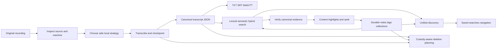

# EchoFlow 🦝✨

**Private local transcription that remembers where everything came from.**

EchoFlow is a local-first Python application for turning recordings into durable,
searchable evidence and keeping research work attached to that evidence without handing
the corpus to a hosted transcription service.

It does more than run a speech model. EchoFlow inspects the machine, chooses a safe local
execution strategy, manages model custody, survives interrupted work, preserves source
provenance, publishes portable transcripts, keeps word-level timing and anonymous-speaker
evidence, searches a private corpus, verifies results against canonical evidence, stores
human research separately from rebuildable indexes, saves reusable research questions,
and now gives deletion the same explicit custody rules as creation.

Canonical transcript JSON is authoritative transcript evidence. Human-authored research
state is authoritative user knowledge. DuckDB search/research projections and publication
formats are rebuildable. The original recording is read-only throughout normal processing
and can only be deleted through a separate explicit provenance-checked operation.

> **EchoFlow's product rule:** do complicated work locally, keep the evidence
> understandable, portable, and owned by the user.

Start with **[docs/README.md](docs/README.md)** for human-facing documentation or
**[Getting started](docs/getting-started.md)** for the shortest clone-to-transcript path.

## What can it do right now?

EchoFlow is pre-production, but the backend covers most of the local
recording-to-research lifecycle.

| Area | Current foundation |
|---|---|
| Local transcription | faster-whisper CPU/int8 and CUDA-capable strategies with explicit managed model revisions |
| Hardware awareness | process-visible CPU/RAM, affinity/cgroup limits, accelerator topology, engine capability negotiation, resource admission |
| Media handling | FFprobe inspection, deterministic stream selection, FFmpeg canonicalization, exact source-relative work windows |
| Word/time evidence | source-relative word timestamps, preserved temporal provenance, deterministic human elapsed coordinates |
| Reliability | private checkpoints, validated resume, contiguous checkpoint ordering, bounded accelerated prefetch |
| Languages | multilingual decoding plus conservative local text-language attribution |
| Speakers | optional anonymous recording-scoped diarization, word-level handoffs, durable display labels, honest overlap/mixed presentation |
| Difficult audio | optional deterministic FFmpeg noise suppression with provenance/timeline checks |
| Model custody | explicit inventory, recommendation, install, revalidation, immutable revision pinning/removal |
| Transcript output | canonical JSON plus deterministic TXT, SRT, WebVTT publication views |
| Search | private BM25 lexical retrieval, optional semantic retrieval, hybrid reciprocal-rank fusion |
| Evidence navigation | canonical-hash verification, aligned highlights, bounded context, speaker presentation, source seek coordinates |
| Research workspace | authoritative SQLite notes/tags/collections plus rebuildable DuckDB research projection |
| Unified discovery | grouped transcript/note/tag/collection query without fabricated cross-type scores |
| Saved searches | durable typed query intent that re-resolves current evidence instead of freezing result snapshots |
| Safe lifecycle | typed plan-bound deletion scopes plus private execution-state retention that preserves evidence/human work by default |
| Quality | Linux/macOS/Windows CI, strict typing, lint/format/security, complexity/dead-code, branch coverage, dependency audit, package verification |

## From recording to useful evidence



Text fallback: source media is inspected and transcribed locally into canonical JSON; rebuildable search finds passages; canonical verification turns results back into evidence; durable research state attaches human knowledge to that evidence; custody planning keeps deletion explicit.

Search ranking is not source truth. A result points back to canonical transcript
coordinates, and navigation verifies that generation before presenting precise evidence
or accepting a durable note anchor.

## Install the current source build

EchoFlow does not publish end-user installers or Releases yet. The supported path is a
source/developer install with Python 3.12 and `uv`:

```bash
git clone https://github.com/SSD1805/EchoFlow.git
cd EchoFlow
uv sync --locked --extra transcription
uv run echoflow init
uv run echoflow doctor
```

## Plan, transcribe, and resume

```bash
uv run echoflow models recommend
uv run echoflow models install small
uv run echoflow transcribe interview.m4a --dry-run
uv run echoflow transcribe interview.m4a
```

Add publication formats when useful:

```bash
uv run echoflow transcribe interview.m4a --export txt --export srt --export vtt
```

Resume a validated interrupted job with the original input and job ID:

```bash
uv run echoflow transcribe interview.m4a --resume JOB_ID
```

Model acquisition is explicit and network-bearing. Transcription does not silently
download faster-whisper weights. Resume rechecks source identity and current resource
admission rather than silently changing the execution contract.

## Optional anonymous speakers

```bash
uv run echoflow transcribe interview.wav --diarize
uv run echoflow library speakers name JOB_ID speaker-02 "Dr. Chen"
uv run echoflow library speakers transcript JOB_ID
```

A display name is user-authored presentation state. Anonymous speaker refs remain the
evidence identity. EchoFlow does not perform biometric identity inference or silent
cross-recording speaker linking.

## Search, navigate, annotate, and save useful questions

Build the private lexical library and search it:

```bash
uv run echoflow library rebuild
uv run echoflow library search "housing insecurity"
uv run echoflow library find "housing insecurity" --context-segments 1
```

Research metadata can constrain transcript retrieval before scoring:

```bash
uv run echoflow library search \
  "housing affordability" \
  --tag methodology \
  --collection "Chapter 3" \
  --with-notes
```

The notebook itself is durable user state:

```bash
uv run echoflow library notes
uv run echoflow library notes add JOB_ID segment-000042 \
  --body "Compare this with the 2024 survey." \
  --tag methodology \
  --collection "Chapter 3"
```

Saved searches persist the question, not today's answer:

```bash
uv run echoflow library saved save "Housing chapter" "rent burden" \
  --tag housing --mode hybrid
uv run echoflow library saved
uv run echoflow library saved run "Housing chapter"
uv run echoflow library navigation
```

## Delete exactly what you mean

Deletion is dry-run first. This only removes the transcript from rebuildable active search
state:

```bash
uv run echoflow library delete JOB_ID --scope library-view
```

The plan prints every action, preserved attached notes, affected document-scoped saved
searches, and a confirmation token. Nothing changes until the same request is repeated
with that token:

```bash
uv run echoflow library delete JOB_ID \
  --scope library-view \
  --confirm 'delete:...'
```

Available transcript-scoped custody operations include:

```text
library-view          remove rebuildable retrieval membership
derived-artifacts     delete regenerable TXT/SRT/VTT
execution-state       delete private checkpoints/intermediates
canonical-transcript  delete canonical JSON plus disposable descendants
research-notes        delete notes anchored to this exact canonical generation
saved-searches        delete saved searches explicitly constrained to this transcript
source-recording      delete original recording only with --allow-source + provenance match
```

`canonical-transcript` does **not** imply `research-notes`, `saved-searches`, or
`source-recording`. Shared tags/collections are never cascade-deleted merely because one
transcript or note disappears.

Age-based retention is narrower still:

```bash
uv run echoflow library retention --execution-days 30
```

It can delete only old private job workspaces. Completed jobs are eligible by default;
failed/interrupted jobs require `--include-incomplete` because cleanup removes resume
capability. Running jobs are never eligible. Canonical transcripts, human research, source
media, and lightweight lifecycle manifests are preserved.

EchoFlow does not claim that ordinary file deletion proves secure physical erasure on
SSDs, snapshots, backups, sync history, or copy-on-write storage.

Read **[Safe deletion and retention](docs/architecture/safe-deletion-retention.md)** for
the exact contract.

## What belongs to you? 🦝

| Artifact | Role | Rebuildable? |
|---|---|---|
| Original recording | source evidence | **No** |
| Canonical transcript JSON | authoritative transcript evidence | **No** |
| Speaker display labels | user-authored knowledge | **No** |
| Notes, tags, collections, evidence anchors | user-authored knowledge | **No** |
| Saved searches | user-authored query intent | **No** |
| TXT/SRT/WebVTT | publication views | Yes |
| Normalized/enhanced working audio | private processing material | Yes |
| Lexical/semantic search state | private search projections | Yes |
| Research query projection | rebuildable view over durable research state | Yes |

A database is allowed to make evidence useful. It is not allowed to become the only place
unique evidence or human research exists.

## For maintainers

Start with **[docs/architecture/README.md](docs/architecture/README.md)**, especially
**[Corpus search](docs/architecture/corpus-search.md)**,
**[Durable research state](docs/architecture/research-state.md)**,
**[Library lifecycle](docs/architecture/library-lifecycle.md)**,
**[Safe deletion and retention](docs/architecture/safe-deletion-retention.md)**, and
**[SECURITY.md](SECURITY.md)**.

Normal qualification includes Ruff lint/format/security rules, strict mypy, Vulture,
Radon, branch coverage, locked dependency audit, package builds, clean-wheel verification,
and Linux/macOS/Windows CI. Targeted mutation testing is reserved for load-bearing logic.

## Where the project goes next

Safe lifecycle controls now sit beside the research/search foundation. The next sequence
is:

1. **Incremental library refresh** so ordinary growth upserts/removes changed canonical
   generations and full rebuild becomes the repair lever.
2. **First thin GUI** consuming the existing evidence, research, saved-search, and custody
   services.
3. **Research portability** with evidence-bearing CSV/JSONL/Markdown and eventual workspace
   export.
4. **Semantic dependency/model qualification** for a normal install path.
5. **Representative-device qualification and productization** across 8/16 GB systems,
   Apple Silicon, discrete GPUs, and larger workstations.

See **[ROADMAP.md](ROADMAP.md)** for the detailed sequence.

---

**Make sensitive local transcription boringly dependable. Make its evidence easy to
navigate and annotate. Do not give the corpus away.** 💃
