# EchoFlow 🦝✨

**A private, local-first workspace for recorded evidence.**

EchoFlow turns audio and video into reproducible canonical transcripts, preserves source
and processing provenance, lets people search a private corpus and navigate results back
to exact verified evidence, and keeps notes, tags, collections, speaker labels, and saved
research questions as durable user-owned knowledge.

Transcription is the engine room, not the whole product. EchoFlow also inspects the
machine, chooses a safe local execution strategy, manages model custody, survives
interrupted work, keeps word-level timing and anonymous-speaker evidence, publishes
portable transcript views, incrementally reconciles an evolving library, and gives
deletion the same explicit custody rules as creation.

Canonical transcript JSON is authoritative transcript evidence. Human-authored research
state is authoritative user knowledge. DuckDB search/research projections and publication
formats are rebuildable. The original recording is read-only throughout normal processing
and can only be deleted through a separate explicit provenance-checked operation.

> **EchoFlow's product rule:** do complicated work locally, keep the evidence
> understandable, portable, and owned by the user.

Start with **[docs/README.md](docs/README.md)** for human-facing documentation or
**[Getting started](docs/getting-started.md)** for the shortest clone-to-transcript path.

## What can it do right now?

EchoFlow is pre-production, but the backend and desktop now cover the first coherent path
from importing a recording through local processing, evidence search, and durable research.

| Area | Current foundation |
|---|---|
| Local transcription | faster-whisper CPU/int8 and CUDA-capable strategies with explicit managed model revisions |
| Hardware awareness | process-visible CPU/RAM, affinity/cgroup limits, accelerator topology, engine capability negotiation, resource admission |
| Media handling | FFprobe inspection, deterministic stream selection, FFmpeg canonicalization, exact source-relative work windows |
| Word/time evidence | source-relative word timestamps, preserved temporal provenance, deterministic human elapsed coordinates |
| Reliability | private checkpoints, validated resume, contiguous checkpoint ordering, bounded accelerated prefetch |
| Languages | multilingual decoding plus conservative local text-language attribution |
| Speakers | optional anonymous recording-scoped diarization, word-level handoffs, durable display labels, honest overlap/mixed presentation |
| Difficult audio | optional deterministic FFmpeg noise suppression with provenance/timeline checks |
| Model custody | explicit inventory, recommendation, install, revalidation, immutable revision pinning/removal |
| Transcript output | canonical JSON plus deterministic TXT, SRT, WebVTT publication views |
| Search | private BM25 lexical retrieval, optional semantic retrieval, hybrid reciprocal-rank fusion |
| Evidence navigation | canonical-hash verification, aligned highlights, bounded context, speaker presentation, source seek coordinates |
| Research workspace | authoritative SQLite notes/tags/collections, rebuildable DuckDB projection, desktop browse/create/edit/delete/filter/anchor maintenance |
| Unified discovery | grouped transcript/note/tag/collection query without fabricated cross-type scores |
| Saved searches | durable typed query intent that re-resolves current evidence instead of freezing result snapshots |
| Safe lifecycle | typed plan-bound deletion scopes plus private execution-state retention that preserves evidence/human work by default |
| Incremental library | cheap refresh/reconciliation plus durable transcript and recording locations |
| Processing Center | desktop readiness, machine/model state, preflight, start/cancel, resume versus retry, job-state discard, diarization/enhancement/publication intent |
| Desktop presentation | Tauri + React import, Library, verified evidence reader, Research, Processing, six semantic-token themes with a compact persisted picker |
| Accessibility | keyboard/semantic-role tests, axe, explicit light/dark browser schemes, and a six-skin contrast matrix |
| Quality | Linux/macOS/Windows CI, strict typing, lint/format/security, complexity/dead-code, branch coverage, dependency audit, Playwright/axe, package verification |

## From recording to useful evidence

```mermaid
flowchart LR
    A[Original recording] --> B[Inspect source and machine]
    B --> C[Choose safe local strategy]
    C --> D[Transcribe and checkpoint]
    D --> E[Canonical transcript JSON]
    E --> F[TXT SRT WebVTT]
    E --> G[Lexical semantic hybrid search]
    G --> H[Verify canonical evidence]
    H --> I[Context highlights and seek]
    I --> J[Durable notes tags collections]
    J --> G
    G --> K[Unified discovery]
    J --> K
    K --> L[Saved searches navigation]
    E --> M[Custody-aware deletion planning]
    J --> M
    D --> M

    classDef source fill:#F9D5E5,stroke:#7B2E52,stroke-width:2px,color:#22151B
    classDef process fill:#E8D9FF,stroke:#68469B,stroke-width:2px,color:#1F1630
    classDef evidence fill:#FFF0B8,stroke:#8A6B18,stroke-width:2px,color:#2C260F
    classDef view fill:#DDF5E3,stroke:#347A46,stroke-width:2px,color:#142719
    classDef inspect fill:#D8EEFF,stroke:#2E617B,stroke-width:2px,color:#12222A
    classDef stop fill:#FFD6D6,stroke:#9E3434,stroke-width:2px,color:#351616

    class A source
    class B,C,D process
    class E,H evidence
    class F,G,K,L view
    class I inspect
    class J source
    class M stop
```



<details>
<summary>Static diagram fallback if rich rendering is unavailable</summary>


</details>

Text fallback: source media is inspected and transcribed locally into canonical JSON;
rebuildable search finds passages; canonical verification turns results back into evidence;
durable human research attaches to that evidence; custody planning keeps destructive work
explicit.

Search ranking is not source truth. A result points back to canonical transcript
coordinates, and navigation verifies that generation before presenting precise evidence
or accepting a durable note anchor.

## Desktop status

The Tauri + React desktop is no longer only an import/search shell. It currently provides:

- native file/folder selection and remembered-location permissions;
- recording discovery without automatic processing side effects;
- a Processing Center for readiness, model state, job state, preflight, launch, cancel,
  resume/retry distinction, and private-state discard;
- Library search across transcripts, notes, tags, and collections;
- verified evidence context and source-relative cursor coordinates;
- Research note create/edit/delete, tag/collection navigation, saved-search lifecycle,
  typed retrieval controls, exact-generation evidence return, and explicit anchor review;
- six accessible presentation skins through one compact theme picker; and
- persisted presentation preference without mixing theme state into evidence or research.

The browser/webview does **not** receive raw canonical/source filesystem paths for evidence
navigation. Rust owns native desktop capability; Python owns application rules; React owns
presentation.

The current Research UI deliberately translates backend vocabulary into ordinary choices.
For example, the user chooses **Any of these words**, **All of these words**, or **Exact
phrase** instead of separately operating phrase and term-operator plumbing. Retrieval,
ordering, filters, result count, and context live under **Search options**; backend retrieval
provenance remains available under **Technical details**.

There are still no end-user installers or Releases. The supported path remains a source
build while packaging and first-run behavior are qualified.

## Themes and accessibility

EchoFlow currently ships **Archive, Midnight, Paper, Moss, Plum, and Ember**. They are not
six independent CSS systems. Every skin supplies the same semantic roles for background,
surfaces, text, borders, accent/on-accent, form controls, focus, errors, and selection.
Components consume those roles rather than inventing per-screen colors.

Every theme explicitly declares its browser `color-scheme`. Playwright checks the same
contrast pairs across all six skins, including form-control boundaries and focus state, and
runs axe against representative Research controls. Read
**[Desktop themes and accessibility](docs/development/desktop-accessibility.md)** for the
contract.

## Install the current source build

The supported development/source path uses Python 3.12 and `uv`:

```bash
git clone https://github.com/SSD1805/EchoFlow.git
cd EchoFlow
uv sync --locked --extra transcription
uv run echoflow init
uv run echoflow doctor
```

For the native desktop, follow **[Desktop development prerequisites](docs/development/desktop-development.md)**.

## Plan, transcribe, and resume from the CLI

The CLI remains useful for automation and source-build qualification:

```bash
uv run echoflow models recommend
uv run echoflow models install small
uv run echoflow transcribe interview.m4a --dry-run
uv run echoflow transcribe interview.m4a
```

Add publication formats when useful:

```bash
uv run echoflow transcribe interview.m4a --export txt --export srt --export vtt
```

Resume a validated interrupted job with the original input and job ID:

```bash
uv run echoflow transcribe interview.m4a --resume JOB_ID
```

Model acquisition is explicit and network-bearing. Transcription does not silently
download faster-whisper weights. Resume rechecks source identity and current resource
admission rather than silently changing the execution contract.

## Search, annotate, and save useful questions

```bash
uv run echoflow library rebuild
uv run echoflow library refresh
uv run echoflow library search "housing insecurity"
uv run echoflow library find "housing insecurity" --context-segments 1
```

Research metadata can constrain transcript retrieval before scoring:

```bash
uv run echoflow library search \
  "housing affordability" \
  --tag methodology \
  --collection "Chapter 3" \
  --with-notes
```

The notebook itself is durable user state:

```bash
uv run echoflow library notes add JOB_ID segment-000042 \
  --body "Compare this with the 2024 survey." \
  --tag methodology \
  --collection "Chapter 3"
```

Saved searches persist the question, not today's answer:

```bash
uv run echoflow library saved save "Housing chapter" "rent burden" \
  --tag housing --mode hybrid
uv run echoflow library saved run "Housing chapter"
```

## Delete exactly what you mean

Deletion is dry-run first. This only removes the transcript from rebuildable active search
state:

```bash
uv run echoflow library delete JOB_ID --scope library-view
```

The plan prints every action, preserved attached notes, affected document-scoped saved
searches, and a confirmation token. Nothing changes until the same request is repeated
with that token.

`canonical-transcript` does **not** imply `research-notes`, `saved-searches`, or
`source-recording`. Shared tags/collections are never cascade-deleted merely because one
transcript or note disappears.

Age-based retention is narrower still:

```bash
uv run echoflow library retention --execution-days 30
```

It can delete only old private job workspaces. Canonical transcripts, human research,
source media, and lightweight lifecycle manifests are preserved.

Read **[Safe deletion and retention](docs/architecture/safe-deletion-retention.md)** for
the exact contract.

## What belongs to you? 🦝

| Artifact | Role | Rebuildable? |
|---|---|---|
| Original recording | source evidence | **No** |
| Canonical transcript JSON | authoritative transcript evidence | **No** |
| Speaker display labels | user-authored knowledge | **No** |
| Notes, tags, collections, evidence anchors | user-authored knowledge | **No** |
| Saved searches | user-authored query intent | **No** |
| Remembered library/recording locations | durable app preference | **No, but machine-local** |
| Theme preference | machine-local presentation preference | Yes / non-evidence |
| TXT/SRT/WebVTT | publication views | Yes |
| Normalized/enhanced working audio | private processing material | Yes |
| Lexical/semantic search state | private search projections | Yes |
| Research query projection | rebuildable view over durable research state | Yes |

A database is allowed to make evidence useful. It is not allowed to become the only place
unique evidence or human research exists.

## For maintainers

Start with **[docs/architecture/README.md](docs/architecture/README.md)**, especially
**[Processing Center](docs/architecture/processing-center.md)**,
**[Corpus search](docs/architecture/corpus-search.md)**,
**[Durable research state](docs/architecture/research-state.md)**,
**[Library lifecycle](docs/architecture/library-lifecycle.md)**,
**[Safe deletion and retention](docs/architecture/safe-deletion-retention.md)**, and
**[SECURITY.md](SECURITY.md)**.

Normal qualification includes Ruff lint/format/security rules, strict mypy, Vulture,
Radon, branch coverage, locked dependency audit, package builds, clean-wheel verification,
frontend type/build/audit gates, Playwright/axe, the theme contrast matrix, and
Linux/macOS/Windows CI.

## Where the project goes next

Research/search and the first Processing Center workflow are built. The next first-release
sequence is:

1. transcript and speaker tools plus provenance/details polish;
2. Tauri-owned local audio/video playback from verified source-relative coordinates;
3. lifecycle and retention UI over the existing plan-bound custody backend;
4. architecture/redundancy audit before packaging freezes seams;
5. packaging, first-run storage setup, signed updates, and evidence-safe uninstall;
6. backup/restore plus selected research portability;
7. packaged semantic-model/dependency custody; and
8. representative-device qualification across ordinary consumer hardware and hostile path,
   disk, interruption, upgrade, and accessibility cases.

See **[ROADMAP.md](ROADMAP.md)** for the capability matrix and exact sequencing.
