# EchoFlow 🦝✨

**A private, local-first workspace for recorded evidence.**

EchoFlow turns audio and video into reproducible canonical transcripts, preserves source
and processing provenance, lets people search a private corpus and navigate results back
to exact verified evidence, and keeps notes, tags, collections, speaker labels, and saved
research questions as durable user-owned knowledge.

Transcription is the engine room, not the whole product. EchoFlow also inspects the
machine, chooses a safe local execution strategy, manages model custody, survives
interrupted work, keeps word-level timing and anonymous-speaker evidence, publishes
portable transcript views, incrementally reconciles an evolving library, and gives
deletion the same explicit custody rules as creation.

Canonical transcript JSON is authoritative transcript evidence. Human-authored research
state is authoritative user knowledge. DuckDB search/research projections and publication
formats are rebuildable. The original recording is read-only throughout normal processing
and can only be deleted through a separate explicit provenance-checked operation.

> **EchoFlow's product rule:** do complicated work locally, keep the evidence
> understandable, portable, and owned by the user.

Start with **[docs/README.md](docs/README.md)** for human-facing documentation or
**[Getting started](docs/getting-started.md)** for the shortest clone-to-transcript path.

## What can it do right now?

EchoFlow is pre-production, but the backend and first desktop slices already cover most of
the local recording-to-evidence lifecycle.

| Area | Current foundation |
|---|---|
| Local transcription | faster-whisper CPU/int8 and CUDA-capable strategies with explicit managed model revisions |
| Hardware awareness | process-visible CPU/RAM, affinity/cgroup limits, accelerator topology, engine capability negotiation, resource admission |
| Media handling | FFprobe inspection, deterministic stream selection, FFmpeg canonicalization, exact source-relative work windows |
| Word/time evidence | source-relative word timestamps, preserved temporal provenance, deterministic human elapsed coordinates |
| Reliability | private checkpoints, validated resume, contiguous checkpoint ordering, bounded accelerated prefetch |
| Languages | multilingual decoding plus conservative local text-language attribution |
| Speakers | optional anonymous recording-scoped diarization, word-level handoffs, durable display labels, honest overlap/mixed presentation |
| Difficult audio | optional deterministic FFmpeg noise suppression with provenance/timeline checks |
| Model custody | explicit inventory, recommendation, install, revalidation, immutable revision pinning/removal |
| Transcript output | canonical JSON plus deterministic TXT, SRT, WebVTT publication views |
| Search | private BM25 lexical retrieval, optional semantic retrieval, hybrid reciprocal-rank fusion |
| Evidence navigation | canonical-hash verification, aligned highlights, bounded context, speaker presentation, source seek coordinates |
| Research workspace | authoritative SQLite notes/tags/collections, rebuildable DuckDB projection, desktop browse/create/edit/delete and label assignment |
| Unified discovery | grouped transcript/note/tag/collection query without fabricated cross-type scores |
| Saved searches | durable typed query intent that re-resolves current evidence instead of freezing result snapshots |
| Safe lifecycle | typed plan-bound deletion scopes plus private execution-state retention that preserves evidence/human work by default |
| Incremental library | cheap refresh/reconciliation plus durable transcript and recording locations |
| Desktop foundation | Tauri + React shell, native import, Library discovery, verified evidence reader/cursor, Research workspace, Archive/Midnight themes |
| Quality | Linux/macOS/Windows CI, strict typing, lint/format/security, complexity/dead-code, branch coverage, dependency audit, Playwright/axe, package verification |

## From recording to useful evidence

```mermaid
flowchart LR
    A[Original recording] --> B[Inspect source and machine]
    B --> C[Choose safe local strategy]
    C --> D[Transcribe and checkpoint]
    D --> E[Canonical transcript JSON]
    E --> F[TXT SRT WebVTT]
    E --> G[Lexical semantic hybrid search]
    G --> H[Verify canonical evidence]
    H --> I[Context highlights and seek]
    I --> J[Durable notes tags collections]
    J --> G
    G --> K[Unified discovery]
    J --> K
    K --> L[Saved searches navigation]
    E --> M[Custody-aware deletion planning]
    J --> M
    D --> M

    classDef source fill:#F9D5E5,stroke:#7B2E52,stroke-width:2px,color:#22151B
    classDef process fill:#E8D9FF,stroke:#68469B,stroke-width:2px,color:#1F1630
    classDef evidence fill:#FFF0B8,stroke:#8A6B18,stroke-width:2px,color:#2C260F
    classDef view fill:#DDF5E3,stroke:#347A46,stroke-width:2px,color:#142719
    classDef inspect fill:#D8EEFF,stroke:#2E617B,stroke-width:2px,color:#12222A
    classDef stop fill:#FFD6D6,stroke:#9E3434,stroke-width:2px,color:#351616

    class A source
    class B,C,D process
    class E,H evidence
    class F,G,K,L view
    class I inspect
    class J source
    class M stop
```



<details>
<summary>Static diagram fallback if rich rendering is unavailable</summary>


</details>

Text fallback: source media is inspected and transcribed locally into canonical JSON;
rebuildable search finds passages; canonical verification turns results back into evidence;
durable human research attaches to that evidence; custody planning keeps destructive work
explicit.

Search ranking is not source truth. A result points back to canonical transcript
coordinates, and navigation verifies that generation before presenting precise evidence
or accepting a durable note anchor.

## Desktop status

EchoFlow has a thin Tauri + React desktop foundation over the Python application services.
The current desktop can choose files/folders through native dialogs, remember approved
locations, discover recordings, search the local library, open verified canonical context,
move a source-relative evidence cursor through canonical word coordinates, browse durable
research, create notes from verified evidence, and edit/delete notes plus their tag and
collection assignments.

Research edits use the authoritative note `updated_at` as an optimistic-concurrency token.
The body and label relationships change in one SQLite transaction with one journal event;
the evidence anchor does not move. If another local surface changed the note first, the
desktop write fails closed and asks for refresh instead of silently overwriting it.

The browser/webview does **not** receive raw canonical/source filesystem paths for evidence
navigation. Rust owns native desktop capability; Python owns application rules; React owns
presentation.

The remaining Research UI work is saved-search lifecycle, research-object → verified
evidence navigation, explicit stale-anchor review/re-anchor, and advanced typed retrieval
controls. The broader desktop audit also shows a major processing gap: Python already has
health/resource/model/job/transcription contracts that still need coherent desktop
workflows before EchoFlow is a self-contained end-user application. See
**[ROADMAP.md](ROADMAP.md)** for the complete capability-to-productization map.

There are still no end-user installers or Releases. The supported path remains a source
build while packaging and first-run behavior are qualified.

## Install the current source build

The supported development/source path uses Python 3.12 and `uv`:

```bash
git clone https://github.com/SSD1805/EchoFlow.git
cd EchoFlow
uv sync --locked --extra transcription
uv run echoflow init
uv run echoflow doctor
```

## Plan, transcribe, and resume

```bash
uv run echoflow models recommend
uv run echoflow models install small
uv run echoflow transcribe interview.m4a --dry-run
uv run echoflow transcribe interview.m4a
```

Add publication formats when useful:

```bash
uv run echoflow transcribe interview.m4a --export txt --export srt --export vtt
```

Resume a validated interrupted job with the original input and job ID:

```bash
uv run echoflow transcribe interview.m4a --resume JOB_ID
```

Model acquisition is explicit and network-bearing. Transcription does not silently
download faster-whisper weights. Resume rechecks source identity and current resource
admission rather than silently changing the execution contract.

## Optional anonymous speakers

```bash
uv run echoflow transcribe interview.wav --diarize
uv run echoflow library speakers name JOB_ID speaker-02 "Dr. Chen"
uv run echoflow library speakers transcript JOB_ID
```

A display name is user-authored presentation state. Anonymous speaker refs remain the
evidence identity. EchoFlow does not perform biometric identity inference or silent
cross-recording speaker linking.

## Search, navigate, annotate, and save useful questions

Build or refresh the private lexical library and search it:

```bash
uv run echoflow library rebuild
uv run echoflow library refresh
uv run echoflow library search "housing insecurity"
uv run echoflow library find "housing insecurity" --context-segments 1
```

Research metadata can constrain transcript retrieval before scoring:

```bash
uv run echoflow library search \
  "housing affordability" \
  --tag methodology \
  --collection "Chapter 3" \
  --with-notes
```

The notebook itself is durable user state:

```bash
uv run echoflow library notes
uv run echoflow library notes add JOB_ID segment-000042 \
  --body "Compare this with the 2024 survey." \
  --tag methodology \
  --collection "Chapter 3"
```

Saved searches persist the question, not today's answer:

```bash
uv run echoflow library saved save "Housing chapter" "rent burden" \
  --tag housing --mode hybrid
uv run echoflow library saved
uv run echoflow library saved run "Housing chapter"
uv run echoflow library navigation
```

## Delete exactly what you mean

Deletion is dry-run first. This only removes the transcript from rebuildable active search
state:

```bash
uv run echoflow library delete JOB_ID --scope library-view
```

The plan prints every action, preserved attached notes, affected document-scoped saved
searches, and a confirmation token. Nothing changes until the same request is repeated
with that token:

```bash
uv run echoflow library delete JOB_ID \
  --scope library-view \
  --confirm 'delete:...'
```

Available transcript-scoped custody operations include:

```text
library-view          remove rebuildable retrieval membership
derived-artifacts     delete regenerable TXT/SRT/VTT
execution-state       delete private checkpoints/intermediates
canonical-transcript  delete canonical JSON plus disposable descendants
research-notes        delete notes anchored to this exact canonical generation
saved-searches        delete saved searches explicitly constrained to this transcript
source-recording      delete original recording only with --allow-source + provenance match
```

`canonical-transcript` does **not** imply `research-notes`, `saved-searches`, or
`source-recording`. Shared tags/collections are never cascade-deleted merely because one
transcript or note disappears.

Age-based retention is narrower still:

```bash
uv run echoflow library retention --execution-days 30
```

It can delete only old private job workspaces. Completed jobs are eligible by default;
failed/interrupted jobs require `--include-incomplete` because cleanup removes resume
capability. Running jobs are never eligible. Canonical transcripts, human research, source
media, and lightweight lifecycle manifests are preserved.
