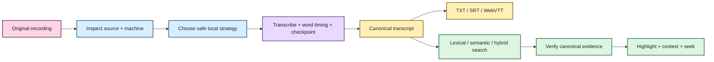

# EchoFlow 🦝✨

**Private local transcription that remembers where everything came from.**

EchoFlow is a local-first Python application for turning recordings into durable,
searchable evidence. It is designed for interviews, research recordings, meetings,
lectures, oral histories, and other audio you may not want wandering off to a hosted
transcription service.

The application does more than run a speech model. It inspects the machine it is running
on, chooses a safe execution strategy, manages local model custody, survives interrupted
work, preserves source provenance, publishes portable transcripts, keeps word-level
timing evidence, handles anonymous speaker evidence conservatively, and builds a private
searchable library that can navigate results back to the canonical transcript.

The original recording remains read-only input. Canonical transcript JSON is the
authoritative transcript artifact. User-authored knowledge stays separate from both.
Working audio and search databases are derived state that can be regenerated.

> **EchoFlow's product rule:** do complicated work locally, keep the evidence
> understandable, portable, and owned by the user.

For the human-friendly documentation lobby, start at **[docs/README.md](docs/README.md)**.
For the shortest path from clone to transcript, use
**[Getting started](docs/getting-started.md)**.

🧜‍♀️

## What can it do right now?

EchoFlow is pre-production, but the backend already covers a surprisingly large part of
the local recording-to-research lifecycle.

| Area | Current foundation |
|---|---|
| Local transcription | faster-whisper CPU/int8 and CUDA-capable strategies with explicit managed model revisions |
| Hardware awareness | process-visible CPU/RAM, affinity/cgroup limits, accelerator topology, engine capability negotiation, and resource admission |
| Media handling | FFprobe inspection, deterministic audio-stream selection, FFmpeg canonicalization, exact source-relative frame windows |
| Word timing | native faster-whisper per-word timestamps validated, rebased to source-relative time, and preserved through resume |
| Time provenance | human `HH:MM:SS.mmm` elapsed coordinates plus source-declared `timecode` / `creation_time` provenance when available |
| Reliability | durable private checkpoints, validated resume, contiguous checkpoint ordering, bounded accelerated prefetch |
| Languages | multilingual decoding plus conservative local text-language attribution |
| Speakers | optional anonymous recording-scoped diarization, word-level handoffs, durable user display labels, and honest overlap/mixed presentation; diarization execution is currently security-held when its locked dependency gate is unsafe |
| Difficult audio | optional deterministic local FFmpeg noise suppression with provenance and timeline-preservation checks |
| Model custody | explicit inventory, recommendation, install, local revalidation, immutable revision pinning, and exact-revision removal |
| Transcript output | canonical JSON plus deterministic TXT, SRT, and WebVTT derived views |
| Search | private local BM25 lexical retrieval, optional semantic retrieval, and inspectable hybrid RRF ranking |
| Evidence navigation | canonical-hash verification, aligned lexical highlights, bounded context expansion, speaker display integration, and deterministic source seek coordinates |
| Evidence | source/canonical SHA-256, segment/word timestamps, speaker/language context, provenance, stale-index detection, and integrity receipts |
| Portability | Linux, macOS, and Windows CI plus clean-wheel/package verification |

The point of this list is not that users should learn every subsystem. It is that most of
the annoying decisions around local transcription are becoming application behavior
instead of homework.

## The journey from recording to something useful



Search ranking is intentionally not treated as source truth. A ranked result points back
to canonical transcript coordinates, and the navigation layer verifies that canonical
generation before presenting precise word evidence.

## Install the current source build

EchoFlow does not publish end-user installers or Releases yet. The current supported
path is a source/developer install with Python 3.12 and `uv`:

```bash
git clone https://github.com/SSD1805/EchoFlow.git
cd EchoFlow
uv sync --locked --extra transcription
```

Initialize private application state and inspect the machine:

```bash
uv run echoflow init
uv run echoflow doctor
uv run echoflow runner
```

## Let EchoFlow recommend a transcription model

```bash
uv run echoflow models recommend
uv run echoflow models install small
```

Model installation is an explicit network-bearing action. Transcription itself does not
silently download faster-whisper weights.

EchoFlow records and locally revalidates the immutable model revision it manages. A
cached model does not become trusted application state merely because some bytes happen
to exist in a Hugging Face cache.

## Plan, transcribe, and resume

A dry run inspects the source and machine and shows the intended execution plan without
starting recognition:

```bash
uv run echoflow transcribe interview.m4a --dry-run
```

Then transcribe locally:

```bash
uv run echoflow transcribe interview.m4a
```

The current faster-whisper execution path requests native word timestamps. EchoFlow
validates and rebases those word intervals onto the same source-relative timeline as the
canonical segment instead of running a second forced-alignment model.

Add derived publication formats when useful:

```bash
uv run echoflow transcribe interview.m4a --export txt --export srt --export vtt
```

If an in-progress job is interrupted, EchoFlow can restore its validated checkpoint
contract:

```bash
uv run echoflow transcribe interview.m4a --resume JOB_ID
```

Resume rechecks source identity and current resource admission. It does not silently
change model revision, selected audio stream, preprocessing, alignment, or execution
target just to get moving again.

## Optional noise suppression

For a difficult recording, deterministic local FFmpeg noise suppression can be enabled
explicitly:

```bash
uv run echoflow transcribe noisy-interview.wav --enhance
```

The enhanced audio is private derived processing material, not a replacement for the
source. EchoFlow verifies that preprocessing did not change the frame/timeline shape
before allowing ASR to consume it.

See **[Local speech enhancement](docs/architecture/speech-enhancement.md)** for the exact
provider and failure contract.

## Optional anonymous speaker diarization

The user surface is:

```bash
uv run echoflow transcribe interview.wav --diarize
```

Diarization produces anonymous recording-scoped labels such as `speaker-01`; it does not
perform biometric identity or cross-recording speaker linking.

When word timing exists, EchoFlow can preserve speaker handoffs without forcing one
speaker onto the enclosing segment. The derived speaker transcript also distinguishes
true simultaneous overlap from sequential mixed/unresolved text.

After a transcript is in the library, you can assign your own durable display name:

```bash
uv run echoflow library speakers name JOB_ID speaker-02 "Dr. Chen"
uv run echoflow library speakers transcript JOB_ID
```

`Dr. Chen` is user-authored presentation state. `speaker-02` remains the anonymous
evidence ref underneath it.

The current pyannote dependency path is **security-held** while its locked Lightning
version is affected by a compensated advisory. EchoFlow fails closed before pyannote
execution/model acquisition while that condition remains true. See
**[Give the anonymous speakers names](docs/speaker-names.md)**,
**[Anonymous speaker diarization](docs/architecture/diarization.md)**, and
**[SECURITY.md](SECURITY.md)**.

## Search and navigate your transcript library

Build the private lexical library:

```bash
uv run echoflow library rebuild
```

Search for exact or related words:

```bash
uv run echoflow library search "housing insecurity"
```

Ask for neighboring canonical context without changing the ranking:

```bash
uv run echoflow library search "housing insecurity" --context-segments 1
```

Filter by transcript evidence when useful:

```bash
uv run echoflow library search \
  "rent increase" \
  --speaker speaker-02 \
  --language en
```

If `speaker-02` has a current user label, human search presentation can show
`Dr. Chen (speaker-02)` while machine-readable output keeps the raw ref.

Lexical results can now resolve matching aligned words back to canonical evidence and use
the first exact match as a source seek coordinate. Semantic-only results deliberately
stay passage-level because an embedding does not identify one magical matching word.
Hybrid results preserve both retrieval provenance and exact lexical highlights when
lexical evidence contributed.

Inspect one transcript's custody and source-integrity evidence:

```bash
uv run echoflow library show JOB_ID
```

Read **[From search result to the exact evidence](docs/evidence-navigation.md)** for the
human version and **[Evidence-first corpus search](docs/architecture/corpus-search.md)**
for the implementation contract.

### ✨ Optional semantic and hybrid search

Lexical search is good at finding the words you typed. Semantic search can also find a
passage whose wording differs but whose meaning is related.

For example, the query:

```text
people struggling to afford housing
```

may help retrieve:

```text
I was spending almost seventy percent of my pay on the apartment.
```

The current semantic foundation uses a strict-local Multilingual E5 Small profile and
private rebuildable vectors. It is deliberately optional: the locked project dependency
graph does not yet include Sentence Transformers, so a compatible local runtime and
immutable local model snapshot are currently advanced setup rather than base-install
requirements.

Hybrid retrieval combines BM25 and dense ranks using reciprocal rank fusion instead of
pretending their raw scores share one scale.

Read **[Semantic search, without the mystery box](docs/semantic-search.md)** for the
plain-language explanation.

## What belongs to you? 🦝

The custody boundary is intentionally simple:

| Artifact | Role | Rebuildable? |
|---|---|---|
| Original recording | source evidence | **No** |
| Canonical transcript JSON, including word timing evidence | authoritative transcript artifact | **No** |
| Speaker display labels | user-authored knowledge | **No** |
| Future notes/tags/annotations/collections | user-authored knowledge | **No** |
| TXT/SRT/WebVTT | publication views | Yes |
| Normalized/enhanced working audio | private processing material | Yes |
| Lexical search database | private search projection | Yes |
| Semantic chunks/vectors | private search projection | Yes |
| Evidence-navigation context/highlight views | derived presentation over canonical evidence | Yes |

A database is allowed to make evidence useful. It is not allowed to become the only
place the evidence exists.

## For maintainers

The architecture is organized around narrow capabilities rather than one universal
pipeline manager. Start with **[docs/architecture/README.md](docs/architecture/README.md)**.

The most useful references are:

- **[Processing capabilities](docs/architecture/processing-capabilities.md)** for the
  end-to-end execution map.
- **[Adaptive heterogeneous execution](docs/architecture/adaptive-heterogeneous-execution.md)**
  for machine discovery, engine capability, strategy admission, and bounded overlap.
- **[Media and timeline](docs/architecture/media-and-timeline.md)** for stream selection,
  canonical audio, and timestamp semantics.
- **[Word-level timestamp alignment](docs/architecture/word-alignment.md)** for native
  word timing, source-relative rebasing, checkpoint identity, and speaker handoffs.
- **[Model management](docs/architecture/model-management.md)** for explicit acquisition,
  immutable revisions, and local custody.
- **[Diarization](docs/architecture/diarization.md)** for anonymous speaker evidence and
  the current security hold.
- **[Corpus search](docs/architecture/corpus-search.md)** for lexical/semantic/hybrid
  retrieval, canonical navigation, and data ownership.

Documentation itself has a contract too. See
**[docs/documentation-style.md](docs/documentation-style.md)**.

## Quality and development

Production code uses a `src/` layout. Tests are colocated beneath the package whose
contract they protect.

Normal repository qualification includes Ruff lint/format/security rules, strict mypy,
Vulture, Radon complexity/maintainability checks, branch coverage, locked dependency
verification/auditing, package builds, clean-wheel verification, and Linux/macOS/Windows
CI.

Mutation testing with Poodle is targeted qualification for load-bearing decisions rather
than a routine per-commit gate. See
**[docs/development/testing-and-bisect.md](docs/development/testing-and-bisect.md)**.

## Where the project goes next

The evidence plumbing is now much further along than the user-authored research
workspace.

The next major product layer is **durable notes, tags, saved searches, collections, and
annotation state anchored to verified canonical evidence locations**. After that, the
highest-value work is qualifying semantic installation/model custody for ordinary source
installs, dogfooding on representative consumer hardware, and building an installer plus
thin graphical shell over the same application services.

Source separation for genuinely overlapping speech remains later. EchoFlow can now
represent overlap honestly, so separation should earn its model/compute/provenance cost
by improving real recordings rather than appearing as an impressive checkbox.

See **[ROADMAP.md](ROADMAP.md)** for the current sequencing and deliberate limits.

---

**EchoFlow is trying to make sensitive local transcription boringly dependable, then
make the resulting evidence easy to find, navigate, and eventually annotate without
giving the corpus away.** 💃
