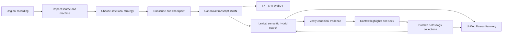

# EchoFlow 🦝✨

**Private local transcription that remembers where everything came from.**

EchoFlow is a local-first Python application for turning recordings into durable,
searchable evidence and keeping research work attached to that evidence without handing
the corpus to a hosted transcription service.

It does more than run a speech model. EchoFlow inspects the machine it is running on,
chooses a safe execution strategy, manages local model custody, survives interrupted
work, preserves source provenance, publishes portable transcripts, keeps word-level
timing evidence, handles anonymous speaker evidence conservatively, searches a private
local corpus, navigates results back to verified canonical evidence, stores durable
notes/tags/collections separately from rebuildable search machinery, and now gives those
capabilities one grouped library-discovery doorway.

The original recording remains read-only source evidence. Canonical transcript JSON is
the authoritative transcript artifact. Human-authored research state is authoritative
user knowledge. DuckDB search and research projections are acceleration structures that
may be deleted and rebuilt.

> **EchoFlow's product rule:** do complicated work locally, keep the evidence
> understandable, portable, and owned by the user.

For the human-friendly documentation lobby, start at **[docs/README.md](docs/README.md)**.
For the shortest path from clone to transcript, use
**[Getting started](docs/getting-started.md)**.

## What can it do right now?

EchoFlow is pre-production, but the backend now covers most of the local
recording-to-research lifecycle.

| Area | Current foundation |
|---|---|
| Local transcription | faster-whisper CPU/int8 and CUDA-capable strategies with explicit managed model revisions |
| Hardware awareness | process-visible CPU/RAM, affinity/cgroup limits, accelerator topology, engine capability negotiation, and resource admission |
| Media handling | FFprobe inspection, deterministic audio-stream selection, FFmpeg canonicalization, exact source-relative frame windows |
| Word timing | native faster-whisper word timestamps validated, rebased to source-relative time, and preserved through resume |
| Time provenance | human `HH:MM:SS.mmm` elapsed coordinates plus source-declared `timecode` / `creation_time` provenance when available |
| Reliability | durable private checkpoints, validated resume, contiguous checkpoint ordering, bounded accelerated prefetch |
| Languages | multilingual decoding plus conservative local text-language attribution |
| Speakers | optional anonymous recording-scoped diarization, word-level handoffs, durable display labels, and honest overlap/mixed presentation; diarization remains security-held when its locked dependency gate is unsafe |
| Difficult audio | optional deterministic local FFmpeg noise suppression with provenance and timeline-preservation checks |
| Model custody | explicit inventory, recommendation, install, local revalidation, immutable revision pinning, and exact-revision removal |
| Transcript output | canonical JSON plus deterministic TXT, SRT, and WebVTT derived views |
| Search | private local BM25 lexical retrieval, optional semantic retrieval, and inspectable hybrid RRF ranking |
| Evidence navigation | canonical-hash verification, aligned lexical highlights, bounded context expansion, speaker display integration, and deterministic source seek coordinates |
| Research workspace | authoritative SQLite notes/tags/collections anchored to exact canonical evidence, plus a rebuildable DuckDB research projection |
| Research-aware search | tag, collection, note-text, and with-notes constraints applied before lexical ranking or semantic scoring |
| Unified discovery | one grouped query across transcript evidence, notes, tags, and collections with no fabricated cross-type relevance score |
| Quality | Linux/macOS/Windows CI, strict typing, lint/format/security rules, complexity/dead-code checks, branch coverage, dependency audit, package build, and clean-wheel verification |

The point is not that users should learn every subsystem. It is that most of the annoying
choices around local transcription, provenance, search, and research-state custody are
becoming application behavior instead of homework.

## The journey from recording to something useful



Text fallback: the original recording produces a canonical transcript; rebuildable search
ranks passages; canonical navigation verifies those passages; durable research state is
attached to exact evidence and can constrain later searches; unified discovery composes
transcript evidence and research objects into one grouped human-facing query.

Search ranking is intentionally not source truth. A ranked result points back to canonical
transcript coordinates, and the navigation layer verifies that canonical generation
before presenting precise word evidence or accepting a durable note anchor.

## Install the current source build

EchoFlow does not publish end-user installers or Releases yet. The supported path is a
source/developer install with Python 3.12 and `uv`:

```bash
git clone https://github.com/SSD1805/EchoFlow.git
cd EchoFlow
uv sync --locked --extra transcription
uv run echoflow init
uv run echoflow doctor
```

## Plan, transcribe, and resume

```bash
uv run echoflow models recommend
uv run echoflow models install small
uv run echoflow transcribe interview.m4a --dry-run
uv run echoflow transcribe interview.m4a
```

Add derived publication formats when useful:

```bash
uv run echoflow transcribe interview.m4a --export txt --export srt --export vtt
```

Resume a validated interrupted job with the original input and job ID:

```bash
uv run echoflow transcribe interview.m4a --resume JOB_ID
```

Model acquisition is explicit and network-bearing. Transcription itself does not silently
download faster-whisper weights. Resume rechecks source identity and current resource
admission rather than silently changing the original execution contract.

## Optional anonymous speakers

```bash
uv run echoflow transcribe interview.wav --diarize
```

Diarization produces anonymous recording-scoped refs such as `speaker-01`; it does not
perform biometric identity or cross-recording speaker linking. After a transcript is in
the library, a user can assign a durable display label:

```bash
uv run echoflow library speakers name JOB_ID speaker-02 "Dr. Chen"
uv run echoflow library speakers transcript JOB_ID
```

`Dr. Chen` is user-authored presentation state. `speaker-02` remains the evidence ref.
The current pyannote dependency path remains security-held while its locked Lightning
version is affected by the compensated advisory described in **[SECURITY.md](SECURITY.md)**.

## Search, navigate, and annotate the local library

Build the private lexical library:

```bash
uv run echoflow library rebuild
```

Search transcript evidence directly:

```bash
uv run echoflow library search "housing insecurity"
```

Or use the one-box grouped library doorway:

```bash
uv run echoflow library find "housing insecurity"
```

`library find` returns separate transcript-evidence, note, tag, and collection groups.
Transcript evidence keeps its own lexical/semantic/hybrid ranking provenance. Notes and
labels remain their own object types rather than receiving a made-up universal score.

Add neighboring canonical context without changing transcript ranking:

```bash
uv run echoflow library find "housing insecurity" --context-segments 1
```

If local semantic state is available, `--mode semantic` or `--mode hybrid` changes only
the transcript-evidence group. Note, tag, and collection lookup remains deterministic
local text lookup.

Research metadata can also constrain transcript retrieval before scoring:

```bash
uv run echoflow library search \
  "housing affordability" \
  --tag methodology \
  --collection "Chapter 3" \
  --with-notes
```

The notebook itself is durable user state:

```bash
uv run echoflow library notes

uv run echoflow library notes add JOB_ID segment-000042 \
  --body "Compare this with the 2024 survey." \
  --tag methodology \
  --collection "Chapter 3"
```

The CLI currently exposes canonical segment IDs because it needs a real evidence address.
A future graphical shell can turn transcript selection into the same verified
`EvidenceAnchor` without asking a normal person to type IDs.

Read **[Find things across the whole local library](docs/library-discovery.md)**,
**[Your notes should survive the machinery](docs/research-notes.md)**, and
**[From search result to the exact evidence](docs/evidence-navigation.md)** for the human
versions of those contracts.

### Optional semantic and hybrid search

Semantic search can find related wording while lexical search remains the dependency-light
default. Hybrid retrieval combines BM25 and dense ranks using reciprocal rank fusion
instead of pretending their raw scores share one scale.

The current semantic foundation uses a strict-local Multilingual E5 Small profile and
private rebuildable vectors. The locked base project still does not declare Sentence
Transformers as a normal semantic extra, so semantic setup remains advanced rather than
part of the ordinary source install.

Read **[Semantic search, without the mystery box](docs/semantic-search.md)**.

## What belongs to you? 🦝

| Artifact | Role | Rebuildable? |
|---|---|---|
| Original recording | source evidence | **No** |
| Canonical transcript JSON | authoritative transcript evidence | **No** |
| Speaker display labels | user-authored knowledge | **No** |
| Research notes, tags, collections, evidence anchors | user-authored knowledge | **No** |
| Future saved searches / curated result sets | user-authored knowledge | **No** |
| TXT/SRT/WebVTT | publication views | Yes |
| Normalized/enhanced working audio | private processing material | Yes |
| Lexical search database | private search projection | Yes |
| Semantic chunks/vectors | private search projection | Yes |
| Research query projection | derived relationships/terms over durable research state | Yes |
| Evidence-navigation/discovery views | derived presentation over canonical evidence and durable user state | Yes |

A database is allowed to make evidence useful. It is not allowed to become the only place
unique evidence or human research exists.

## For maintainers

Start with **[docs/architecture/README.md](docs/architecture/README.md)**. Particularly
useful references are:

- **[Processing capabilities](docs/architecture/processing-capabilities.md)** for the
  end-to-end capability map;
- **[Corpus search](docs/architecture/corpus-search.md)** for lexical/semantic/hybrid
  retrieval and canonical navigation;
- **[Durable research state](docs/architecture/research-state.md)** for SQLite authority,
  the monotonic change journal, DuckDB projection, watermark, and research filtering;
- **[Model management](docs/architecture/model-management.md)** for explicit model
  acquisition and immutable revision custody; and
- **[SECURITY.md](SECURITY.md)** for the actual local-first threat boundary.

Normal qualification includes Ruff lint/format/security rules, strict mypy, Vulture,
Radon, branch coverage, locked dependency verification/auditing, package builds,
clean-wheel verification, and Linux/macOS/Windows CI. Targeted mutation testing with
Poodle is reserved for load-bearing decision logic rather than routine per-commit work.

## Where the project goes next

The backend research-state foundation and unified library doorway are built. The
highest-value next work is now **remembering useful views and reducing navigation
friction**, not adding another storage engine.

The sequence is now:

1. **Saved searches and useful derived navigation**: durable saved query intent plus
   derived frequent/recent tags, facets, and selected/citable result sets where they help.
2. **First thin GUI**: browse/find transcripts, select evidence, add/edit notes and tags,
   and jump to source media by reusing existing application services and evidence anchors.
3. **Research portability and corpus-scale ergonomics**: durable research export,
   incremental library refresh, and measured performance on realistic corpora.
4. **Representative-device qualification**: verify interaction and processing behavior on
   ordinary 8/16 GB systems, Apple Silicon, discrete-GPU machines, and larger workstations.
5. **Productization**: qualify semantic installation/model custody, installers, and
   polished recovery language.

Source separation for genuinely overlapping speech remains later. It should earn its
model/compute/provenance cost with measured benefit on real recordings.

See **[ROADMAP.md](ROADMAP.md)** for the detailed sequence and deliberate limits.

---

**Make sensitive local transcription boringly dependable. Make its evidence easy to
navigate and annotate. Do not give the corpus away.** 💃
