# EchoFlow roadmap 🗺️✨

EchoFlow is becoming a **private local workspace for recorded evidence**.

Its job is not to out-engine every speech-recognition runtime. Its job is to make local
transcription dependable, resumable, inspectable, searchable, navigable, annotatable, and
portable on ordinary computers while keeping source evidence and human-authored knowledge
under clear custody.

Modern EchoFlow restarted on August 2, 2026. The project has moved from “can we transcribe
a file?” to “can a person build, research, and safely maintain a private evidence library
without giving the corpus away?”

```mermaid
flowchart LR
    A[Local media] --> B[Reliable local transcription]
    B --> C[Canonical evidence]
    C --> D[Lexical semantic hybrid retrieval]
    D --> E[Verified evidence navigation]
    E --> F[Durable research workspace]
    D --> G[Unified discovery]
    F --> G
    G --> H[Saved searches and derived navigation]
    H --> I[Safe deletion and retention]
    I --> J[Incremental refresh]
    J --> K[Thin graphical shell]
```



# Current foundation

The backend is broad enough that near-term work should improve **human workflow,
qualification, delivery, and ordinary-library ergonomics**, not reopen solved custody or
search contracts.

## Local execution and media processing

EchoFlow currently provides process-visible CPU/memory inspection, physical accelerator
topology, resource-admitted faster-whisper strategies, deterministic FFprobe inspection,
audio-stream selection, canonical mono 16 kHz PCM16 normalization when needed, exact work
windows, optional deterministic noise suppression with provenance, and bounded preparation
overlap while preserving checkpoint order.

Performance ranks and memory estimates remain conservative heuristics pending broader
representative-device qualification.

## Reliability, model custody, and timeline evidence

The execution contract includes explicit model inventory/recommendation/installation,
immutable resolved model revisions, no silent ASR model download during transcription,
private checkpoints and validated resume, source/model/stream/preprocessing/execution
binding, source-relative word timestamps, deterministic elapsed-time presentation, and
source-declared temporal metadata when FFprobe reports it.

Numeric source-relative seconds remain authoritative navigation coordinates. Human clock
strings are presentation.

## Language and speaker evidence

EchoFlow supports multilingual decoding, conservative local language attribution, optional
recording-scoped anonymous diarization, deterministic speaker refs, word-level speaker
projection where timing supports it, overlap-aware presentation, and durable human display
labels without biometric identity inference or silent cross-recording linkage.

The pyannote execution path remains security-held while its locked Lightning dependency is
affected by the compensated advisory documented in `SECURITY.md`.

## Canonical transcript and publications

Canonical JSON is authoritative transcript evidence with source/execution provenance,
source-relative timestamps, language evidence, optional enhancement provenance, and
optional speaker evidence.

By default, public artifacts live under the platform Downloads `EchoFlow/` directory. A
transcription can choose `--output-dir`, and an explicit EchoFlow configuration may define
`ECHOFLOW_OUTPUT_DIR`.

TXT, SRT, and WebVTT are deterministic derived publications. They are not transcript
authority.

## Transcript library, retrieval, and evidence navigation

The local library includes a database-neutral lexical contract, DuckDB document/segment/
term projections, deterministic BM25-style ranking, phrase/ANY/ALL and typed filters,
canonical/source SHA-256 identity, deterministic semantic chunks, strict-local E5
embeddings, reciprocal-rank hybrid retrieval, stale-vector refusal, verified canonical
navigation, aligned-word highlighting where justified, neighboring context, and stable
source seek coordinates.

Search ranking and evidence navigation remain separate. An index ranks a passage;
navigation verifies the canonical evidence before presenting precision.

`echoflow library rebuild` reads existing canonical JSON and rebuilds discovery/index
projections. It never re-runs ASR.

## Durable research workspace

Authoritative SQLite owns notes, tags, collections, evidence anchors, and saved-search
intent. Exact canonical generation identity is retained in anchors. A monotonic
transactional journal drives a rebuildable DuckDB research projection with bounded,
idempotent replay and fail-closed convergence rules.

`ResearchWorkspaceService` is the shared application seam for CLI and future GUI adapters.
Research filters apply before transcript ranking when they define eligible evidence.

The custody hierarchy is:

| Class | Examples | Rule |
|---|---|---|
| Authoritative evidence | original recording, canonical JSON | never treat as cache; destructive deletion must be explicit |
| Authoritative human knowledge | speaker labels, notes, tags, collections, saved searches | must survive index rebuilds and unrelated deletion |
| Rebuildable projection | lexical/semantic/research DuckDB, derived exports | may be regenerated |
| Private execution state | checkpoints, normalization/enhancement intermediates | lifecycle-managed; not source truth |
| Lightweight lifecycle metadata | job manifests/discovery pointers | retained when heavyweight execution state is cleaned |

## Unified discovery, saved searches, and navigation

`echoflow library find QUERY` returns typed transcript, note, tag, and collection groups
without fabricating one cross-type relevance score.

Saved searches are durable **questions**, not result snapshots. They preserve typed query
semantics and explicitly refuse derived `evidence_scope`; replay re-resolves current
research relationships and current canonical evidence.

Frequent/recent tag and collection navigation is derived from current relationships. It
does not create authoritative popularity counters.

## Safe deletion and retention controls

This is now **foundation**.

`LibraryCustodyService` provides a plan-first typed deletion system. The CLI is a dry run
unless the exact plan token is returned with `--confirm`:

```bash
echoflow library delete TRANSCRIPT_ID --scope library-view
echoflow library delete TRANSCRIPT_ID --scope canonical-transcript
echoflow library delete TRANSCRIPT_ID --scope research-notes
echoflow library delete TRANSCRIPT_ID --scope saved-searches
echoflow library delete TRANSCRIPT_ID --scope source-recording --allow-source
echoflow library retention --execution-days 30
```

Deletion scopes separate:

- active-library membership/rebuildable retrieval state;
- regenerable TXT/SRT/VTT publications;
- private checkpoints/intermediates;
- canonical transcript evidence;
- notes attached to the exact canonical generation;
- saved searches explicitly constrained to the transcript; and
- the original recording.

`canonical-transcript` expands only across disposable descendants: library view, derived
publications, and private execution state. It does **not** imply note, saved-search, or
source deletion.

A confirmation token binds the exact canonical generation, requested/effective scopes,
mutation set, and relevant preserved note/saved-search dependency list. Canonical bytes are
re-hashed before mutation. Source deletion requires a second explicit switch and current
source bytes must still match transcription provenance.

Age-based retention is intentionally narrower. It deletes only old private job workspaces;
completed jobs are eligible by default, failed/interrupted jobs require
`--include-incomplete`, and running jobs are never eligible. Canonical evidence, human
research, source media, and lightweight lifecycle manifests survive retention cleanup.

EchoFlow does not claim secure erasure on storage where SSD wear levelling, snapshots,
copy-on-write history, backups, or sync/versioning make that guarantee unverifiable.

See `docs/architecture/safe-deletion-retention.md` and
`docs/architecture/library-lifecycle.md` for exact semantics.

## Test/quality debt repaired after saved-search merge

The saved-search/navigation PR was merged while its Linux branch-coverage gate was still
below the repository threshold even though all 1,000 tests passed. This tranche adds the
missing edge/failure and human-rendering tests instead of lowering the 90% requirement.

Coverage additions exercise invalid durable saved-search objects, storage bounds, corrupt
persisted state, missing mutation targets, closed navigation dispatch, human CLI rendering,
and safe missing-state behavior. The custody tranche adds its own positive, negative,
stale-plan, provenance, partial-state, and retention tests.

# Near-term product sequence

## 1. Incremental library refresh and corpus-scale qualification

A whole-corpus rebuild remains the correct repair path, but normal growth should not
require re-reading every transcript when one generation changes.

Add incremental refresh keyed by stable generation identity, likely
`(document_id, canonical_sha256)`:

```text
new generation       -> upsert
changed generation   -> replace/upsert
removed transcript   -> remove
unchanged transcript -> skip
```

Keep full rebuild as explicit repair/recovery. Normal GUI-era UX should feel like “the
library noticed my transcript,” not “please rebuild a database.”

Then qualify realistic corpora: startup, cold/warm search, filtered lexical/semantic
queries, unified discovery, saved-search replay, projection catch-up, incremental refresh,
and full repair rebuild.

## 2. First thin GUI

The GUI has earned its place because the backend is ahead of the human interface.

The first graphical slice should browse/open transcripts, use unified discovery, show
speaker/time evidence, create/edit/delete notes, apply tags/collections with derived
suggestions, browse saved searches, jump to source-relative media coordinates, and expose
the same typed deletion/retention plans.

It must consume existing application services. It must not invent a second search engine,
note schema, speaker policy, custody model, or evidence location rule.

## 3. Research portability and selected-result export

Portability is part of the ownership thesis. Target CSV, JSON/JSONL, and Markdown first,
then a whole-workspace/user-state export manifest when the durable schema is ready.

Exports should retain document ID, source/canonical SHA-256, segment IDs, and numeric
evidence coordinates where applicable.

## 4. Qualify semantic dependency and managed embedding custody

Before semantic search is advertised as a normal source install, qualify one locked
optional semantic dependency set with managed immutable E5 snapshot acquisition, private
cache placement, disk/resource admission, no silent search-time download, offline
execution after installation, and clean-wheel/platform qualification.

## 5. Representative-device dogfooding and delivery

Exercise real corpora on 8 GB Windows, 16 GB commodity hardware, Apple Silicon, a
discrete-GPU laptop, and larger 32/64 GB workstations. Measure real-time factor,
cold/warm model behavior, thermal/memory pressure, private disk cost, enhancement benefit,
embedding build cost, refresh cost, and interactive query latency.

A pre-1.0 delivery milestone should include polished recovery/error language and a package
or installer path that does not require a developer environment.

# Conditional later capabilities

## Deeper original-media clock qualification

Only add production/media-clock mapping when real recordings require it: non-zero stream
origins, rational frame/timecode rates, drop-frame semantics, PTS/DTS mapping, and explicit
synchronization across independent sources.

## Speech/source separation for overlapping speakers

Source separation remains later than honest overlap representation. It adds substantial
compute/model custody, uncertainty, derived-audio provenance, and failure modes. It should
demonstrate measurable end-to-end recognition benefit before entering the normal path.

## Typed query evolution

Do not let CLI flags, GUI chips, saved searches, and a future natural-language convenience
layer grow separate semantics. Add date/duration/fuzzy/facet constraints only when real
usage requires them.

## Bounded failure recovery

Audio bisection/retry should be added only if representative long-recording failures show
it is needed. Do not front-load a recovery labyrinth for hypothetical failures.

## Durable-contract policy

EchoFlow has not yet had a released/dogfooded compatibility boundary. Internal durable
contracts therefore use one current canonical shape rather than accumulating migrations
for unreleased intermediate states. Unsupported schema versions still fail closed.

# Research candidates, not promises

Interesting later investigations include independent forced alignment, finer language
attribution, character n-gram/fuzzy retrieval for ASR names, a small local reranker if
measured benefit justifies it, resource-admitted HNSW only when exact search latency
justifies approximation, deterministic natural-language query grammar, optional local
query translation that exposes the interpreted typed query, citation-bound local
summarization over explicit evidence sets, user-authored cross-recording person
relationships without biometric inference, additional ASR engines, and additional
accelerator backends when concrete advantage exists.

The order can change when security review, dogfooding, hardware evidence, or complexity
contradicts an assumption. The stable direction is narrower:

> **Make sensitive local transcription boringly dependable. Make its evidence easy to
> navigate and annotate. Do not give the corpus away.** 💃
