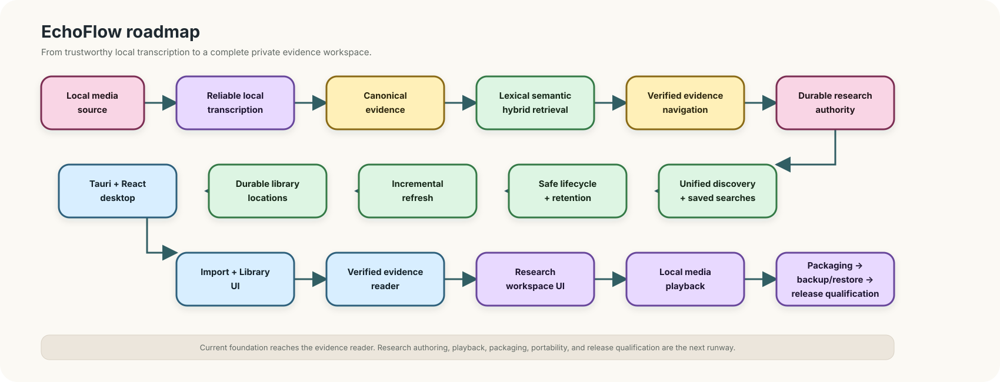

# EchoFlow roadmap 🗺️✨

EchoFlow is becoming a **private local workspace for recorded evidence**.

Its job is not to out-engine every speech-recognition runtime. Its job is to make local
transcription dependable, resumable, inspectable, searchable, navigable, annotatable, and
portable on ordinary computers while keeping source evidence and human-authored knowledge
under clear custody.

Modern EchoFlow restarted on August 2, 2026. The project has moved from “can we transcribe
a file?” through a substantial backend foundation and into real desktop evidence and
research workflows. This roadmap now audits the full product surface so backend capability
and desktop productization can be planned together rather than rediscovered a few features
at a time.


<details>
<summary>Static diagram fallback if rich rendering is unavailable</summary>



</details>

Text fallback: EchoFlow already spans local media, reliable transcription, canonical
evidence, retrieval, verified navigation, durable research, lifecycle controls, incremental
refresh, remembered locations, native import, Library discovery, the verified evidence
reader, and the first Research interactions. Remaining work is primarily productization:
finish the research loop, expose processing/model/job controls, add playback and lifecycle
UI, package the application, make durable work portable, and qualify real devices.

# What is foundation now

The word **foundation** below means the contract exists in code and is protected by tests.
It does not mean every capability has a non-technical desktop workflow yet.

## Local execution, media, and model custody

EchoFlow inspects process-visible CPU/memory, physical accelerator topology, and engine
capabilities before admitting a concrete local strategy. FFprobe provides deterministic
media inspection and stream selection; FFmpeg provides canonical local normalization and
optional deterministic enhancement. Work windows, checkpoint ordering, and resume remain
source-relative and provenance-bound.

Model acquisition is explicit and network-bearing. Managed model revisions are verified
and pinned before transcription; EchoFlow does not hide model download inside ASR.

## Canonical evidence and publication

Canonical JSON is authoritative transcript evidence. It retains source/execution
provenance, source-relative segment and word timing, language evidence, optional speaker
evidence, and optional enhancement provenance.

TXT, SRT, and WebVTT are deterministic publications. They are useful views, not transcript
authority. The original recording remains read-only during normal processing.

## Retrieval and verified navigation

The library has a database-neutral retrieval contract, DuckDB lexical projection,
BM25-style ranking, optional semantic chunks/embeddings, hybrid reciprocal-rank fusion,
and exact generation identity through `(document_id, canonical_sha256)`.

Search ranking and evidence navigation remain separate. A ranked passage becomes precise
evidence only after EchoFlow reopens the canonical transcript, verifies generation
identity, resolves exact segment/word coordinates, and returns a source-relative seek
coordinate.

## Durable research workspace

Authoritative SQLite owns notes, tags, collections, evidence anchors, and saved-search
intent. A monotonic journal drives a rebuildable DuckDB research projection.
`ResearchWorkspaceService` composes those stores with verified transcript retrieval.

The desktop can browse current and older-generation notes, create a note from verified
evidence, and edit/delete notes plus replace tag/collection assignments. Desktop edits are
optimistic-concurrency checked against the authoritative `updated_at` version and body plus
labels commit atomically with one research-journal event. Editing research never silently
rebinds its canonical evidence anchor.

Saved searches are durable questions, not result snapshots. Their backend lifecycle is
implemented; desktop create/run/rename/delete remains work.

## Safe deletion, refresh, and locations

`LibraryCustodyService` provides dry-run-first typed deletion. Confirmation is bound to the
exact canonical generation, requested/effective scopes, mutation set, and relevant
preserved dependencies. Source deletion requires explicit `source-recording`, a second
`--allow-source` switch, and current provenance verification.

Normal library refresh reconciles changed canonical generations without reopening every
unchanged transcript. Metadata is a cheap change detector; canonical SHA-256 remains the
generation authority. Remembered transcript and recording locations persist explicit user
permission. Missing removable roots stay remembered but unavailable.

The default recording policy is manual. `automatic` is durable permission metadata only;
there is no background daemon silently processing recordings today.

## Desktop foundation

The desktop architecture is:

```text
EchoFlow Desktop
├── React + TypeScript + Vite     presentation
├── Tauri / Rust                  narrow native capability host
└── Python EchoFlow               application and evidence rules
```

The shell provides Archive/Midnight themes, keyboard-visible navigation, native file/folder
selection, one-time versus remembered import choices, recording discovery, transcript
refresh, grouped Library discovery, verified evidence reading/cursor movement, Research
browse, provenance-bound note creation, and version-checked note mutation.

React does not receive arbitrary shell, SQL/database, or raw evidence-path capability.

# Capability → desktop productization audit

This is the planning inventory. “Backend ready” means there is already a tested application
or CLI contract worth productizing, not that the desktop should simply expose a CLI flag.

| Capability | Authority available today | Desktop today | Remaining product work | Planned slice |
|---|---|---|---|---|
| First-run initialization | private workspace/output allocation and config validation | source-build startup only | first-run wizard, storage choices, failure recovery | Packaging / first run |
| Health diagnostics | `doctor` checks local state, disk, FFmpeg and system resources | none | human health panel, actionable repair guidance | Processing center |
| Hardware/resource policy | effective CPU/RAM/accelerator inspection, execution profiles and admission | none | resource summary, safe defaults, explicit overrides | Processing center |
| Managed model custody | inventory, recommendation, install, immutable revision verification/revalidation/removal | none | model manager, disk-cost visibility, download progress/cancel/retry, offline state | Processing center |
| Native import and remembered locations | durable transcript/recording roots and discovery permissions | **implemented** | location management/forget/availability polish | Settings / library polish |
| Recording discovery | candidate media discovery without hashing/probing/transcribing as a side effect | **implemented** | connect selected recordings to an explicit processing flow | Processing center |
| Job lifecycle | list/show status, progress, failure state, resumability and private-state discard | none | Jobs/Processing view, resume/retry/discard UX | Processing center |
| Transcription planning | media probe, stream choice, model/engine/resource plan, disk/memory admission, dry run | none | preflight summary before running work | Processing center |
| Transcription execution | faster-whisper local execution with checkpoints/resume | none | long-running Tauri↔Python execution contract, progress, cancel/resume and crash recovery | Processing center |
| Difficult-audio enhancement | deterministic FFmpeg suppression with timeline/provenance checks | none | explicit processing option plus explanation/cost preview | Processing controls |
| Anonymous diarization | recording-scoped speaker turns, word handoffs, overlap-aware presentation | backend only | processing toggle/resource warning and result presentation polish | Processing + speakers |
| Speaker display labels | durable user-authored names without biometric identity claims | labels can be presented in evidence | rename/manage speakers in desktop | Speaker tools |
| Canonical JSON authority | reproducible canonical transcript with full provenance | consumed indirectly | transcript/provenance inspector for advanced users | Evidence inspector |
| TXT/SRT/WebVTT publication | deterministic rebuildable exports | none | export chooser and destination workflow | Evidence/export tools |
| Lexical BM25 retrieval | private corpus ranking | **implemented** through Library discovery | advanced phrase/ANY/ALL and sort controls | Research/search completion |
| Semantic retrieval | optional local chunks/embeddings | backend ready, not normal packaged path | desktop mode control after model/dependency custody qualification | Search + semantic qualification |
| Hybrid RRF retrieval | lexical + semantic rank fusion | backend ready | retrieval-mode control and explainable result state | Search + semantic qualification |
| Verified evidence navigation | generation verification, context, exact word timing and seek coordinate | **implemented** | research-object return path and media playback | Research completion + playback |
| Unified discovery | typed transcript/note/tag/collection groups without fabricated cross-type score | **implemented** | richer filters and object-specific actions | Research/search completion |
| Research notes | exact generation-bound anchors in authoritative SQLite | browse/create/edit/delete **implemented in current tranche** | research-object → evidence navigation, stale-anchor review/re-anchor UX | Research completion |
| Tags and collections | durable names/relationships + rebuildable projection | browse + note assignment **implemented in current tranche** | dedicated navigation/filter/manage flows | Research completion |
| Saved searches | create/run/delete typed intent, current-corpus re-resolution | browse only | create/run/rename/delete UI, result handoff | Research completion |
| Research-aware filtering | tags/collections/note text constrain evidence before ranking | backend ready | desktop filters with inspectable active state | Research/search completion |
| Safe deletion | typed dry-run plans, exact confirmation binding, source double-guard | none | custody center with plan review and explicit confirmation | Lifecycle UI |
| Retention | execution-state-only age policies preserving evidence/research | none | retention settings, preview, cleanup result | Lifecycle UI |
| Local source playback | verified source-relative seek coordinate exists | no playback | Tauri-owned media capability, playback state, source mismatch/unavailable handling | Native playback |
| Desktop packaging | Python wheel + tested source build | development Tauri shell | managed Python sidecar/runtime, FFmpeg/native deps, Windows/macOS/Linux installers | Packaging |
| Updates/uninstall | custody semantics exist conceptually | none | signed updates and uninstall that never implies evidence deletion | Packaging |
| Backup/restore | authority boundaries identify irreplaceable state | none | backup manifest, restore/reconciliation and recovery UX | Portability |
| Research export | evidence identities and numeric coordinates exist | none | CSV/JSONL/Markdown selected-research export | Portability |
| Packaged semantic custody | dependency/model rules are designed | not qualified | locked optional stack, immutable embedding model, private cache, offline use | Semantic qualification |
| Representative hardware | resource-planning contracts exist | CI smoke on major OSes | 8/16 GB, Apple Silicon, dGPU, 32/64 GB real-device qualification | Release qualification |

# Product critical path

The audit changes one important thing about the old roadmap: **media playback is not the
only major desktop gap after Research.** EchoFlow already has a surprisingly complete local
processing/control plane in Python, but a normal desktop user cannot yet launch and manage
that work. Productization should expose that capability before packaging freezes the native
runtime shape.

## 1. Finish the Research and Library interaction loop

Current foundation after this tranche:

- Research navigation and authoritative overview;
- current-versus-older canonical generation presentation;
- note creation from a verified evidence window;
- atomic edit of note body + tag/collection assignments;
- guarded note deletion;
- optimistic concurrency using authoritative `updated_at`; and
- no frontend SQL, SQLite, or raw evidence paths.

Remaining work:

- create, run, rename, and delete saved searches;
- navigate a note/tag/collection/saved-search result back to current verified evidence when
  possible;
- preserve older-generation anchors visibly and provide explicit review/re-anchor rather
  than automatic migration; and
- expose typed search controls for phrase/ANY/ALL, speaker, language, transcript, research
  filters, retrieval mode, and sort.

This closes the loop: **find evidence → verify → annotate → organize → ask a durable
question → return to evidence.**

## 2. Build the desktop Processing center

This is the largest backend-to-product gap.

The first Processing center should combine three existing authorities without collapsing
them into one giant settings screen:

1. **Machine + model readiness:** doctor status, runner resources/policy, model inventory,
   recommendation, install/revalidate/remove and disk cost.
2. **Job lifecycle:** queued/running/completed/failed work, progress, resumability, failure
   explanation, resume/retry, and explicit private-state discard.
3. **Transcription preflight + launch:** selected recording, media/stream summary, profile,
   model/engine target, disk/memory admission, optional diarization/enhancement/publication,
   then explicit start.

Long-running work must not be modeled as a browser request that happens to take an hour.
Tauri should own native process/capability lifecycle while Python continues to own planning,
resource admission, transcription correctness, checkpointing, and publication.

## 3. Finish transcript controls and speaker tools

Once desktop processing can create evidence itself, expose the existing user-facing control
surfaces that make the result understandable:

- selected audio stream where more than one legitimate stream exists;
- enhancement/diarization choices with resource and provenance implications;
- publication format selection;
- speaker display-name editing while retaining anonymous speaker refs as evidence identity;
- language/speaker transcript presentation controls; and
- provenance/transcript inspection where it helps troubleshooting or audit.

## 4. Add local media playback behind a Tauri capability

The evidence reader already has a verified source-relative cursor. Let that coordinate drive
local audio/video without handing an arbitrary path to React.

Rust owns file capability and media lifecycle. Python owns source identity/evidence rules.
The webview receives playback state and safe coordinates, not general filesystem authority.

Qualification includes unavailable/moved sources, source identity mismatch, keyboard
transport, reduced motion, long media, and seeking around exact word boundaries.

## 5. Productize safe lifecycle and retention

Before a packaged app invites non-technical users to accumulate large local corpora, give
them safe cleanup tools:

- dry-run deletion plan review;
- plan-bound confirmation;
- visibly separate source, canonical evidence, derived artifacts, execution state, research,
  and saved-search scopes;
- the source-recording second guard; and
- retention preview/cleanup for eligible private execution state.

A friendly Delete button must never flatten EchoFlow’s custody model.

## 6. Desktop packaging, first run, updates, and uninstall

Produce deliberate delivery paths for:

- a normal Windows installer/application entry point;
- a signed/notarized macOS application bundle and installer/disk-image flow; and
- an intentional Linux desktop package.

Packaging must account for the Tauri host, managed Python runtime/sidecar, FFmpeg/FFprobe,
native transcription dependencies, model custody, migrations, updates, and uninstall.

**Uninstalling EchoFlow must not silently delete canonical transcripts or authoritative
human research state.** Program removal and user-data destruction are different operations.

## 7. Backup, restore, and research portability

Back up what is irreplaceable: canonical evidence, research SQLite state, saved searches,
speaker labels, and other durable human state. Rebuildable DuckDB projections should be
regenerated rather than promoted to backup authority.

Remembered absolute paths are machine-local preferences. Export them as reviewable metadata
and require explicit reconciliation/reapproval on another machine.

Selected research export should target CSV, JSON/JSONL, and Markdown while retaining
document/generation identity, segment IDs, and numeric evidence coordinates.

## 8. Qualify semantic dependencies and embedding custody for packaging

Before semantic retrieval is advertised as a normal packaged capability, qualify one
locked optional dependency set with managed immutable embedding-model acquisition, private
cache placement, disk/resource admission, no silent search-time download, offline use after
installation, and packaged-platform qualification.

## 9. Representative-device release qualification

Exercise real corpora and the packaged app on 8 GB Windows, 16 GB commodity hardware,
Apple Silicon, a discrete-GPU laptop, and 32/64 GB workstations. Measure real-time factor,
cold/warm model behavior, thermal/memory pressure, private disk cost, enhancement benefit,
embedding build cost, refresh cost, query latency, and GUI responsiveness.

Also cover Unicode/space-heavy paths, external drives, permission failures, low disk,
interrupted downloads, crash/resume, upgrade migrations, uninstall/reinstall, offline
operation, keyboard/accessibility use, corruption/recovery, location disappearance and
reappearance, and one-time versus remembered import.

# Cross-cutting rules for every desktop slice

The frontend is not a second application authority. Every new surface should preserve these
boundaries:

| Concern | Owner |
|---|---|
| canonical transcript/evidence rules | Python application services |
| durable research and custody rules | Python authoritative stores/services |
| native file/process/media capability | Tauri/Rust |
| presentation and interaction state | React |
| raw filesystem authority | never delegated generally to the webview |
| SQL/database authority | never delegated to React |
| long-running work | explicit native/application lifecycle, not a giant synchronous UI call |

Destructive operations need typed plans and explicit confirmation. Human-authored state
needs concurrency-safe mutation. Evidence navigation needs generation verification. Model
or network acquisition must be explicit. Accessibility and keyboard use remain release
gates, not cleanup work.

# Conditional later capabilities

## Deeper original-media clock qualification

Only add production/media-clock mapping when real recordings require it: non-zero stream
origins, rational frame/timecode rates, drop-frame semantics, PTS/DTS mapping, and explicit
synchronization across independent sources.

## Speech/source separation for overlapping speakers

Source separation remains later than honest overlap representation. It adds substantial
compute/model custody, uncertainty, derived-audio provenance, and failure modes. It should
demonstrate measurable recognition benefit before entering the normal path.

## Typed query evolution

Natural-language query assistance may eventually compile into the stable typed
`SearchQuery`/research-filter contract, but it must remain inspectable and must not turn an
LLM interpretation into hidden retrieval authority.

# Pre-1.0 meaning

The pre-1.0 milestone is not “the tests pass from a checkout.” It is:

> A normal person can install EchoFlow, understand first run, process sensitive recordings,
> search and annotate their evidence, recover from common failure, move or back up durable
> work, update the app safely, and remove the program without losing evidence.

The capability audit above is the checklist for reaching that state without accidentally
rebuilding mature backend behavior in the frontend.
