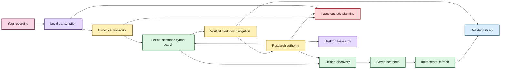
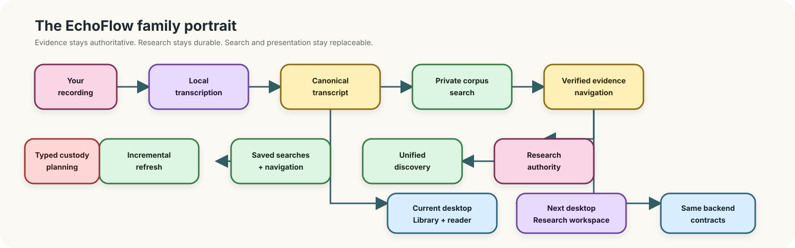

# Welcome to EchoFlow 🦝✨

EchoFlow is a **private, local-first workspace for recorded evidence**.

It can inspect a recording, choose a safe way to run on the computer you actually have,
transcribe locally, survive interruptions, preserve provenance, search a private corpus,
navigate results back to verified canonical evidence, keep research notes attached to that
evidence, save reusable research questions, and expose the main workflow through a native
desktop shell.

You do **not** need to understand CUDA, DuckDB, SQLite, BM25, model revisions, or desktop
IPC to use the product. Those are implementation details. The desktop should speak in
recordings, transcripts, searches, notes, processing, and evidence.

> **The short version:** your recording stays yours, canonical JSON remains inspectable
> evidence, your notes and saved searches remain your knowledge, and most machinery built
> around those things can be thrown away and rebuilt.

## What can EchoFlow do today?

| You want to… | EchoFlow currently… |
|---|---|
| Transcribe privately | runs faster-whisper locally from a verified managed model |
| Avoid melting a smaller laptop | inspects process-visible CPU, RAM, and compatible acceleration before choosing a strategy |
| Use the desktop to process a recording | provides readiness, model state, preflight, start/cancel, job progress, resume versus retry, and private-state discard in Processing |
| Survive interruption | checkpoints completed work and validates the original contract on resume |
| Keep the original recording intact | treats source media as read-only during normal processing and writes artifacts separately |
| Handle audio/video | selects one audio stream deterministically and canonicalizes locally |
| Clean noisy audio | optionally applies deterministic local suppression with provenance/timeline checks |
| Work across languages | supports multilingual decoding plus conservative local language attribution |
| Distinguish speakers | preserves optional anonymous recording-scoped speaker evidence without claiming identity |
| Publish useful formats | produces canonical JSON plus rebuildable TXT/SRT/WebVTT |
| Search a private corpus | supports lexical BM25, optional semantic retrieval, hybrid RRF, and inspectable Research search options |
| Follow a result to evidence | verifies canonical generation and returns justified segment/word/context/seek coordinates |
| Keep durable research | stores notes/tags/collections in authoritative private SQLite anchored to exact evidence |
| Edit research safely | atomically replaces note prose/labels and refuses stale desktop writes |
| Navigate research labels | filters notes through authoritative tag/collection semantics and keeps selected filters inspectable |
| Reuse research questions | stores and edits full typed saved-search intent, then re-resolves current evidence |
| Remember libraries | persists explicit transcript/recording location permissions without copying user media |
| Refresh an evolving corpus | incrementally reconciles changed canonical generations and can verify tracked evidence |
| Remove something safely | plans typed deletion scopes before mutation and binds confirmation to the exact plan |
| Change appearance | offers Archive, Midnight, Paper, Moss, Plum, and Ember through one persisted, accessible Theme picker |

## Pick your doorway

- **[Getting started](getting-started.md)** for the source-build path, desktop path, and first transcript.
- **[Processing Center](architecture/processing-center.md)** for what the desktop processing workflow owns and what remains authoritative in Python/Tauri.
- **[Find things across the whole local library](library-discovery.md)** for grouped Library discovery.
- **[Research search](research-search.md)** for Match, Search options, saved searches, and the typed backend contract beneath the ordinary UI.
- **[Your notes should survive the machinery](research-notes.md)** for notes, tags, collections, saved research intent, and evidence-anchor maintenance.
- **[From search result to the exact evidence](evidence-navigation.md)** for verified canonical navigation and the evidence reader/cursor.
- **[Transcript time without calculator gymnastics](time-navigation.md)** for timeline and source-relative coordinate semantics.
- **[Give the anonymous speakers names](speaker-names.md)** for user-authored speaker labels.
- **[Semantic search, without the mystery box](semantic-search.md)** for local semantic/hybrid retrieval.
- **[Desktop themes and accessibility](development/desktop-accessibility.md)** for the semantic token system and contrast qualification.
- **[Safe deletion and retention](architecture/safe-deletion-retention.md)** for custody-aware deletion.
- **[Post-MVP research roadmap](post-mvp-roadmap.md)** for later research-native workflows.
- **[SECURITY.md](../SECURITY.md)** for the security boundary.
- **[Architecture](architecture/README.md)** for maintainers.
- **[Development docs](development/)** for prerequisites, testing, accessibility, benchmarking, and quality gates.

## The EchoFlow family portrait

Static diagram fallback if rich rendering is unavailable

Text fallback: canonical evidence feeds rebuildable search; search resolves back to verified
evidence; durable notes/tags/collections and saved searches remain authoritative human
knowledge; lifecycle and refresh reuse those identities; the desktop Library and Research
surfaces consume the same application contracts. Processing sits alongside those surfaces
as the desktop doorway into the existing local execution authorities.

## What belongs to you, and what can the raccoon rebuild? 🦝

| Data | What it is | Rebuildable? |
|---|---|---|
| Original recording | source evidence | **No** |
| Canonical transcript JSON | authoritative transcript evidence | **No** |
| Speaker display labels | user-authored knowledge | **No** |
| Research notes, tags, collections, anchors | user-authored knowledge | **No** |
| Saved searches | user-authored query intent | **No** |
| Remembered library/recording locations | machine-local app preference | **No, but reconcile on another machine** |
| Theme preference | machine-local presentation preference | Yes / non-evidence |
| TXT / SRT / WebVTT | publication views | Yes |
| Normalized/enhanced working audio | private processing material | Yes |
| Checkpoint workspace after publication | execution/recovery state | Usually disposable |
| Lexical/semantic search databases | derived search projections | Yes |
| Research query projection | derived view over durable research state | Yes |

If deleting a search projection destroys unique human-authored information, something has
gone very wrong.

## The desktop today

The first-release Research circuit and Processing Center are both built. Research search
uses ordinary product language by default: **Any of these words**, **All of these words**,
or **Exact phrase**; advanced retrieval, ordering, filters, result count, and context are
under **Search options**. Technical retrieval provenance remains available under
**Technical details**.

Processing exposes machine/model readiness, durable jobs, preflight, explicit launch,
native cancellation, resume versus retry, and safe private-state discard without moving
planning or evidence authority into React.

Appearance is now one compact Theme dropdown rather than one button per skin. All six
skins share the same semantic control/text/focus tokens and the same contrast/a11y test
matrix.

## What comes next

The next critical path is:

1. transcript and speaker tools plus provenance/details polish;
2. Tauri-owned local media playback from verified source-relative coordinates;
3. lifecycle and retention UI over the existing custody backend;
4. architecture/redundancy audit before packaging;
5. packaging, first run, signed updates, and evidence-safe uninstall;
6. backup/restore and selected research portability;
7. packaged semantic custody; and
8. representative-device qualification.

Only after the first desktop product is coherent do the deliberately separate
**[post-MVP research features](post-mvp-roadmap.md)** become normal roadmap work.

See **[ROADMAP.md](../ROADMAP.md)** for the capability matrix and detailed sequencing.

The editorial and Mermaid visual rules live in
**[documentation-style.md](documentation-style.md)**.
