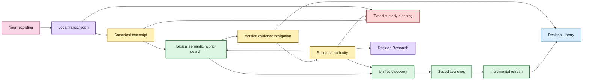

# Welcome to EchoFlow 🦝✨

EchoFlow is a **private, local-first workspace for recorded evidence**.

It can inspect a recording, choose a safe way to run on the computer you actually have, transcribe locally, survive interruptions, preserve provenance, search a private corpus, navigate results back to verified canonical evidence, keep research notes attached to that evidence, save reusable research questions, manage generation-bound speaker labels, inspect transcript provenance, publish derived transcript views, and play verified local source evidence through a native desktop shell.

You do **not** need to understand CUDA, DuckDB, SQLite, BM25, model revisions, or desktop IPC to use the product. Those are implementation details. The desktop should speak in recordings, transcripts, searches, notes, processing, speakers, playback, and evidence.

> **The short version:** your recording stays yours, canonical JSON remains inspectable evidence, your notes/speaker names/saved searches remain your knowledge, and most machinery built around those things can be thrown away and rebuilt.

## What can EchoFlow do today?

| You want to… | EchoFlow currently… |
|---|---|
| Transcribe privately | runs faster-whisper locally from a verified managed model |
| Avoid melting a smaller laptop | inspects effective CPU/RAM and compatible acceleration before choosing a strategy |
| Process from the desktop | provides readiness, model state, preflight, supervised start/cancel, progress, resume versus retry, and private-state discard |
| Survive interruption | checkpoints completed work and validates the original contract on resume |
| Keep the original intact | treats source media as read-only during normal processing and writes artifacts separately |
| Handle audio/video | selects one audio stream deterministically and canonicalizes locally |
| Clean noisy audio | optionally applies deterministic local suppression with provenance/timeline checks |
| Work across languages | supports multilingual decoding plus conservative local language attribution |
| Distinguish speakers | preserves anonymous recording-scoped speaker evidence without claiming identity |
| Name known speakers | stores human display names separately and binds them to the exact canonical generation |
| Read handoffs/overlap | presents single-speaker, overlap, mixed, and unattributed spans without flattening uncertainty |
| Inspect a transcript | shows verified generation, selected audio stream, source availability, and processing provenance |
| Publish useful formats | produces canonical JSON plus rebuildable TXT/SRT/WebVTT, including post-hoc desktop publication |
| Search a private corpus | supports lexical BM25, optional semantic retrieval, hybrid RRF, and inspectable Research search options |
| Follow a result to evidence | verifies canonical generation and returns justified segment/word/context/seek coordinates |
| Play the cited recording | re-verifies the exact transcript generation and source before opening an opaque native audio/video session |
| Keep durable research | stores notes/tags/collections in authoritative private SQLite anchored to exact evidence |
| Reuse questions | stores and edits full typed saved-search intent, then re-resolves current evidence |
| Remember libraries | persists explicit transcript/recording permissions without copying user media |
| Refresh an evolving corpus | incrementally reconciles changed canonical generations and can verify tracked evidence |
| Remove something safely | plans typed deletion scopes before mutation and binds confirmation to the exact plan |
| Change appearance | offers Archive, Midnight, Paper, Moss, Plum, Ember, Pride, and Monochrome through one accessible Theme picker |

## Pick your doorway

- **[Getting started](getting-started.md)** for the source-build path, desktop path, and first transcript.
- **[Processing Center](architecture/processing-center.md)** for the desktop processing authority split.
- **[Transcript and speaker tools](transcript-tools.md)** for generation-bound details, speaker management, overlap presentation, and post-hoc publication.
- **[Verified native playback](native-playback.md)** for source re-verification, opaque media sessions, exact seek coordinates, and the multi-audio fail-closed rule.
- **[Find things across the whole local library](library-discovery.md)** for grouped Library discovery.
- **[Research search](research-search.md)** for Match, Search options, saved searches, and the typed backend contract beneath the ordinary UI.
- **[Your notes should survive the machinery](research-notes.md)** for notes, tags, collections, saved research intent, and anchor maintenance.
- **[From search result to the exact evidence](evidence-navigation.md)** for verified canonical navigation and the evidence reader/cursor.
- **[Transcript time without calculator gymnastics](time-navigation.md)** for timeline and source-relative coordinates.
- **[Give the anonymous speakers names](speaker-names.md)** for human-authored display labels and generation semantics.
- **[Semantic search, without the mystery box](semantic-search.md)** for local semantic/hybrid retrieval.
- **[Desktop themes and accessibility](development/desktop-accessibility.md)** for the eight-skin semantic token system and contrast qualification.
- **[Frontend testing strategy](development/frontend-testing.md)** for frontend/backend test ownership and mutation policy.
- **[Safe deletion and retention](architecture/safe-deletion-retention.md)** for custody-aware deletion.
- **[Post-MVP research roadmap](post-mvp-roadmap.md)** for later research-native workflows.
- **[SECURITY.md](../SECURITY.md)** for the repository security boundary.
- **[Architecture](architecture/README.md)** and **[Development docs](development/)** for maintainers.

## The EchoFlow family portrait

Static diagram fallback if rich rendering is unavailable

Text fallback: canonical evidence feeds rebuildable search; search resolves back to verified evidence; durable notes/tags/collections, speaker labels, and saved searches remain authoritative human knowledge; lifecycle and refresh reuse those identities; the desktop Processing, Library, transcript-tools, playback, and Research surfaces consume the same application authorities.

## What belongs to you, and what can the raccoon rebuild? 🦝

| Data | What it is | Rebuildable? |
|---|---|---|
| Original recording | source evidence | **No** |
| Canonical transcript JSON | authoritative transcript evidence | **No** |
| Speaker display labels | user-authored knowledge | **No** |
| Research notes, tags, collections, anchors | user-authored knowledge | **No** |
| Saved searches | user-authored query intent | **No** |
| Remembered locations | machine-local app preference | **No, but reconcile on another machine** |
| Theme preference | presentation preference | Yes / non-evidence |
| TXT / SRT / WebVTT | publication views | Yes |
| Normalized/enhanced working audio | private processing material | Yes |
| Checkpoint workspace after publication | execution/recovery state | Usually disposable |
| Lexical/semantic/research databases | derived projections | Yes |

If deleting a search projection destroys unique human-authored information, something has gone very wrong.

## The desktop today

Research/search, the Processing Center, desktop comprehension/themes, transcript/speaker tools, and verified native playback are now coherent first-release slices.

Research uses ordinary product language by default. Processing presents backend planning/admission rather than duplicating it. Transcript tools pass exact generation identity into Python for details, speaker mutation, and publication. Playback does the same for source authorization, then Rust owns an opaque opened-file session. The webview does not parse canonical evidence or receive canonical/source paths.

Appearance remains one compact picker. All eight skins share the same semantic text/control/focus contract and the same registry-driven contrast/a11y matrix.

## What comes next

The next critical path is:

1. lifecycle and retention UI over the existing custody backend;
2. architecture/redundancy audit before packaging;
3. packaging, first run, signed updates, and evidence-safe uninstall;
4. backup/restore and selected research portability;
5. packaged semantic custody; and
6. representative-device qualification.

Only after the first desktop product is coherent do the deliberately separate **[post-MVP research features](post-mvp-roadmap.md)** become normal roadmap work.

See **[ROADMAP.md](../ROADMAP.md)** for the capability audit and detailed sequencing. Editorial/Mermaid rules live in **[documentation-style.md](documentation-style.md)**.
