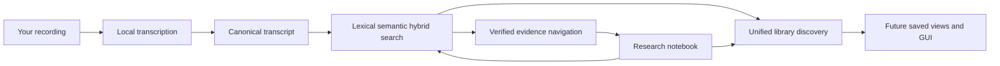

# Welcome to EchoFlow 🦝✨

EchoFlow is a **local-first workspace for recorded evidence**.

It can inspect a recording, choose a safe way to run on the computer you actually have,
transcribe locally, survive interruptions, preserve provenance, enrich the transcript,
search a private corpus, navigate a result back to verified canonical evidence, and keep
your own research notes attached to that evidence without giving them to a cloud service.

You do **not** need to understand CUDA, DuckDB, SQLite, BM25, vector spaces, immutable
model revisions, or why a raccoon has been granted library privileges to use the product.
Those details exist because somebody has to care about them. EchoFlow would like that
somebody to be EchoFlow.

> **The short version:** your recording stays yours, the canonical transcript remains
> inspectable evidence, your notes and labels remain your knowledge, and most machinery
> built around those things can be thrown away and rebuilt.

## What can EchoFlow do today?

EchoFlow is still pre-production, but the backend is no longer a toy transcription script.
The current foundation covers the local journey from media to a searchable, navigable
evidence corpus with durable user-authored research state.

| You want to… | EchoFlow currently… |
|---|---|
| Transcribe a recording privately | runs faster-whisper locally from a verified managed model |
| Avoid melting a smaller laptop | inspects process-visible CPU, RAM, and compatible acceleration before choosing a strategy |
| Survive an interruption | checkpoints completed work and validates the original contract on resume |
| Keep the original recording intact | treats source media as read-only evidence and writes processing artifacts separately |
| Handle video files | deterministically selects an audio stream and transcribes the audio-bearing source |
| Clean up a noisy recording | optionally applies deterministic local noise suppression with provenance and timeline checks |
| Work with multiple languages | supports multilingual decoding plus conservative local language attribution |
| Distinguish speakers | preserves optional anonymous recording-scoped speaker evidence without claiming identity |
| Give speakers useful display names | stores user-assigned labels separately from canonical diarization evidence |
| Read awkward handoffs honestly | distinguishes clean speaker spans, overlap, mixed/unresolved text, and unattributed text |
| Publish useful transcript formats | produces canonical JSON plus rebuildable TXT, SRT, and WebVTT views |
| Find an exact phrase later | builds a private local lexical/BM25 transcript library |
| Find an idea when wording changed | supports optional local semantic retrieval |
| Combine both search styles | uses inspectable reciprocal-rank fusion |
| Follow a search result back to evidence | verifies the canonical transcript, resolves exact lexical words when justified, expands context, and exposes a source seek coordinate |
| Keep durable research notes | stores notes, tags, and collections in authoritative private SQLite state anchored to exact canonical evidence |
| Query your notebook quickly | projects only query-relevant research relationships and lexical terms into rebuildable DuckDB state |
| Search transcript evidence through your notes | applies tag/collection/note-text constraints before lexical ranking or semantic scoring |
| Find related things across the whole workspace | returns grouped transcript evidence, notes, tags, and collections through one discovery query without inventing a cross-type score |

The point is not to make users operate the machinery. The point is to make sensitive local
transcription and research feel boringly dependable.

## Pick your doorway

### 💃 I just want to use the thing

Start with **[Getting started](getting-started.md)**.

It walks through installation, model setup, transcription, resume, exports, search, and
the current command-line research notebook.

### 🔎 I want one search box for the whole library

Read **[Find things across the whole local library](library-discovery.md)**.

It explains `echoflow library find QUERY`, why transcript evidence/notes/tags/collections
stay in separate result groups, what semantic mode does and does not affect, and how this
same application response is intended to feed the first GUI.

### 📝 I want to keep notes beside the evidence

Read **[Your notes should survive the machinery](research-notes.md)**.

It explains durable evidence anchors, notes/tags/collections, notebook queries,
research-aware transcript search, stale transcript generations, and why deleting a search
index cannot delete your research work.

### 🔎 I found something. Show me the actual evidence.

Read **[From search result to the exact evidence](evidence-navigation.md)**.

It explains canonical hash verification, exact lexical word highlighting, semantic
restraint, neighboring context, speaker display names, source seek coordinates, and the
durable anchor research notes reuse.

### 🕰️ I want to understand transcript time and jumping around

Read **[Transcript time without calculator gymnastics](time-navigation.md)**.

It explains source-relative timing, human elapsed display, source-declared media metadata,
and why playback should seek by canonical numeric coordinates.

### 👥 I want `speaker-02` to have a human name

Read **[Give the anonymous speakers names](speaker-names.md)**.

It explains why `speaker-02` remains evidence while `Dr. Chen` is durable user-authored
presentation state.

### ✨ I want to understand semantic search

Read **[Semantic search, without the mystery box](semantic-search.md)** for the
plain-language explanation of lexical, semantic, and hybrid search, including what an
embedding is and what stays local.

### 🔐 I care about privacy and security boundaries

Read **[SECURITY.md](../SECURITY.md)**. Security claims should be boring enough to audit.

### 🔧 I am maintaining or extending EchoFlow

Open the **[architecture maintenance hatch](architecture/README.md)**.

Those documents contain the exact contracts for media handling, execution strategy,
model custody, checkpoints, diarization, enhancement, transcript retrieval, evidence
navigation, and durable research-state projection.

### 🧪 I am here to break things professionally

The [development docs](development/) cover benchmarking, test design, bisect strategy,
semantic retrieval qualification, and targeted mutation testing.

## The EchoFlow family portrait

Text fallback: canonical evidence feeds rebuildable search; search resolves back to
verified evidence; durable notes/tags/collections attach to that evidence and can constrain
later retrieval; unified discovery now composes transcript evidence and research objects
into one grouped human doorway. Saved views and the GUI can build on that response instead
of reimplementing the backend.

The shared rule is simple:

**Do complicated work locally. Keep the evidence understandable, portable, and owned by
the user.**

## What belongs to you, and what can the raccoon rebuild? 🦝

| Data | What it is | Rebuildable? |
|---|---|---|
| Original recording | source evidence | **No** |
| Canonical transcript JSON | authoritative transcript artifact | **No** |
| Speaker display labels | user-authored knowledge | **No** |
| Research notes, tags, collections, evidence anchors | user-authored knowledge | **No** |
| Future saved searches / selected result sets | user-authored knowledge | **No** |
| TXT / SRT / WebVTT | publication views | Yes |
| Normalized/enhanced working audio | private processing material | Yes |
| Checkpoint machinery after successful publication | execution/recovery state | Usually disposable after completion |
| Lexical search database | derived search projection | Yes |
| Semantic chunks and vectors | derived search projection | Yes |
| Research query projection | derived relationships/terms over durable research state | Yes |
| Search context/highlight views | derived presentation over canonical evidence | Yes |

If deleting a search or research projection destroys unique user-authored information,
something has gone very wrong.

## Where the product is going next

The research-navigation sequence that used to live here as future work is now foundation:
word timing, human/source time semantics, speaker display labels, overlap-aware speaker
presentation, verified search navigation, durable notes/tags/collections, and unified
library discovery are implemented.

The next layers are intentionally more human-facing:

1. **Saved searches and useful derived navigation**, including frequent/recent tags and
   facets where they reduce hunting without creating new authoritative counters.
2. **A thin graphical shell** that can browse/find transcripts, select evidence, create
   notes, apply tags/collections, and seek local media using existing application services.
3. **Portable research export and incremental library refresh** so ownership and larger
   corpora remain pleasant rather than merely correct.
4. **Corpus-scale and representative-device qualification** so latency/resource decisions
   are measured on real workloads rather than guessed.
5. **Productization** through semantic-install qualification, installers, and polished
   recovery/error language.

The GUI should be a presentation adapter, not a second implementation of transcription,
search, time mapping, speaker policy, evidence anchoring, or research-state custody.

For the fuller sequencing and deliberate limits, see **[ROADMAP.md](../ROADMAP.md)**.

## Why the docs have different personalities

- **Welcome/onboarding docs** explain the product in ordinary language.
- **Feature guides** explain *why* a capability exists before exposing implementation
  detail.
- **Architecture docs** keep exact contracts, but provide a plain-English doorway.
- **Security, audit, schema, and command contracts** prioritize unambiguous language.

The detailed editorial rules live in **[documentation-style.md](documentation-style.md)**.

💃 **You are now allowed to leave the documentation lobby.**
