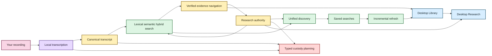

# Welcome to EchoFlow 🦝✨

EchoFlow is a **local-first workspace for recorded evidence**.

It can inspect a recording, choose a safe way to run on the computer you actually have,
transcribe locally, survive interruptions, preserve provenance, enrich the transcript,
search a private corpus, navigate results back to verified canonical evidence, keep your
research notes attached to that evidence, save reusable research questions, clean up local
state without making “delete” mean five dangerous things at once, and now expose those
contracts through the first real desktop workflows.

You do **not** need to understand CUDA, DuckDB, SQLite, BM25, vector spaces, immutable
model revisions, or why a raccoon has been granted library privileges. Those details exist
because somebody has to care about them. EchoFlow would like that somebody to be EchoFlow.

> **The short version:** your recording stays yours, canonical JSON remains inspectable
> evidence, your notes and saved searches remain your knowledge, and most machinery built
> around those things can be thrown away and rebuilt.

## What can EchoFlow do today?

EchoFlow is still pre-production, but it is no longer only a backend transcription project.

| You want to… | EchoFlow currently… |
|---|---|
| Transcribe privately | runs faster-whisper locally from a verified managed model |
| Avoid melting a smaller laptop | inspects process-visible CPU, RAM, and compatible acceleration before choosing a strategy |
| Survive interruption | checkpoints completed work and validates the original contract on resume |
| Keep the original recording intact | treats source media as read-only during normal processing and writes artifacts separately |
| Handle video | deterministically selects an audio stream |
| Clean noisy audio | optionally applies deterministic local suppression with provenance/timeline checks |
| Work across languages | supports multilingual decoding plus conservative local language attribution |
| Distinguish speakers | preserves optional anonymous recording-scoped speaker evidence without claiming identity |
| Name speakers for yourself | stores display labels separately from canonical diarization evidence |
| Publish useful formats | produces canonical JSON plus rebuildable TXT/SRT/WebVTT |
| Find exact wording | builds a private lexical/BM25 library |
| Find related meaning | supports optional local semantic retrieval and hybrid RRF |
| Follow a result to evidence | verifies canonical generation, resolves justified lexical words, expands context, exposes source-relative seek coordinates |
| Keep durable research notes | stores notes/tags/collections in authoritative private SQLite anchored to exact canonical evidence |
| Search through research state | applies tag/collection/note-text constraints before transcript scoring |
| Find related things across the workspace | returns grouped transcript/note/tag/collection results without inventing one score |
| Reuse a research question | saves typed query intent and re-resolves current evidence on replay |
| Remember where libraries live | persists explicit transcript/recording location permissions without copying user media |
| Refresh an evolving corpus | incrementally reconciles changed canonical generations and can verify tracked evidence |
| Remove something safely | plans typed deletion scopes before mutation and binds confirmation to the exact plan |
| Use a desktop shell | provides Tauri + React import, Library search, verified evidence reading, and Archive/Midnight themes |
| Browse the research layer | shows authoritative notes, tags, collections, saved searches, and current/older evidence state through a typed path-minimized bridge |

The point is not to make users operate the machinery. The point is to make sensitive local
transcription and research boringly dependable.

## Pick your doorway

### 💃 I just want to use the thing

Start with **[Getting started](getting-started.md)**. The source build is still the supported
installation path while desktop packaging is qualified.

### 🔎 I want one search box for the whole library

Read **[Find things across the whole local library](library-discovery.md)**. The same grouped
discovery contract now powers the desktop Library screen.

### 📝 I want notes beside the evidence

Read **[Your notes should survive the machinery](research-notes.md)**. The first desktop
Research screen now browses that same authoritative state; editing is the next UI slice.

### 🔎 I found something. Show me the actual evidence.

Read **[From search result to the exact evidence](evidence-navigation.md)**. The desktop
reader now opens verified neighboring context and lets canonical word coordinates move a
source-relative evidence cursor.

### 🕰️ I want to understand transcript time and jumping around

Read **[Transcript time without calculator gymnastics](time-navigation.md)**.

### 👥 I want `speaker-02` to have a human name

Read **[Give the anonymous speakers names](speaker-names.md)**.

### ✨ I want semantic search without a mystery box

Read **[Semantic search, without the mystery box](semantic-search.md)**.

### 🧹 I want to delete or clean something without regretting it

Read **[Safe deletion and retention](architecture/safe-deletion-retention.md)**.

Deletion is dry-run first. EchoFlow separates removing a transcript from search, deleting
regenerable publications, deleting private checkpoints, deleting canonical JSON, deleting
attached notes, deleting document-scoped saved searches, and deleting the original source.
Those are not synonyms.

### 🔐 I care about privacy and security boundaries

Read **[SECURITY.md](../SECURITY.md)**. Security claims should be boring enough to audit.

### 🔧 I am maintaining or extending EchoFlow

Open the **[architecture maintenance hatch](architecture/README.md)**.

### 🧪 I am here to break things professionally

The [development docs](development/) cover benchmarking, test design, bisect strategy,
semantic qualification, targeted mutation testing, frontend accessibility, and the current
quality gates.

## The EchoFlow family portrait



Text fallback: canonical evidence feeds rebuildable search; search resolves back to verified
evidence; durable notes/tags/collections and saved searches remain authoritative human
knowledge; lifecycle and refresh operations reuse those identities; the desktop Library and
Research surfaces consume the same application contracts rather than creating parallel
browser-owned data.

## What belongs to you, and what can the raccoon rebuild? 🦝

| Data | What it is | Rebuildable? |
|---|---|---|
| Original recording | source evidence | **No** |
| Canonical transcript JSON | authoritative transcript artifact | **No** |
| Speaker display labels | user-authored knowledge | **No** |
| Research notes, tags, collections, anchors | user-authored knowledge | **No** |
| Saved searches | user-authored query intent | **No** |
| Remembered library/recording locations | machine-local app preference | **No, but reconcile on another machine** |
| TXT / SRT / WebVTT | publication views | Yes |
| Normalized/enhanced working audio | private processing material | Yes |
| Checkpoint workspace after publication | execution/recovery state | Usually disposable |
| Lightweight lifecycle manifest | discovery/execution metadata | Small; retained by workspace cleanup |
| Lexical search database | derived search projection | Yes |
| Semantic chunks and vectors | derived search projection | Yes |
| Research query projection | derived view over durable research state | Yes |

If deleting a search projection destroys unique human-authored information, something has
gone very wrong.

## What “delete” means now

EchoFlow's deletion command is a plan by default:

```bash
echoflow library delete JOB_ID --scope library-view
```

It returns the exact action set and a confirmation token. Repeating the same request with
`--confirm TOKEN` applies only if the current plan still matches.

`canonical-transcript` automatically includes only disposable descendants: active search
membership, TXT/SRT/VTT, and private execution state. It does not imply deleting attached
notes, document-scoped saved searches, or source media.

Source deletion requires both `source-recording` and `--allow-source`, and the current
source must still match transcription provenance. EchoFlow does not claim that ordinary
filesystem deletion proves secure physical erasure.

Retention is narrower:

```bash
echoflow library retention --execution-days 30
```

It can age-delete only private job workspaces. Running jobs are never eligible;
failed/interrupted jobs require `--include-incomplete` because cleanup removes resume
capability. Canonical evidence, research state, source media, and lifecycle manifests are
preserved.

## Where the product is going next

Incremental refresh, durable locations, the Tauri/React shell, native import, grouped
Library discovery, verified evidence reading, and the first browse-first Research surface
are now foundation.

The next layers are:

1. **Research interaction UI** for note creation/editing, tags/collections, and saved-search
   management through the existing typed backend authority.
2. **Tauri-owned local media playback** driven by verified source-relative coordinates,
   without exposing arbitrary raw paths to React.
3. **Desktop packaging and first run** for Windows, signed/notarized macOS, and deliberate
   Linux delivery.
4. **Backup, restore, and portable research export** while rebuilding disposable indexes.
5. **Semantic dependency/model qualification and representative-device release testing**.

For detailed sequencing and limits, see **[ROADMAP.md](../ROADMAP.md)**.

## Why the docs have different personalities

- **Welcome/onboarding docs** explain the product in ordinary language.
- **Feature guides** explain why a capability exists before implementation detail.
- **Architecture docs** keep exact contracts with a plain-English doorway.
- **Security, audit, schema, and command contracts** prioritize unambiguous language.

The editorial and Mermaid visual rules live in
**[documentation-style.md](documentation-style.md)**.

💃 **You are now allowed to leave the documentation lobby.**
