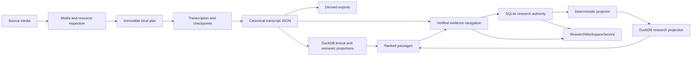

# EchoFlow architecture 🔧

Welcome to the maintenance hatch.

The user-facing docs explain what EchoFlow does. These pages explain **why the boundaries
exist, what each capability owns, what it refuses to own, and which invariants must
survive refactors**.

If you are trying to transcribe a file rather than maintain the system, use
**[Getting started](../getting-started.md)**. There is no prize for learning cgroup
accounting before lunch.

## The shape of the system

EchoFlow is built around narrow local capabilities instead of one universal pipeline or
generic plugin framework. The composition root lives in
`src/echoflow/app/app_container.py` and wires concrete implementations with Dependency
Injector.



Text fallback: source media produces canonical transcript evidence; DuckDB search
projections rank passages; evidence navigation verifies those passages; SQLite owns
human-authored research state; a deterministic projector builds disposable DuckDB query
state; `ResearchWorkspaceService` is the application-facing seam across those boundaries.

The architectural through-line is **custody**. Source evidence, canonical transcript
truth, private execution state, managed model dependencies, rebuildable indexes, and
durable human knowledge intentionally have different deletion and recovery semantics.

## Where to look

| Page | What question it answers |
|---|---|
| [Processing capabilities](processing-capabilities.md) | How does the whole local transcription/research system fit together? |
| [Adaptive heterogeneous execution](adaptive-heterogeneous-execution.md) | How does EchoFlow decide what this machine can safely run? |
| [Media and timeline](media-and-timeline.md) | What source did we inspect, which audio stream did we use, and what do timestamps mean? |
| [Word-level timestamp alignment](word-alignment.md) | How do engine-produced word timings become source-relative evidence? |
| [Local model management](model-management.md) | Which model revision is allowed to execute, and how did it get here? |
| [Speech enhancement](speech-enhancement.md) | How can preprocessing affect ASR without becoming source truth? |
| [Anonymous speaker diarization](diarization.md) | How are speaker turns represented without pretending anonymous labels are identities? |
| [Corpus search](corpus-search.md) | How do lexical/semantic/hybrid ranking and verified canonical navigation stay separate? |
| [Durable research state](research-state.md) | Why does SQLite own human research while DuckDB owns rebuildable acceleration, and how do they converge? |
| [ROADMAP](../../ROADMAP.md) | What is implemented, what is next, and what remains research? |
| [SECURITY](../../SECURITY.md) | What does the security boundary actually claim? |

## Package map

| Package | Responsibility |
|---|---|
| `app` | Dependency-injection composition root |
| `core` | Configuration, errors, observability, health, measurements |
| `interfaces` | Local filesystem/storage adapters and private-storage policy |
| `media` | Read-only source inspection and deterministic audio-stream selection |
| `runner` | Process-visible CPU/memory inspection and execution-budget policy |
| `model_management` | Explicit local model inventory, acquisition, verification, provenance, and removal |
| `transcription` | Planning, normalization, enhancement, segmentation, ASR, checkpoints, language attribution, word alignment, diarization, assembly, exports |
| `workspace` | Private job paths and public artifact allocation |
| `benchmarking` | Privacy-minimized local execution measurement |
| `library` | Retrieval, canonical evidence navigation, speaker presentation, authoritative research state, and rebuildable research projection |

`runner` means the local compute environment visible to the process; it is not a
distributed task runner. `media.probe` performs inspection, not transcoding.

## Capability boundaries

EchoFlow prefers a small object with one clear job over a grand abstraction that owns
everything vaguely adjacent to it.

External/configuration/durable-data boundaries may use Pydantic where parsing and
serialization are valuable. Small internal immutable values generally use frozen/slotted
dataclasses. Services use narrow `Protocol` capabilities when substitution is real and
useful.

The search/research area has deliberately separate responsibilities:

1. `TranscriptLibraryService` and retrieval services discover/rank rebuildable transcript
   passages.
2. `EvidenceLocator` verifies and resolves those passages back to canonical evidence.
3. `SpeakerLabelService` owns durable recording-scoped human display names without
   rewriting diarization evidence.
4. `ResearchStateStore` owns durable human-authored notes, tags, collections, and
   evidence anchors.
5. `ResearchStateProjector` owns convergence from authoritative SQLite state into the
   rebuildable research projection.
6. `ResearchProjectionIndex` owns fast derived research constraints and summaries.
7. `ResearchWorkspaceService` composes those capabilities for presentation adapters.

That split should survive unified discovery and the GUI. Presentation convenience is not
permission to merge custody boundaries.

## Why SQLite and DuckDB both exist

The two engines serve different workloads and different custody classes.

SQLite is authoritative for irreplaceable, frequently mutated user research. DuckDB is
used for rebuildable analytical/query projections over transcript and research data.
There is **one authority**, not two masters.

```text
SQLite authority
      |
      | monotonic transactional change journal
      v
ResearchStateProjector
      |
      v
DuckDB research projection
```

If the research projection disappears, rebuild it. If SQLite user state disappears,
unique human work is lost. That asymmetry is intentional.

See [Durable research state](research-state.md) for the full transaction, watermark,
rebuild, and fail-closed contract.

## The custody rules 🦝

These rules are load-bearing:

1. **Original media is source evidence and treated as read-only input.**
2. **Canonical transcript JSON is authoritative transcript evidence.**
3. **Managed model manifests describe verified local execution dependencies.**
4. **Lexical, semantic, and research DuckDB databases are private rebuildable
   projections.**
5. **User-authored speaker labels, notes, tags, collections, future saved searches, and
   curated result sets do not share deletion semantics with indexes.**
6. **Research-state joins include canonical generation identity, not a friendly segment ID
   alone.**
7. **Precise navigation resolves back to verified canonical evidence rather than trusting
   a stale search projection.**
8. **Research filters are applied before ranking/scoring when they define eligible
   evidence.**
9. **A convenience layer may not quietly become the only place unique evidence or user
   knowledge lives.**

Search infrastructure is allowed to disappear. User-authored knowledge is not.

## The next architectural seam

The next user-facing feature is **unified library discovery**. It should compose existing
services rather than create another database or search engine.

A future discovery service may return grouped typed results such as transcript evidence,
notes, tags, collections, and saved searches. It should preserve each result type's own
semantics rather than inventing one universal relevance score across unlike objects.

Saved searches belong to durable SQLite user state because they are authored workspace
intent. Frequent/recent tag rankings are derived convenience views and should not become
precious counters.

The first GUI then becomes a thin presentation adapter over the same discovery,
`ResearchWorkspaceService`, `EvidenceAnchor`, speaker, time, and playback-seek contracts.

## New abstraction test

Before adding a manager, framework, registry, adapter hierarchy, generalized plugin
system, or “database wrapper,” ask which concrete capability or invariant it protects.

File count is not an architectural problem. Repeated policy, unclear ownership, and
unprovable invariants are.

## Documentation contract

Architecture pages should provide:

- a plain-English doorway;
- a visual model when structure matters;
- the exact implementation contract;
- ownership/failure semantics; and
- explicit current limits or future seams.

See **[documentation-style.md](../documentation-style.md)** for the editorial contract.

The code can be serious without the prose developing a fear of joy. 💃
