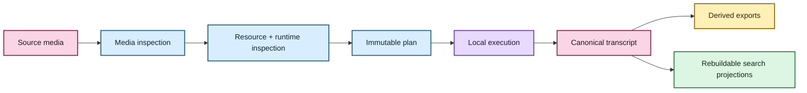

# EchoFlow architecture 🔧

Welcome to the maintenance hatch.

The user-facing docs explain what EchoFlow does. These pages explain **why the boundaries
exist, what each capability owns, what it refuses to own, and which invariants must
survive refactors**.

If you are trying to transcribe a file rather than maintain the system, back out gently
and use **[Getting started](../getting-started.md)**. There is no prize for learning
cgroup accounting before lunch.

## The shape of the system

EchoFlow is built around narrow local capabilities instead of one universal pipeline or
generic plugin framework. The composition root lives in
`src/echoflow/app/app_container.py` and wires concrete implementations with Dependency
Injector.

The architectural through-line is custody: source evidence and canonical transcript
truth remain distinguishable from temporary execution state, model dependencies, and
rebuildable search infrastructure.

## Where to look

| Page | What question it answers |
|---|---|
| [Processing capabilities](processing-capabilities.md) | How does the whole local transcription system fit together? |
| [Adaptive heterogeneous execution](adaptive-heterogeneous-execution.md) | How does EchoFlow decide what this machine can safely run? |
| [Media and timeline](media-and-timeline.md) | What source did we inspect, which audio stream did we use, and what do timestamps mean? |
| [Word-level timestamp alignment](word-alignment.md) | How do engine-produced word timings become source-relative evidence and improve speaker handoffs? |
| [Local model management](model-management.md) | Which model revision is allowed to execute, and how did it get here? |
| [Speech enhancement](speech-enhancement.md) | How can preprocessing affect ASR without becoming source truth? |
| [Anonymous speaker diarization](diarization.md) | How are speaker turns represented without pretending anonymous labels are identities? |
| [Corpus search](corpus-search.md) | How does canonical evidence become lexical/semantic/hybrid retrieval without becoming database-owned? |
| [ROADMAP](../../ROADMAP.md) | What is implemented, what is next, and what remains research? |
| [SECURITY](../../SECURITY.md) | What does the security boundary actually claim? |

🧜‍♀️ The mermaid has no architectural responsibility. She is observing.

## Package map

| Package | Responsibility |
|---|---|
| `app` | Dependency-injection composition root |
| `core` | Configuration, errors, observability, health, measurements |
| `interfaces` | Local filesystem/storage adapters and private-storage policy |
| `media` | Read-only source inspection and deterministic audio-stream selection |
| `runner` | Process-visible CPU/memory inspection and execution-budget policy |
| `model_management` | Explicit local model inventory, acquisition, verification, provenance, and removal |
| `transcription` | Planning, normalization, enhancement, segmentation, ASR, checkpoints, language attribution, word alignment, diarization, assembly, exports |
| `workspace` | Private job paths and public artifact allocation |
| `benchmarking` | Privacy-minimized local execution measurement |
| `library` | Evidence-first lexical/semantic retrieval over rebuildable transcript projections |

A couple of names are easy to misread. `runner` means the local compute environment
available to the process; it is not a distributed task runner. `media.probe` performs
inspection, not transcoding.

## Capability boundaries

EchoFlow prefers a small object with one clear job over a grand abstraction that owns
everything vaguely adjacent to it.

External/configuration/durable-data boundaries may use Pydantic where parsing and
serialization are valuable. Small internal immutable values generally use frozen/slotted
dataclasses. Services use narrow `Protocol` capabilities when substitution is real and
useful for testing or multiple implementations.

Structlog remains behind `core.observability.ILogger`; application services should not
need to import Structlog directly.

## The custody rules 🦝

These rules are load-bearing:

1. **Original media is source evidence and treated as read-only input.**
2. **Canonical transcript/checkpoint artifacts carry execution truth.**
3. **Managed model manifests describe verified local execution dependencies.**
4. **Lexical and semantic databases are derived, private, and rebuildable.**
5. **Future user-authored notes, labels, tags, collections, and annotations must not
   share deletion semantics with rebuildable indexes.**
6. **A convenience layer may not quietly become the only place unique evidence lives.**

That fifth rule matters more as the product becomes a research library. Search
infrastructure is allowed to disappear. User-authored knowledge is not.

## New abstraction test

Before adding a manager, framework, registry, adapter hierarchy, or generalized plugin
system, ask which concrete capability or invariant it protects.

File count is not an architectural problem. Repeated policy, unclear ownership, and
unprovable invariants are.

## Documentation contract

Architecture docs may be technical. They should not require a reader to decode a wall of
implementation nouns before learning the purpose.

Each architecture page should aim to provide:

- a plain-English doorway;
- a visual model when structure matters;
- the exact implementation contract;
- ownership/failure semantics; and
- explicit current limits or future seams.

See **[documentation-style.md](../documentation-style.md)** for the editorial contract.

The code can be serious without the prose developing a fear of joy. 💃