# EchoFlow architecture 🔧

Welcome to the maintenance hatch.

The user-facing docs explain what EchoFlow does. These pages explain **why the boundaries
exist, what each capability owns, what it refuses to own, and which invariants must
survive refactors**.

If you are trying to transcribe a file rather than maintain the system, use
**[Getting started](../getting-started.md)**.

## The shape of the system

EchoFlow is composed from narrow local capabilities in
`src/echoflow/app/app_container.py`. The through-line is custody: source evidence,
canonical transcript truth, private execution state, rebuildable projections, durable
human knowledge, and desktop presentation deliberately do not share authority semantics.

```mermaid
flowchart LR
    A[Source media] --> B[Media and resource inspection]
    B --> C[Immutable local plan]
    C --> D[Transcription and checkpoints]
    D --> E[Canonical transcript JSON]
    E --> F[Derived exports]
    E --> G[DuckDB lexical and semantic projections]
    G --> H[Ranked passages]
    E --> I[Verified evidence navigation]
    H --> I
    I --> J[SQLite research authority]
    J --> K[Deterministic projector]
    K --> L[DuckDB research projection]
    L --> H
    J --> M[Saved searches]
    J --> N[ResearchWorkspaceService]
    I --> N
    M --> N
    N --> O[Unified discovery]
    E --> P[LibraryCustodyService]
    G --> P
    J --> P
    D --> P
    P --> Q[Plan-bound deletion]
    O --> R[Versioned desktop bridge]
    I --> R
    R --> S[React Library and evidence reader]
    N --> T[Next Research workspace UI]

    classDef source fill:#F9D5E5,stroke:#7B2E52,stroke-width:2px,color:#22151B
    classDef process fill:#E8D9FF,stroke:#68469B,stroke-width:2px,color:#1F1630
    classDef evidence fill:#FFF0B8,stroke:#8A6B18,stroke-width:2px,color:#2C260F
    classDef view fill:#DDF5E3,stroke:#347A46,stroke-width:2px,color:#142719
    classDef inspect fill:#D8EEFF,stroke:#2E617B,stroke-width:2px,color:#12222A
    classDef stop fill:#FFD6D6,stroke:#9E3434,stroke-width:2px,color:#351616

    class A source
    class B,C,D process
    class E,I,J evidence
    class F,G,H,K,L,M,O view
    class N,R,S inspect
    class T process
    class P,Q stop
```



Text fallback: canonical JSON is evidence; DuckDB ranks rebuildable views; canonical
navigation verifies evidence; SQLite owns human research; `ResearchWorkspaceService`
composes research interactions; the current desktop bridge feeds Library/evidence
presentation; a dedicated Research UI is the next consumer of that same authority;
`LibraryCustodyService` keeps destructive policy separate.

## Where to look

| Page | What question it answers |
|---|---|
| [Processing capabilities](processing-capabilities.md) | How does the local transcription/research system fit together? |
| [Adaptive heterogeneous execution](adaptive-heterogeneous-execution.md) | How does EchoFlow decide what this machine can safely run? |
| [Media and timeline](media-and-timeline.md) | Which source/stream did we use, and what do timestamps mean? |
| [Word-level timestamp alignment](word-alignment.md) | How do engine timings become source-relative evidence? |
| [Local model management](model-management.md) | Which model revision is allowed to execute, and how did it get here? |
| [Speech enhancement](speech-enhancement.md) | How can preprocessing affect ASR without becoming source truth? |
| [Anonymous speaker diarization](diarization.md) | How are speaker turns represented without pretending anonymous labels are identities? |
| [Corpus search](corpus-search.md) | How do lexical/semantic/hybrid ranking and verified navigation stay separate? |
| [Durable research state](research-state.md) | Why does SQLite own human research while DuckDB owns rebuildable acceleration? |
| [Library lifecycle](library-lifecycle.md) | Where does canonical JSON live, what does rebuild/refresh scan, and which state is durable? |
| [Library locations](library-locations.md) | What does “remember this folder” persist, and what does discovery refuse to do? |
| [Incremental library refresh](incremental-library-refresh.md) | How does the corpus reconcile without a full rebuild? |
| [Safe deletion and retention](safe-deletion-retention.md) | What exactly can be deleted, what is preserved, and how is destructive intent confirmed? |
| [ROADMAP](../../ROADMAP.md) | What is implemented, what is next, and what remains research? |
| [SECURITY](../../SECURITY.md) | What does the security boundary actually claim? |

## Package map

| Package / surface | Responsibility |
|---|---|
| `app` | Dependency-injection composition root |
| `core` | Configuration, errors, observability, health, measurements |
| `interfaces` | Local filesystem/storage adapters and private-storage policy |
| `media` | Read-only source inspection and deterministic audio-stream selection |
| `runner` | Process-visible CPU/memory inspection and execution-budget policy |
| `model_management` | Model inventory, acquisition, verification, provenance, removal |
| `transcription` | Planning, normalization, enhancement, segmentation, ASR, checkpoints, language, alignment, diarization, assembly, exports |
| `workspace` | Private job paths and public artifact allocation |
| `benchmarking` | Privacy-minimized local execution measurement |
| `library` | Retrieval, evidence navigation, research authority/projections, saved searches, discovery, refresh, locations, and typed custody policy |
| `desktop` | Versioned allowlisted Python bridge for native presentation adapters |
| `frontend` | React/TypeScript presentation over typed desktop operations; no direct DB/filesystem authority |
| `src-tauri` | Thin native host/capability boundary for dialogs, process lifecycle, and later local media capability |

## Capability boundaries

EchoFlow prefers a small object with one clear job over a universal manager.

The search/research/custody/desktop area deliberately separates responsibilities:

1. `TranscriptLibraryService` discovers and ranks rebuildable transcript passages.
2. `EvidenceLocator` verifies ranked passages against canonical evidence.
3. `SpeakerLabelService` owns durable recording-scoped human display names without
   rewriting diarization evidence.
4. `ResearchStateStore` owns durable notes, tags, collections, and exact evidence anchors.
5. `ResearchStateProjector` converges authoritative SQLite state into a disposable DuckDB
   research projection.
6. `ResearchProjectionIndex` owns fast derived research constraints and summaries.
7. `WorkspaceMetadataStore` owns durable saved-search intent and computes disposable
   navigation views.
8. `ResearchWorkspaceService` composes those capabilities for CLI and presentation adapters.
9. `LibraryLocationService` owns remembered directory permissions and cheap recording
   discovery without becoming a media processor.
10. `LibraryCustodyService` owns typed deletion planning/execution and age-based private
    execution-state retention.
11. `echoflow.desktop.bridge` exposes an allowlisted versioned IPC surface. Current
    Library/evidence DTOs retain stable evidence identity without leaking canonical/source
    filesystem paths to React.
12. React owns interaction and presentation only. It does not issue SQL, mutate DuckDB or
    SQLite directly, or receive arbitrary shell authority.

That split must survive future UI convenience work. Presentation convenience is not
permission to merge custody boundaries.

## Why SQLite and DuckDB both exist

SQLite is authoritative for irreplaceable, frequently mutated user research. DuckDB is
used for rebuildable analytical/query projections. There is one authority, not two
masters.

```text
SQLite authority
      |
      | monotonic transactional change journal
      v
ResearchStateProjector
      |
      v
DuckDB research projection
```

If a research projection disappears, rebuild it. If SQLite user state disappears, unique
human work is lost. That asymmetry is intentional.

Saved searches live in authoritative SQLite because they are authored intent. Their
runtime evidence scope does not. Replaying a saved search re-resolves the current corpus
and current research relationships.

## The custody rules 🦝

1. **Original media is source evidence and read-only during normal processing.** Explicit
   source deletion is a separate provenance-checked operation.
2. **Canonical transcript JSON is authoritative transcript evidence.**
3. **Managed model manifests describe verified local execution dependencies.**
4. **Lexical, semantic, and research DuckDB databases are rebuildable projections.**
5. **Speaker labels, notes, tags, collections, and saved searches are human-authored
   authority and do not inherit index deletion semantics.**
6. **Research joins include canonical generation identity, not a friendly segment ID alone.**
7. **Precise navigation resolves to verified canonical evidence rather than trusting a
   stale search projection.**
8. **Research filters apply before ranking/scoring when they define eligible evidence.**
9. **Saved searches persist typed query intent, not a frozen derived evidence scope.**
10. **Canonical deletion preserves attached notes and document-scoped saved searches unless
    their own destructive scopes are explicitly selected.**
11. **Age-based retention can delete only private job workspaces.**
12. **Remembered locations are permissions/pointers, not copies of user media.**
13. **The desktop webview receives typed presentation DTOs, not arbitrary filesystem paths
    or database handles.**
14. **EchoFlow does not claim secure erasure it cannot prove.**

Search infrastructure may disappear. User-authored knowledge may not disappear by
accident.

## Current application seams

Unified discovery, saved searches, frequent/recent navigation, and research interactions
compose through `ResearchWorkspaceService`. The current desktop exposes grouped Library
discovery plus verified context/word coordinates through narrow bridge methods.

Incremental corpus growth composes through `TranscriptLibraryService.refresh(...)` and
remembered roots through `LibraryLocationService`. Full `library rebuild` is the explicit
repair/recovery lever, not a normal “one file changed” workflow.

Custody-sensitive operations compose separately through `LibraryCustodyService`:

```bash
echoflow library delete TRANSCRIPT_ID --scope library-view
echoflow library delete TRANSCRIPT_ID --scope canonical-transcript
echoflow library retention --execution-days 30
```

Deletion and retention are dry-run by default. Applying a reviewed operation requires the
plan-bound token returned by the dry run.

The next desktop seam is the **Research workspace**, not another research database. It
should browse and mutate notes/tags/collections/saved searches through narrow bridge
operations delegating to `ResearchWorkspaceService`. Local media playback belongs behind a
separate Tauri-owned capability and should consume verified source-relative coordinates
without giving React arbitrary path authority.

## New abstraction test

Before adding a manager, framework, registry, adapter hierarchy, generalized plugin
system, or database wrapper, ask which concrete capability or invariant it protects.

File count is not an architectural problem. Repeated policy, unclear ownership, and
unprovable invariants are.

## Documentation contract

Architecture pages should provide a plain-English doorway, a structural model when useful,
the exact implementation contract, ownership/failure semantics, and explicit current
limits or future seams.

Mermaid diagrams use direct GitHub-supported fenced syntax and the approved EchoFlow
palette; color helps hierarchy but never carries the only meaning. See
**[documentation-style.md](../documentation-style.md)** for the editorial and visual
contract.
