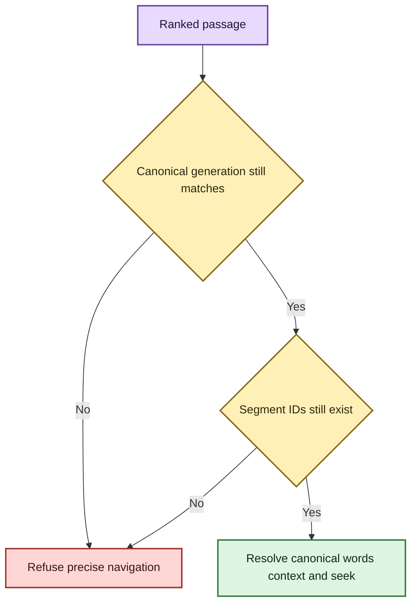

# Evidence-first corpus search 🔎🦝

Status: lexical, semantic/hybrid, canonical evidence navigation, research-aware filtering,
unified discovery, saved searches, incremental refresh, and desktop Library presentation
implemented.  
Last updated: August 19, 2026

## The human version

A transcript library should help you find **what was said** without quietly replacing
your evidence with a database, vector store, or generated answer.

EchoFlow supports three transcript retrieval modes:

| Mode | Best when… | Example |
|---|---|---|
| Lexical | you remember actual words, names, acronyms, or identifiers | `rent increase` |
| Semantic | you remember the idea but not the wording | `people struggling to afford housing` |
| Hybrid | you want exact terminology and conceptual similarity to support each other | research across a mixed corpus |

Retrieval ranks a passage. A separate navigation layer verifies the exact canonical
transcript generation and resolves that passage back to canonical segments and aligned
words. A research-workspace layer can decorate or constrain those results using durable
notes/tags/collections without teaching the search index that human-authored knowledge is
transcript truth.

> **Canonical transcript JSON is evidence. SQLite research state is human-authored truth.
> DuckDB search/research databases are rebuildable projections.**

```mermaid
flowchart LR
    A[Canonical transcript JSON] --> B[Lexical projection]
    A --> C[Semantic chunks and vectors]
    B --> D[BM25 ranking]
    C --> E[Dense ranking]
    D --> F[Hybrid RRF when requested]
    E --> F
    D --> G[Ranked passages]
    E --> G
    F --> G
    G --> H[Verify canonical evidence]
    H --> I[Segments words context seek]
    J[SQLite notes tags collections] --> K[DuckDB research projection]
    K --> B
    K --> C
    I --> L[ResearchWorkspaceService]
    J --> L
    L --> M[Unified discovery]
    M --> N[CLI Library]
    M --> O[Desktop Library]

    classDef source fill:#F9D5E5,stroke:#7B2E52,stroke-width:2px,color:#22151B
    classDef process fill:#E8D9FF,stroke:#68469B,stroke-width:2px,color:#1F1630
    classDef evidence fill:#FFF0B8,stroke:#8A6B18,stroke-width:2px,color:#2C260F
    classDef view fill:#DDF5E3,stroke:#347A46,stroke-width:2px,color:#142719
    classDef inspect fill:#D8EEFF,stroke:#2E617B,stroke-width:2px,color:#12222A

    class A,H,I evidence
    class B,C,D,E,F process
    class G,K,M view
    class J source
    class L,N,O inspect
```



Text fallback: canonical transcript evidence produces rebuildable lexical/semantic search
state; ranked passages are re-verified against canonical evidence; authoritative SQLite
research state is projected into DuckDB only to accelerate constraints/summaries; grouped
discovery then feeds both CLI and desktop Library presentation.

## Durability classes

### Authoritative evidence

- original recording supplied by the user;
- canonical transcript JSON.

### Authoritative user knowledge

- speaker display labels;
- research notes;
- tags;
- collections; and
- saved searches.

These are **not retrieval cache**. An index rebuild must never delete them.

### Rebuildable projections and views

- document/segment projection;
- lexical term statistics;
- deterministic search chunks;
- dense embeddings;
- normalized chunk-to-segment relationships;
- derived research relationships/lexical note terms;
- retrieval statistics; and
- context/highlight/navigation presentation.

If every DuckDB file disappeared, EchoFlow should reconstruct search/query acceleration
without losing unique evidence or human-authored research.

## Canonical hashing and stale-state refusal

EchoFlow records two different SHA-256 digests in the lexical document projection:

- `source_sha256`: recording digest captured during transcription;
- `canonical_sha256`: digest of the exact canonical transcript JSON bytes indexed by the
  library.

Every semantic generation records a `corpus_fingerprint` derived from sorted
`(document_id, canonical_sha256)` pairs. Semantic/hybrid retrieval refuses stale vectors.

Before exposing precise canonical segments/words, `EvidenceLocator` re-reads canonical
JSON and verifies its SHA-256, document identity, and source SHA against the ranked
passage. Stale indexed evidence fails closed instead of presenting fake precision.



## Lexical retrieval

`DuckDbTranscriptIndex` is the lexical adapter. It stores ordinary document, segment, and
term-statistic tables and computes deterministic BM25-style ranking without installing
DuckDB's FTS extension.

The public query is typed through `SearchQuery`, including text, phrase/ANY/ALL semantics,
speaker/language/document/timeline constraints, bounded limits, sorting, and optional
`evidence_scope`.

User values remain parameterized. The storage adapter owns SQL. The user and React do not.

Lexical tokenization is a shared library rule so ranking and exact canonical-word
highlighting use the same Unicode-aware token semantics.

## Semantic search chunks

ASR segments are evidence coordinates, not automatically ideal retrieval units. EchoFlow
combines adjacent canonical segments into deterministic retrieval windows.

`search-chunk-v1` currently uses target size 220 words, maximum target size 300 words, no
synthetic splitting inside one canonical ASR segment, no overlap in v1, stable
source-relative coordinates, content SHA-256, complete ordered segment IDs, and sorted
language/speaker refs.

A search chunk is never canonical evidence. It is a disposable retrieval window pointing
back to canonical segments.

## Embedding profile and strict-local boundary

One semantic index generation has one coherent `EmbeddingProfile`.

The current qualified profile targets:

```text
model_id             intfloat/multilingual-e5-small
dimensions           384
normalization        l2
pooling               mean
distance_metric      dot
query_transform      "query: {text}"
passage_transform    "passage: {text}"
chunking_profile     search-chunk-v1
resolved_revision    immutable snapshot revision
embedding_schema     1
```

Provider output is validated for cardinality, dimensions, finite values, and normalization
before it may replace valid semantic state.

The base locked project still does **not** declare Sentence Transformers as a normal
packaged semantic extra. Semantic search therefore remains advanced optional setup while
lexical search remains dependency-light.

## Numeric storage and exact similarity first

`DuckDbSemanticIndex` stores vectors as DuckDB `FLOAT[]`, not opaque BLOBs. The
application boundary remains `tuple[float, ...]`.

The first semantic implementation performs an exact scan over eligible local chunks.
Hard filters are applied before top-K ranking. No ANN/HNSW index exists yet; approximation
should appear only when measured corpus size shows exact local scan misses an interactive
latency target.

## Hybrid retrieval

Lexical BM25 and dense semantic scores do not share one trustworthy scale. EchoFlow
combines **ranks** using reciprocal rank fusion (RRF) with `k=60`:

```text
RRF(d) = Σ 1 / (60 + rank_i(d))
```

Hybrid retrieval overfetches bounded candidate ranks before fusion. `SearchResponse`
preserves lexical, semantic, and fused ranks.

## Canonical evidence navigation

`EvidenceLocator` resolves a ranked passage back to the verified canonical transcript and
produces an `EvidenceLocation` with exact canonical/source identity, result segment IDs,
numeric start/end, deterministic `seek_seconds`, canonical speaker refs, exact matched
aligned words when justified, and bounded canonical context.

Lexical results may expose exact aligned-word matches. Semantic-only results do not
fabricate exact-word precision. Hybrid results may expose lexical highlights when lexical
evidence contributed.

The desktop Evidence reader consumes the path-minimized presentation DTO from this seam.
It can move an evidence cursor among canonical timed words without pretending the current
React surface is already an audio/video player.

## Durable research state and pre-ranking constraints

Notes reuse `EvidenceLocator` rather than a parallel annotation coordinate system. A
durable `EvidenceAnchor` includes document/source/canonical identity, segment IDs, and
source-relative start/end seconds.

`ResearchWorkspaceService` can constrain transcript search using tags, collections, note
text, and `with_notes`. Human names resolve once to durable IDs. The rebuildable research
projection returns canonical evidence scope, then BM25 or semantic scoring runs **inside
that scope**.

The search contract distinguishes `evidence_scope = None` from `evidence_scope = ()`.
`None` means no research restriction. Empty means the restriction matched nothing and
search must return nothing.

## Unified discovery is implemented

One query can return four typed groups:

- transcript evidence;
- authoritative notes;
- tags; and
- collections.

The groups do not compete on a fabricated universal relevance scale. The CLI and desktop
Library screen both consume this application-level composition.

The desktop bridge intentionally strips raw canonical/source filesystem paths from the
webview response while retaining document/generation/segment/time identity needed for
research presentation.

## Saved searches are implemented

Saved searches belong to authoritative SQLite user state because they are authored query
intent. They persist typed search/research/retrieval choices, not a frozen evidence scope.
Running one re-resolves current corpus and current research relationships.

The browse-first desktop Research screen lists saved searches today. Graphical run/edit/
delete interactions are the next UI slice.

## Incremental library refresh

Normal corpus growth no longer requires full rebuild. Incremental refresh compares cheap
canonical metadata first, validates/hashes changed or new canonical bytes, applies an
atomic lexical delta, reconciles moved/external paths, and invalidates semantic state when
corpus generation identity changes.

`--verify` deliberately reopens every tracked canonical to detect same-size/mtime
modification. Full rebuild remains the explicit repair/recovery lever.

## Current deliberate limits

The current search/navigation/workspace system does not provide:

- generated corpus answers as the primary interface;
- arbitrary-model CLI selection;
- bundled embedding weights as a normal packaged dependency;
- ANN/HNSW or learned reranking;
- selected/exportable result-set objects;
- automatic cross-generation note re-anchoring;
- local audio/video playback yet;
- complete advanced query controls in the desktop UI yet;
- cross-recording biometric/person identity; or
- source separation for overlapping speech.

The product rule stays evidence-first:

> **Search may become smarter. The result should remain inspectable evidence, not an
> uncited answer floating above the corpus.**
