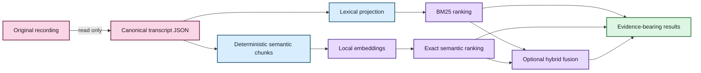
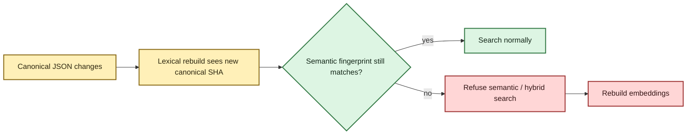
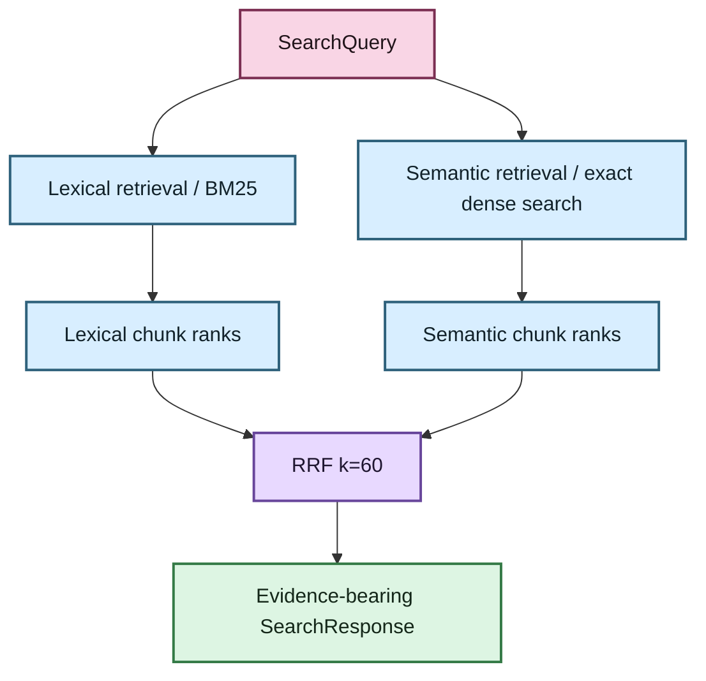
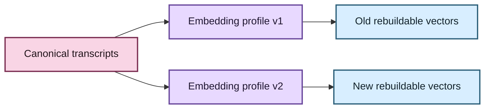

# Evidence-first corpus search 🔎🦝

Status: lexical retrieval implemented; semantic/hybrid foundation implemented with a strict-local optional E5 adapter  
Last updated: August 17, 2026

## The human version

A transcript library should help you find **what was said** without quietly replacing
your evidence with a database, vector store, or generated answer.

EchoFlow therefore supports three ways to retrieve transcript passages:

| Mode | Best when… | Example |
|---|---|---|
| Lexical | you remember the actual words, names, acronyms, or identifiers | `rent increase` |
| Semantic | you remember the idea but not the wording | `people struggling to afford housing` |
| Hybrid | you want exact terminology and conceptual similarity to support each other | research across a mixed corpus |

The result is still a passage from the transcript with timestamps and evidence context.

The load-bearing ownership rule is:

> **Canonical transcript JSON is evidence. Search databases are projections.**

That one sentence explains a large amount of the implementation below.



For a non-architecture explanation of embeddings and the local privacy boundary, read
**[Semantic search, without the mystery box](../semantic-search.md)** first.

## 🦝 What lives under the floorboards? Three durability classes

Search becomes much easier to reason about when data is classified by whether it can be
reconstructed.

### Authoritative evidence

- original recording supplied by the user;
- canonical transcript JSON.

### User-authored knowledge

Future notes, tags, collections, speaker display labels, annotations, and saved searches
belong here.

They are **not retrieval cache**. An index rebuild must never delete them. Durable
annotations should anchor to canonical evidence coordinates, not only to disposable
semantic chunk IDs.

### Rebuildable projections

- document projection;
- segment projection;
- lexical term statistics;
- deterministic search chunks;
- dense embeddings; and
- retrieval statistics.

If every search database disappeared, EchoFlow should be able to reconstruct search
from canonical transcripts without losing unique user-authored information.

## Canonical hashing and stale-state refusal

EchoFlow records two different SHA-256 digests in the lexical document projection:

- `source_sha256`: the recording digest captured when transcription was planned;
- `canonical_sha256`: the digest of the exact canonical transcript JSON bytes indexed
  by the library.

They answer different questions.

The original recording may remain byte-identical while the canonical transcript changes
because it was regenerated, enriched, corrected, or replaced.

Every semantic generation records a `corpus_fingerprint` derived from sorted
`(document_id, canonical_sha256)` pairs.



EchoFlow does not quietly search stale vectors.

## Lexical retrieval

`DuckDbTranscriptIndex` is the current lexical adapter. It stores ordinary document,
segment, and term-statistic tables and computes deterministic BM25-style ranking without
installing DuckDB's FTS extension.

The public application query remains typed through `SearchQuery`:

```text
SearchQuery
  text = "housing"
  phrase = false
  operator = any | all
  speaker_refs = ["speaker-02"]
  languages = ["en"]
  document_ids = ["job-123"]
  sort = relevance | timeline
  limit = 100
```

User values remain parameterized. The storage adapter owns SQL. The user does not.

Lexical search remains the base/default mode and does not require a semantic runtime.

## Why semantic search needs chunks

ASR segments are evidence coordinates, not automatically good retrieval units.

A canonical segment might contain only:

```text
Yeah.
```

or:

```text
And then we moved.
```

Embedding tiny fragments like that can lose useful surrounding meaning. EchoFlow
therefore combines adjacent canonical segments into deterministic retrieval windows.

`search-chunk-v1` currently uses:

- target size: 220 whitespace-delimited words;
- maximum target size: 300 words;
- no synthetic splitting inside one canonical ASR segment;
- no overlap in v1;
- stable document/segment ordering;
- content SHA-256;
- first/last segment IDs plus the complete ordered segment-ID tuple;
- exact source-relative start/end timestamps; and
- sorted language and anonymous speaker references observed in the window.

If one canonical segment is already larger than the target/max window, it remains one
chunk. EchoFlow does not invent fake evidence coordinates merely to satisfy a retrieval
heuristic.

A search chunk is **never canonical evidence**. It is a disposable window pointing back
to canonical segments.

## Embedding profile: the model is not the whole contract

One semantic index generation has one coherent `EmbeddingProfile`.

The first qualified real adapter targets:

```text
model_id             intfloat/multilingual-e5-small
dimensions           384
normalization        l2
pooling               mean
distance_metric      dot
query_transform      "query: {text}"
passage_transform    "passage: {text}"
chunking_profile     search-chunk-v1
resolved_revision    immutable snapshot revision
embedding_schema     1
```

That profile matters because two models can disagree about dimensions, pooling,
normalization, query instructions, passage instructions, and distance semantics even if
both advertise themselves as “embeddings.”

The model is replaceable. **The retrieval contract must remain explicit.**

`EmbeddingProvider` therefore exposes separate methods:

```python
embed_queries(texts)
embed_passages(texts)
```

E5 uses distinct query-side and passage-side transforms, so EchoFlow does not flatten
the interface into a misleading generic `embed(text)` call.

## Strict-local model boundary 🔐

`SentenceTransformersE5Provider` accepts a local snapshot directory. The directory name
must agree with the recorded immutable revision.

The provider loads `SentenceTransformer` from that local path with:

- local-only model resolution; and
- remote model code disabled.

It never hands a repository ID to the runtime during indexing/search.

Provider output is checked before it can replace valid semantic state. Validation covers:

- non-empty text inputs;
- one output vector per input;
- exactly 384 dimensions for this profile;
- finite numeric values; and
- expected L2 normalization.

A failed rebuild must not destroy the previous valid semantic generation.

### Dependency boundary

The locked project dependency graph does **not yet** declare Sentence Transformers as a
semantic extra. That is deliberate.

Semantic search is currently an implemented optional capability for environments that
already provide a compatible runtime and local immutable Multilingual E5 Small snapshot.
A later qualification tranche can add an audited/locked semantic extra and managed model
acquisition without changing the application retrieval contract.

Lexical search remains fully available without it.

## Numeric vector storage, now that we have earned the jargon

EchoFlow keeps semantic vectors as numeric data that the current search backend can
inspect directly.

In `DuckDbSemanticIndex`, vectors are stored as DuckDB `FLOAT[]` rather than opaque
BLOBs.

There. We have reached the sentence that used to be thrown at readers without a
staircase. 💃

The application boundary remains `tuple[float, ...]`, so a later adapter can choose a
fixed-length vector type, compressed representation, or different backend without
changing the domain contract.

The semantic database is private rebuildable state under:

```text
STATE_DIR/library/semantic.duckdb
```

It is intentionally separate from the lexical database in this tranche so semantic
storage/rebuild evolution does not destabilize the already-working BM25 path.

## Exact local similarity first

The first semantic implementation performs an **exact scan** over eligible local chunks.

Hard filters are applied before top-K ranking:

- transcript/document IDs;
- language;
- speaker;
- exact phrase when requested; and
- `ALL` lexical terms when requested.

Filtering first avoids starvation. A search constrained to one speaker must not inspect
the global top 100 vectors and only afterward discover that none belonged to that
speaker.

No ANN/HNSW index exists yet. Approximate nearest-neighbor indexing is an optimization,
not a product requirement. It should appear only when measured corpus size shows that an
exact local scan misses an interactive latency target.

An 8 GB laptop should not pay an ANN tax because ANN is fashionable.

## 💃 Bringing the ranks together: hybrid retrieval

Lexical BM25 scores and dense semantic similarity scores do not share one trustworthy
scale.

EchoFlow therefore does not normalize them into a fake universal relevance probability.
It combines **ranks** using reciprocal rank fusion (RRF) with `k=60`.



The core formula is:

```text
RRF(d) = Σ 1 / (60 + rank_i(d))
```

Hybrid retrieval overfetches candidate ranks before fusion so one retrieval mode has
room to contribute candidates that the other missed. Current implementation bounds the
candidate pool rather than allowing unbounded work.

`SearchResponse` preserves lexical, semantic, and fused rank provenance. Timeline
presentation may reorder results chronologically without falsely rewriting that stored
relevance rank.

## Evidence-bearing results

The retrieval response is not just `text + score`.

A `SearchPassage` can carry:

- document/source identity;
- canonical transcript identity/hash;
- deterministic chunk ID;
- constituent canonical segment IDs;
- start/end timestamps;
- speaker and language evidence;
- lexical rank;
- semantic rank;
- fused rank; and
- the actual transcript passage.

That means a presentation layer can show a useful result while retaining the route back
to source evidence.

## Provider interoperability without model roulette

The search core depends on `EmbeddingProvider` + `EmbeddingProfile`, not an E5-specific
domain type.

Tests include a fake non-E5 provider to prove that the application/service contract is
provider-agnostic.

The ordinary CLI nevertheless qualifies one concrete profile today. It does **not**
accept arbitrary Hugging Face repository IDs as if all embedding models were
interchangeable.

A future provider registry can expose additional qualified local profiles once EchoFlow
can validate their full retrieval contract.

## What happens when a better model arrives?

Canonical transcripts do not need to migrate.



Vectors are derived state. Replace the qualified profile, rebuild the semantic
projection, keep the evidence.

## Current deliberate limits

The current search system does not provide:

- generated corpus answers or “chat with your transcripts” as the primary interface;
- arbitrary-model CLI selection;
- bundled embedding weights;
- ANN/HNSW;
- learned reranking;
- saved searches, collections, tags, notes, or annotations; or
- word-level alignment for sub-segment highlighting/anchoring.

The next retrieval UX work should be driven by real corpora: snippets/highlighting,
context expansion, facets, exportable result sets, precise jump-to-audio, saved/user
state, and finer alignment coordinates.

The product rule stays evidence-first:

> **Search may become smarter. The result should remain inspectable evidence, not an
> uncited answer floating above the corpus.**