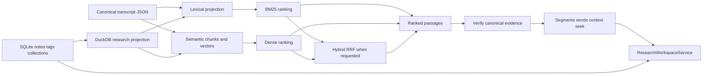
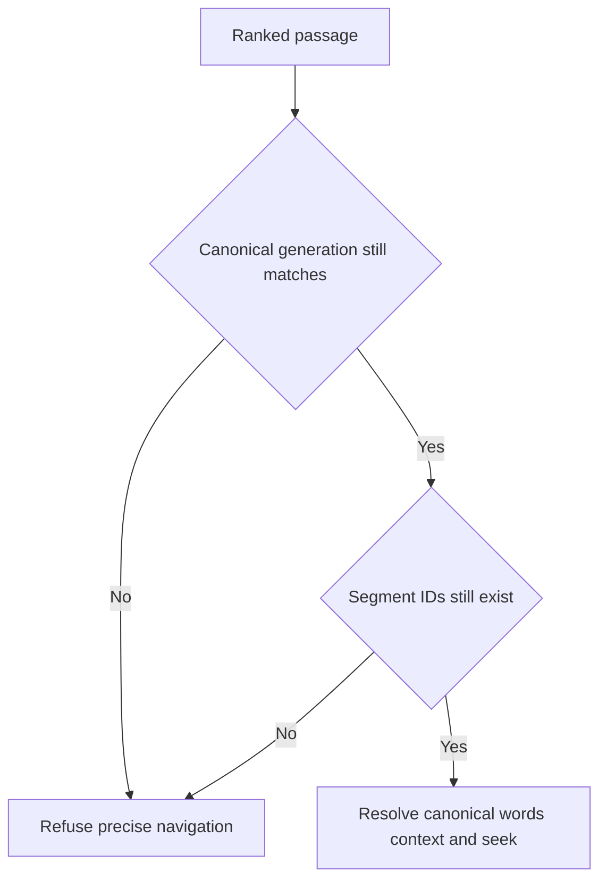

# Evidence-first corpus search 🔎🦝

Status: lexical, semantic/hybrid, canonical evidence navigation, and research-aware
filtering implemented  
Last updated: August 18, 2026

## The human version

A transcript library should help you find **what was said** without quietly replacing
your evidence with a database, vector store, or generated answer.

EchoFlow supports three transcript retrieval modes:

| Mode | Best when… | Example |
|---|---|---|
| Lexical | you remember actual words, names, acronyms, or identifiers | `rent increase` |
| Semantic | you remember the idea but not the wording | `people struggling to afford housing` |
| Hybrid | you want exact terminology and conceptual similarity to support each other | research across a mixed corpus |

Retrieval ranks a passage. A separate navigation layer verifies the exact canonical
transcript generation and resolves that passage back to canonical segments and aligned
words. A research-workspace layer can then decorate or constrain those results using
durable notes/tags/collections without teaching the search index that human-authored
knowledge is transcript truth.

> **Canonical transcript JSON is evidence. SQLite research state is human-authored truth.
> DuckDB search/research databases are rebuildable projections.**



Text fallback: canonical transcript evidence produces rebuildable lexical/semantic search
state; ranked passages are re-verified against canonical evidence; authoritative SQLite
research state is projected into DuckDB only to accelerate research constraints and
summaries.

## Durability classes

### Authoritative evidence

- original recording supplied by the user;
- canonical transcript JSON.

### Authoritative user knowledge

- speaker display labels;
- research notes;
- tags;
- collections;
- future saved searches and curated result sets.

These are **not retrieval cache**. An index rebuild must never delete them.

### Rebuildable projections and views

- document/segment projection;
- lexical term statistics;
- deterministic search chunks;
- dense embeddings;
- normalized chunk-to-segment relationships;
- derived research relationships/lexical note terms;
- retrieval statistics; and
- context/highlight/navigation presentation.

If every DuckDB file disappeared, EchoFlow should reconstruct search/query acceleration
without losing unique evidence or human-authored research.

## Canonical hashing and stale-state refusal

EchoFlow records two different SHA-256 digests in the lexical document projection:

- `source_sha256`: recording digest captured during transcription;
- `canonical_sha256`: digest of the exact canonical transcript JSON bytes indexed by the
  library.

Every semantic generation records a `corpus_fingerprint` derived from sorted
`(document_id, canonical_sha256)` pairs. Semantic/hybrid retrieval refuses stale vectors.

Before exposing precise canonical segments/words, `EvidenceLocator` re-reads canonical
JSON and verifies its SHA-256, document identity, and source SHA against the ranked
passage. Stale indexed evidence fails closed instead of presenting fake precision.



## Lexical retrieval

`DuckDbTranscriptIndex` is the current lexical adapter. It stores ordinary document,
segment, and term-statistic tables and computes deterministic BM25-style ranking without
installing DuckDB's FTS extension.

The public query is typed through `SearchQuery`, including text, phrase/ANY/ALL semantics,
speaker/language/document/timeline constraints, bounded limits, sorting, and optional
`evidence_scope`.

User values remain parameterized. The storage adapter owns SQL. The user does not.

Lexical tokenization is a shared library rule so ranking and exact canonical-word
highlighting use the same Unicode-aware token semantics.

Lexical search remains the dependency-light default.

## Semantic search chunks

ASR segments are evidence coordinates, not automatically ideal retrieval units. EchoFlow
combines adjacent canonical segments into deterministic retrieval windows.

`search-chunk-v1` currently uses:

- target size: 220 whitespace-delimited words;
- maximum target size: 300 words;
- no synthetic splitting inside one canonical ASR segment;
- no overlap in v1;
- stable document/segment ordering;
- content SHA-256;
- first/last segment IDs plus the complete ordered segment-ID tuple;
- exact source-relative start/end timestamps; and
- sorted language and anonymous speaker refs observed in the window.

A search chunk is never canonical evidence. It is a disposable retrieval window pointing
back to canonical segments.

## Embedding profile and strict-local boundary

One semantic index generation has one coherent `EmbeddingProfile`.

The current qualified profile targets:

```text
model_id             intfloat/multilingual-e5-small
dimensions           384
normalization        l2
pooling               mean
distance_metric      dot
query_transform      "query: {text}"
passage_transform    "passage: {text}"
chunking_profile     search-chunk-v1
resolved_revision    immutable snapshot revision
embedding_schema     1
```

`EmbeddingProvider` exposes separate query/passage operations because E5 uses different
transforms on each side. Provider output is validated for cardinality, dimensions, finite
values, and normalization before it may replace valid semantic state.

The base locked project still does **not** declare Sentence Transformers as a normal
semantic extra. Semantic search therefore remains advanced optional setup while lexical
search remains fully available.

## Numeric storage and exact similarity first

`DuckDbSemanticIndex` stores vectors as DuckDB `FLOAT[]`, not opaque BLOBs. The
application boundary remains `tuple[float, ...]`.

The first semantic implementation performs an **exact scan** over eligible local chunks.
Hard filters are applied before top-K ranking. No ANN/HNSW index exists yet; approximation
should appear only when measured corpus size shows exact local scan misses an interactive
latency target.

## Hybrid retrieval

Lexical BM25 and dense semantic scores do not share one trustworthy scale. EchoFlow
combines **ranks** using reciprocal rank fusion (RRF) with `k=60`:

```text
RRF(d) = Σ 1 / (60 + rank_i(d))
```

Hybrid retrieval overfetches bounded candidate ranks before fusion. `SearchResponse`
preserves lexical, semantic, and fused ranks.

## Canonical evidence navigation

`EvidenceLocator` resolves a ranked passage back to the verified canonical transcript and
produces an `EvidenceLocation` with:

- exact canonical/source identity;
- result segment IDs;
- numeric result start/end;
- deterministic `seek_seconds`;
- canonical speaker refs;
- exact matched aligned words when justified; and
- bounded canonical context segments.

Lexical results may expose exact aligned-word matches. Semantic-only results do not
fabricate exact-word precision. Hybrid results may expose lexical highlights when lexical
evidence contributed.

## Speaker display integration

`ResearchNavigationService` composes transcript retrieval, canonical evidence location,
and current user-assigned speaker display labels.

A human may see `Dr. Chen (speaker-02)`, while JSON retains raw anonymous refs and exposes
friendly labels separately. Ranking/filtering continues to use anonymous evidence refs.

## Durable research state now reuses the same evidence coordinates

Notes are implemented and anchored through `EvidenceLocator` rather than a parallel
annotation coordinate system.

A durable `EvidenceAnchor` includes:

```text
document_id
source_sha256
canonical_sha256
segment_ids
start_seconds
end_seconds
```

Multi-segment anchors must be contiguous. If canonical evidence changes, the note remains
durable historical user state but does not silently reattach to a new generation.

## Research filters are pre-ranking constraints

`ResearchWorkspaceService` can constrain transcript search using:

- tags;
- collections;
- note text; and
- `with_notes`.

Human names resolve once to durable IDs. The rebuildable DuckDB research projection then
returns canonical evidence scope. BM25 ranking or semantic vector scoring runs **inside
that scope**.

The search contract distinguishes:

```text
evidence_scope = None
```

from:

```text
evidence_scope = ()
```

`None` means no research restriction. An empty tuple means the research restriction
matched nothing and search must return nothing. This prevents an empty filter from
accidentally widening into a corpus-wide query.

## Normalized semantic segment mapping

Semantic chunks keep their JSON provenance, but `DuckDbSemanticIndex` also maintains a
derived relational `chunk_segments` mapping.

That relation lets EchoFlow:

- constrain semantic candidates by research evidence before vector scoring; and
- resolve lexical segment IDs back to semantic chunks for hybrid reconciliation without
  scanning every chunk's JSON metadata.

Existing semantic indexes can derive the relation locally without recomputing embeddings.

## Search and research presentation remain separate from storage

`ResearchWorkspaceService` is the product-facing seam. CLI and future GUI adapters should
use it rather than deciding whether to query SQLite or DuckDB themselves.

The next **unified library discovery** layer should compose existing transcript search,
notes, tags, collections, and later saved searches into grouped typed results. It should
not invent one universal relevance score across unlike objects or a second search engine.

Saved searches will belong to durable SQLite user state. Frequent/recent tag rankings are
derived convenience views.

## Current deliberate limits

The current search/navigation/workspace system does not provide:

- generated corpus answers as the primary interface;
- arbitrary-model CLI selection;
- bundled embedding weights;
- ANN/HNSW or learned reranking;
- saved-search objects;
- curated/exportable result-set objects;
- automatic cross-generation note re-anchoring;
- a graphical local media player;
- a polished GUI;
- cross-recording biometric/person identity; or
- source separation for overlapping speech.

The product rule stays evidence-first:

> **Search may become smarter. The result should remain inspectable evidence, not an
> uncited answer floating above the corpus.**
