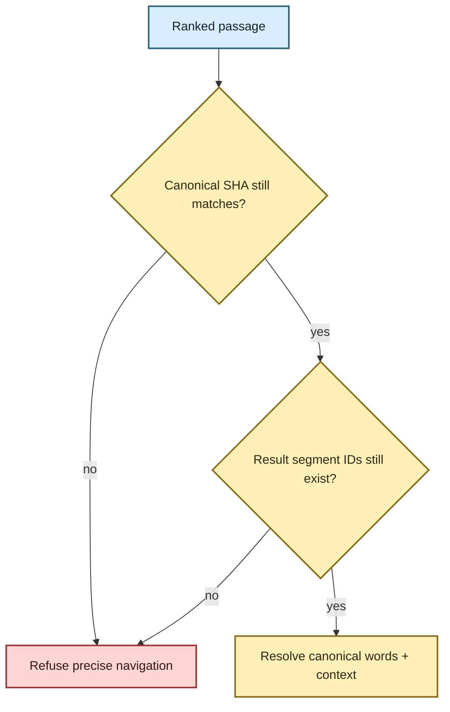
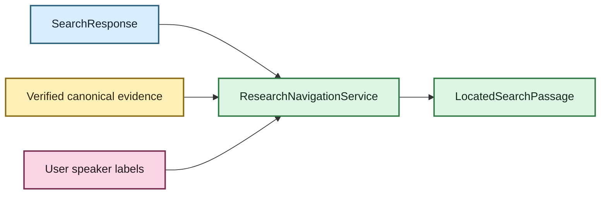

# Evidence-first corpus search 🔎🦝

Status: lexical, semantic/hybrid, and canonical evidence-navigation foundations implemented  
Last updated: August 18, 2026

## The human version

A transcript library should help you find **what was said** without quietly replacing
your evidence with a database, vector store, or generated answer.

EchoFlow supports three retrieval modes:

| Mode | Best when… | Example |
|---|---|---|
| Lexical | you remember actual words, names, acronyms, or identifiers | `rent increase` |
| Semantic | you remember the idea but not the wording | `people struggling to afford housing` |
| Hybrid | you want exact terminology and conceptual similarity to support each other | research across a mixed corpus |

Retrieval ranks a passage. A separate navigation layer can then verify the exact canonical
transcript generation and resolve that passage back to canonical segments and aligned
words.

The load-bearing rule remains:

> **Canonical transcript JSON is evidence. Search databases and navigation views are projections.**

```mermaid
flowchart LR
    A[Original recording] -->|read only| B[Canonical transcript JSON]
    B --> C[Lexical projection]
    B --> D[Semantic chunks]
    C --> E[BM25 ranking]
    D --> F[Local embeddings]
    F --> G[Exact semantic ranking]
    E --> H[Optional hybrid fusion]
    G --> H
    E --> I[Ranked SearchResponse]
    G --> I
    H --> I
    I --> V[Verify canonical SHA]
    V --> N[EvidenceLocation\nsegments + words + seek + context]

    classDef evidence fill:#F9D5E5,stroke:#7B2E52,stroke-width:2px,color:#22151B
    classDef derived fill:#D8EEFF,stroke:#2E617B,stroke-width:2px,color:#12222A
    classDef process fill:#E8D9FF,stroke:#68469B,stroke-width:2px,color:#1F1630
    classDef result fill:#DDF5E3,stroke:#347A46,stroke-width:2px,color:#142719

    class A,B,V evidence
    class C,D derived
    class E,F,G,H process
    class I,N result
```



For a non-architecture explanation, read **[Semantic search, without the mystery
box](../semantic-search.md)** and **[From search result to the exact
evidence](../evidence-navigation.md)** first.

## 🦝 Three durability classes

Search becomes easier to reason about when data is classified by whether it can be
reconstructed.

### Authoritative evidence

- original recording supplied by the user;
- canonical transcript JSON.

### User-authored knowledge

Speaker display labels are implemented here. Future notes, tags, collections,
annotations, and saved searches belong in the same durability class.

They are **not retrieval cache**. An index rebuild must never delete them. Durable
annotations should anchor to canonical evidence coordinates, not only to disposable
semantic chunk IDs or formatted timestamps.

### Rebuildable projections and views

- document/segment projection;
- lexical term statistics;
- deterministic search chunks;
- dense embeddings;
- retrieval statistics; and
- derived context/highlight/navigation presentation.

If every search database disappeared, EchoFlow should be able to reconstruct search from
canonical transcripts without losing unique user-authored information.

## Canonical hashing and stale-state refusal

EchoFlow records two different SHA-256 digests in the lexical document projection:

- `source_sha256`: recording digest captured during transcription;
- `canonical_sha256`: digest of the exact canonical transcript JSON bytes indexed by the
  library.

The original recording may remain byte-identical while the canonical transcript changes
because it was regenerated, enriched, corrected, or replaced.

Every semantic generation records a `corpus_fingerprint` derived from sorted
`(document_id, canonical_sha256)` pairs. Semantic/hybrid retrieval refuses stale vectors.

Evidence navigation has an additional boundary: before exposing precise canonical
segments/words, `EvidenceLocator` re-reads the canonical JSON and verifies its SHA-256,
job ID, and source SHA against the ranked passage. A result whose indexed evidence no
longer matches the canonical file fails closed rather than presenting stale precision.



## Lexical retrieval

`DuckDbTranscriptIndex` is the current lexical adapter. It stores ordinary document,
segment, and term-statistic tables and computes deterministic BM25-style ranking without
installing DuckDB's FTS extension.

The public application query remains typed through `SearchQuery`:

```text
SearchQuery
  text = "housing"
  phrase = false
  operator = any | all
  speaker_refs = ["speaker-02"]
  languages = ["en"]
  document_ids = ["job-123"]
  sort = relevance | timeline
  limit = 100
```

User values remain parameterized. The storage adapter owns SQL. The user does not.

Lexical tokenization is now a shared library text rule rather than a DuckDB-private
helper. Ranking and exact canonical-word highlighting therefore use the same
Unicode-aware token semantics instead of drifting independently.

Lexical search remains the base/default mode and does not require a semantic runtime.

## Why semantic search needs chunks

ASR segments are evidence coordinates, not automatically good retrieval units. A
canonical segment might contain only `Yeah.` or `And then we moved.`

EchoFlow therefore combines adjacent canonical segments into deterministic retrieval
windows. `search-chunk-v1` currently uses:

- target size: 220 whitespace-delimited words;
- maximum target size: 300 words;
- no synthetic splitting inside one canonical ASR segment;
- no overlap in v1;
- stable document/segment ordering;
- content SHA-256;
- first/last segment IDs plus the complete ordered segment-ID tuple;
- exact source-relative start/end timestamps; and
- sorted language and anonymous speaker references observed in the window.

If one canonical segment is already larger than the target/max window, it remains one
chunk. A search chunk is **never canonical evidence**. It is a disposable window
pointing back to canonical segments.

## Embedding profile: the model is not the whole contract

One semantic index generation has one coherent `EmbeddingProfile`.

The first qualified real adapter targets:

```text
model_id             intfloat/multilingual-e5-small
dimensions           384
normalization        l2
pooling               mean
distance_metric      dot
query_transform      "query: {text}"
passage_transform    "passage: {text}"
chunking_profile     search-chunk-v1
resolved_revision    immutable snapshot revision
embedding_schema     1
```

The profile matters because dimensions, pooling, normalization, query instructions,
passage instructions, and distance semantics are all load-bearing parts of one vector
space.

`EmbeddingProvider` exposes separate `embed_queries()` and `embed_passages()` operations.
E5 uses distinct query-side and passage-side transforms, so EchoFlow does not flatten the
interface into a misleading generic `embed(text)` call.

## Strict-local model boundary 🔐

`SentenceTransformersE5Provider` accepts a local snapshot directory whose name must
agree with the recorded immutable revision. It uses local-only model resolution and
disables remote model code.

Provider output is validated for one vector per input, expected dimensions, finite
numeric values, and L2 normalization before it may replace valid semantic state. A
failed rebuild must not destroy the previous generation.

The locked project dependency graph does **not yet** declare Sentence Transformers as a
semantic extra. Semantic search is therefore currently an advanced optional capability
for environments that already provide a compatible runtime and immutable local model
snapshot. Lexical search remains fully available without it.

## Numeric vector storage, now that we have earned the jargon

`DuckDbSemanticIndex` stores vectors as numeric DuckDB `FLOAT[]`, not opaque BLOBs. The
application boundary remains `tuple[float, ...]`, so a later backend can choose a
different physical representation without changing the domain contract.

The semantic database is private rebuildable state under:

```text
STATE_DIR/library/semantic.duckdb
```

It is intentionally separate from the lexical database so semantic evolution does not
destabilize the dependency-light BM25 path.

## Exact local similarity first

The first semantic implementation performs an **exact scan** over eligible local chunks.
Hard filters are applied before top-K ranking for transcript IDs, language, speaker,
phrase constraints, and `ALL` lexical terms where applicable.

No ANN/HNSW index exists yet. Approximate nearest-neighbor indexing is an optimization
that should appear only when measured corpus size shows exact local scan no longer meets
an interactive latency target.

An 8 GB laptop should not pay an ANN tax because ANN is fashionable.

## 💃 Hybrid retrieval

Lexical BM25 scores and dense semantic similarity scores do not share one trustworthy
scale. EchoFlow combines **ranks** using reciprocal rank fusion (RRF) with `k=60`:

```text
RRF(d) = Σ 1 / (60 + rank_i(d))
```

Hybrid retrieval overfetches bounded candidate ranks before fusion so one mode can
contribute passages the other missed. `SearchResponse` preserves lexical, semantic, and
fused ranks. Timeline presentation may reorder results chronologically without rewriting
those stored relevance ranks.

## SearchResponse is ranking provenance, not the final research view

`SearchPassage` carries enough evidence to identify the ranked window:

- document/source identity;
- canonical transcript identity/hash;
- optional deterministic chunk ID;
- constituent canonical segment IDs;
- lexical matched-segment IDs when available;
- source-relative start/end timestamps;
- anonymous speaker/language evidence;
- lexical/semantic/fused ranks; and
- transcript passage text.

It deliberately does **not** pretend to be a fully resolved canonical annotation target.
That is the job of the next layer.

## Canonical evidence navigation

`EvidenceLocator` takes a `SearchResponse` and resolves each ranked passage back to the
verified canonical transcript.

The derived `EvidenceLocation` includes:

- exact canonical/source identity;
- result segment IDs;
- numeric result start/end;
- a deterministic `seek_seconds` coordinate;
- result speaker refs observed in canonical segment/word evidence;
- exact matched aligned words when justified; and
- bounded canonical context segments.

Context expansion is controlled after ranking, currently by `--context-segments 0..10`.
It does not feed neighboring text back into BM25/dense ranking.

### Exact highlighting is intentionally asymmetric

A lexical result identifies matched canonical segment evidence. When aligned words exist,
EchoFlow can apply the same lexical token semantics to those canonical words and expose
exact highlighted word coordinates.

Phrase queries require contiguous query tokens before words are marked as the phrase.

A semantic-only result has no equivalent exact-word claim. It receives canonical passage
navigation and a seek coordinate, but **no fabricated word highlight**.

Hybrid results may contain exact lexical highlights when lexical evidence contributed to
the fused result.

This asymmetry is intentional. Embedding similarity answers “which passage is related?”
It does not answer “which exact word caused the similarity?”

## Speaker display integration

`ResearchNavigationService` composes three authorities without merging them:

1. `TranscriptLibraryService` ranks passages;
2. `EvidenceLocator` verifies/resolves canonical coordinates;
3. `SpeakerLabelService` adds current user-authored display names for the exact canonical
   generation.

A human may see `Dr. Chen (speaker-02)`, while JSON retains raw `speaker_refs` and exposes
friendly labels separately. Ranking/filtering continues to use anonymous evidence refs.

Label resolution is batched per canonical generation so a large result set does not
reread private speaker-label state once per row.



That service is intended for CLI, future GUI, Python, and other presentation adapters.
The terminal does not own the navigation semantics.

## Future notes can reuse the same coordinate system

Notes and annotations are not implemented yet, but this navigation layer establishes the
anchor they should reuse: canonical/source identity, segment IDs, word indices where
available, and numeric source-relative seconds.

A note should never depend only on a formatted timestamp or disposable semantic chunk
ID. If canonical evidence changes, EchoFlow should retain user knowledge and report the
stale anchor instead of silently moving it.

## Provider interoperability without model roulette

The search core depends on `EmbeddingProvider` + `EmbeddingProfile`, not an E5-specific
domain type. The ordinary CLI nevertheless qualifies one concrete profile today rather
than accepting arbitrary model IDs as interchangeable.

A future provider registry can expose additional qualified local profiles once EchoFlow
can validate their full retrieval contract.

## Current deliberate limits

The current search/navigation system does not provide:

- generated corpus answers as the primary interface;
- arbitrary-model CLI selection;
- bundled embedding weights;
- ANN/HNSW or learned reranking;
- saved searches, collections, tags, notes, or annotations;
- a graphical local media player;
- cross-recording biometric/person identity; or
- source separation for overlapping speech.

Those are separate product layers. The current frontier is durable user-authored research
state over the verified evidence coordinates that search navigation now exposes.

The product rule stays evidence-first:

> **Search may become smarter. The result should remain inspectable evidence, not an
> uncited answer floating above the corpus.**
