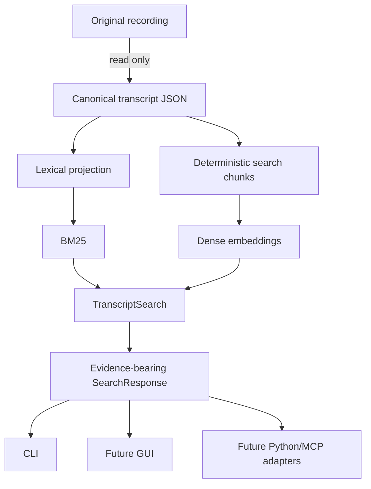
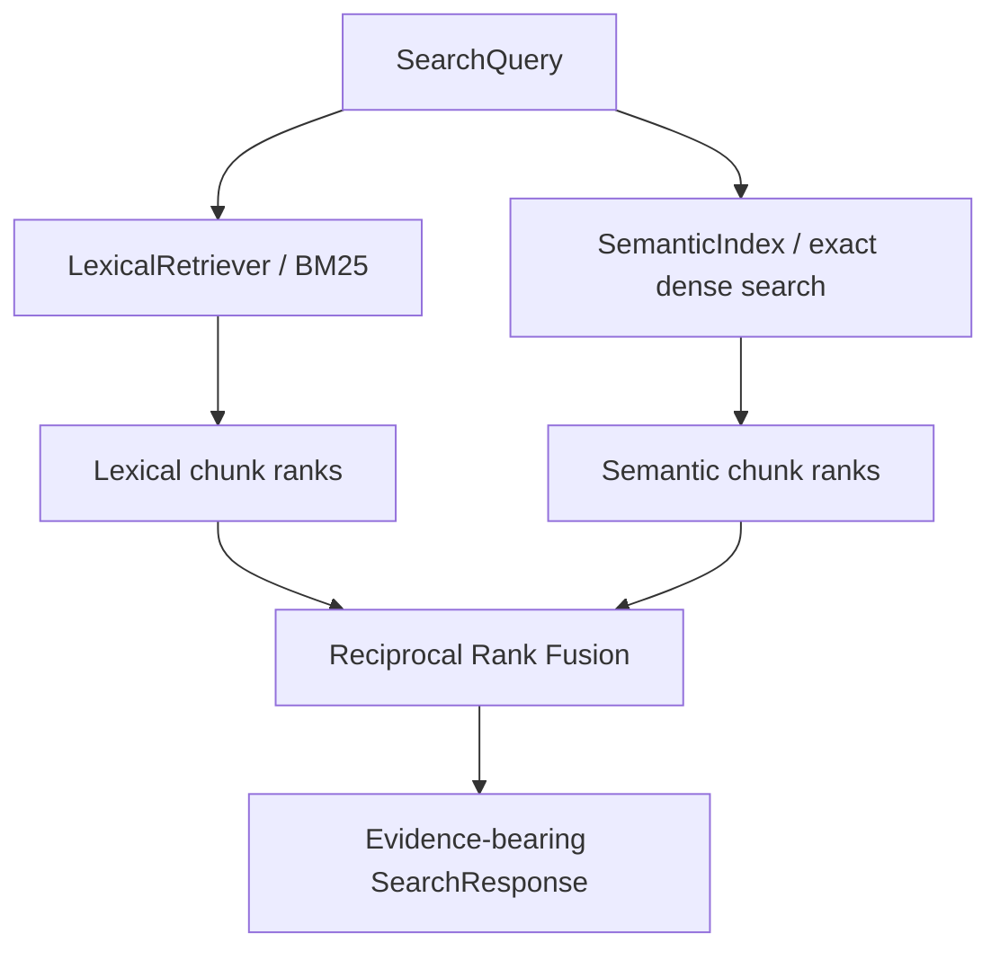

# Evidence-first corpus search

Status: lexical retrieval implemented; semantic/hybrid foundation implemented with a strict-local optional E5 adapter  
Last updated: August 17, 2026

## Product intent

EchoFlow makes a local transcript corpus searchable without turning a database, a vector
store, or a chat model into the product. A researcher should be able to retrieve a
passage, inspect its timestamps and speaker/language evidence, and trace it back to the
canonical transcript that produced it.

The core ownership rule is:

> canonical transcript JSON is evidence; database state is a projection.

The original recording is treated as read-only input. Canonical JSON is the durable,
portable transcript artifact. DuckDB exists to make that evidence searchable and may be
deleted and rebuilt.



## Three durability classes

EchoFlow deliberately separates data by whether it can be reconstructed.

### Authoritative

- original recording supplied by the user;
- canonical transcript JSON.

### User-authored

Future notes, tags, collections, annotations, and saved searches belong here. They are
not retrieval cache and must never be discarded by an index rebuild. When annotation
work is added, it must anchor to durable transcript evidence coordinates rather than
only to a derived chunk ID.

### Rebuildable

- document projection;
- segment projection;
- lexical term statistics;
- deterministic search chunks;
- dense embeddings;
- retrieval statistics.

Removing rebuildable state must not destroy unique user information.

## Canonical hashing and stale-index detection

The lexical document projection now records two distinct digests:

- `source_sha256`: the source recording digest recorded when transcription was planned;
- `canonical_sha256`: the SHA-256 of the exact canonical transcript JSON bytes indexed
  by the library.

These answer different questions. A source recording can remain byte-identical while a
canonical transcript changes because the transcript was regenerated, enriched, or
replaced.

Every semantic generation records a `corpus_fingerprint` derived from sorted
`(document_id, canonical_sha256)` pairs. Semantic or hybrid search refuses to run when
the current lexical projection no longer matches that fingerprint.

The failure mode is therefore explicit:

```text
canonical JSON changes
    -> lexical rebuild sees new canonical_sha256
    -> semantic corpus fingerprint no longer matches
    -> semantic/hybrid retrieval refuses
    -> embeddings must be rebuilt
```

EchoFlow does not quietly search stale vectors.

## Lexical retrieval

`DuckDbTranscriptIndex` remains the lexical adapter. It stores ordinary document,
segment, and term-statistic tables and computes deterministic BM25-style ranking without
installing DuckDB's FTS extension.

The public query contract remains `SearchQuery`:

```text
SearchQuery
  text = "housing"
  phrase = false
  operator = any | all
  speaker_refs = ["speaker-02"]
  languages = ["en"]
  document_ids = ["job-123"]
  sort = relevance | timeline
  limit = 100
```

User values remain parameterized. The storage adapter owns its SQL.

## Deterministic semantic chunks

ASR segments are evidence coordinates, not necessarily good embedding units. A segment
may contain only `"Yeah."` or `"And then we moved."`.

EchoFlow therefore creates deterministic windows over adjacent canonical segments.

`search-chunk-v1` currently uses:

- target size: 220 whitespace-delimited words;
- maximum target size: 300 words;
- no synthetic splitting inside one source segment;
- no overlap in v1;
- stable document/segment ordering;
- content SHA-256;
- first/last segment IDs and the complete ordered segment-ID tuple;
- exact source-relative start/end timestamps;
- sorted language and anonymous speaker references observed in the window.

A source segment larger than the target remains one chunk. EchoFlow does not cut a
canonical segment into invented evidence coordinates merely to satisfy a retrieval
heuristic.

A chunk is never canonical evidence. It is a disposable retrieval window that points
back to canonical segments.

## Embedding profile

One semantic index generation has exactly one coherent embedding profile. EchoFlow will
not mix English E5 vectors with multilingual E5 vectors in the same space.

The first real adapter is designed for:

```text
model_id             intfloat/multilingual-e5-small
dimensions           384
normalization        l2
distance_metric      dot
query_transform      "query: {text}"
passage_transform    "passage: {text}"
chunking_profile     search-chunk-v1
resolved_revision    immutable snapshot revision
```

`EmbeddingProvider` exposes two separate methods:

```python
embed_queries(texts)
embed_passages(texts)
```

That distinction is intentional. E5 retrieval uses different query-side and
passage-side text transforms. EchoFlow does not flatten this into a misleading generic
`embed(text)` contract.

The stored profile records model identity, immutable resolved revision, dimensions,
normalization, metric, transforms, chunking profile, and the local snapshot path needed
to restore the same provider.

## Strict-local model boundary

`SentenceTransformersE5Provider` accepts a local snapshot directory and requires the
directory name to equal the recorded immutable revision. It loads
`SentenceTransformer` from that local path and never passes a repository ID to the
runtime.

The provider validates:

- non-empty input;
- one output vector per input;
- exactly 384 dimensions;
- finite numeric values;
- L2-normalized output.

The adapter lazy-imports `sentence_transformers`. EchoFlow's locked dependency graph
does **not yet** declare a semantic extra in this tranche. That is deliberate: the
repository's CI requires `pyproject.toml` and `uv.lock` to remain coherent, and this
change does not claim an unqualified dependency lock that was not actually resolved and
audited.

Consequently, semantic build/search is an implemented optional capability for an
environment that already has a compatible Sentence Transformers runtime and a local
immutable multilingual-E5 snapshot. Base EchoFlow and lexical search remain unchanged.
A later dependency-qualification tranche can add a locked `semantic` extra and managed
model acquisition without changing the retrieval contracts introduced here.

## Numeric vector storage

`DuckDbSemanticIndex` stores vectors as DuckDB `FLOAT[]`.

Vectors are not serialized to opaque BLOBs. The application boundary remains
`tuple[float, ...]`, so another adapter may later choose a fixed-length vector type,
compressed representation, or different backend without changing domain contracts.

The semantic database is private rebuildable state at:

```text
STATE_DIR/library/semantic.duckdb
```

It is intentionally separate from the lexical database in this tranche. This keeps
semantic rebuild/storage evolution independent from the already-working BM25 index and
makes deletion semantics obvious. Both databases remain disposable projections of
canonical JSON.

## Exact local similarity first

The first semantic retrieval implementation performs an exact scan over the filtered
local chunk set.

Hard filters are applied before top-K ranking:

- transcript/document;
- language;
- speaker;
- exact phrase when requested;
- `ALL` lexical terms when requested.

This avoids filter starvation. A query for one speaker must not search the global top
100 vectors and only then discover that all 100 belonged to someone else.

No ANN/HNSW structure is introduced yet. Approximate nearest-neighbor indexing is an
execution optimization, not a product requirement. It should be added only if measured
corpus size and latency demonstrate that exact local search misses an interactive
target.

## Hybrid retrieval and RRF

`TranscriptSearch` composes narrow capabilities:



Hybrid ranking uses reciprocal rank fusion with `k=60`:

```text
RRF(d) = Σ 1 / (60 + rank_i(d))
```

RRF avoids pretending BM25 scores and cosine/dot similarities are directly comparable.
EchoFlow exposes ranks rather than converting unlike scores into a fake universal
"relevance probability."

The public result includes:

- canonical/source identity;
- chunk ID when a derived chunk was used;
- complete segment evidence coordinates;
- lexical-matched segment IDs;
- source-relative timestamps;
- language and speaker evidence;
- lexical rank when applicable;
- semantic rank when applicable;
- fused rank;
- retrieval provenance.

Timeline sorting changes presentation order but does not erase the recorded relevance
ranks.

## Unified retrieval response

`TranscriptLibraryService.retrieve()` returns one `SearchResponse` shape for lexical,
semantic, and hybrid modes.

```text
SearchResponse
  query
  retrieval mode
  lexical backend ID
  semantic backend ID
  embedding profile
  fusion profile
  results[]
    evidence coordinates
    passage
    timestamps
    speakers
    languages
    lexical rank
    semantic rank
    fused rank
```

`TranscriptLibraryService.search()` remains as a compatibility path for direct lexical
segment results. New presentation adapters should prefer `retrieve()`.

This lets future CLI, GUI, Python, and MCP surfaces share behavior rather than each
inventing retrieval semantics.

## CLI

Lexical retrieval remains the default and requires no semantic runtime:

```bash
uv run echoflow library rebuild
uv run echoflow library search "housing insecurity"
```

Build semantic state from a local immutable multilingual-E5 snapshot:

```bash
uv run echoflow library embeddings build \
  /path/to/models--intfloat--multilingual-e5-small/snapshots/<revision> \
  --revision <revision>
```

Inspect semantic provenance:

```bash
uv run echoflow library embeddings
uv run echoflow library embeddings --json
```

Run exact semantic search:

```bash
uv run echoflow library search \
  "people struggling to make rent" \
  --mode semantic
```

Run hybrid BM25 + dense retrieval:

```bash
uv run echoflow library search \
  "people struggling to make rent" \
  --mode hybrid
```

Filters are shared:

```bash
uv run echoflow library search \
  "housing insecurity" \
  --mode hybrid \
  --speaker speaker-02 \
  --language en \
  --limit 20
```

`--json` emits query, retrieval provenance, result count, and evidence-bearing results.

## Rebuild behavior

A lexical rebuild validates the complete searchable projection before replacing the
BM25 index transactionally.

A semantic rebuild:

1. discovers and validates canonical transcripts;
2. computes deterministic chunks;
3. embeds passages using one explicit profile;
4. rebuilds the lexical projection from the same validated corpus;
5. replaces semantic state transactionally;
6. records the exact corpus fingerprint and profile.

If embedding fails, the semantic database is not partially replaced. If canonical state
later changes, fingerprint validation prevents reuse of stale semantic vectors.

## Source-integrity evidence

`echoflow library show TRANSCRIPT_ID` remains the source/custody inspection surface.

It distinguishes:

- original recording path when known;
- recorded source SHA-256;
- canonical transcript SHA-256;
- current source-integrity recheck;
- canonical transcript path;
- private rebuildable index custody.

These are separate claims. EchoFlow does not collapse them into a vague trust badge.

## User-authored state boundary

Tags, notes, collections, saved searches, and annotations are intentionally not
implemented in the semantic database.

When added, they must live in a non-rebuildable user-state layer and anchor to canonical
evidence coordinates such as:

```text
document_id
first_segment_id
last_segment_id
start_seconds (optional)
end_seconds (optional)
```

A chunk ID may be cached as convenience, but may not be the only durable anchor because
chunking policy is versionable and disposable.

## Deliberate exclusions

This tranche does not add:

- ANN/HNSW;
- a learned reranker;
- ColBERT/late interaction;
- SPLADE/learned sparse retrieval;
- LLM query expansion;
- generated corpus answers;
- a GUI;
- user-authored notes/tags/collections;
- a stable public Python package API;
- a declared/locked Sentence Transformers dependency extra.

Those are separate product decisions. The retrieval contract no longer depends on them.

## Stable rule

> Local evidence first. Canonical JSON owns transcript truth. User-authored state is
> durable. Retrieval state is rebuildable. Ranking remains inspectable. Model and
> chunking provenance are explicit.
