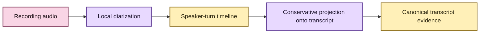
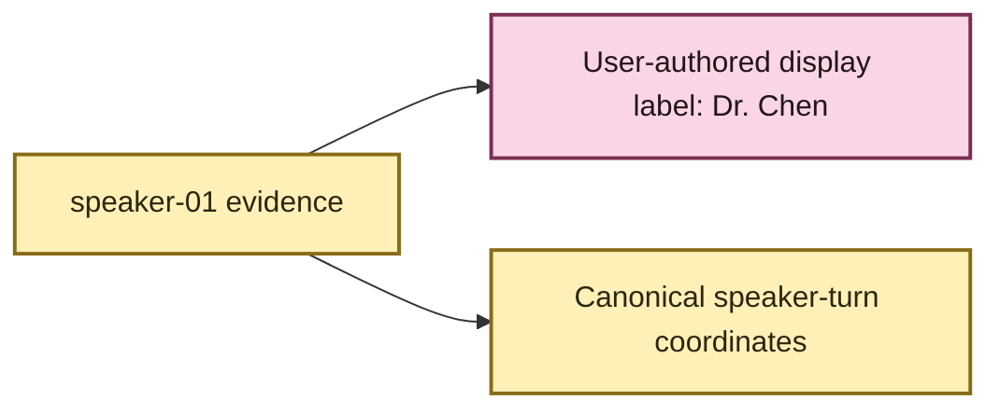

# Anonymous speaker diarization 👥

EchoFlow treats diarization as **speaker-timeline evidence**, not identity.

In ordinary language: diarization tries to answer **who spoke when inside this one
recording?** It gives recording-scoped labels such as `speaker-01` and `speaker-02` so a
transcript can say which anonymous voice most likely owns a passage.

It does **not** mean “identify this human,” and EchoFlow does not infer that
`speaker-01` in one recording is the same person as `speaker-01` in another.



## What the user would see

The intended CLI surface is opt-in:

```bash
uv run echoflow transcribe interview.wav --diarize
```

If the speaker count is known:

```bash
uv run echoflow transcribe focus-group.wav --diarize --speakers 4
```

Or provide a bounded range:

```bash
uv run echoflow transcribe meeting.wav --diarize --min-speakers 2 --max-speakers 6
```

Exact and bounded speaker-count options are mutually exclusive. Speaker-count options
are invalid without `--diarize`.

## Current operational status: integrated, but security-held 🔐

The first adapter targets the open-source pyannote `community-1` pipeline.

As of August 2026, pyannote 4.0.7 requires Lightning and the current lock resolves
Lightning 2.6.5. That release is affected by CVE-2026-58659 / PYSEC-2026-3624, a
checkpoint-loading remote-code-execution vulnerability.

This is not an irrelevant transitive advisory. Pyannote subclasses
`lightning.LightningModule` and loads pretrained checkpoints through Lightning, so the
vulnerable path intersects the feature EchoFlow would actually execute.

EchoFlow therefore **fails closed** before pyannote import or model acquisition when the
installed Lightning safety cannot be established.

The dependency audit carries one narrow documented exception for that exact advisory
while the runtime compensating control remains in place. Other advisories still fail the
audit.

Once a compatible patched Lightning release is available and qualified, both the audit
exception and runtime hold should be removed.

So the current product description is deliberately precise:

> **Diarization is integrated, tested at the application boundary, and security-gated;
> it is not currently an operationally qualified everyday feature.**

## Privacy and model-acquisition boundary

Pyannote model acquisition may require accepting upstream model conditions and
authenticating with Hugging Face.

EchoFlow does not store a Hugging Face token in its own configuration.

Any model download authorization is narrowly scoped to diarization:

```bash
uv run echoflow transcribe interview.wav \
  --diarize \
  --allow-diarization-model-download
```

That flag does **not** authorize faster-whisper model downloads. ASR model acquisition
remains the separate explicit `echoflow models install MODEL` path.

Pyannote telemetry is disabled by EchoFlow before package import. Diarization provenance
records `telemetry_enabled: false`. Recording audio remains local during inference.

Once a snapshot is resolved into EchoFlow's configured private model cache, inference
uses the local snapshot path.

## Dependency footprint

Diarization is intentionally a separate dependency extra because pyannote brings a
large PyTorch-based stack:

```bash
uv sync --locked --extra transcription --extra diarization
```

Representative CPU-only Windows/Linux/macOS installation size, peak RAM, and sustained
real-time factor still need physical-device qualification before EchoFlow should call
this a comfortable feature for an 8 GB machine.

## The evidence model

The primary diarization artifact is a source-relative speaker-turn timeline:

```text
00:00.0 ─ 00:12.4  speaker-01
00:12.4 ─ 00:18.8  speaker-02
00:18.1 ─ 00:20.0  speaker-01   # overlap can exist
```

Overlap is real evidence, not an error condition.

Raw backend labels are not stable API. EchoFlow sorts turns deterministically and maps
them to `speaker-01`, `speaker-02`, and so on in first-seen timeline order.

The current canonical transcript schema keeps optional diarization fields in the same
structural contract rather than inventing a new schema version for each combination of
features.

## Why EchoFlow is conservative about putting a speaker name on text

ASR segments and diarization turns are produced independently.

Without word-level alignment, one ASR segment may cross a speaker handoff or overlap two
speakers. EchoFlow therefore assigns `RecognizedSegment.speaker_ref` only when exactly
one unique diarized speaker overlaps that segment.

```text
ASR segment overlaps speaker-01 only
    → speaker_ref = speaker-01

ASR segment crosses speaker-01 → speaker-02
    → speaker_ref = null

ASR segment overlaps speaker-01 + speaker-02
    → speaker_ref = null
```

The exact speaker-turn timeline is still preserved when projection is ambiguous.

That refusal matters. It is better to preserve “we know these voices overlap here” than
to confidently put the wrong speaker label in front of a sentence.

## Why word/timestamp alignment is the next important seam ✨

Word-level or fine-grained timestamp alignment would give EchoFlow smaller evidence
coordinates than an entire ASR segment.

That unlocks several improvements at once:

- finer speaker attribution near handoffs;
- better presentation of overlapping turns;
- precise transcript highlighting;
- more exact jump-to-audio behavior;
- durable annotations anchored to smaller evidence spans; and
- cleaner future speaker-label UX.

Alignment does not solve every overlap problem, but it lets EchoFlow stop treating a
long ASR segment as the smallest practical text unit.

## User-assigned display labels without biometric identity

A useful future feature is allowing the user to say:

```text
speaker-01 → Dr. Chen
speaker-02 → Interviewer
```

The important design rule is that this should be **display/user-authored state**, not a
rewrite of the underlying anonymous diarization evidence.

Conceptually:



The label is meaningful user knowledge and must **not** share the deletion semantics of
a rebuildable search index.

EchoFlow can remain anonymous-by-default while still letting a researcher make their own
recording understandable.

## Better overlap handling before source separation

Overlap deserves two distinct product steps.

First, EchoFlow should improve **representation and presentation** of overlap using
better temporal alignment, clearer multi-speaker evidence, and UI/export behavior that
does not force one speaker when multiple voices are active.

Only later should EchoFlow consider **speech/source separation**, where the audio itself
is decomposed into estimated sources before or during recognition.

Source separation is materially heavier. It adds compute, model/dependency custody,
quality uncertainty, and new provenance questions. It should be justified by real
recordings after the simpler evidence model is strong.

🧜‍♀️ Deep technical water is permitted. Inventing confidence is not.

## Canonical and derived output behavior

When a segment has one unambiguous `speaker_ref`, derived TXT/SRT/WebVTT views may prefix
that anonymous speaker label.

Ambiguous segments remain unlabeled. Export rendering never changes timestamps or
becomes canonical custody.

Future user-assigned display labels should remain a presentation layer over stable
anonymous speaker references and durable transcript coordinates.

## Qualification boundary

The current deterministic test surface covers:

- adapter/cache-only versus download policy;
- telemetry-disable behavior;
- deterministic label normalization;
- canonical schema integration;
- executor integration;
- conservative speaker projection;
- derived exports; and
- the fail-closed Lightning security gate.

The locked diarization dependency graph remains in normal/scheduled vulnerability
auditing.

A clean-wheel distribution lane imports the real pyannote/PyTorch runtime without
executing the gated model. A dedicated real-model acceptance workflow exists but remains
blocked by the dependency security gate; once unblocked, it is manual and
credential-gated rather than ordinary PR CI.

## Current deliberate limits

This capability does not currently provide:

- biometric speaker identification;
- cross-recording speaker linking;
- user-assigned display labels;
- guaranteed word-level speaker attribution;
- polished overlap presentation;
- simultaneous-speaker/source separation; or
- a claim that the dependency footprint is suitable for every low-memory device.

The stable rule is:

> **Preserve speaker evidence first. Add convenience only when it does not fabricate
> certainty.**