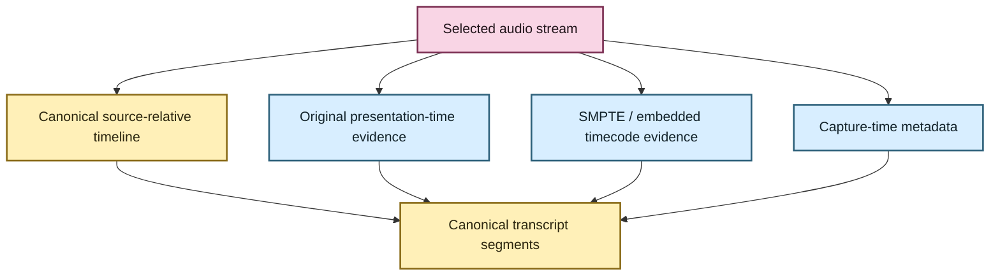

# Media normalization and transcript timeline 🎙️🕰️

EchoFlow has to answer two deceptively simple questions before it can produce a useful
transcript:

1. **What exactly did we transcribe?**
2. **What does a timestamp in the transcript actually mean?**

Those questions get complicated quickly when the input is a video with multiple audio
streams, a container with a non-zero presentation timestamp, or a camera file carrying
capture-time metadata.

The current implementation solves the first layer rigorously: deterministic stream
selection, source fingerprinting, canonical audio, exact frame windows, and one
source-relative elapsed-time transcript.

The next provenance step is to preserve **original-media timecode/capture-time evidence**
without overloading that existing source-relative timeline.

## The human version

Today, if EchoFlow says a passage begins at `4221.7` seconds, it means:

> **4221.7 seconds after the beginning of the selected recording audio.**

That timeline survives normalization, segmentation, checkpoints, enhancement, and
assembly.

It does **not yet** mean “camera wall-clock time 14:32:08,” “SMPTE 01:10:21:17,” or “the
container's original PTS value.” Those are distinct pieces of provenance and should stay
distinct.

```mermaid
flowchart LR
    A[Local media file] --> B[FFprobe inspection + fingerprint]
    B --> C[Choose one audio stream]
    C --> D[Canonical PCM timeline]
    D --> E[Optional enhancement]
    E --> F[Exact frame windows]
    F --> G[Local ASR]
    G --> H[Source-relative canonical transcript]

    classDef source fill:#F9D5E5,stroke:#7B2E52,stroke-width:2px,color:#22151B
    classDef inspect fill:#D8EEFF,stroke:#2E617B,stroke-width:2px,color:#12222A
    classDef process fill:#E8D9FF,stroke:#68469B,stroke-width:2px,color:#1F1630
    classDef evidence fill:#FFF0B8,stroke:#8A6B18,stroke-width:2px,color:#2C260F

    class A source
    class B,C inspect
    class D,E,F,G process
    class H evidence
```



## One input boundary for audio and video

EchoFlow treats every supported input as **audio-bearing local media**.

Video is not a second downstream pipeline. FFprobe discovers the streams, EchoFlow
selects one audio stream, and later processing discards video/subtitle/attachment/data
streams.

That means `interview.m4a`, `lecture.wav`, and `meeting.mp4` all converge on the same
transcription contract once one audio stream has been selected.

## What media inspection owns

`FfprobeMediaProbe` performs read-only inspection. It does not transcode, install models,
choose enhancement, or choose a transcription strategy.

For one local source it:

- snapshots filesystem identity before inspection;
- invokes FFprobe with a file-only protocol whitelist;
- reads bounded container/stream metadata;
- validates that at least one audio stream exists;
- fingerprints the complete source with SHA-256;
- snapshots filesystem identity again; and
- refuses the input if the source changed during inspection.

The result is immutable `MediaInfo` evidence.

Routine logs omit local paths by default because recording names and directory layouts
may themselves be sensitive.

## Deterministic audio-stream selection

`AudioStreamSelector` chooses exactly one discovered audio stream.

Without an override, the first audio stream is selected. With:

```bash
uv run echoflow transcribe meeting.mp4 --audio-stream 2
```

EchoFlow validates that stream index `2` is actually audio and records that choice in
the job/source contract.

Resume restores the same selected stream. It does not decide that a different track is
close enough.

Selection returns new immutable metadata rather than mutating the FFprobe discovery
record.

## Canonical working audio

The current deterministic processing representation is:

| Property | Value |
|---|---|
| container | WAV |
| codec | signed 16-bit little-endian PCM (`pcm_s16le`) |
| sample rate | 16,000 Hz |
| channels | 1 (mono) |

If a source WAV already satisfies the contract, planning can choose `DIRECT`.

Other supported audio-bearing media uses `FFMPEG_NORMALIZE`, mapping exactly the selected
audio stream and dropping unrelated streams.

The resulting `normalized.wav` lives inside the private job workspace.

It is **not a second source of truth**. It is a deterministic working representation that
can be discarded after the job lifecycle no longer needs it.

## Optional enhanced derivative

With `--enhance`, EchoFlow creates a private `enhanced.wav` after canonical decode and
before ASR segmentation.

The enhanced file may change sample values. It may not silently change the timeline
shape.

EchoFlow checks:

- channel count;
- sample width;
- sample rate; and
- frame count.

Any mismatch fails closed and the derived output is removed where possible.

Why so fussy? Because if preprocessing trims, pads, resamples, or changes the channel
structure without telling anyone, every downstream timestamp becomes suspicious.

Anonymous diarization intentionally continues to consume the unmodified canonical
decode in the first enhancement version. See
**[speech-enhancement.md](speech-enhancement.md)** for that provider boundary.

## Source-relative timestamps

Canonical transcript timestamps are elapsed seconds from the start of the selected audio
origin.

Application-owned work units are represented by integer PCM frame intervals:

```text
[start_frame, end_frame)
```

Seconds are derived from those exact frames and the canonical sample rate.

Faster-whisper returns timestamps relative to the materialized work interval. Assembly
adds the interval's source-relative offset:

```text
work interval 0 starts at 0 s
engine timestamp 12.4 s   → canonical timestamp 12.4 s

work interval 7 starts at 4200 s
engine timestamp 21.7 s   → canonical timestamp 4221.7 s
```

SRT and WebVTT render from canonical timestamps. Segment/checkpoint boundaries therefore
do not reset subtitle time to zero.

💃 The timeline survives the choreography.

## Current source/provenance record

The original local media file remains authoritative.

EchoFlow separately records enough execution context to explain how canonical text was
produced, including:

- source fingerprint/media identity;
- selected audio stream;
- decode strategy;
- managed ASR engine/model/revision and execution target;
- enhancement provider/version/operation/parameters when used;
- language and optional speaker evidence; and
- source-relative segment timestamps.

Derived audio can therefore disappear without erasing the description of the path from
source to transcript.

## ✨ Next provenance layer: original media timecode and capture time

Source-relative seconds are useful but incomplete for some research, documentary,
forensic, archival, and multi-device recordings.

A future timeline provenance model should be able to preserve **additional clocks** when
the media exposes them, without redefining the canonical elapsed-time coordinate.

Potential evidence includes:

- non-zero container or stream PTS/DTS origins;
- SMPTE timecode tracks or tags;
- camera/device creation or capture timestamps;
- timezone/offset information when it is actually encoded and trustworthy;
- stream start-time offsets; and
- synchronization relationships between independently recorded sources when explicitly
  known.

The key design rule is **parallel provenance, not timeline mutation**.

Conceptually:



A transcript segment could then say, in effect:

> This passage begins 4221.7 seconds into the selected audio **and**, where trustworthy
> source metadata exists, corresponds to original media timecode/capture coordinates X.

Those values should be typed and qualified, not collapsed into a single ambiguous
`timestamp` field.

## Why this should be its own model

Container/media time is messy.

A creation timestamp may represent file creation rather than acoustic capture. A stream
can begin at a non-zero presentation timestamp. Timecode may have frame-rate/drop-frame
semantics. Device clocks may be wrong. Some metadata may be missing, malformed, or
contradictory.

EchoFlow should therefore preserve:

- the **kind** of time evidence;
- its raw/normalized representation;
- the stream/container it came from;
- confidence/qualification rules where needed; and
- whether it can be deterministically mapped to source-relative seconds.

It should not pretend every media timestamp is interchangeable.

## Relationship to word/timestamp alignment

Original-media timecode and word alignment solve different problems.

**Word/timestamp alignment** gives finer coordinates *within the canonical source-relative
timeline*.

**Original-media timecode/capture provenance** gives additional clocks or source metadata
that can be mapped alongside that timeline.

Together they eventually make very precise evidence receipts possible:

```text
word "budget"
  canonical elapsed time: 01:10:21.700
  original media timecode: 02:14:03:17   (if available/qualified)
  capture timestamp: 2026-07-04T14:32:08-04:00   (if present/qualified)
```

Neither should be invented when the source does not provide trustworthy evidence.

## Why the stages remain separate

Inspection answers **what source and streams exist?**

Selection answers **which audio stream are we using?**

Normalization answers **what deterministic representation will local processing use?**

Enhancement answers **did the user request a provenance-bearing acoustic transform?**

Alignment will answer **where do finer text units sit on the canonical timeline?**

Original timecode/capture provenance will answer **what other source clocks can be
preserved alongside that timeline?**

Keeping these responsibilities separate makes metadata discovery side-effect free,
keeps source authority explicit, and leaves room for richer evidence without rewriting
the meaning of timestamps that already exist.

🧜‍♀️ Multiple clocks. One transcript. No temporal soup.