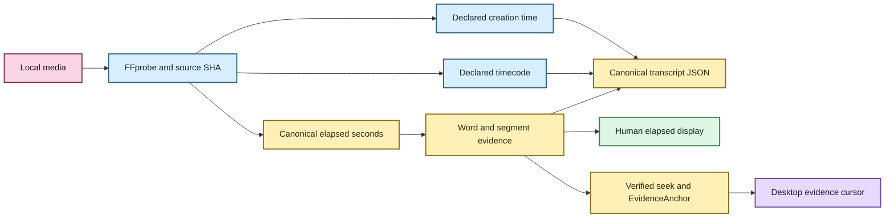
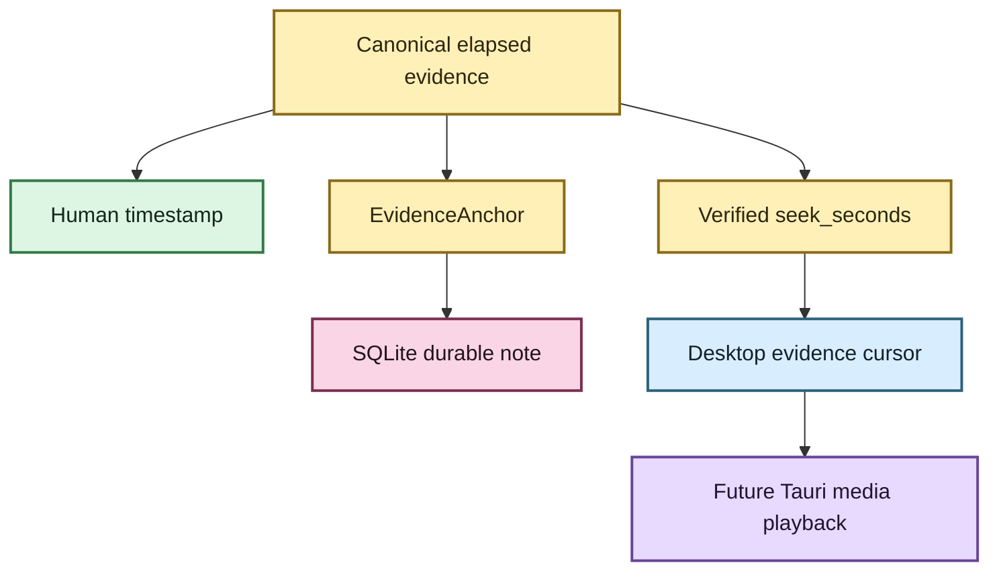

# Media normalization and transcript timeline 🎙️🕰️

Status: canonical media timeline, word timing, verified seek coordinates, durable evidence
anchors, and desktop evidence-cursor presentation are implemented. Local audio/video
playback is not yet implemented.  
Last updated: August 19, 2026

EchoFlow has to answer three deceptively simple questions before recorded evidence is
useful:

1. **What exactly did we transcribe?**
2. **Where is a transcript span inside that recording?**
3. **What other clocks did the original media claim to have?**

Those are different questions. The architecture keeps their answers separate.

The canonical transcript timeline is always **elapsed source-relative seconds from the
selected audio origin**. Humans can view that coordinate as `HH:MM:SS.mmm`. Original
container/stream `timecode` and `creation_time` tags are preserved in parallel as
source-declared provenance when FFprobe reports them.

Nothing rewrites the meaning of the canonical elapsed coordinate.

For the plain-language guide, see
**[Transcript time without calculator gymnastics](../time-navigation.md)**.

## The human version

If EchoFlow says a passage begins at `4788.37` seconds, it means:

> **4788.37 seconds after the beginning of the selected recording audio.**

The human presentation is:

```text
01:19:48.370
```

That timeline survives normalization, segmentation, checkpoints, enhancement, word
alignment, assembly, search navigation, desktop evidence-cursor movement, and durable note
anchoring.

A file may also declare something like:

```text
timecode:      10:00:00:00
creation_time: 2026-04-05T12:34:56Z
```

EchoFlow preserves those declarations with their format/stream origin. It does not treat
them as interchangeable with `4788.37` seconds, and it does not claim that a device clock
was historically correct merely because a tag exists.



Text fallback: FFprobe/source identity produces canonical elapsed time plus preserved
source-declared clocks; canonical word/segment evidence drives transcript JSON, human
clock display, verified seek coordinates, durable anchors, and the current desktop
evidence cursor.

## One input boundary for audio and video

EchoFlow treats every supported input as **audio-bearing local media**.

Video is not a second downstream pipeline. FFprobe discovers streams, EchoFlow selects
one audio stream, and transcription discards unrelated video/subtitle/attachment/data
streams from the working audio path.

`interview.m4a`, `lecture.wav`, and `meeting.mp4` therefore converge on the same
transcription contract once one audio stream has been selected.

Temporal metadata discovery remains attached to the original media evidence, not to a
normalized WAV derivative.

## What media inspection owns

`FfprobeMediaProbe` performs read-only inspection. It does not transcode, install models,
choose enhancement, or choose a transcription strategy.

For one local source it snapshots filesystem identity, invokes FFprobe with a file-only
protocol whitelist, reads bounded container/stream metadata, requests format/stream
`timecode` and `creation_time`, validates that audio exists, fingerprints the complete
source with SHA-256, snapshots identity again, and refuses the input if the source changed
during inspection.

The result is immutable `MediaInfo` evidence. Routine logs omit local paths by default
because recording names and directory layouts may themselves be sensitive.

## Source-declared temporal tags

`MediaTemporalTag` records:

| Field | Meaning |
|---|---|
| `kind` | currently `timecode` or `creation_time` |
| `value` | the source-declared string |
| `source` | `format` or `stream` |
| `stream_index` | required for stream-scoped declarations, absent for format scope |

Conflicting values are preserved rather than silently resolved. The values are
declarations, not trusted wall-clock facts.

## Deterministic audio-stream selection

`AudioStreamSelector` chooses exactly one discovered audio stream.

Without an override, the first audio stream is selected. With:

```bash
uv run echoflow transcribe meeting.mp4 --audio-stream 2
```

EchoFlow validates that stream index `2` is audio and records that choice in the job/source
contract. Resume restores the same selected stream.

## Canonical working audio

The current deterministic processing representation is:

| Property | Value |
|---|---|
| container | WAV |
| codec | signed 16-bit little-endian PCM (`pcm_s16le`) |
| sample rate | 16,000 Hz |
| channels | 1 (mono) |

If a source WAV already satisfies the contract, planning can choose `DIRECT`. Other
supported audio-bearing media uses `FFMPEG_NORMALIZE`, mapping exactly the selected audio
stream and dropping unrelated streams.

The resulting `normalized.wav` lives inside the private job workspace. It is deterministic
working material, not a second source of truth.

## Optional enhanced derivative

With `--enhance`, EchoFlow creates a private `enhanced.wav` after canonical decode and
before ASR segmentation.

The enhanced file may change sample values. It may not silently change timeline shape.
EchoFlow checks channel count, sample width, sample rate, and frame count. A mismatch fails
closed and the derivative is removed where possible.

Anonymous diarization intentionally consumes the unmodified canonical decode in the first
enhancement version. See **[speech-enhancement.md](speech-enhancement.md)**.

## Source-relative timestamps

Canonical transcript timestamps are elapsed seconds from the start of the selected audio
origin.

Application-owned work units are represented by integer PCM frame intervals:

```text
[start_frame, end_frame)
```

Faster-whisper returns segment and native word timestamps relative to the materialized
work interval. Assembly adds the interval's source-relative offset:

```text
work interval 7 starts at 4200 s
engine word at 588.37 s    → canonical word at 4788.37 s
                              → display 01:19:48.370
```

Work windows are execution/checkpoint detail. They never reset the published transcript
timeline. SRT and WebVTT also render from canonical timestamps.

## Human elapsed timestamps are derived views

`format_elapsed_timestamp()` renders canonical seconds as unwrapped `HH:MM:SS.mmm`.
Hours intentionally do not wrap at 24 because the coordinate is elapsed media, not a wall
clock. Formatted strings are not durable anchors.

## Canonical source provenance

EchoFlow records enough context to explain how canonical text was produced, including
source fingerprint/media identity, selected audio stream, source-declared temporal tags,
decode strategy, managed model revision/execution target, optional enhancement provenance,
language/speaker evidence, and source-relative segment/word timestamps.

Temporal tags deliberately do **not** replace source identity. Source identity remains the
cryptographic/file/media contract.

## Why EchoFlow does not add elapsed time to SMPTE yet

A source string such as `10:00:00:00` is not enough information for safe arithmetic.
SMPTE-style timecode can depend on frame rate and drop-frame/non-drop-frame semantics.
Container/device metadata may also be missing, stale, copied, or contradictory.

EchoFlow preserves source declarations but **does not invent a mapping from canonical
seconds to SMPTE frames** without qualified frame semantics.

That limitation does not block ordinary source-relative navigation. The desktop already
moves an evidence cursor to verified canonical word coordinates. Future media playback can
seek the original recording to the same `seek_seconds` once a Tauri-owned playback
capability exists.

## Word timing, evidence cursor, playback, and durable notes share one axis

These features solve different jobs but share one coordinate system:

**Word timing** answers: where does this word live in canonical elapsed time?

**Human formatting** answers: how should a person read that coordinate?

**Evidence cursor** answers: which verified canonical coordinate is the desktop reader
currently pointing at?

**Playback seek** answers: where should a local player jump?

**EvidenceAnchor** answers: which exact canonical evidence does this user note refer to?



Text fallback: one canonical elapsed coordinate drives display, verified seek, durable
research anchors, and the current desktop evidence cursor; native playback remains the
next capability rather than a new timeline.

## Why the stages remain separate

Inspection answers **what source, streams, and declared metadata exist?**

Selection answers **which audio stream are we using?**

Normalization answers **what deterministic representation will local processing use?**

Enhancement answers **did the user request a provenance-bearing acoustic transform?**

Word alignment answers **where do finer text units sit on the canonical timeline?**

Human formatting answers **how should a person read that elapsed coordinate?**

Temporal provenance answers **what other source clocks were declared alongside it?**

Evidence anchoring answers **where does durable user-authored knowledge attach?**

Desktop evidence-cursor presentation answers **which verified coordinate is the reader
showing now?**

Keeping these responsibilities separate makes metadata discovery side-effect free, keeps
source authority explicit, and lets search, notes, exports, desktop navigation, and future
playback reuse the same evidence instead of inventing parallel timelines.

🧜‍♀️ Multiple clocks. One transcript. No temporal soup.
