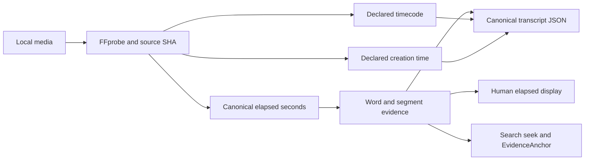
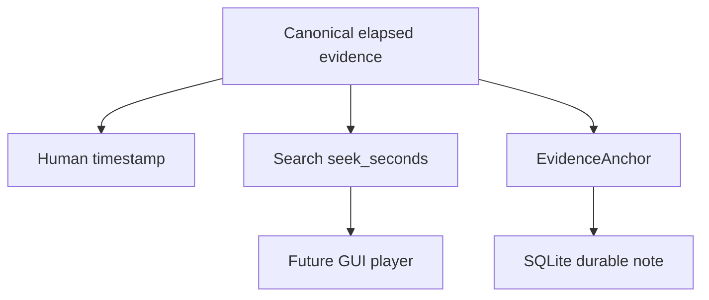

# Media normalization and transcript timeline 🎙️🕰️

EchoFlow has to answer three deceptively simple questions before recorded evidence is
useful:

1. **What exactly did we transcribe?**
2. **Where is a transcript span inside that recording?**
3. **What other clocks did the original media claim to have?**

Those are different questions. The architecture keeps their answers separate.

The canonical transcript timeline is always **elapsed source-relative seconds from the
selected audio origin**. Humans can view that coordinate as `HH:MM:SS.mmm`. Original
container/stream `timecode` and `creation_time` tags are preserved in parallel as
source-declared provenance when FFprobe reports them.

Nothing rewrites the meaning of the canonical elapsed coordinate.

For the plain-language guide, see
**[Transcript time without calculator gymnastics](../time-navigation.md)**.

## The human version

If EchoFlow says a passage begins at `4788.37` seconds, it means:

> **4788.37 seconds after the beginning of the selected recording audio.**

The human presentation is:

```text
01:19:48.370
```

That timeline survives normalization, segmentation, checkpoints, enhancement, word
alignment, assembly, search navigation, and durable note anchoring.

A file may also declare something like:

```text
timecode:      10:00:00:00
creation_time: 2026-04-05T12:34:56Z
```

EchoFlow preserves those declarations with their format/stream origin. It does not treat
them as interchangeable with `4788.37` seconds, and it does not claim that a device clock
was historically correct merely because a tag exists.



## One input boundary for audio and video

EchoFlow treats every supported input as **audio-bearing local media**.

Video is not a second downstream pipeline. FFprobe discovers streams, EchoFlow selects
one audio stream, and transcription discards unrelated video/subtitle/attachment/data
streams from the working audio path.

`interview.m4a`, `lecture.wav`, and `meeting.mp4` therefore converge on the same
transcription contract once one audio stream has been selected.

Temporal metadata discovery remains attached to the original media evidence, not to a
normalized WAV derivative.

## What media inspection owns

`FfprobeMediaProbe` performs read-only inspection. It does not transcode, install models,
choose enhancement, or choose a transcription strategy.

For one local source it:

- snapshots filesystem identity before inspection;
- invokes FFprobe with a file-only protocol whitelist;
- reads bounded container/stream metadata;
- requests format/stream `timecode` and `creation_time` tags;
- validates that at least one audio stream exists;
- fingerprints the complete source with SHA-256;
- snapshots filesystem identity again; and
- refuses the input if the source changed during inspection.

The result is immutable `MediaInfo` evidence. Routine logs omit local paths by default
because recording names and directory layouts may themselves be sensitive.

## Source-declared temporal tags

`MediaTemporalTag` records:

| Field | Meaning |
|---|---|
| `kind` | currently `timecode` or `creation_time` |
| `value` | the source-declared string |
| `source` | `format` or `stream` |
| `stream_index` | required for stream-scoped declarations, absent for format scope |

A stream-scoped tag must reference a stream that FFprobe actually discovered.

Conflicting values are preserved rather than silently resolved. A format-level timecode
and video-stream timecode may disagree. EchoFlow retains both with enough provenance for
a later qualified mapping decision.

The values are *declarations*, not trusted wall-clock facts.

## Deterministic audio-stream selection

`AudioStreamSelector` chooses exactly one discovered audio stream.

Without an override, the first audio stream is selected. With:

```bash
uv run echoflow transcribe meeting.mp4 --audio-stream 2
```

EchoFlow validates that stream index `2` is audio and records that choice in the job/source
contract.

Resume restores the same selected stream. It does not decide another track is close
enough.

## Canonical working audio

The current deterministic processing representation is:

| Property | Value |
|---|---|
| container | WAV |
| codec | signed 16-bit little-endian PCM (`pcm_s16le`) |
| sample rate | 16,000 Hz |
| channels | 1 (mono) |

If a source WAV already satisfies the contract, planning can choose `DIRECT`.
Other supported audio-bearing media uses `FFMPEG_NORMALIZE`, mapping exactly the selected
audio stream and dropping unrelated streams.

The resulting `normalized.wav` lives inside the private job workspace. It is **not a
second source of truth**. It is deterministic working material that can be discarded after
the job lifecycle no longer needs it.

## Optional enhanced derivative

With `--enhance`, EchoFlow creates a private `enhanced.wav` after canonical decode and
before ASR segmentation.

The enhanced file may change sample values. It may not silently change timeline shape.
EchoFlow checks channel count, sample width, sample rate, and frame count. A mismatch fails
closed and the derivative is removed where possible.

Anonymous diarization intentionally consumes the unmodified canonical decode in the first
enhancement version. See **[speech-enhancement.md](speech-enhancement.md)**.

## Source-relative timestamps

Canonical transcript timestamps are elapsed seconds from the start of the selected audio
origin.

Application-owned work units are represented by integer PCM frame intervals:

```text
[start_frame, end_frame)
```

Seconds are derived from exact frames and the canonical sample rate.

Faster-whisper returns segment and native word timestamps relative to the materialized
work interval. Assembly adds the interval's source-relative offset:

```text
work interval 0 starts at 0 s
engine word at 12.4 s      → canonical word at 12.4 s

work interval 7 starts at 4200 s
engine word at 588.37 s    → canonical word at 4788.37 s
                              → display 01:19:48.370
```

Work windows are an execution/checkpoint detail. They never reset the published transcript
timeline. SRT and WebVTT also render from canonical timestamps.

## Human elapsed timestamps are derived views

`format_elapsed_timestamp()` renders canonical seconds as unwrapped `HH:MM:SS.mmm`.

| Numeric evidence | Human display |
|---:|---|
| `0.0` | `00:00:00.000` |
| `60.0` | `00:01:00.000` |
| `3600.0` | `01:00:00.000` |
| `4788.37` | `01:19:48.370` |
| `86400.0` | `24:00:00.000` |

Hours intentionally do not wrap at 24. A 30-hour recording is elapsed media, not a wall
clock.

Formatted strings are not durable anchors.

## Canonical source provenance

EchoFlow records enough context to explain how canonical text was produced, including:

- source fingerprint/media identity;
- selected audio stream;
- source-declared temporal tags when present;
- decode strategy;
- managed ASR engine/model/revision and execution target;
- enhancement provider/version/parameters when used;
- language and optional speaker evidence; and
- source-relative segment and word timestamps.

Temporal tags deliberately do **not** replace source identity. Source identity remains the
cryptographic/file/media contract.

## Why EchoFlow does not add elapsed time to SMPTE yet

A source string such as:

```text
10:00:00:00
```

looks temptingly like a clock. It is not enough information for safe arithmetic.
SMPTE-style timecode can depend on frame rate and drop-frame/non-drop-frame semantics.
Container/device metadata may also be missing, stale, copied, or contradictory.

EchoFlow therefore preserves source declarations but **does not invent a mapping from
canonical seconds to SMPTE frames** without qualified frame semantics.

That limitation does not block ordinary click-to-media navigation. A local player can seek
directly to canonical `seek_seconds`.

Future SMPTE mapping, if real product use requires it, should qualify exact/rational frame
rate, nominal frame-numbering rate, drop-frame semantics, source of the declaration,
conflict policy, and rollover tests.

## Word timing, playback, and durable notes use the same elapsed axis

These features solve different jobs but share one coordinate system:

**Word timing** answers: where does this word live in canonical elapsed time?

**Human formatting** answers: how should a person read that coordinate?

**Playback seek** answers: where should a local player jump?

**EvidenceAnchor** answers: which exact canonical evidence does this user note refer to?

Durable notes are now implemented. An anchor contains exact document/source/canonical
generation identity, canonical segment IDs, and numeric source-relative start/end seconds.
A note does not depend on a pretty timestamp or rebuildable search chunk.



The graphical player is still future presentation work; the timeline and note-storage
contracts it needs already exist.

## Why the stages remain separate

Inspection answers **what source, streams, and declared metadata exist?**

Selection answers **which audio stream are we using?**

Normalization answers **what deterministic representation will local processing use?**

Enhancement answers **did the user request a provenance-bearing acoustic transform?**

Word alignment answers **where do finer text units sit on the canonical timeline?**

Human formatting answers **how should a person read that elapsed coordinate?**

Temporal provenance answers **what other source clocks were declared alongside it?**

Evidence anchoring answers **where does durable user-authored knowledge attach?**

Keeping these responsibilities separate makes metadata discovery side-effect free, keeps
source authority explicit, and lets search, notes, exports, and a future GUI reuse the same
evidence instead of inventing parallel timelines.

🧜‍♀️ Multiple clocks. One transcript. No temporal soup.
