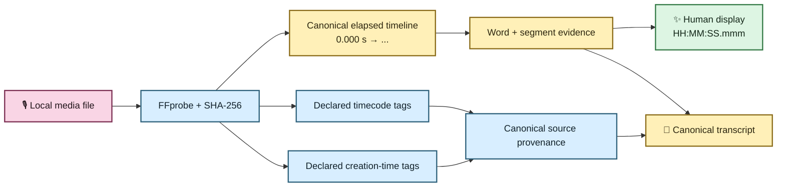
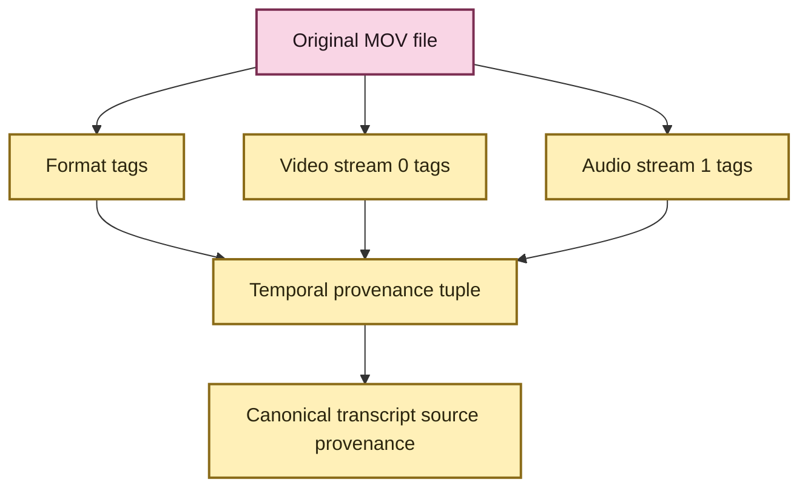

# Media normalization and transcript timeline 🎙️🕰️

EchoFlow has to answer three deceptively simple questions before recorded evidence is
useful:

1. **What exactly did we transcribe?**
2. **Where is a transcript span inside that recording?**
3. **What other clocks did the original media claim to have?**

Those are different questions. The architecture now keeps their answers separate.

The canonical transcript timeline is always **elapsed source-relative seconds from the
selected audio origin**. Humans can view that coordinate as `HH:MM:SS.mmm`. Original
container/stream `timecode` and `creation_time` tags are preserved in parallel as
source-declared provenance when FFprobe reports them.

Nothing rewrites the meaning of the canonical elapsed coordinate.

For the plain-language navigation guide, see
**[Transcript time without calculator gymnastics](../time-navigation.md)**.

## The human version

If EchoFlow says a passage begins at `4788.37` seconds, it means:

> **4788.37 seconds after the beginning of the selected recording audio.**

The human presentation is:

```text
01:19:48.370
```

That timeline survives normalization, segmentation, checkpoints, enhancement, word
alignment, and assembly.

A file may also declare something like:

```text
timecode:      10:00:00:00
creation_time: 2026-04-05T12:34:56Z
```

EchoFlow preserves those declarations with their format/stream origin. It does not treat
them as interchangeable with `4788.37` seconds, and it does not claim that a device clock
was historically correct merely because a tag exists.



## One input boundary for audio and video

EchoFlow treats every supported input as **audio-bearing local media**.

Video is not a second downstream pipeline. FFprobe discovers the streams, EchoFlow
selects one audio stream, and transcription later discards unrelated video/subtitle/
attachment/data streams from the working audio path.

That means `interview.m4a`, `lecture.wav`, and `meeting.mp4` all converge on the same
transcription contract once one audio stream has been selected.

Temporal metadata discovery remains attached to the original media evidence, not to a
normalized WAV derivative.

## What media inspection owns

`FfprobeMediaProbe` performs read-only inspection. It does not transcode, install models,
choose enhancement, or choose a transcription strategy.

For one local source it:

- snapshots filesystem identity before inspection;
- invokes FFprobe with a file-only protocol whitelist;
- reads bounded container/stream metadata;
- requests format/stream `timecode` and `creation_time` tags;
- validates that at least one audio stream exists;
- fingerprints the complete source with SHA-256;
- snapshots filesystem identity again; and
- refuses the input if the source changed during inspection.

The result is immutable `MediaInfo` evidence.

Routine logs omit local paths by default because recording names and directory layouts
may themselves be sensitive.

## Source-declared temporal tags

`MediaTemporalTag` records four things:

| Field | Meaning |
|---|---|
| `kind` | currently `timecode` or `creation_time` |
| `value` | the source-declared string |
| `source` | `format` or `stream` |
| `stream_index` | required for stream-scoped declarations, absent for format scope |

A stream-scoped tag must reference a stream that FFprobe actually discovered.

Conflicting values are intentionally preserved rather than silently resolved. For
example, a format-level timecode and a video-stream timecode may disagree. EchoFlow's
current job is to retain that evidence with enough provenance for a later qualified
mapping decision.



The values are *declarations*, not trusted wall-clock facts.

## Deterministic audio-stream selection

`AudioStreamSelector` chooses exactly one discovered audio stream.

Without an override, the first audio stream is selected. With:

```bash
uv run echoflow transcribe meeting.mp4 --audio-stream 2
```

EchoFlow validates that stream index `2` is actually audio and records that choice in
the job/source contract.

Resume restores the same selected stream. It does not decide that a different track is
close enough.

Selection uses `dataclasses.replace`, so temporal provenance discovered from the original
container survives a user-selected audio-stream change without being rediscovered or
mutated.

## Canonical working audio

The current deterministic processing representation is:

| Property | Value |
|---|---|
| container | WAV |
| codec | signed 16-bit little-endian PCM (`pcm_s16le`) |
| sample rate | 16,000 Hz |
| channels | 1 (mono) |

If a source WAV already satisfies the contract, planning can choose `DIRECT`.

Other supported audio-bearing media uses `FFMPEG_NORMALIZE`, mapping exactly the selected
audio stream and dropping unrelated streams.

The resulting `normalized.wav` lives inside the private job workspace.

It is **not a second source of truth**. It is a deterministic working representation that
can be discarded after the job lifecycle no longer needs it.

## Optional enhanced derivative

With `--enhance`, EchoFlow creates a private `enhanced.wav` after canonical decode and
before ASR segmentation.

The enhanced file may change sample values. It may not silently change the timeline
shape.

EchoFlow checks:

- channel count;
- sample width;
- sample rate; and
- frame count.

Any mismatch fails closed and the derived output is removed where possible.

Why so fussy? Because if preprocessing trims, pads, resamples, or changes the channel
structure without telling anyone, every downstream timestamp becomes suspicious.

Anonymous diarization intentionally continues to consume the unmodified canonical
decode in the first enhancement version. See
**[speech-enhancement.md](speech-enhancement.md)** for that provider boundary.

## Source-relative timestamps

Canonical transcript timestamps are elapsed seconds from the start of the selected audio
origin.

Application-owned work units are represented by integer PCM frame intervals:

```text
[start_frame, end_frame)
```

Seconds are derived from those exact frames and the canonical sample rate.

Faster-whisper returns segment and native word timestamps relative to the materialized
work interval. Assembly adds the interval's source-relative offset:

```text
work interval 0 starts at 0 s
engine word at 12.4 s      → canonical word at 12.4 s

work interval 7 starts at 4200 s
engine word at 588.37 s    → canonical word at 4788.37 s
                              → display 01:19:48.370
```

The default work-window duration is currently 600 seconds (10 minutes). Those work
windows are an execution/checkpoint detail, not a user-facing time coordinate. They
never reset the published transcript timeline.

SRT and WebVTT also render from canonical timestamps. Segment/checkpoint boundaries
therefore do not reset subtitle time to zero.

💃 The timeline survives the choreography.

## Human elapsed timestamps are derived views

`format_elapsed_timestamp()` renders canonical seconds as unwrapped `HH:MM:SS.mmm`.

Examples:

| Numeric evidence | Human display |
|---:|---|
| `0.0` | `00:00:00.000` |
| `60.0` | `00:01:00.000` |
| `3600.0` | `01:00:00.000` |
| `4788.37` | `01:19:48.370` |
| `86400.0` | `24:00:00.000` |

Hours intentionally do not wrap at 24. A 30-hour oral-history corpus item is elapsed
media, not a wall clock.

The formatter rounds to milliseconds deterministically and handles rollover, so
`59.9996` becomes `00:01:00.000` rather than producing an impossible `00:00:60.000`.

Search JSON retains numeric `start_seconds`/`end_seconds` and adds derived
`start_timestamp`/`end_timestamp` conveniences. The human table shows the formatted
range.

Formatted strings are not durable anchors.

## Canonical source provenance

The original local media file remains authoritative.

EchoFlow records enough execution context to explain how canonical text was produced,
including:

- source fingerprint/media identity;
- selected audio stream;
- source-declared temporal tags when present;
- decode strategy;
- managed ASR engine/model/revision and execution target;
- enhancement provider/version/operation/parameters when used;
- language and optional speaker evidence; and
- source-relative segment and word timestamps.

Temporal tags are included in canonical source provenance only when they exist, so files
without them retain the previous wire shape.

Temporal tags deliberately do **not** participate in checkpoint source equality. Source
identity remains the cryptographic/file/media identity contract. A camera clock changing
its story is provenance drift, not a new SHA-256 source.

## Why EchoFlow does not add elapsed time to SMPTE yet

A source string such as:

```text
10:00:00:00
```

looks temptingly like a clock. It is not enough information for safe arithmetic.

SMPTE-style timecode can depend on frame rate and drop-frame/non-drop-frame semantics.
Container/device metadata may also be missing, stale, copied, or contradictory.

This tranche therefore preserves source-declared values but **does not invent a mapping
from canonical seconds to SMPTE frames** without qualified frame semantics.

That limitation does not block ordinary click-to-audio navigation. A local player can
seek directly to canonical `start_seconds`.

Future SMPTE mapping, if product use requires it, should qualify:

- exact/rational frame rate;
- nominal frame-numbering rate;
- drop-frame semantics;
- source of the timecode declaration;
- conflict-resolution policy; and
- deterministic mapping tests around minute/hour/day rollover.

## Relationship to word timing

Word timing and media temporal provenance solve different problems.

**Word timing** answers:

> Where does this word live inside the canonical elapsed timeline?

**Human elapsed formatting** answers:

> How do I show that coordinate without making a person calculate 4788 seconds?

**Original-media temporal metadata** answers:

> What other clock information did the source itself declare?

Together they support richer evidence receipts without pretending every clock is the
same clock.

```text
word "budget"
  canonical elapsed seconds: 4788.370
  human elapsed display:     01:19:48.370
  declared source timecode:  10:00:00:00   (if present; not yet mapped)
  declared creation time:    2026-04-05T12:34:56Z   (if present)
```

## Relationship to future notes and click-to-seek

A graphical player does not exist yet, and neither does the durable notes editor/store.
The coordinate contract they need now does.

A future player should seek by numeric canonical seconds.

A future annotation should anchor to durable evidence such as source SHA-256 plus a
canonical word/segment time span. It should not anchor only to a pretty timestamp string
or rebuildable search-chunk ID.

That keeps user-authored knowledge attached even when search indexes are rebuilt or time
display formatting changes.

## Why the stages remain separate

Inspection answers **what source, streams, and declared metadata exist?**

Selection answers **which audio stream are we using?**

Normalization answers **what deterministic representation will local processing use?**

Enhancement answers **did the user request a provenance-bearing acoustic transform?**

Word alignment answers **where do finer text units sit on the canonical timeline?**

Human timestamp formatting answers **how should a person read that elapsed coordinate?**

Temporal provenance answers **what other source clocks were declared alongside it?**

Keeping these responsibilities separate makes metadata discovery side-effect free,
keeps source authority explicit, and leaves room for richer evidence without rewriting
the meaning of timestamps that already exist.

🧜‍♀️ Multiple clocks. One transcript. No temporal soup.
