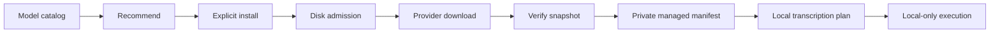

# Local model management 📦🔐

## The human version

EchoFlow needs speech models to transcribe locally. Those model files are large,
versioned execution dependencies, not mysterious cache confetti.

So EchoFlow keeps one very deliberate boundary around them:

> **Downloading a model is an explicit action. Running transcription uses a model that
> EchoFlow has already installed, verified, and pinned to an immutable revision.**

That gives ordinary users a simpler experience and gives maintainers something they can
actually reason about.



## Why EchoFlow does not just trust whatever is in a cache

The Hugging Face cache is a useful byte-level storage layout. EchoFlow does not need to
copy model weights into a proprietary format.

But “some files exist in a cache directory” is not enough to answer:

- which model EchoFlow intended to install;
- which provider repository it came from;
- which immutable revision was resolved;
- whether the expected files are still present; or
- whether a transcription plan can safely refer to that exact dependency later.

So the provider cache remains the physical home of the bytes while EchoFlow owns private
**managed manifests** describing snapshots it deliberately installed and verified.

A pre-existing cache entry is not silently adopted as managed state.

## What a managed manifest records

The current contract records at least:

- logical model ID and engine;
- provider repository ID;
- requested provider revision, when supplied;
- resolved immutable revision;
- absolute local snapshot path;
- measured snapshot size; and
- verification method.

The manifest is a receipt and dependency record, not a second copy of the model.

## The three main responsibilities

`ModelCatalog` describes the finite set of models EchoFlow knows how to reason about.
For faster-whisper, quality/cache metadata is derived from the transcription strategy
catalog instead of duplicated.

`ModelManager` owns application-level inventory, explicit installation, manifest custody,
local revalidation, resolved-revision lookup, and removal.

`ModelProvider` owns provider-specific mechanics such as obtaining a Hugging Face
snapshot, validating its layout, and removing an exact cached revision.

`ModelStorageAdmitter` checks disk capacity before acquisition starts.

The split matters because “what models does EchoFlow support?” and “how does this
provider download bytes?” are different questions.

## Install transaction

A model install follows this order:

1. resolve the model ID through the catalog;
2. reject an invalid/blank requested revision;
3. admit the estimated cache requirement against current disk capacity;
4. create private model/cache/registry directories only after admission succeeds;
5. ask the provider to acquire the requested repository/revision;
6. reject a returned snapshot outside EchoFlow's configured model cache;
7. bind the snapshot path to the declared provider repository cache directory;
8. require the snapshot directory name to equal the resolved immutable revision;
9. verify provider-specific required files exist and are non-empty;
10. measure the installed snapshot and construct provenance; and
11. commit the private EchoFlow manifest **last**.

That ordering is intentional.

A disk refusal should not begin a giant download. A malformed provider result should not
become managed state. A manifest should mean “the install made it through verification,”
not “we started trying.”

🦝 The raccoon gets a receipt after the groceries are actually in the pantry.

## User surface

The normal flow is deliberately boring:

```bash
uv run echoflow models recommend
uv run echoflow models install small
uv run echoflow transcribe recording.m4a
```

Inventory is offline:

```bash
uv run echoflow models
```

Removal is explicit:

```bash
uv run echoflow models remove small
```

The CLI requires confirmation unless `--yes` is supplied.

## Inventory and local revalidation

Inventory and resolved-revision lookup are offline and side-effect free. They do not
create directories, download models, or repair provider state.

When a managed manifest exists, EchoFlow revalidates it before claiming the model is
usable. Validation checks that:

- manifest identity still matches the catalog model/repository;
- the snapshot remains inside EchoFlow's configured model cache;
- the snapshot belongs to the declared provider repository cache directory;
- the path agrees with the recorded resolved revision;
- the verification method is supported; and
- required provider files remain present/non-empty.

If external deletion or tampering makes the manifest stale, EchoFlow fails closed.

The receipt is evidence of what EchoFlow verified earlier. It is not allowed to become a
magic amulet that makes missing bytes reappear.

## What current verification does and does not prove

Current faster-whisper verification establishes structural/provider provenance:
expected cache layout, repository/revision identity, and required non-empty files.

It does **not** claim an independently maintained cryptographic allowlist/signature for
upstream model weights.

A future provider can add stronger digest/signature evidence without changing the
application custody boundary.

## Transcription custody boundary

There is one ASR model path.

A new transcription plan must resolve the selected faster-whisper model through the
verified managed registry.

If the model is not installed and locally revalidated, planning fails with an
install-first message.

A successful plan therefore records a non-empty immutable resolved revision.

At execution time, faster-whisper loads that exact local revision with
`local_files_only=True`.

There is no:

- transcription-time ASR download flag;
- ambient-cache fallback;
- arbitrary configuration revision override; or
- silent substitution of a newer model because the old one is inconvenient.

Resume restores the exact managed model revision recorded in the checkpoint contract.
It never downloads a replacement as a side effect.

## Network boundary 🔐

`echoflow models install MODEL` is the explicit network-bearing ASR model action.

Inventory, recommendation, planning with an already-managed model, and execution do not
need to contact the model provider.

Model management never uploads source media, transcripts, job metadata, or application
telemetry to the provider.

This is why the install boundary is visible to the user instead of being buried inside
`transcribe`.

## Removal transaction

Removal is intentionally asymmetric with installation:

1. resolve and validate the managed manifest;
2. reconstruct the exact installed snapshot identity;
3. ask the provider to remove that resolved revision from the local cache; and
4. delete the EchoFlow manifest **only after provider removal succeeds**.

If provider removal fails, the manifest is retained.

EchoFlow should not forget that it owns bytes it failed to remove.

## Failure semantics

Private registry/model state lives under EchoFlow's application model root.

These conditions fail closed:

- corrupt registry data;
- path escape;
- repository mismatch;
- stale/missing snapshot;
- unsupported verification method;
- required-file verification failure;
- storage refusal; and
- provider removal failure.

Routine public errors should describe the application failure without leaking private
internal paths.

## Reusing the custody pattern for future local models

Future model-backed capabilities should reuse the same ideas:

- capability-specific catalog/qualified profiles;
- provider adapters for acquisition/verification;
- immutable resolved revisions;
- private manifests;
- disk admission before acquisition;
- offline inventory/revalidation; and
- execution through verified model identity.

The current FFmpeg speech-noise-suppression provider is model-free, so it does not
pretend to have a model manifest.

If a future neural enhancement, alignment, source-separation, or embedding provider adds
weights, those weights should enter through this custody family rather than inventing a
new hidden download path.

## Generalize only when reality asks

The first implementation manages faster-whisper models. Semantic embeddings currently
have their own strict-local profile/snapshot boundary and are not yet a locked managed
extra.

A broader shared model-custody abstraction should emerge when a second qualified
model-backed capability exposes real common variation.

EchoFlow does not need a speculative universal model marketplace merely because such an
abstraction would look impressive on a diagram.

## Current deliberate limits

Model management does not currently provide:

- automatic/background model updates;
- adoption of arbitrary cache entries;
- generic arbitrary model hubs;
- model quota/garbage-collection policy;
- hosted inventory/telemetry; or
- independent cryptographic attestation of upstream weights.

The stable rule is:

> **EchoFlow should know which local model dependency it chose, where it came from,
> which immutable revision it verified, whether it is still present, and when it is safe
> to remove it.**

Not glamorous. Extremely useful. 💃
