# Processing capabilities 🎛️

EchoFlow is not one giant transcription function. It composes small local capabilities
into a reproducible workflow whose source, execution choices, recovery state, transcript,
search projections, and research-navigation views remain explainable afterward.

This page is the **family portrait** for maintainers.

For narrower contracts, see:

- [adaptive heterogeneous execution](adaptive-heterogeneous-execution.md);
- [media and timeline](media-and-timeline.md);
- [word-level timestamp alignment](word-alignment.md);
- [model management](model-management.md);
- [speech enhancement](speech-enhancement.md);
- [diarization](diarization.md); and
- [corpus search](corpus-search.md).

## What the user experiences

The intended experience is simpler than the machinery:

1. give EchoFlow a recording;
2. let it inspect the source and current machine;
3. install a recommended model explicitly if needed;
4. transcribe locally;
5. resume if interrupted;
6. export useful views;
7. search completed transcripts; and
8. follow a result back to verified canonical evidence.

Underneath that, EchoFlow preserves enough evidence to explain how each result was
produced.

```mermaid
flowchart LR
    A[Local recording] --> B[Inspect source]
    B --> C[Inspect machine + runtime]
    C --> D[Build immutable plan]
    D --> E[Normalize / enhance if needed]
    E --> F[Segment + local ASR]
    F --> G[Word timing + checkpoints]
    G --> H[Language + optional speaker evidence]
    H --> I[Canonical transcript]
    I --> J[Derived exports]
    I --> K[Lexical / semantic search]
    K --> N[Verify + highlight + context + seek]
    U[User speaker labels] --> N

    classDef evidence fill:#F9D5E5,stroke:#7B2E52,stroke-width:2px,color:#22151B
    classDef inspect fill:#D8EEFF,stroke:#2E617B,stroke-width:2px,color:#12222A
    classDef process fill:#E8D9FF,stroke:#68469B,stroke-width:2px,color:#1F1630
    classDef publish fill:#FFF0B8,stroke:#8A6B18,stroke-width:2px,color:#2C260F
    classDef result fill:#DDF5E3,stroke:#347A46,stroke-width:2px,color:#142719

    class A,I evidence
    class B,C,D inspect
    class E,F,G,H process
    class J,U publish
    class K,N result
```



## 1. Media inspection: what is this file?

`FfprobeMediaProbe` owns source facts, not transcoding. It reads bounded FFprobe metadata
with file-only protocol access, fingerprints the complete source, and refuses a file
whose observed identity changes during inspection.

`AudioStreamSelector` chooses one deterministic audio stream. The choice becomes
provenance and resume restores it instead of silently choosing another track.

Source-declared `timecode` and `creation_time` tags are preserved with format/stream
scope when available. They remain provenance, not canonical elapsed-time authority.

## 2. Resource/runtime inspection: what can this computer really do?

`RunnerInspector` observes CPU and system memory actually visible to the process,
including relevant affinity/cgroup limits.

`HardwareTopologyInspector` adds physical accelerator evidence.
`EngineCapabilityRegistry` separately asks the installed engine/runtime which concrete
device/compute targets are executable. `StrategyEvaluator` admits/ranks safe strategies
against RAM, device memory, runtime capability, and profile intent.

A visible GPU is not assumed usable. Shared/unified accelerator memory is not counted as
bonus physical RAM. Explicit impossible strategies fail instead of being silently
replaced.

See [adaptive heterogeneous execution](adaptive-heterogeneous-execution.md) for the
whole hardware cabaret. 💃

## 3. Model custody: which exact dependency may execute?

A strategy is not executable until its selected faster-whisper model has a verified
managed immutable revision.

`ModelManager` owns explicit acquisition/custody. Planning asks it for the locally
revalidated revision. At execution, faster-whisper uses local-only model resolution and
the exact revision already recorded in the plan.

No transcription-time ASR download fallback exists.

## 4. Canonical audio: one deterministic working representation

The current canonical processing format is:

```text
WAV
pcm_s16le
16 kHz
mono
```

Already-canonical WAV may use `DIRECT`; other supported audio-bearing media uses
`FFMPEG_NORMALIZE`.

Normalization changes representation, not the public transcript timeline. Exact PCM
frame intervals define durable work windows.

## 5. Optional enhancement: help ASR without rewriting the source

When `--enhance` is enabled, `FfmpegAfftdnEnhancer` creates private enhanced audio from
canonical audio using the fixed current filter contract.

ASR may consume the derivative. The original recording remains authoritative. EchoFlow
checks channel count, sample width, sample rate, and frame count before accepting the
derivative so preprocessing cannot quietly shift transcript time.

Anonymous diarization deliberately continues to read the unmodified canonical decode in
enhancement v1.

## 6. Segmentation, word timing, and checkpointing

EchoFlow owns deterministic segmentation:

- exact integer PCM frame boundaries;
- stable zero-based work IDs;
- 600-second maximum work windows;
- no work-window overlap;
- one job-scoped ASR session; and
- strictly ordered checkpoint commits.

The faster-whisper session requests native word timestamps. Engine-produced words are
validated and rebased from work-window time onto the same source-relative timeline as
canonical segments.

Per-window checkpoints persist aligned word evidence. The manifest records alignment
identity so incompatible pre-alignment state cannot silently resume into a mixed job.

Accelerated execution may materialize at most one future segment while the current one
is inferred. Completed checkpoints must remain a contiguous prefix of the deterministic
work plan.

Resume restores the source/model/device/decode/enhancement/segmentation/alignment
contract and re-admits current resources.

## 7. Recognition and multilingual attribution

The faster-whisper backend performs managed local ASR plus native word timing. EchoFlow
does not currently run a separate forced-alignment model.

With no explicit language, multilingual behavior can reconsider language within durable
work units rather than latching one job-wide prompt forever.

Published text-language labels come from local deterministic attribution, which may leave
ambiguous short text unlabeled rather than fabricating certainty.

## 8. Optional anonymous speaker evidence

Diarization is recording-scoped enrichment, not identity.

The pyannote capability remains security-gated because the locked Lightning dependency
is affected by a compensated advisory. EchoFlow refuses the vulnerable path before
provider execution/model acquisition.

When speaker evidence exists, word timing provides a finer projection coordinate than a
whole ASR segment. A word receives a speaker only when exactly one diarized speaker
overlaps that word interval.

The enclosing segment keeps a convenience `speaker_ref` only when aligned words support
one uniform speaker. Mixed handoffs and ambiguous overlap stay explicit.

The library adds two human-facing layers without rewriting that evidence:

- durable user-authored names such as `speaker-02 → Dr. Chen`, bound to the exact canonical
  transcript generation; and
- an overlap-aware derived transcript that distinguishes `single-speaker`, `overlap`,
  `mixed-unresolved`, and `unattributed` states.

No biometric identity or cross-recording person inference occurs.

## 9. Canonical transcript and derived exports

Canonical JSON is authoritative transcript evidence.

It records source/stream provenance, execution-plan identity, managed model revision,
source-relative segment and word timing, language evidence, optional enhancement
provenance, source-declared temporal tags, and optional diarization evidence.

TXT, SRT, and WebVTT remain deterministic segment-oriented publication views. They are
useful. They are not recognition truth.

## 10. Transcript library and retrieval 🦝

Canonical transcript JSON can be projected into private rebuildable search state.

Lexical retrieval uses the database-neutral `TranscriptIndex` application port and
DuckDB BM25 adapter. Semantic retrieval adds deterministic segment-anchored chunks,
`EmbeddingProvider`/`EmbeddingProfile`, strict-local Multilingual E5 Small, private
numeric vectors, exact dense similarity, and stale-corpus refusal.

`TranscriptSearch` can combine lexical and semantic ranks with RRF while preserving
lexical, semantic, and fused provenance in one `SearchResponse`.

Nested word evidence remains outside ranking storage. Search indexes canonical segment
text once.

## 11. Canonical evidence navigation

Retrieval and navigation are separate capabilities.

`EvidenceLocator` takes ranked passages and re-verifies the exact canonical transcript
SHA/source identity before exposing precise coordinates. It can then:

- resolve result segment IDs;
- expose exact aligned words for lexical matches;
- preserve phrase contiguity for exact phrase highlighting;
- avoid exact-word claims for semantic-only results;
- add bounded neighboring canonical context; and
- choose a deterministic source-relative seek coordinate.

`ResearchNavigationService` composes that canonical location with current user-assigned
speaker display labels. Ranking/filtering still uses anonymous refs; presentation may
show `Dr. Chen (speaker-02)`.

This service is deliberately reusable by CLI, future GUI, Python, and other adapters.
The terminal is not the owner of research-navigation semantics.

## 12. Private storage, user state, and observability

Structured logging uses Structlog behind `ILogger`. Routine logs redact local paths by
default.

Private job/checkpoint state, model caches, normalized/enhanced audio, segment
materializations, search databases, and user-authored state remain distinct from
user-visible transcript artifacts.

Speaker display labels are the first implemented durable library-side user state. Future
notes/tags/collections/annotations must share the **durability class**, not necessarily
the same physical JSON adapter. Higher-volume mutable/queryable research state will
likely justify a transactional user-state store behind application ports.

POSIX private state uses owner-only mode policy; Windows uses current-user DACL policy.
These are filesystem access controls, not application-level encryption or secure
erasure.

## Capability ownership map

| Capability | Owns | Does not own |
|---|---|---|
| `FfprobeMediaProbe` | source identity + stream metadata | transcoding |
| `AudioStreamSelector` | selected audio stream | media discovery |
| `RunnerInspector` | process-visible CPU/RAM | model choice |
| `HardwareTopologyInspector` | physical accelerator evidence | runtime-support claims |
| `EngineCapabilityRegistry` | engine/device/compute support | strategy ranking |
| `StrategyEvaluator` | safe strategy admission/ranking | model acquisition |
| `ModelManager` | managed model custody/revision | ASR execution |
| `TranscriptionJobPlanner` | immutable combined execution plan | performing work |
| `FfmpegAudioDecoder` | selected-stream canonicalization | enhancement |
| `FfmpegAfftdnEnhancer` | optional noise suppression | source authority |
| `WaveAudioSegmenter` | exact work windows/materialization | recognition |
| `FasterWhisperSession` | local ASR + native word timing | model download or forced alignment |
| `LocalCheckpointStore` | private resumable segment/word evidence | public artifacts |
| `TranscriptAssembler` | source-relative segment/word assembly | filesystem policy |
| `LinguaLanguageAttributor` | conservative text-language labels | acoustic decoding |
| `SpeakerDiarizer` | anonymous speaker-turn evidence | biometric identity |
| `TranscriptExporter` | derived TXT/SRT/VTT | recognition truth |
| `TranscriptIndex` | database-neutral lexical search contract | semantic execution |
| `DuckDbTranscriptIndex` | private BM25 projection | canonical truth |
| `EmbeddingProvider` | query/passage embedding semantics | corpus custody |
| `DuckDbSemanticIndex` | rebuildable vectors + exact similarity | canonical evidence |
| `TranscriptSearch` | retrieval composition + RRF | storage implementation |
| `TranscriptLibraryService` | discovery/rebuild/stale-state/retrieval/integrity receipts | user annotations |
| `SpeakerLabelService` | durable human names over anonymous refs | diarization evidence |
| `EvidenceLocator` | verified canonical result coordinates | ranking |
| `ResearchNavigationService` | retrieval + location + display composition | canonical mutation |
| `WorkspaceService` | private/public path allocation | audio semantics |

Protocols exist around real substitutable behavior, not because every class deserves a
ceremonial interface.

## Current deliberate limits

EchoFlow does not currently claim:

- calibrated performance across representative consumer hardware;
- every visible accelerator is useful/faster;
- alternate ASR engines;
- arbitrary word-level code-switch attribution;
- independent forced alignment or phoneme-level timing;
- biometric or cross-recording speaker identity;
- speech/source separation;
- generative restoration;
- automatic enhancement selection;
- trusted deterministic SMPTE/PTS mapping beyond preserved source declarations;
- storage durability across sudden power loss;
- malicious same-user TOCTOU resistance;
- secure erasure;
- a qualified locked semantic dependency extra;
- ANN/HNSW, learned reranking, or generated corpus answers;
- durable notes/tags/collections/annotations/saved searches; or
- a polished installer/desktop GUI.

## What is the next product layer?

Word timing, time provenance, speaker naming, overlap presentation, and aligned search
navigation are now foundation.

The next major product layer is **durable user-authored research state over verified
evidence locations**: notes, tags, saved searches, collections, annotations, and
exportable/citable selected result sets.

After that come semantic-install qualification, representative-device dogfooding, and a
beginner-friendly installer/thin graphical shell over these same application services.

Source separation remains later and evidence-driven. EchoFlow can now represent overlap
honestly; another model should earn its compute/custody/provenance burden with measured
benefit.

> **Source evidence stays authoritative. Derived machinery stays explainable. User
> knowledge does not get mistaken for cache.**
