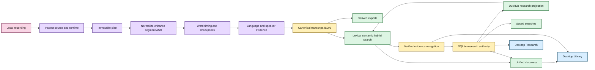

# Processing capabilities 🎛️

Status: local transcription, canonical evidence, lexical/semantic retrieval, verified
navigation, durable research state, incremental refresh, remembered locations, and first
Tauri/React Library/Research presentation are implemented.  
Last updated: August 19, 2026

EchoFlow is not one giant transcription function. It composes small local capabilities
into a reproducible workflow whose source, execution choices, recovery state, transcript,
search projections, navigation views, research state, and desktop presentation remain
explainable afterward.

This page is the **family portrait** for maintainers.

For narrower contracts, see:

- [adaptive heterogeneous execution](adaptive-heterogeneous-execution.md);
- [media and timeline](media-and-timeline.md);
- [word-level timestamp alignment](word-alignment.md);
- [model management](model-management.md);
- [speech enhancement](speech-enhancement.md);
- [diarization](diarization.md);
- [corpus search](corpus-search.md);
- [durable research state](research-state.md);
- [incremental library refresh](incremental-library-refresh.md); and
- [durable library locations](library-locations.md).

## What the user experiences now

The current end-to-end product path is:

1. choose a recording or remembered location;
2. inspect source and current machine;
3. install a recommended model explicitly if needed;
4. transcribe locally and resume if interrupted;
5. publish canonical JSON plus optional derived views;
6. refresh/search the private library;
7. follow a result back to verified canonical evidence;
8. keep durable notes/tags/collections/saved searches attached to that evidence; and
9. browse import, Library, evidence-reader, and Research surfaces through the desktop shell.

The next product layer is interaction depth: research editing, saved-search management,
advanced search controls, and Tauri-owned media playback. It is no longer “build a GUI.”



Text fallback: local execution produces canonical transcript evidence; rebuildable search
ranks it; verified navigation resolves results; authoritative research state attaches to
exact evidence and can constrain later retrieval; grouped discovery and desktop Library/
Research views consume those same application contracts.

## 1. Media inspection: what is this file?

`FfprobeMediaProbe` owns source facts, not transcoding. It reads bounded FFprobe metadata
with file-only protocol access, fingerprints the complete source, and refuses a file whose
observed identity changes during inspection.

`AudioStreamSelector` chooses one deterministic audio stream. The choice becomes
provenance and resume restores it instead of silently choosing another track.

Source-declared `timecode` and `creation_time` tags are preserved with format/stream scope
when available. They remain provenance, not canonical elapsed-time authority.

## 2. Resource/runtime inspection: what can this computer really do?

`RunnerInspector` observes CPU and system memory actually visible to the process, including
relevant affinity/cgroup limits.

`HardwareTopologyInspector` adds physical accelerator evidence.
`EngineCapabilityRegistry` separately asks the installed engine/runtime which concrete
device/compute targets are executable. `StrategyEvaluator` admits/ranks safe strategies
against RAM, device memory, runtime capability, and profile intent.

A visible GPU is not assumed usable. Shared/unified accelerator memory is not counted as
bonus physical RAM. Explicit impossible strategies fail instead of being silently
replaced.

## 3. Model custody: which exact dependency may execute?

A strategy is not executable until its selected faster-whisper model has a verified
managed immutable revision.

`ModelManager` owns explicit acquisition/custody. Planning asks it for the locally
revalidated revision. At execution, faster-whisper uses local-only model resolution and
the exact revision already recorded in the plan.

No transcription-time ASR download fallback exists.

## 4. Canonical audio and optional enhancement

The current canonical processing format is WAV / `pcm_s16le` / 16 kHz / mono.

Already-canonical WAV may use `DIRECT`; other supported audio-bearing media uses
`FFMPEG_NORMALIZE`.

Normalization changes representation, not the public transcript timeline. Exact PCM frame
intervals define durable work windows.

When `--enhance` is enabled, `FfmpegAfftdnEnhancer` creates private enhanced audio from
canonical audio using the fixed current filter contract. The original recording remains
authoritative, and EchoFlow verifies the derivative did not change the timeline shape.

Anonymous diarization deliberately continues to read the unmodified canonical decode in
enhancement v1.

## 5. Segmentation, word timing, and checkpointing

EchoFlow owns deterministic segmentation with exact PCM frame boundaries, stable work IDs,
a 600-second maximum work window, no work-window overlap, one job-scoped ASR session, and
strictly ordered checkpoint commits.

The faster-whisper session requests native word timestamps. Engine-produced words are
validated and rebased from work-window time onto the same source-relative timeline as
canonical segments.

Per-window checkpoints persist aligned word evidence. Resume restores the source/model/
device/decode/enhancement/segmentation/alignment contract and re-admits current resources.

## 6. Recognition, language, and speaker evidence

The faster-whisper backend performs managed local ASR plus native word timing. EchoFlow
does not currently run a separate forced-alignment model.

Multilingual behavior can reconsider language within durable work units rather than
latching one job-wide prompt forever. Published text-language labels come from local
deterministic attribution, which may leave ambiguous text unlabeled.

Diarization is recording-scoped enrichment, not identity. A word receives a speaker only
when exactly one diarized speaker overlaps that word interval. Mixed handoffs and
ambiguous overlap stay explicit.

The library adds human-facing display labels such as `speaker-02 → Dr. Chen` without
rewriting anonymous canonical evidence. No biometric or cross-recording person inference
occurs.

## 7. Canonical transcript and derived exports

Canonical JSON is authoritative transcript evidence.

It records source/stream provenance, execution-plan identity, managed model revision,
source-relative segment and word timing, language evidence, optional enhancement
provenance, source-declared temporal tags, and optional diarization evidence.

TXT, SRT, and WebVTT remain deterministic publication views. They are useful. They are not
recognition truth.

## 8. Transcript library and retrieval 🦝

Canonical transcript JSON is projected into private rebuildable search state.

Lexical retrieval uses the database-neutral `TranscriptIndex` application port and DuckDB
BM25 adapter. Semantic retrieval adds deterministic segment-anchored chunks,
`EmbeddingProvider`/`EmbeddingProfile`, strict-local Multilingual E5 Small, private numeric
vectors, exact dense similarity, and stale-corpus refusal.

`TranscriptSearch` can combine lexical and semantic ranks with RRF while preserving
lexical, semantic, and fused provenance in one `SearchResponse`.

Normal corpus growth uses incremental refresh; full rebuild remains repair/recovery.

## 9. Canonical evidence navigation

Retrieval and navigation are separate capabilities.

`EvidenceLocator` re-verifies the exact canonical transcript SHA/source identity before
exposing precise coordinates. It resolves segment IDs, exact aligned words for justified
lexical matches, bounded canonical context, and a deterministic source-relative seek.

`ResearchNavigationService` composes that canonical location with current user-assigned
speaker display labels. Ranking/filtering still uses anonymous refs.

The desktop Evidence reader consumes the path-minimized result DTO and can move a verified
evidence cursor among canonical timed words. Media playback itself remains separate.

## 10. Durable research workspace

Notes, tags, collections, and saved searches are implemented durable library-side state.

`ResearchWorkspaceService` is the application-facing facade over verified anchors,
authoritative SQLite research state, deterministic projection convergence, rebuildable
DuckDB research relationships/terms, transcript retrieval, grouped discovery, and saved
search intent.

A note anchor includes document identity, source SHA-256, canonical transcript SHA-256,
canonical segment IDs, and numeric source-relative time. If the canonical transcript
generation changes, the note survives as durable historical user state but does not
silently attach to the new generation.

Research tag/collection/note-text constraints are resolved to canonical evidence scope
**before** BM25 ranking or semantic vector scoring.

SQLite user state is not rebuildable. The DuckDB research projection is.

## 11. Remembered locations and import

`LibraryLocationService` owns explicit one-time-versus-remembered folder semantics. A
remembered root is a private permission/pointer, not copied media.

Transcript roots participate in incremental canonical reconciliation. Recording roots only
perform cheap candidate discovery. Discovery does not itself hash, FFprobe, transcribe,
copy, or mutate source media.

The current desktop intake screen consumes this service through the versioned bridge and
native Tauri dialogs.

## 12. Desktop presentation boundary

The desktop architecture is intentionally thin:

```text
React + TypeScript + Vite   presentation
Tauri / Rust                native capability host
Python EchoFlow             application/evidence authority
```

The versioned Python bridge exposes only allowlisted operations. React does not own SQL,
DuckDB/SQLite access, arbitrary shell execution, or canonical/source path authority for
evidence/research views.

Current desktop surfaces include Add evidence, Library, verified Evidence reader/cursor,
and browse-first Research. Archive/Midnight themes and Playwright/axe checks are part of
the same product contract, not decorative afterthoughts.

## 13. Private storage and observability

Structured logging uses Structlog behind `ILogger`. Routine logs redact local paths by
default.

Private job/checkpoint state, model caches, normalized/enhanced audio, segment
materializations, search databases, SQLite research authority, and rebuildable research
projection remain distinct from user-visible transcript artifacts.

POSIX private state uses owner-only mode policy; Windows uses current-user DACL policy.
These are filesystem access controls, not application-level encryption or secure erasure.

## Capability ownership map

| Capability | Owns | Does not own |
|---|---|---|
| `FfprobeMediaProbe` | source identity + stream metadata | transcoding |
| `AudioStreamSelector` | selected audio stream | media discovery |
| `RunnerInspector` | process-visible CPU/RAM | model choice |
| `HardwareTopologyInspector` | physical accelerator evidence | runtime-support claims |
| `EngineCapabilityRegistry` | engine/device/compute support | strategy ranking |
| `StrategyEvaluator` | safe strategy admission/ranking | model acquisition |
| `ModelManager` | managed model custody/revision | ASR execution |
| `TranscriptionJobPlanner` | immutable combined execution plan | performing work |
| `FfmpegAudioDecoder` | selected-stream canonicalization | enhancement |
| `FfmpegAfftdnEnhancer` | optional noise suppression | source authority |
| `WaveAudioSegmenter` | exact work windows/materialization | recognition |
| `FasterWhisperSession` | local ASR + native word timing | model download or forced alignment |
| `LocalCheckpointStore` | private resumable segment/word evidence | public artifacts |
| `TranscriptAssembler` | source-relative segment/word assembly | filesystem policy |
| `LinguaLanguageAttributor` | conservative text-language labels | acoustic decoding |
| `SpeakerDiarizer` | anonymous speaker-turn evidence | biometric identity |
| `TranscriptExporter` | derived TXT/SRT/VTT | recognition truth |
| `TranscriptIndex` | database-neutral lexical search contract | semantic execution |
| `DuckDbTranscriptIndex` | private BM25 projection | canonical truth |
| `EmbeddingProvider` | query/passage embedding semantics | corpus custody |
| `DuckDbSemanticIndex` | rebuildable vectors + exact similarity | canonical evidence |
| `TranscriptSearch` | retrieval composition + RRF | storage implementation |
| `TranscriptLibraryService` | refresh/rebuild/stale-state/retrieval/integrity receipts | durable research authority |
| `LibraryLocationService` | remembered roots + cheap candidate discovery | ASR execution or source deletion |
| `SpeakerLabelService` | durable human display names | diarization evidence |
| `EvidenceLocator` | verified canonical result/anchor coordinates | ranking |
| `ResearchNavigationService` | retrieval + location + speaker-display composition | canonical mutation |
| `ResearchStateStore` | durable notes/tags/collections + evidence anchors | search ranking |
| `WorkspaceMetadataStore` | saved-search intent + derived navigation | transcript authority |
| `ResearchStateProjector` | deterministic projection convergence | user truth |
| `ResearchProjectionIndex` | fast research filtering/summaries | authoritative note content |
| `ResearchWorkspaceService` | one application seam over research + evidence + retrieval | database topology leakage |
| `desktop.bridge` | versioned allowlisted desktop IPC | business-rule ownership |
| React frontend | accessible interaction/presentation | database/filesystem/shell authority |
| Tauri host | native dialogs/process/native capability boundary | research/search policy |
| `WorkspaceService` | private/public path allocation | audio semantics |

Protocols exist around real substitutable behavior, not because every class deserves a
ceremonial interface.

## Current deliberate limits

EchoFlow does not currently claim:

- calibrated performance across representative consumer hardware;
- every visible accelerator is useful/faster;
- alternate ASR engines;
- arbitrary word-level code-switch attribution;
- independent forced alignment or phoneme-level timing;
- biometric or cross-recording speaker identity;
- speech/source separation;
- generative restoration;
- automatic enhancement selection;
- trusted deterministic SMPTE/PTS mapping beyond preserved source declarations;
- malicious same-user TOCTOU resistance;
- secure erasure;
- a normal packaged semantic dependency/model-extra path;
- ANN/HNSW, learned reranking, or generated corpus answers;
- selected/citable result-set objects;
- automatic cross-generation note re-anchoring;
- desktop research mutations yet;
- local audio/video playback yet; or
- a polished signed consumer installer/update lifecycle.

## What is the next product layer?

The backend and first desktop read/navigation surfaces are foundation. The next sequence is:

1. **Research interaction UI** over existing note/tag/collection/saved-search authority.
2. **Advanced Library controls** over the existing typed `SearchQuery` contract.
3. **Tauri-owned local media playback** driven by verified source-relative coordinates.
4. **Desktop packaging/first-run/update/uninstall** plus backup/restore/export.
5. **Semantic-install and representative-device release qualification**.

Source separation remains later and evidence-driven. EchoFlow can already represent
overlap honestly; another model should earn its compute/custody/provenance burden with
measured benefit.

> **Source evidence stays authoritative. Derived machinery stays explainable. User
> knowledge does not get mistaken for cache.**
