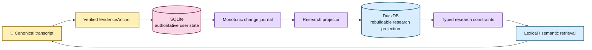

# Durable research state architecture

EchoFlow keeps **user-authored research knowledge durable** while still making that
knowledge fast enough to use as part of corpus search.

The design deliberately uses two stores with different authority:

- **SQLite is authoritative user state.** Notes, tags, collections, and their evidence
  anchors live there because they are unique work the user cannot reconstruct from the
  transcript.
- **DuckDB is a rebuildable research projection.** It carries only the relationships and
  lexical terms needed to query that user state efficiently alongside transcript search.

The databases do not share a transaction and do not attach to one another. EchoFlow
coordinates them through stable evidence identities and a deterministic projector.



## Why two stores?

One database could technically hold everything. That would make the custody boundary
worse.

Transcript lexical indexes, semantic vectors, and research query projections are caches
in the architectural sense: they may be deleted and rebuilt. Notes and other human-authored
knowledge are not caches.

Putting both classes of state behind one deletion/rebuild lifecycle would create an easy
failure mode where an index-maintenance operation can destroy unique user work.

The dual-store design makes the rule physical:

| Store | Authority | Contains | Rebuildable? |
|---|---|---|---|
| SQLite research state | authoritative | notes, evidence anchors, tags, collections, relationships, outbox sequence | **No** |
| DuckDB research projection | derived | evidence keys, note IDs, tag/collection IDs, lexical note terms, projection watermark | Yes |
| DuckDB lexical index | derived | transcript terms and segment metadata | Yes |
| DuckDB semantic index | derived | semantic chunks, segment map, numeric vectors | Yes |

## Evidence identity is the join contract

Research state never joins transcript evidence by a friendly segment ID alone.

The load-bearing projected evidence key is:

```text
(document_id, canonical_sha256, segment_id)
```

The full durable anchor also carries source identity and source-relative time coordinates.

Including the canonical SHA-256 prevents a stale annotation from silently attaching to a
new transcript generation that happens to reuse `segment-000042`.

A current transcript may therefore have a segment named `segment-000042` while an older
note anchored to an earlier canonical SHA remains intentionally unmatched.

That is not data loss. It is stale-generation isolation.

## Verified anchors

`EvidenceAnchor` is produced only after canonical evidence validation.

Before creating a durable note, the application verifies that:

1. the requested document is present in the current transcript library;
2. the canonical transcript bytes still hash to the indexed canonical SHA-256;
3. the requested segment IDs exist in canonical order;
4. a multi-segment selection is contiguous; and
5. any optional sub-segment start/end coordinates remain inside the selected canonical
   span.

The storage adapter therefore receives an already-qualified evidence address rather than
being asked to decide whether a transcript pointer is trustworthy.

The same anchor contract is intended for a future GUI. Text selection can produce an
`EvidenceAnchor`; it does not need a GUI-only identity scheme.

## SQLite authority and transaction boundary

The research-state adapter uses SQLite because the workload is mutable, relational, local,
and modest enough that an embedded transactional database is appropriate.

The authoritative write path uses:

- foreign keys;
- WAL mode;
- `synchronous=FULL`;
- `BEGIN IMMEDIATE` writer serialization; and
- one transaction for the user mutation **and** its change-journal record.

A note cannot commit successfully while its corresponding projection-change event is
missing.

The authoritative monotonic sequence is stored as durable SQLite metadata. It is not
inferred from the highest surviving outbox row, because outbox rows may later be compacted.

## Change journal and projector

Every user-state mutation advances a monotonic sequence and records the affected note in
the SQLite change journal.

The projector consumes that journal in bounded batches.

For each touched note, the DuckDB projection is replaced from current authoritative state.
That makes replay idempotent: processing the same change twice converges to the same
projection.

The DuckDB watermark advances in the **same DuckDB transaction** as the corresponding
projection rows.

The projector therefore has three normal recovery modes:

### Incremental catch-up

If the DuckDB watermark is behind and retained journal history bridges the gap, replay
bounded batches until an empty journal read and the authoritative sequence agree at the
same observation point.

A SQLite write immediately after that observation simply makes the projection stale again
for the next request. That is normal projection behavior, not corruption.

### Full rebuild

If the research projection is missing, damaged, or too far behind for retained journal
history to bridge the gap, rebuild it from a consistent authoritative SQLite snapshot.

No unique user data is reconstructed from DuckDB.

### Fail closed

If the DuckDB watermark claims to be **ahead** of authoritative SQLite state, EchoFlow
refuses to invent a reconciliation story. That state indicates corruption or an invalid
store pairing and requires explicit recovery.

## Projection shape

The DuckDB research projection is intentionally narrower than the SQLite schema.

It stores what fast filtering needs:

- note IDs;
- canonical evidence keys;
- tag IDs;
- collection IDs; and
- deterministic lexical note terms.

The full mutable note body remains authoritative in SQLite.

A projected notebook query therefore follows this pattern:

1. DuckDB finds matching note IDs quickly;
2. SQLite batch-loads the authoritative notes by those IDs; and
3. presentation renders only authoritative note content.

The SQLite batch path preserves caller order so a projected result list does not become
mysteriously reordered by a second database lookup.

## Research filters are pre-ranking constraints

Research metadata is not a post-processing decoration when it is used as a filter.

A query such as:

```text
transcript text = "housing affordability"
tag = methodology
collection = Chapter 3
```

first resolves the research constraints to a canonical evidence scope. Lexical BM25 or
semantic vector retrieval then ranks **inside that scope**.

EchoFlow does not retrieve the whole transcript corpus and filter results afterward in
Python.

The search contract distinguishes:

```text
evidence_scope = None
```

from:

```text
evidence_scope = ()
```

`None` means no research-state restriction. An empty tuple means the research restriction
matched no evidence and therefore the search must return no results.

This prevents an empty-filter result from accidentally widening into a corpus-wide search.

## Semantic segment mapping

Semantic chunks retain their existing JSON provenance, but the semantic DuckDB adapter
also maintains a derived relational `chunk_segments` mapping.

That relation lets EchoFlow:

- constrain semantic candidates by research evidence before vector scoring; and
- resolve lexical segment IDs back to semantic chunks for hybrid search without scanning
  every chunk's JSON metadata.

Existing semantic indexes can derive this relation locally from their own chunk metadata;
no embedding recomputation is required solely to gain the relational map.

## Workspace service boundary

`ResearchWorkspaceService` is the application-facing seam.

CLI and future GUI adapters should use that service rather than deciding which database to
query themselves.

The service composes:

- verified evidence anchors;
- authoritative SQLite research state;
- the deterministic projector;
- the DuckDB research projection; and
- transcript search/navigation services.

This keeps storage topology out of presentation code and preserves one definition of
research filtering across notebook queries and transcript search.

## Performance characteristics

The design is intended to remain boring at larger local-project sizes.

Important properties are:

- bounded projector batches instead of unbounded replay;
- idempotent note replacement instead of fragile differential patching;
- relational joins on stable IDs instead of Python corpus scans;
- research scope pushed before lexical ranking/vector scoring;
- batch authoritative note reads instead of one SQLite query per result; and
- independent rebuildability of every DuckDB projection.

The implementation does **not** currently claim a benchmarked upper bound such as
"millions of notes in N milliseconds." Representative-corpus qualification should measure
that before a performance SLA is documented.

## Concurrency boundary

SQLite serializes writers with `BEGIN IMMEDIATE`. The projector is designed for safe
idempotent replay and convergence.

EchoFlow is still primarily a single-user local application. If a future GUI and CLI are
allowed to mutate the same workspace concurrently at high frequency, add explicit
multi-process coordination where measurements show it is necessary rather than assuming
atomic file/database operations eliminate every lost-update scenario.

## Current deliberate limits

This tranche does not yet provide:

- saved-search objects;
- exportable/citable selected result sets;
- rich-text note editing;
- semantic embeddings over note prose;
- automatic cross-generation re-anchoring;
- collaborative/multi-user synchronization; or
- a GUI annotation surface.

Those features should build on this authority/projection split rather than introducing a
second research-state store.

## Invariants for future maintainers

The following are load-bearing:

1. **SQLite research state is authoritative and must never be treated as rebuildable
   cache.**
2. **DuckDB research state is a disposable projection and must be reconstructable from
   SQLite.**
3. **A user mutation and its outbox event commit together.**
4. **The DuckDB watermark advances atomically with projected rows.**
5. **Projection replay is idempotent.**
6. **Research joins include canonical generation identity, not segment ID alone.**
7. **Empty research scope means no matches, not unrestricted search.**
8. **Research constraints are applied before ranking/scoring when they are filters.**
9. **Presentation reads authoritative note content from SQLite.**
10. **Deleting any DuckDB file must never delete unique user-authored knowledge.**

If a refactor makes one of those statements false, it is not merely an implementation
change. It changes EchoFlow's custody model.
