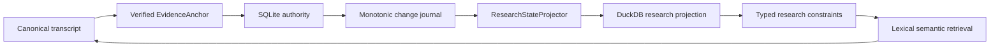

# Durable research state architecture

EchoFlow keeps **user-authored research knowledge durable** while still making that
knowledge fast enough to use as part of corpus search.

The design deliberately uses two stores with different authority:

- **SQLite is authoritative user state.** Notes, tags, collections, and their evidence
  anchors live there because they are unique work the user cannot reconstruct from the
  transcript.
- **DuckDB is a rebuildable research projection.** It carries only the relationships and
  lexical terms needed to query that user state efficiently alongside transcript search.

The databases do not share a transaction and do not attach to one another. EchoFlow
coordinates them through stable evidence identities and a deterministic projector.



Text fallback: canonical evidence creates a verified anchor; user research commits to
SQLite with a monotonic journal; a deterministic projector builds disposable DuckDB query
state; research constraints are then pushed into transcript retrieval.

## Why two stores?

One database could technically hold everything. That would make the custody boundary
worse.

Transcript indexes, semantic vectors, and research query projections are caches in the
architectural sense: they may be deleted and rebuilt. Notes and other human-authored
knowledge are not caches.

| Store | Authority | Contains | Rebuildable? |
|---|---|---|---|
| SQLite research state | authoritative | notes, evidence anchors, tags, collections, relationships, outbox sequence | **No** |
| DuckDB research projection | derived | evidence keys, note IDs, tag/collection IDs, lexical note terms, projection watermark | Yes |
| DuckDB lexical index | derived | transcript terms and segment metadata | Yes |
| DuckDB semantic index | derived | semantic chunks, segment map, numeric vectors | Yes |

## Why SQLite for durable state and DuckDB for projection?

This is a workload and custody decision, not a claim that one database is universally
better.

SQLite fits the authoritative research workspace because the workload is transactional
and mutation-heavy. A user repeatedly creates, edits, deletes, renames, and relates small
durable records. EchoFlow needs those writes to commit atomically with constraints,
foreign keys, and crash-safe local durability.

DuckDB fits the query side because EchoFlow also performs analytical work: scanning many
segments, joining projected relationships, filtering local corpora, computing lexical
statistics, restricting semantic candidates, and ranking results.

| Need | Better fit here | Reason |
|---|---|---|
| Small frequent user-authored writes | SQLite | transactional embedded application state |
| Relational integrity for precious records | SQLite | constraints and straightforward durable mutation |
| Corpus scans and analytical joins | DuckDB | columnar analytical execution |
| Search/ranking projections | DuckDB | large local query workloads |
| State that must survive index deletion | SQLite | authoritative user custody |
| State that may be rebuilt for speed | DuckDB | disposable projection semantics |

### Why not DuckDB for both?

DuckDB could technically store notes, tags, and collections. The issue is not that it
would instantly lose them. The issue is that EchoFlow would then choose an analytical
database as the system of record for frequently mutated, irreplaceable user state while
also treating DuckDB files as rebuildable machinery.

That blurs the deletion boundary and makes future repair operations more dangerous.

### Why not SQLite for both?

SQLite could technically hold transcript search state, but EchoFlow's retrieval path is
increasingly an analytical corpus workload. DuckDB is the better home for large scans,
joins, ranking support, vector candidate filtering, and other rebuildable structures.

### Why not make both authoritative?

Two authoritative stores would create a dual-master problem. A mutation could succeed in
one database and fail in the other, leaving EchoFlow to decide which copy is true.

EchoFlow avoids that class of conflict entirely:

```text
SQLite authority
      |
      | monotonic change journal
      v
Deterministic projector
      |
      v
DuckDB projection
```

All user-authored mutations commit to SQLite. DuckDB receives only a derived,
reconstructable representation. If the stores disagree, SQLite wins.

## Evidence identity is the join contract

Research state never joins transcript evidence by a friendly segment ID alone.

The load-bearing projected evidence key is:

```text
(document_id, canonical_sha256, segment_id)
```

The full durable anchor also carries source identity and source-relative time coordinates.
Including canonical SHA-256 prevents a stale annotation from silently attaching to a new
transcript generation that reuses `segment-000042`.

That is stale-generation isolation, not data loss.

## Verified anchors

`EvidenceAnchor` is produced only after canonical evidence validation.

Before creating a durable note, the application verifies that:

1. the requested document is present in the current transcript library;
2. canonical transcript bytes still hash to the indexed canonical SHA-256;
3. requested segment IDs exist in canonical order;
4. a multi-segment selection is contiguous; and
5. optional sub-segment start/end coordinates remain inside the selected canonical span.

The storage adapter receives an already-qualified evidence address rather than being asked
to decide whether a transcript pointer is trustworthy.

The planned GUI should reuse this exact anchor contract for transcript selection.

## SQLite authority and transaction boundary

The authoritative write path uses:

- foreign keys;
- WAL mode;
- `synchronous=FULL`;
- `BEGIN IMMEDIATE` writer serialization; and
- one transaction for the user mutation **and** its change-journal record.

A note cannot commit successfully while its corresponding projection-change event is
missing.

The authoritative monotonic sequence is stored as durable SQLite metadata. It is not
inferred from the highest surviving outbox row because journal rows may later be
compacted.

## Change journal and projector

Every user-state mutation advances a monotonic sequence and records the affected note in
the SQLite journal.

The projector consumes changes in bounded batches. For each touched note, the DuckDB
projection is replaced from current authoritative state. Replay is therefore idempotent:
processing the same change twice converges to the same projection.

The DuckDB watermark advances in the **same DuckDB transaction** as corresponding
projection rows.

That means DuckDB cannot truthfully say “projected through 128” if rows for 128 did not
commit.

### Incremental catch-up

If DuckDB is behind and retained journal history bridges the gap, replay bounded batches
until an empty journal read and authoritative sequence agree at the same observation
point.

A SQLite write immediately after that observation simply makes the projection stale again
for the next request. That is normal projection behavior.

### Full rebuild

If the projection is missing, damaged, or too far behind for retained journal history to
bridge the gap, rebuild it from a consistent authoritative SQLite snapshot.

No unique user data is reconstructed from DuckDB.

### Fail closed

If the DuckDB watermark claims to be **ahead** of authoritative SQLite state, EchoFlow
refuses to invent a reconciliation story. That indicates corruption or an invalid store
pairing and requires explicit recovery.

## Projection shape

The DuckDB research projection is intentionally narrower than SQLite.

It stores what fast filtering needs:

- note IDs;
- canonical evidence keys;
- tag IDs;
- collection IDs; and
- deterministic lexical note terms.

The mutable note body remains authoritative in SQLite.

A projected notebook query follows this pattern:

1. DuckDB finds matching note IDs quickly;
2. SQLite batch-loads authoritative notes by those IDs; and
3. presentation renders only authoritative note content.

The batch path preserves caller order so projected results do not become mysteriously
reordered by a second database lookup.

## Research filters are pre-ranking constraints

Research metadata is not merely decoration when used as a filter.

A query such as:

```text
transcript text = "housing affordability"
tag = methodology
collection = Chapter 3
```

first resolves research constraints to a canonical evidence scope. Lexical BM25 or
semantic retrieval then ranks **inside that scope**.

The search contract distinguishes:

```text
evidence_scope = None
```

from:

```text
evidence_scope = ()
```

`None` means no research restriction. An empty tuple means the restriction matched no
evidence, so search returns nothing. This prevents an empty research filter from
accidentally widening into a corpus-wide query.

## Semantic segment mapping

Semantic chunks keep JSON provenance, but the semantic DuckDB adapter also maintains a
derived relational `chunk_segments` mapping.

That relation lets EchoFlow:

- constrain semantic candidates by research evidence before vector scoring; and
- resolve lexical segment IDs back to semantic chunks for hybrid search without scanning
  every chunk's JSON metadata.

Existing semantic indexes can derive this relation locally from chunk metadata; no
embedding recomputation is required solely for the relational map.

## Workspace service boundary

`ResearchWorkspaceService` is the application-facing seam.

CLI and future GUI adapters should use that service rather than deciding which database to
query themselves.

The service composes:

- verified evidence anchors;
- authoritative SQLite research state;
- deterministic projection convergence;
- DuckDB research filtering/summaries; and
- transcript search/navigation.

Storage topology should remain invisible to presentation code.

## Performance characteristics

The design is intended to remain boring at larger local-project sizes:

- bounded projector batches instead of unbounded replay;
- idempotent note replacement instead of fragile differential patching;
- relational joins on stable IDs instead of Python corpus scans;
- research scope pushed before lexical ranking/vector scoring;
- batch authoritative note reads instead of one SQLite query per result; and
- independent rebuildability of every DuckDB projection.

The implementation does **not** yet claim a benchmarked upper bound such as “millions of
notes in N milliseconds.” Representative-corpus qualification should measure that before
a performance SLA is documented.

## Concurrency boundary

SQLite serializes writers with `BEGIN IMMEDIATE`. The projector is designed for safe
idempotent replay and convergence.

EchoFlow is still primarily a single-user local application. If a future GUI and CLI are
allowed to mutate the same workspace concurrently at high frequency, add explicit
multi-process coordination where measurements show it is necessary rather than assuming
atomic database operations eliminate every lost-update scenario.

## What comes next

This storage architecture is now foundation. The next user-facing work should **reuse it**:

- unified library discovery across transcript evidence and research state;
- saved searches in authoritative SQLite state;
- frequent/recent tag rankings as derived convenience views;
- selected/citable result sets;
- portable research export;
- explicit stale-anchor review/re-anchor UX; and
- a thin graphical annotation/playback shell.

The current system still does not provide rich-text note editing, semantic embeddings over
note prose, automatic cross-generation re-anchoring, collaborative synchronization, or a
GUI.

## Invariants for future maintainers

The following are load-bearing:

1. **SQLite research state is authoritative and must never be treated as rebuildable
   cache.**
2. **DuckDB research state is a disposable projection and must be reconstructable from
   SQLite.**
3. **A user mutation and its journal event commit together.**
4. **The DuckDB watermark advances atomically with projected rows.**
5. **Projection replay is idempotent.**
6. **Research joins include canonical generation identity, not segment ID alone.**
7. **Empty research scope means no matches, not unrestricted search.**
8. **Research constraints are applied before ranking/scoring when they are filters.**
9. **Presentation reads authoritative note content from SQLite.**
10. **Deleting any DuckDB file must never delete unique user-authored knowledge.**

If a refactor makes one of those statements false, it changes EchoFlow's custody model.
