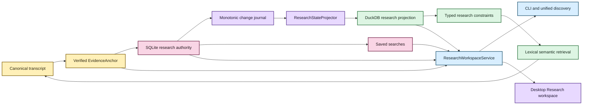

# Durable research state architecture

Status: authoritative notes/tags/collections, saved searches, projection sync/rebuild,
research-aware retrieval, unified discovery, desktop note CRUD/labels, exact-generation
note → evidence return, and saved-search create/run/rename/delete are implemented. Advanced
Research filtering/navigation and explicit stale-anchor review/re-anchor remain work.  
Last updated: August 19, 2026

EchoFlow keeps **user-authored research knowledge durable** while still making that
knowledge fast enough to use as part of corpus search.

The design deliberately uses two stores with different authority:

- **SQLite is authoritative user state.** Notes, tags, collections, evidence anchors, and
  saved-search intent live there because they are unique work the user cannot reconstruct
  from the transcript.
- **DuckDB is a rebuildable research projection.** It carries only relationships and
  lexical terms needed to query that user state efficiently alongside transcript search.

The databases do not share a transaction and do not attach to one another. EchoFlow
coordinates them through stable evidence identities and a deterministic projector.



Text fallback: canonical evidence creates a verified anchor; user research commits to
SQLite with a monotonic journal; a deterministic projector builds disposable DuckDB query
state; saved searches remain SQLite-authored intent; CLI, unified discovery, and the
desktop Research workspace consume the same application service boundary.

## Why two stores?

One database could technically hold everything. That would make the custody boundary
worse.

| Store | Authority | Contains | Rebuildable? |
|---|---|---|---|
| SQLite research state | authoritative | notes, evidence anchors, tags, collections, saved searches, relationships, outbox sequence | **No** |
| DuckDB research projection | derived | evidence keys, note IDs, tag/collection IDs, lexical note terms, projection watermark | Yes |
| DuckDB lexical index | derived | transcript terms and segment metadata | Yes |
| DuckDB semantic index | derived | semantic chunks, segment map, numeric vectors | Yes |

SQLite fits the authoritative research workspace because the workload is transactional and
mutation-heavy. DuckDB fits analytical work such as scanning many segments, joining
relationships, restricting semantic candidates, and ranking results.

Making both authoritative would create a dual-master problem. EchoFlow avoids that class of
conflict:

```text
SQLite authority
      |
      | monotonic change journal
      v
Deterministic projector
      |
      v
DuckDB projection
```

If the stores disagree, SQLite wins.

## Evidence identity is the join contract

Research state never joins transcript evidence by a friendly segment ID alone.

The load-bearing projected evidence key is:

```text
(document_id, canonical_sha256, segment_id)
```

The full durable anchor also carries source identity, canonical path custody, optional
source path custody, and source-relative time coordinates. Including canonical SHA-256
prevents a stale annotation from silently attaching to a new transcript generation that
reuses `segment-000042`.

## Verified anchors, creation, and exact-generation return

`EvidenceAnchor` is produced only after canonical evidence validation. Before creating
durable research anchored to a transcript, the application verifies that the document is
present, canonical bytes still match the indexed SHA-256, requested segments exist in
canonical order, multi-segment selections are contiguous, and optional sub-segment
coordinates stay inside the verified span.

The desktop Evidence reader uses that same canonical segment/word/time system. Its narrow
create-note bridge carries the expected canonical SHA-256 and refuses the write if the
library has moved to a newer generation before Save. React never invents an annotation
identity or receives a raw canonical/source path.

Existing anchors can now be reopened through `EvidenceLocator.locate_anchor()` and
`ResearchWorkspaceService.open_note_evidence()`. That read path verifies the **stored**
canonical bytes and source/document identities, validates stored segments and timing,
expands canonical context, and resolves speaker display labels against the stored
canonical generation.

The current transcript index is not used to substitute a newer generation. An older anchor
either opens against its exact valid stored evidence or fails closed. This is a read path,
not a migration path.

## Mutation, concurrency, and the journal

The authoritative note write path uses foreign keys, WAL mode, `synchronous=FULL`,
`BEGIN IMMEDIATE` writer serialization, and one transaction for the user mutation **and**
its change-journal record.

Desktop note editing replaces body, tag relationships, and collection relationships in one
SQLite transaction and advances the journal once. The `EvidenceAnchor` columns and segment
relationships are not part of that update.

Desktop note edit/delete carries the `updated_at` value it read. The store checks that
version after `BEGIN IMMEDIATE` has acquired the writer boundary. A mismatch fails closed,
so a CLI edit or another local surface cannot be silently overwritten by stale React state.
CLI commands that intentionally operate directly remain compatible and do not require a UI
version token.

Saved-search rename/delete now uses the same local concurrency principle. The workspace
metadata store checks optional `expected_updated_at` after its `BEGIN IMMEDIATE` boundary.
Desktop callers always provide that version. Existing CLI/application callers may omit it
where they deliberately operate as the immediate local authority.

Every projected note mutation advances a monotonic sequence. The projector consumes changes
in bounded batches and replaces touched notes from current authoritative state. Replay is
idempotent. The DuckDB watermark advances in the **same DuckDB transaction** as projected
rows.

Saved searches are authoritative SQLite state but are not part of the note relationship
projection, so their metadata mutation does not fabricate a research-journal event that no
projector consumes.

If retained journal history bridges a stale projection, replay it. If the projection is
missing, damaged, or too far behind, rebuild from a consistent SQLite snapshot. If DuckDB
claims to be ahead of SQLite authority, fail closed.

No unique user data is reconstructed from DuckDB.

## Research filters are pre-ranking constraints

Research metadata is not merely decoration when used as a filter. A query such as:

```text
transcript text = "housing affordability"
tag = methodology
collection = Chapter 3
```

first resolves research constraints to a canonical evidence scope. Lexical BM25 or
semantic retrieval then ranks **inside that scope**.

`evidence_scope = None` means unrestricted by research state. `evidence_scope = ()` means
the research restriction matched no evidence and search must return nothing.

## Saved searches are authored intent

Saved searches live in authoritative SQLite because a named reusable question is
human-authored workspace state. They persist typed search/research/retrieval intent, not a
derived evidence scope or snapshot of current results. Running one later re-resolves the
current corpus and research relationships.

Desktop creation sends name/query/optional description through a narrow bridge method.
Python constructs the typed `SearchQuery` and owns desktop defaults. Rename changes display
metadata while preserving the typed `SavedSearchIntent` server-side. Run re-enters the same
`ResearchWorkspaceService.search()` path used by current research-aware retrieval.

Frequent/recent tag or collection navigation is different. Those rankings are derived
convenience views and remain disposable.

## Workspace, desktop, and logging boundaries

`ResearchWorkspaceService` composes verified anchors, authoritative SQLite research state,
deterministic projection convergence, DuckDB research filtering/summaries, transcript
retrieval, grouped discovery, exact-generation research return, and saved-search behavior.

The CLI and desktop bridge delegate to this service. Desktop methods are narrow DTO
operations: overview, verified note creation, atomic note replacement, guarded note
deletion, exact note-evidence opening, and saved-search create/update/delete/run. React does
not issue SQL, open SQLite/DuckDB, choose canonical generations, or receive canonical/source
filesystem paths.

Research application operations emit structured events through the existing `ILogger`
boundary. Operational logs carry stable event names plus IDs, canonical SHA where evidence
identity matters, retrieval mode, counts, current/older state, and exception type on
failure. They deliberately omit note bodies, query text, saved-search names/descriptions,
and raw filesystem paths. Logging must not become a shadow research archive.

Older-generation anchors remain visible as older evidence. Editing their human-authored
prose or labels is permitted because the evidence anchor does not move. Automatic
re-anchoring is not permitted merely because a newer transcript reuses the same friendly
segment ID.

## Current deliberate limits

Research state currently does not provide:

- dedicated desktop tag/collection navigation and filter management yet;
- advanced typed desktop search controls for phrase/ANY/ALL, speaker, language, transcript,
  research filters, retrieval mode, and sort yet;
- explicit stale/unavailable-anchor review/re-anchor UX yet;
- rich-text/WYSIWYG note bodies;
- semantic embeddings over note prose;
- automatic cross-generation re-anchoring;
- collaborative synchronization; or
- selected/citable result-set objects yet.

## Invariants for maintainers

1. **SQLite research state is authoritative and must never be treated as rebuildable cache.**
2. **DuckDB research state is a disposable projection and must be reconstructable from SQLite.**
3. **A projected user mutation and its journal event commit together.**
4. **Desktop stale writes must fail rather than silently overwrite newer user state.**
5. **Editing note prose/labels must not rebind its evidence anchor.**
6. **Opening a research anchor must verify its stored generation or fail closed; it must not substitute current evidence.**
7. **The DuckDB watermark advances atomically with projected rows.**
8. **Projection replay is idempotent.**
9. **Research joins include canonical generation identity, not segment ID alone.**
10. **Empty research scope means no matches, not unrestricted search.**
11. **Research constraints are applied before ranking/scoring when they are filters.**
12. **Presentation hydrates authoritative note content from SQLite.**
13. **Saved searches persist typed intent, not derived result scope.**
14. **Saved-search rename must preserve typed intent unless an explicit intent-edit operation exists.**
15. **Desktop presentation receives narrow DTOs, not raw database/filesystem authority.**
16. **Operational logging must not copy human research prose or query content into a second archive.**
17. **Deleting any DuckDB file must never delete unique user-authored knowledge.**

If a refactor makes one of those statements false, it changes EchoFlow's custody model.