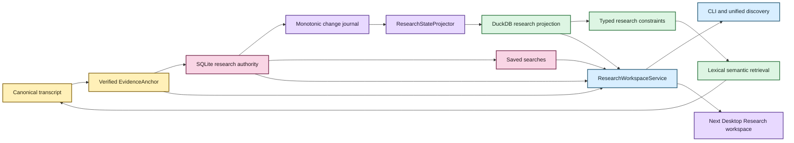

# Durable research state architecture

Status: authoritative notes/tags/collections, saved searches, projection sync/rebuild,
research-aware retrieval, and unified discovery are implemented. A dedicated desktop
Research workspace is the next UI tranche.  
Last updated: August 19, 2026

EchoFlow keeps **user-authored research knowledge durable** while still making that
knowledge fast enough to use as part of corpus search.

The design deliberately uses two stores with different authority:

- **SQLite is authoritative user state.** Notes, tags, collections, evidence anchors, and
  saved-search intent live there because they are unique work the user cannot reconstruct
  from the transcript.
- **DuckDB is a rebuildable research projection.** It carries only relationships and
  lexical terms needed to query that user state efficiently alongside transcript search.

The databases do not share a transaction and do not attach to one another. EchoFlow
coordinates them through stable evidence identities and a deterministic projector.



Text fallback: canonical evidence creates a verified anchor; user research commits to
SQLite with a monotonic journal; a deterministic projector builds disposable DuckDB query
state; saved searches remain SQLite-authored intent; CLI/unified discovery already consume
the workspace service, and the dedicated desktop Research workspace is next.

## Why two stores?

One database could technically hold everything. That would make the custody boundary
worse.

| Store | Authority | Contains | Rebuildable? |
|---|---|---|---|
| SQLite research state | authoritative | notes, evidence anchors, tags, collections, saved searches, relationships, outbox sequence | **No** |
| DuckDB research projection | derived | evidence keys, note IDs, tag/collection IDs, lexical note terms, projection watermark | Yes |
| DuckDB lexical index | derived | transcript terms and segment metadata | Yes |
| DuckDB semantic index | derived | semantic chunks, segment map, numeric vectors | Yes |

SQLite fits the authoritative research workspace because the workload is transactional and
mutation-heavy. DuckDB fits analytical work such as scanning many segments, joining
relationships, restricting semantic candidates, and ranking results.

Making both authoritative would create a dual-master problem. EchoFlow avoids that class of
conflict:

```text
SQLite authority
      |
      | monotonic change journal
      v
Deterministic projector
      |
      v
DuckDB projection
```

If the stores disagree, SQLite wins.

## Evidence identity is the join contract

Research state never joins transcript evidence by a friendly segment ID alone.

The load-bearing projected evidence key is:

```text
(document_id, canonical_sha256, segment_id)
```

The full durable anchor also carries source identity and source-relative time coordinates.
Including canonical SHA-256 prevents a stale annotation from silently attaching to a new
transcript generation that reuses `segment-000042`.

## Verified anchors

`EvidenceAnchor` is produced only after canonical evidence validation. Before creating
durable research anchored to a transcript, the application verifies that the document is
present, canonical bytes still match the indexed SHA-256, requested segments exist in
canonical order, multi-segment selections are contiguous, and optional sub-segment
coordinates stay inside the verified span.

The current desktop Evidence reader already exposes the same canonical segment/word/time
coordinate system. The next Research UI should create notes from those verified coordinates
rather than inventing a UI-only annotation identity.

## SQLite transaction boundary and projection

The authoritative write path uses foreign keys, WAL mode, `synchronous=FULL`,
`BEGIN IMMEDIATE` writer serialization, and one transaction for the user mutation **and**
its change-journal record.

Every projected mutation advances a monotonic sequence. The projector consumes changes in
bounded batches and replaces touched notes from current authoritative state. Replay is
idempotent. The DuckDB watermark advances in the **same DuckDB transaction** as projected
rows.

If retained journal history bridges a stale projection, replay it. If the projection is
missing, damaged, or too far behind, rebuild from a consistent SQLite snapshot. If DuckDB
claims to be ahead of SQLite authority, fail closed.

No unique user data is reconstructed from DuckDB.

## Research filters are pre-ranking constraints

Research metadata is not merely decoration when used as a filter. A query such as:

```text
transcript text = "housing affordability"
tag = methodology
collection = Chapter 3
```

first resolves research constraints to a canonical evidence scope. Lexical BM25 or
semantic retrieval then ranks **inside that scope**.

`evidence_scope = None` means unrestricted by research state. `evidence_scope = ()` means
the research restriction matched no evidence and search must return nothing.

## Saved searches are authored intent

Saved searches live in authoritative SQLite because a named reusable question is
human-authored workspace state. They persist typed search/research/retrieval intent, not a
derived evidence scope or snapshot of current results. Running one later re-resolves the
current corpus and research relationships.

Frequent/recent tag or collection navigation is different. Those rankings are derived
convenience views and remain disposable.

## Workspace service boundary

`ResearchWorkspaceService` is the application-facing seam. It composes verified anchors,
authoritative SQLite research state, deterministic projection convergence, DuckDB research
filtering/summaries, transcript retrieval, grouped discovery, and saved-search/navigation
behavior.

The CLI uses this service today. The current desktop bridge uses it indirectly for grouped
Library discovery and evidence presentation. The next desktop tranche should add narrow
versioned Research operations that delegate back to the same service.

React must not issue SQL or open SQLite/DuckDB directly. Older-generation anchors must
remain visible as older evidence. Automatic re-anchoring is not permitted merely because a
newer transcript reuses the same friendly segment ID.

## Current deliberate limits

Research state currently does not provide:

- a dedicated desktop Research workspace yet;
- rich-text/WYSIWYG note bodies;
- semantic embeddings over note prose;
- automatic cross-generation re-anchoring;
- collaborative synchronization; or
- selected/citable result-set objects yet.

## Invariants for maintainers

1. **SQLite research state is authoritative and must never be treated as rebuildable cache.**
2. **DuckDB research state is a disposable projection and must be reconstructable from SQLite.**
3. **A user mutation and its journal event commit together.**
4. **The DuckDB watermark advances atomically with projected rows.**
5. **Projection replay is idempotent.**
6. **Research joins include canonical generation identity, not segment ID alone.**
7. **Empty research scope means no matches, not unrestricted search.**
8. **Research constraints are applied before ranking/scoring when they are filters.**
9. **Presentation hydrates authoritative note content from SQLite.**
10. **Saved searches persist typed intent, not derived result scope.**
11. **Desktop presentation receives narrow DTOs, not raw database/filesystem authority.**
12. **Deleting any DuckDB file must never delete unique user-authored knowledge.**

If a refactor makes one of those statements false, it changes EchoFlow's custody model.
