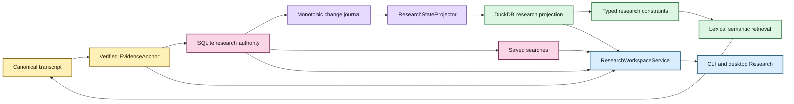

# Durable research state architecture

Status: authoritative notes/tags/collections, saved searches, projection sync/rebuild,
research-aware retrieval, unified discovery, and browse-first desktop Research view are
implemented.  
Last updated: August 19, 2026

EchoFlow keeps **user-authored research knowledge durable** while still making that
knowledge fast enough to use as part of corpus search.

The design deliberately uses two stores with different authority:

- **SQLite is authoritative user state.** Notes, tags, collections, evidence anchors, and
  saved-search intent live there because they are unique work the user cannot reconstruct
  from the transcript.
- **DuckDB is a rebuildable research projection.** It carries only relationships and
  lexical terms needed to query that user state efficiently alongside transcript search.

The databases do not share a transaction and do not attach to one another. EchoFlow
coordinates them through stable evidence identities and a deterministic projector.



Text fallback: canonical evidence creates a verified anchor; user research commits to
SQLite with a monotonic journal; a deterministic projector builds disposable DuckDB query
state; saved searches remain SQLite-authored intent; CLI and desktop presentation compose
through the same workspace service.

## Why two stores?

One database could technically hold everything. That would make the custody boundary
worse.

Transcript indexes, semantic vectors, and research query projections are caches in the
architectural sense: they may be deleted and rebuilt. Notes and other human-authored
knowledge are not caches.

| Store | Authority | Contains | Rebuildable? |
|---|---|---|---|
| SQLite research state | authoritative | notes, evidence anchors, tags, collections, saved searches, relationships, outbox sequence | **No** |
| DuckDB research projection | derived | evidence keys, note IDs, tag/collection IDs, lexical note terms, projection watermark | Yes |
| DuckDB lexical index | derived | transcript terms and segment metadata | Yes |
| DuckDB semantic index | derived | semantic chunks, segment map, numeric vectors | Yes |

## Why SQLite for durable state and DuckDB for projection?

This is a workload and custody decision, not a claim that one database is universally
better.

SQLite fits the authoritative research workspace because the workload is transactional
and mutation-heavy. A user repeatedly creates, edits, deletes, renames, and relates small
durable records. EchoFlow needs those writes to commit atomically with constraints,
foreign keys, and crash-safe local durability.

DuckDB fits the query side because EchoFlow performs analytical work: scanning many
segments, joining projected relationships, filtering local corpora, computing lexical
statistics, restricting semantic candidates, and ranking results.

Making both authoritative would create a dual-master problem. EchoFlow avoids that class
of conflict entirely:

```text
SQLite authority
      |
      | monotonic change journal
      v
Deterministic projector
      |
      v
DuckDB projection
```

All user-authored mutations commit to SQLite. DuckDB receives only a derived,
reconstructable representation. If the stores disagree, SQLite wins.

## Evidence identity is the join contract

Research state never joins transcript evidence by a friendly segment ID alone.

The load-bearing projected evidence key is:

```text
(document_id, canonical_sha256, segment_id)
```

The full durable anchor also carries source identity and source-relative time coordinates.
Including canonical SHA-256 prevents a stale annotation from silently attaching to a new
transcript generation that reuses `segment-000042`.

That is stale-generation isolation, not data loss.

## Verified anchors

`EvidenceAnchor` is produced only after canonical evidence validation.

Before creating durable research anchored to a transcript, the application verifies that:

1. the requested document is present in the current transcript library;
2. canonical transcript bytes still hash to the indexed canonical SHA-256;
3. requested segment IDs exist in canonical order;
4. a multi-segment selection is contiguous; and
5. optional sub-segment coordinates remain inside the selected canonical span.

The storage adapter receives an already-qualified evidence address rather than being asked
to decide whether a transcript pointer is trustworthy.

The current desktop Evidence reader already exposes the same canonical segment/word/time
coordinate system. The next research-editing slice should create notes from those verified
coordinates, not invent a UI-only annotation identity.

## SQLite authority and transaction boundary

The authoritative write path uses foreign keys, WAL mode, `synchronous=FULL`,
`BEGIN IMMEDIATE` writer serialization, and one transaction for the user mutation **and**
its change-journal record.

A note cannot commit successfully while its corresponding projection-change event is
missing.

The authoritative monotonic sequence is stored as durable SQLite metadata. It is not
inferred from the highest surviving journal row because rows may later be compacted.

## Change journal and projector

Every projected research mutation advances a monotonic sequence and records the affected
note. The projector consumes changes in bounded batches. For each touched note, the DuckDB
projection is replaced from current authoritative state. Replay is idempotent: processing
the same change twice converges to the same projection.

The DuckDB watermark advances in the **same DuckDB transaction** as corresponding
projection rows. DuckDB cannot truthfully say “projected through 128” if rows for 128 did
not commit.

If retained journal history bridges a stale projection, replay bounded batches. If the
projection is missing, damaged, or too far behind, rebuild it from a consistent SQLite
snapshot. If DuckDB claims to be ahead of SQLite authority, fail closed.

No unique user data is reconstructed from DuckDB.

## Projection shape

The DuckDB research projection is intentionally narrower than SQLite. It stores what fast
filtering needs:

- note IDs;
- canonical evidence keys;
- tag IDs;
- collection IDs; and
- deterministic lexical note terms.

The mutable note body remains authoritative in SQLite. A projected notebook query finds
matching IDs in DuckDB and hydrates authoritative content from SQLite in caller order.

## Research filters are pre-ranking constraints

Research metadata is not merely decoration when used as a filter.

A query such as:

```text
transcript text = "housing affordability"
tag = methodology
collection = Chapter 3
```

first resolves research constraints to a canonical evidence scope. Lexical BM25 or
semantic retrieval then ranks **inside that scope**.

The search contract distinguishes `evidence_scope = None` from `evidence_scope = ()`.
`None` means unrestricted by research state. An empty tuple means the restriction matched
no evidence, so search returns nothing.

## Saved searches are authored intent

Saved searches are implemented in authoritative SQLite because a named reusable question
is human-authored workspace state.

A saved search persists typed `SearchQuery`/research-filter/retrieval intent. It does not
persist a derived evidence scope or a snapshot of current results. Running it later
re-resolves the current corpus and current research relationships.

Frequent/recent tag or collection navigation is different. Those rankings are derived
convenience views and should remain disposable.

## Workspace service boundary

`ResearchWorkspaceService` is the application-facing seam. It composes:

- verified evidence anchors and navigation;
- authoritative SQLite research state;
- deterministic projection convergence;
- DuckDB research filtering/summaries;
- transcript retrieval;
- grouped discovery; and
- saved searches/navigation.

The CLI and desktop bridge both use this service rather than deciding which database to
query themselves.

The current desktop bridge exposes a browse-first `workspace.research.overview` method.
It serializes notes, tags, collections, and saved searches while deliberately omitting raw
canonical/source filesystem paths from React presentation DTOs.

## Desktop research mutation boundary

The current desktop Research screen is read/browse only. The next interaction tranche
should add narrow versioned methods for:

- create/update/delete note;
- set note tags and collections;
- create/run/rename/delete saved search; and
- navigate an eligible research object back to verified current evidence.

Those methods should delegate to `ResearchWorkspaceService`. React must not issue SQL or
open SQLite/DuckDB directly.

Older-generation anchors must remain visible as older evidence. Automatic re-anchoring is
not permitted merely because a newer transcript reuses the same friendly segment ID.

## Performance and concurrency boundaries

The design uses bounded projector batches, idempotent replacement, relational joins on
stable IDs, pre-ranking research scopes, batch authoritative hydration, and independently
rebuildable DuckDB projections.

The implementation does **not** claim a benchmarked upper bound such as “millions of notes
in N milliseconds.” Representative-corpus qualification should measure that before a
performance SLA is documented.

SQLite serializes writers with `BEGIN IMMEDIATE`. If concurrent CLI/desktop mutation later
becomes frequent enough to expose lost-update UX, add explicit multi-process coordination
where evidence shows it is required.

## Current deliberate limits

Research state currently does not provide:

- rich-text/WYSIWYG note bodies;
- semantic embeddings over note prose;
- automatic cross-generation re-anchoring;
- collaborative synchronization;
- desktop research mutations yet; or
- selected/citable result-set objects yet.

## Invariants for maintainers

1. **SQLite research state is authoritative and must never be treated as rebuildable
   cache.**
2. **DuckDB research state is a disposable projection and must be reconstructable from
   SQLite.**
3. **A user mutation and its journal event commit together.**
4. **The DuckDB watermark advances atomically with projected rows.**
5. **Projection replay is idempotent.**
6. **Research joins include canonical generation identity, not segment ID alone.**
7. **Empty research scope means no matches, not unrestricted search.**
8. **Research constraints are applied before ranking/scoring when they are filters.**
9. **Presentation hydrates authoritative note content from SQLite.**
10. **Saved searches persist typed intent, not derived result scope.**
11. **Desktop presentation receives narrow DTOs, not raw database/filesystem authority.**
12. **Deleting any DuckDB file must never delete unique user-authored knowledge.**

If a refactor makes one of those statements false, it changes EchoFlow's custody model.
