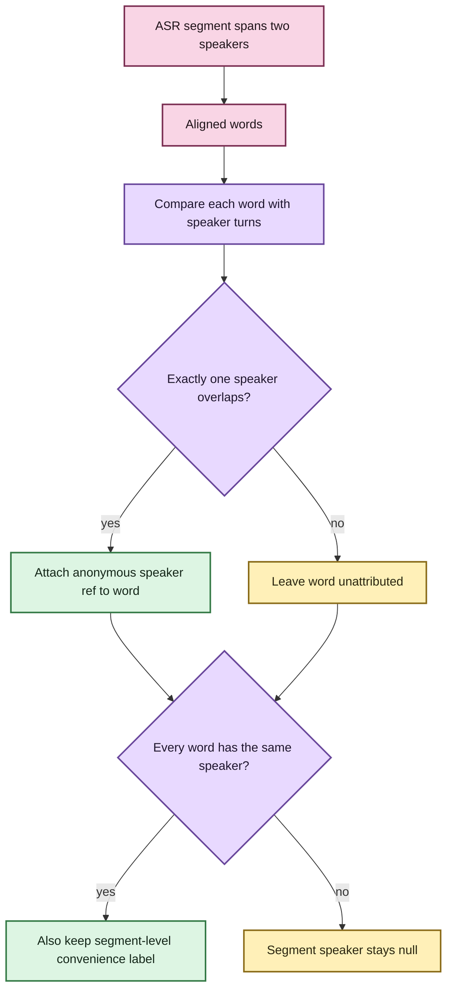

# Word-level timestamp alignment 🕰️

A transcript that says *what* somebody said is useful. A transcript that can also point
to **when each word occurred** is much more useful for speaker handoffs, search
highlighting, jump-to-audio, precise annotations, and later editing interfaces.

EchoFlow now preserves word timing evidence already produced by faster-whisper. It does
not invent timestamps from character positions, and it does not run a separate forced
alignment model in this tranche.

> **The rule:** preserve the engine's word evidence, put it on the same source-relative
> timeline as the canonical transcript, and stay conservative when that evidence is
> ambiguous.

🦝 The scholarly raccoon would like the record to show that “more precise coordinates”
does not mean “permission to become more confident than the evidence.”

## What changes for a user?

Usually, nothing about the command.

Word timing is part of the current faster-whisper transcription contract. A normal local
transcription can now produce canonical segment evidence shaped conceptually like:

```text
segment  12.40s ─ 15.10s   "we moved the meeting to Friday"

word     12.40s ─ 12.70s   " we"
word     12.70s ─ 13.20s   " moved"
word     13.20s ─ 13.55s   " the"
word     13.55s ─ 14.20s   " meeting"
word     14.20s ─ 14.45s   " to"
word     14.45s ─ 15.10s   " Friday"
```

The exact word token text is retained from the engine, including meaningful leading
whitespace. Presentation code may trim or style that text later; canonical evidence does
not quietly rewrite it for aesthetics.

## The timeline stays the same

EchoFlow already owns deterministic work windows over canonical decoded audio. The ASR
engine sees one materialized window at a time and returns timestamps relative to that
window.

Alignment extends the existing assembly rule to words:


If work window 7 begins at source second `4200` and the engine reports a word at
`21.70s`, the canonical word starts at source second `4221.70`.

Segmentation is therefore still an execution detail. It does not reset public word
coordinates to zero every ten minutes.

## Evidence model

`AlignedWord` is a frozen/slotted value containing:

- `start_seconds`;
- `end_seconds`;
- exact engine token text;
- optional engine word probability; and
- optional anonymous `speaker_ref` after diarization projection.

`AlignedRecognizedSegment` retains the existing segment contract and adds an ordered
`words` tuple.

Word evidence is validated before it can become canonical state:

- timestamps must be finite and non-negative;
- end may equal start because EchoFlow does not fabricate duration for a zero-duration
  engine observation;
- words must remain in timeline order;
- overlapping word intervals are rejected beyond a small boundary tolerance;
- words must remain within their containing segment beyond that same tolerance;
- probability, when present, must be finite and between zero and one; and
- blank word tokens are not accepted as evidence.

The boundary tolerance exists for small floating-point/engine rounding differences. It
changes **validation**, not stored timestamps. EchoFlow does not nudge every timestamp
onto a prettier grid.

## Is this forced alignment?

No.

A forced aligner usually takes known text plus audio and performs a separate alignment
step intended to reconcile that text to acoustic time. This tranche does not do that.

EchoFlow asks faster-whisper to return its native word timestamps and preserves them.
That has three useful properties:

1. no additional alignment model or model download;
2. no second heavy inference pass merely to obtain word coordinates; and
3. timing evidence remains attributable to the same managed ASR execution that produced
   the recognized text.

It also means EchoFlow should not advertise these timestamps as independently corrected
forced-alignment truth.

## Speaker handoffs get much better 💃

Before word timing, ASR segments and diarization turns had different boundaries. If one
ASR segment crossed from `speaker-01` to `speaker-02`, EchoFlow correctly left the whole
segment unlabeled rather than guessing.

With word intervals, diarization can project onto the finer evidence:



So this:

```text
speaker-01: "I think we should"
speaker-02: "move it to Friday"
```

can live inside one ASR segment without EchoFlow claiming the entire sentence belonged
to either person.

If two diarized speakers overlap the same word interval, that word remains unattributed.
Later source separation may provide additional evidence, but alignment alone does not
solve simultaneous speech.

## Checkpoint and resume semantics

Alignment changes recognized evidence, so it is part of the private checkpoint contract
rather than a hidden backend switch.

New manifests record an alignment identity containing:

```text
schema_version = 1
provider       = faster-whisper
word_timestamps = true
```

Per-window checkpoint payloads persist the aligned words themselves. Resume restores
that evidence before source-relative assembly.

A pre-alignment checkpoint that lacks the alignment contract is refused rather than
being combined with newly aligned segments. EchoFlow is pre-production, so preserving a
single current contract is preferable to inventing migration support for unreleased
checkpoint shapes.

## What happens to search?

Nothing surprising.

Lexical and semantic retrieval continue to index the canonical **segment text once**.
The transcript-library projection deliberately ignores additional nested word evidence
for now.

That means alignment does not suddenly turn one sentence into six search documents or
change BM25 statistics merely because the canonical transcript has finer coordinates.
Future retrieval UX may use word evidence for highlighting and precise jump-to-audio,
but the current ranking contract remains segment/chunk based.

## What this unlocks

Word coordinates create a useful seam for several later capabilities:

- highlight the exact returned phrase while preserving segment-level search ranking;
- jump playback closer to the relevant word rather than only the containing segment;
- anchor durable annotations more precisely;
- render speaker handoffs inside a long ASR segment;
- improve subtitle/caption editing interfaces; and
- compare future forced-alignment providers without changing the canonical source
  timeline.

Those consumers should use the timing evidence that actually exists rather than derive
fake word positions from character counts.

## What this does **not** claim

This tranche does not provide:

- independent forced alignment;
- phoneme-level timestamps;
- fabricated character offsets;
- calibrated probability as a universal confidence score;
- automatic correction of recognized text from timing evidence;
- original-media SMPTE/container/capture-time provenance;
- user-assigned speaker names/display labels; or
- speech/source separation for simultaneous speakers.

The next provenance tranche is original-media timecode/capture-time representation.
Better speaker display/overlap UX follows, with source separation intentionally later.

🧜‍♀️ One timeline at a time. The mermaid has seen what happens when clocks are allowed
to breed unsupervised.
