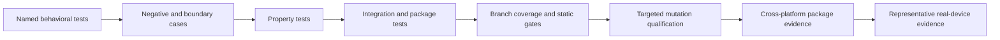

# EchoFlow development docs 🧪🔧

This is where the project stops saying “EchoFlow tries very hard not to melt your laptop”
and starts showing **how we prove that claim is not merely aspirational prose**.

The development docs are for maintainers, contributors, and anyone who enjoys turning
subtle bad decisions into failing tests.

## Start here

| Page | What it is for |
|---|---|
| [Testing and regression bisection](testing-and-bisect.md) | general test strategy, colocation rules, mutation anticipation, and deterministic bisect oracles |
| [Semantic retrieval qualification](semantic-retrieval-testing.md) | property, negative, boundary, integration, and mutation coverage for lexical/semantic/hybrid search decisions |
| [Empirical benchmarking and calibration](benchmarking.md) | measuring real execution without turning hosted CI timing into folklore |

## The current quality gate

Normal pull-request qualification includes:

- locked dependency installation and audit;
- Ruff lint/format/security rules;
- strict mypy;
- Vulture dead-code checks;
- Radon complexity/maintainability reporting;
- pytest with branch coverage and a **90% aggregate gate**;
- package build verification;
- clean-wheel installation; and
- Linux, macOS, and Windows CI.

PR #64's durable research-state work increased the suite to 979 passing tests while
keeping the 90% branch-coverage gate. The important point is not the number itself. The
new tests qualify transactional rollback, projection convergence/rebuild, stale-generation
isolation, research filtering, workspace composition, CLI behavior, and safe error
boundaries rather than merely executing lines for coverage.

## The quality philosophy

EchoFlow has decision-heavy code: resource admission, model custody, stale-state
rejection, resume, cleanup ordering, search filtering, rank composition, evidence
anchoring, transactional user state, projection recovery, and privacy boundaries.

Line/branch coverage alone cannot prove those decisions are correct.

Each layer answers a different question. Mutation testing does not replace ordinary
boundary tests. Hosted CI does not replace physical-device calibration. Benchmarks do not
silently rewrite planner policy.

## No tautologies

A test should prove an observable contract, not restate the implementation.

Useful tests have a meaningful precondition, perform a real operation, and assert a
postcondition that could fail if the implementation were wrong. Examples include:

- a failed SQLite mutation leaves neither the user row nor its journal event committed;
- replaying the same projection changes converges to the same DuckDB state;
- an old canonical generation does not match a new segment that reuses the same friendly
  segment ID;
- an empty research evidence scope returns zero transcript results rather than widening
  to the whole corpus; and
- an unexpected internal CLI error is masked while a known public error preserves its
  intended message and exit code.

Avoid tests of the form “assign X, assert X equals X,” mock-only call counting where no
behavioral contract depends on the call, or assertions that duplicate a constant from the
same function under test.

## Colocation

Tests live with the capability whose contract they protect. Shared fixtures stay at the
narrowest useful scope. Built distributions exclude test packages.

Hypothesis is preferred for invariants and generated sequences. Explicit fixtures/builders
are preferred where IDs, hashes, sequences, and evidence relationships are load-bearing.
Factory-style indirection should be introduced only if entity setup becomes genuinely
repetitive rather than because object factories are fashionable.

## Performance qualification from here

The next performance work should target product workloads rather than microbenchmarks for
their own sake:

- incremental transcript-library refresh versus full rebuild;
- warm/cold unified discovery;
- tag/collection/note-text constrained lexical and semantic search;
- one-edit and large-batch research projection catch-up;
- full research projection rebuild;
- realistic multi-recording corpus startup and disk cost; and
- local media seek/playback responsiveness once the GUI exists.

Representative 8/16 GB consumer machines, Apple Silicon, discrete-GPU laptops, and larger
workstations should calibrate policy. Hosted runner timing remains supporting evidence,
not a substitute for hardware qualification.

## Documentation voice

Development docs use the medium-personality register from
[documentation-style.md](../documentation-style.md): exact commands and contracts, but
with enough explanation that a new contributor can understand why a test exists before
reading the mutant it is trying to kill.

💃 Happy breaking.
