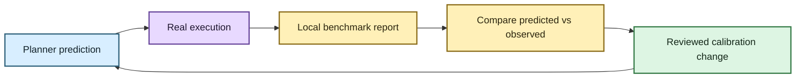

# Empirical benchmarking and calibration 📏

EchoFlow's resource estimates and relative strategy ranks are intentionally conservative
heuristics until real machines prove them right or wrong.

The benchmarking subsystem exists to collect that evidence **without creating a second
transcription implementation**.

The important separation is:

> **Benchmarks describe what happened. A later reviewed policy change decides whether
> those observations justify different planner behavior.**

One fast laptop run does not get to rewrite the product's memory policy by vibes.

## Quick start

ASR models must already be installed through normal model management. Benchmarking never
authorizes a hidden faster-whisper download.

```bash
uv run python -m echoflow.benchmarking /path/to/recording.wav
uv run python -m echoflow.benchmarking /path/to/recording.wav --json
```

Measure a resumed attempt separately:

```bash
uv run python -m echoflow.benchmarking /path/to/recording.wav --resume JOB_ID
```

The harness is experimental. Once its schema and behavior survive real-device use, it
may graduate into the primary `echoflow` command surface.

## What problem are we trying to solve?

The planner currently estimates whether a strategy fits and ranks eligible choices.
Those estimates should become better because of **measured behavior on representative
machines**, not because somebody remembers that one GPU sounded fast in a product page.



## What one benchmark report records

A report describes one execution attempt and currently includes:

- EchoFlow and Python versions;
- path-minimized source provenance: SHA-256, size, modification timestamp, container,
  duration, and selected audio stream;
- process-visible runner resources and selected execution policy;
- path-free managed engine/model/revision and execution target;
- decoder, enhancement, segmentation, and resource-estimate contracts;
- planning, execution, and total wall-clock duration;
- whole-run and execution-only real-time factors;
- sampled process-tree RSS and CPU use;
- aggregate named execution-stage durations/failure counts;
- segment totals/restored/completed counts when available;
- canonical transcript artifact size after successful publication; and
- the ratio between observed peak process-tree RSS and the planner's peak-memory
  estimate.

Repeated stages are named aggregates rather than fixed columns. Future capabilities can
add stages such as:

```text
enhancement.apply
speaker.diarize
alignment
embedding.index
search.index
gpu.transfer
```

without redesigning the benchmark schema.

CPU percentages may exceed 100% because sampled process-tree CPU is summed across cores.
RSS is also summed across the process tree and may conservatively double-count shared
pages. These are comparative measurements, not perfect OS accounting.

## Privacy boundary 🔐

Benchmarking does not transmit reports. EchoFlow has no benchmark telemetry.

Reports are user-owned JSON files in the selected output directory.

They intentionally omit:

- source paths/filenames;
- model-cache paths;
- transcript text; and
- exception messages.

They retain source digest and enough provenance to compare equivalent runs.

A source digest can still be linkable if another party has the same recording, so a
benchmark report from sensitive media is not automatically anonymous.

Public sharing should use synthetic/redistributable media or a future deliberately
shareable report format with reduced provenance.

## Interruption and resume

Ctrl+C and ordinary Python-level failures persist a partial benchmark report before exit
when finalization can run.

The report marks the attempt interrupted/failed, includes only the exception type, and
preserves measurements already recorded.

The transcription checkpoint contract remains authoritative for recovery. Completed
segments are checkpointed before they count as complete.

A later `--resume` benchmark therefore measures the resumed attempt without redefining
resume semantics.

Hard kills, power loss, kernel termination, or machine crashes cannot run benchmark
finalization code, so a final benchmark report is not promised for those cases. Durable
transcription checkpoints/lifecycle state remain the recovery evidence.

## Three qualification layers

### 1. Deterministic unit and contract tests

These prove the measurement machinery itself behaves correctly:

- normal transcription uses a no-op observer without semantic changes;
- repeated stage measurements aggregate correctly;
- failed stages are recorded without swallowing the primary error;
- reports omit sensitive paths/transcript text;
- interruption/failure produce partial reports;
- process-tree sampling tolerates disappearing child processes;
- resume uses the checkpointed current contract; and
- invalid report/schema values fail closed.

### 2. Cross-platform CI

Linux, macOS, and Windows GitHub Actions runners exercise tests, packaging,
clean-wheel behavior, psutil sampling, file handling, native media tools, and CLI
contracts.

Hosted-runner timing is **not calibration truth**.

Runner generations, virtualization, neighboring workloads, frequency policy, caches, and
infrastructure can change outside the project. CI is useful for regression evidence, not
for fitting device policy.

### 3. Representative real-device runs

The initial physical matrix should include:

- an 8 GB Windows consumer machine;
- a 16 GB commodity Windows/Linux machine;
- Apple Silicon;
- a discrete-GPU laptop; and
- a larger 32/64 GB workstation.

For comparisons, hold constant the input bytes, EchoFlow version, managed model revision,
profile/strategy, enhancement condition, and relevant configuration.

Record cold/warm cache state. Prefer repeated trials and medians/spread over one heroic
fastest result.

Thermal throttling, battery/power mode, background applications, storage speed, and OS
updates are legitimate consumer conditions. Record them as experimental context when
known instead of pretending they do not exist.

🧜‍♀️ A benchmark without context is just a number wearing a lab coat.

## Raw ASR versus enhancement + ASR

Noise suppression should be qualified by **transcription outcome and total cost**, not
whether the processed file sounds nicer to a listener.

Use matched conditions:

1. the same managed model/revision/strategy with enhancement off;
2. the same setup with `--enhance`; and
3. repeated runs when variance matters.

Where reference transcripts exist, compare WER and, where useful, CER.

Also compare:

- total/stage wall-clock time;
- real-time factor;
- CPU/RAM pressure;
- accelerator impact;
- private disk overhead;
- checkpoint/resume behavior; and
- failures on silence, clipping, stationary/non-stationary noise, music, and mixed
  acoustic conditions.

The current FFmpeg `afftdn` provider is a fixed deterministic condition. Its existence in
EchoFlow is not a claim that it improves every recording.

An automatic enhancement mode should wait until measurements show a sufficiently
reliable relationship between observable input conditions and end-to-end ASR benefit.

## Future alignment, diarization, search, and source-separation measurements

The same observer/stage model can eventually measure newer capabilities without
inventing parallel harnesses.

Useful future dimensions include:

- alignment wall time and memory cost;
- diarization real-time factor/peak memory after the security gate is cleared;
- embedding-index build cost;
- semantic-query latency at increasing corpus size;
- exact-scan break-even points before considering ANN/HNSW; and
- source-separation cost/recognition benefit on genuine overlap cases.

Source separation in particular should be judged on end-to-end evidence quality, not on
whether separated audio sounds technologically impressive.

## How measurements become policy

The harness is for **measurement first, self-tuning never by accident**.

After a sufficient matrix exists, compare predicted and observed:

- peak system/device memory;
- real-time factor;
- model initialization;
- decode/enhancement/alignment cost;
- segmentation/inference/checkpoint cost;
- cold/warm behavior; and
- accuracy outcomes where reference text exists.

Only then should a separate reviewed change propose new constants, safety margins,
hardware classes, or automatic preprocessing heuristics.

Benchmark reports say what happened. Policy changes explain why that evidence justifies
a different decision.

That separation keeps calibration auditable and prevents the planner from becoming a
self-modifying raccoon with a stopwatch. 🦝