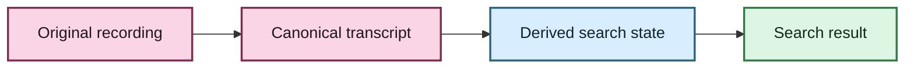

# EchoFlow documentation voice 🦝🧜‍♀️✨

EchoFlow documentation should be **rigorous enough to maintain and pleasant enough to
finish reading**.

The project deals with privacy, provenance, media pipelines, model custody, recovery,
search, and security. Those subjects deserve precision. They do not require the prose to
sound like drywall.

This guide exists so future documentation changes preserve one recognizable voice
without turning every page into a novelty README.

## The governing rule

**Personality may decorate or clarify a contract. It may not replace one.**

If a sentence controls deletion, privacy, security, provenance, compatibility, recovery,
or failure behavior, state the exact rule plainly. A joke can follow it. The joke may
not be the only way to discover what the software does.

Good:

> Semantic vectors are rebuildable derived state. Deleting them must not delete the
> canonical transcript or future user-authored annotations.
>
> The raccoon may rebuild the index. The raccoon may not eat your notes.

Bad:

> 🦝 Don't worry babe, the vibes are immutable.

That is charming and operationally useless.

## Three registers

### 💃 1. Human-facing guides: high personality

Examples:

- `docs/README.md`
- `docs/getting-started.md`
- `docs/semantic-search.md`
- future guides for speakers, noisy audio, search, recovery, and privacy

These documents should:

- begin with what the user is trying to accomplish;
- explain unfamiliar terms before using them as shorthand;
- use examples drawn from real recordings, interviews, meetings, lectures, and research;
- use occasional playful headings, raccoons, mermaids, dancing women, stars, or other
  visual punctuation;
- prefer diagrams over long prose when the idea is structural; and
- tell the reader *why* EchoFlow behaves a certain way, not merely which command exists.

The user should not have to know what CTranslate2, BM25, RRF, a vector dimension, or a
cgroup is unless they deliberately open the maintenance hatch.

### 🧜‍♀️ 2. Architecture and development docs: medium personality

These documents are for maintainers and technically curious readers.

They may use exact terms such as `FLOAT[]`, `SearchResponse`, cgroup limits, immutable
revisions, or reciprocal-rank fusion. They should still provide:

1. a plain-English doorway;
2. a visual model where one helps;
3. the exact contract;
4. failure and ownership semantics; and
5. links to adjacent boundaries.

A good architecture page should let a new contributor understand *why the boundary
exists* before reading every implementation detail.

### 🔐 3. Security, audit, schemas, and command contracts: low personality

Security claims must remain auditable and literal.

Light warmth or a memorable heading is fine. Decorative language must never obscure:

- what is protected;
- what is not protected;
- what is local;
- what may use the network;
- what fails closed;
- which threat actors remain out of scope; or
- which advisory or dependency gate is active.

Dated audit records are archival evidence. Do not retroactively rewrite them merely to
match the current voice.

## Recurring visual language

Use motifs sparingly enough that they stay useful.

- **🦝 Raccoon**: rebuildable machinery, caches, indexes, internal floorboards, or a
  memorable explanation of what can safely be regenerated.
- **💃 Dancing woman**: orchestration, bringing multiple components together, or a
  celebratory transition after a successful workflow.
- **🧜‍♀️ Mermaid**: occasional decorative interruption, especially around diagrams or
  deep technical water. It does not need to represent a service.
- **✨ Sparkles**: optional/enhanced capability, reveal, or conceptual payoff.
- **🔐 Lock**: actual privacy/security boundary, not generic decoration.

Do not put emoji into every diagram node simply because Mermaid and mermaid sound alike.
The diagram should communicate structure first.

## Mermaid diagrams: make the color mean something

Black-and-white diagrams are valid but should not be the automatic default when color
can explain ownership or lifecycle.

Prefer a small semantic palette. For example:

Suggested meanings:

| Treatment | Meaning |
|---|---|
| warm pink | user-owned / authoritative evidence |
| blue | compute, machine capability, or rebuildable infrastructure |
| lavender | processing / enrichment |
| gold | canonical publication / provenance |
| green | result, success, or user-facing retrieval |
| red | failure, refusal, stale state, or safety gate |

Exact hex values may evolve. Consistency matters more than color-brand perfection.

Diagrams must still be understandable from their labels and surrounding prose for
readers who cannot distinguish the colors.

## Jargon has to earn rent

Write the ordinary-language concept first, then name the technical mechanism.

Instead of:

> `DuckDbSemanticIndex` stores vectors as `FLOAT[]` rather than BLOBs.

Prefer:

> EchoFlow keeps semantic vectors as numeric data that the search backend can inspect
> directly. In the current DuckDB adapter, those vectors are stored as `FLOAT[]` rather
> than opaque BLOBs.

Nothing became less precise. The reader simply got a staircase instead of a trapdoor.

## Explain the benefit before the mechanism

For user-facing docs, prefer this order:

1. **What problem does this solve?**
2. **What does the user experience?**
3. **What stays private / authoritative?**
4. **How do I use it?**
5. **How does it work?**
6. **What are the current limits?**
7. **Where is the deep architecture reference?**

Architecture docs can invert steps 4 and 5, but should still start with purpose.

## Humor should help memory

A joke earns its place when it:

- makes a distinction memorable;
- relieves a dense transition;
- gives a difficult concept a concrete mental model; or
- makes the reader want to continue.

It does not earn its place when it:

- makes an error ambiguous;
- trivializes a security or privacy failure;
- appears in every paragraph;
- relies on an in-group reference to understand the technical point; or
- sounds like a corporate account trying to impersonate a person.

Camp needs negative space.

## Searchability still matters

Playful headings should retain descriptive nouns whenever possible.

Good:

- `## 🦝 What lives under the floorboards? Rebuildable search state`
- `## 💃 Bringing the ranks together: hybrid retrieval`
- `## 🔐 Privacy boundary`

Less useful:

- `## She has arrived`
- `## The girls are fighting`

The latter may be funny in prose. They are poor anchors for someone searching a repo.

## Accessibility

- Emoji supplements text; it does not replace meaning.
- Diagrams receive surrounding prose.
- Color is never the only carrier of state.
- Commands and identifiers remain copyable and exact.
- Avoid joke-heavy error examples that obscure the real failure message.
- Prefer headings that remain meaningful to screen-reader and search users.

## The desired reader experience

A reader should be able to enter EchoFlow knowing almost nothing about local ML and
leave understanding:

- what the application does;
- what happens to their recording;
- which artifacts are authoritative;
- what can safely be rebuilt;
- what stays local;
- how to resume and search work; and
- where to go when they want the exact engineering contract.

If they accidentally learn a little systems architecture while a scholarly raccoon
points at a provenance table, that is considered a feature.