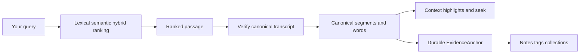
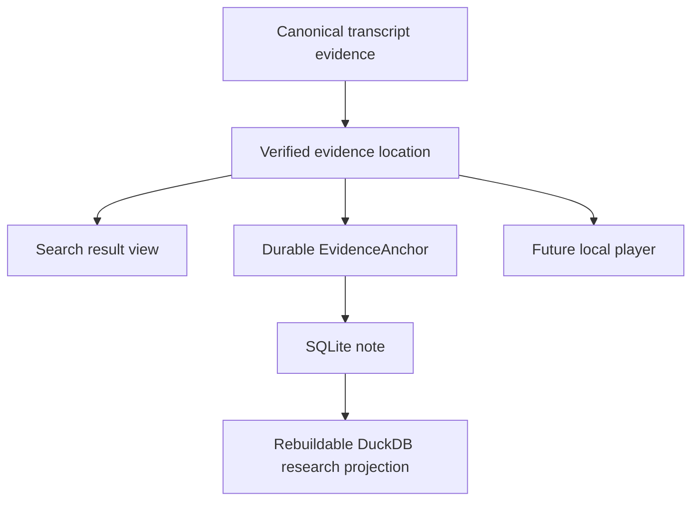

# 🔎 From search result to the exact evidence

Search is useful when it finds something. Research gets easier when the result can also
answer **“where, exactly, did this come from?”**

EchoFlow has a navigation layer between retrieval and presentation. BM25, semantic search,
and hybrid retrieval decide *which passage ranks*. Then EchoFlow goes back to the
authoritative canonical transcript, verifies that it is still the exact transcript that
was indexed, and resolves the result onto canonical segments and word timing.

That distinction is important. A search database may point at evidence. It does not get
to become the evidence.



Text fallback: retrieval ranks a passage, canonical navigation verifies it, and the same
verified evidence coordinates can now be used by durable research notes.

🦝 Search may know the neighborhood. The canonical transcript still owns the street
address.

## What changes when I search?

The command is still the ordinary library search:

```bash
echoflow library search "housing affordability"
```

EchoFlow returns retrieval provenance: source and canonical hashes, segment/chunk
identities, numeric source-relative time, languages, anonymous speaker refs, and
lexical/semantic/fused ranks.

The result can also carry a verified **evidence location**:

- exact canonical transcript generation;
- result segment IDs;
- source-relative result interval;
- deterministic seek coordinate;
- canonical word matches when lexical evidence justifies them;
- current user-assigned speaker display names without replacing anonymous refs; and
- optional neighboring canonical context.

Machine-readable JSON keeps those layers separate rather than flattening them into one
mystery object.

## Exact highlighting is allowed to say “I don't know”

Lexical search knows which canonical segment matched the terms you asked for. When that
segment has aligned word timing, EchoFlow can resolve the same lexical token semantics
onto canonical words and highlight the words that actually matched.

For an exact phrase:

```bash
echoflow library search "housing affordability" --phrase
```

EchoFlow requires phrase tokens to be contiguous before marking canonical words as the
exact match.

Semantic retrieval is different. An embedding may decide this passage:

```text
I was spending almost seventy percent of my pay on the apartment.
```

is relevant to:

```text
people struggling to afford housing
```

There may be no single word in the passage that means “this is the semantic match.” A
semantic-only result therefore gets a verified passage and seek coordinate, but no fake
exact-word highlight.

Hybrid retrieval may contain both kinds of evidence. When lexical evidence contributed,
exact lexical highlights can be shown alongside fused ranking provenance.

## Give me a little more context

```bash
echoflow library search \
  "housing affordability" \
  --context-segments 1
```

`--context-segments` accepts `0` through `10`. Context expansion happens **after ranking**.
EchoFlow does not feed neighboring text back into BM25 or semantic scoring and then
pretend the original ranks still mean the same thing.

The returned context distinguishes actual result evidence from neighboring segments shown
only for reading.

## What about speaker names?

If you previously assigned:

```text
speaker-02 → Dr. Chen
```

ordinary presentation can show:

```text
Dr. Chen (speaker-02)
```

The anonymous `speaker-02` remains machine-readable evidence. The friendly label comes
from separate durable user state and applies only to the exact canonical transcript
generation it was created for.

## Can this jump to the original audio or video?

The application contract exposes the coordinate a player needs.

If an exact aligned lexical match begins at:

```text
4788.370 seconds
```

that renders as:

```text
01:19:48.370
```

and becomes the preferred seek point. If a result has no justified exact-word match, the
passage start remains the safe seek coordinate.

EchoFlow does not yet ship the graphical local media player. The planned thin GUI can
consume this coordinate directly instead of reverse-engineering time from rendered text
or internal work chunks.

## Susan's notes now use this exact coordinate system 📝

The notebook is no longer future work.

`ResearchWorkspaceService.add_note()` asks `EvidenceLocator` to resolve a verified
`EvidenceAnchor` before durable user state is written. The anchor preserves:

```text
document ID
source SHA-256
canonical transcript SHA-256
canonical segment IDs
numeric start/end seconds
```

A command-line note therefore attaches to canonical evidence, not a search row:

```bash
echoflow library notes add JOB_ID segment-000042 \
  --body "Compare this with the 2024 survey." \
  --tag methodology
```

A multi-segment note must select contiguous canonical segments. Optional narrower time
coordinates may refine the anchor inside that verified span.

The note body remains separate durable user knowledge. That means:

- changing timestamp formatting does not detach the note;
- rebuilding BM25 does not delete the note;
- rebuilding semantic vectors does not delete the note;
- rebuilding the DuckDB research projection does not delete the note;
- changing the canonical transcript is detected instead of silently teleporting the
  note; and
- CLI, future GUI, export, and citation workflows can share one anchoring contract.



## Research metadata can constrain later retrieval

Once notes/tags/collections exist, they are not merely decorations on already-ranked
results. EchoFlow can resolve them into a canonical evidence scope before ranking:

```bash
echoflow library search \
  "housing affordability" \
  --tag methodology \
  --collection "Chapter 3" \
  --with-notes
```

This is important. The application does not retrieve a giant corpus and then throw away
results in Python after the fact.

## What this deliberately does not do

Evidence navigation still does not:

- change BM25, semantic similarity, or RRF ranking;
- claim an exact word match for semantic-only relevance;
- rewrite canonical JSON;
- bake speaker display names into diarization evidence;
- automatically re-anchor notes across changed canonical generations;
- save searches or curated result sets yet; or
- ship a graphical media player.

The next product layers can reuse the same verified coordinate system rather than each
inventing a new idea of “where this quote came from.”

For the retrieval internals, open **[Evidence-first corpus search](architecture/corpus-search.md)**.
For durable notebook custody, see **[Your notes should survive the machinery](research-notes.md)**.
For how the timeline works, see **[Transcript time without calculator gymnastics](time-navigation.md)**.
