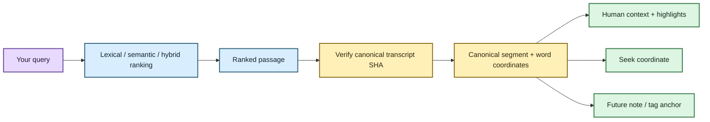
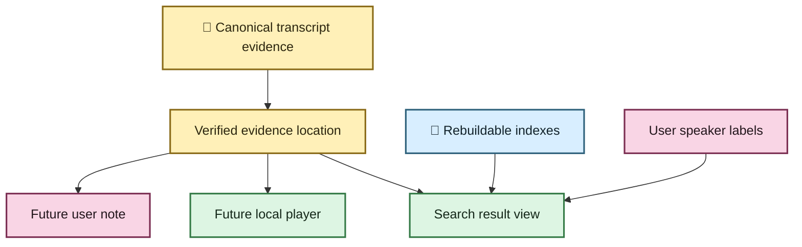

# 🔎 From search result to the exact evidence

Search is useful when it finds something. Research gets easier when the result can also
answer **“where, exactly, did this come from?”**

EchoFlow now has a navigation layer between retrieval and presentation. BM25, semantic
search, and hybrid retrieval still decide *which passage ranks*. Then EchoFlow goes back
to the authoritative canonical transcript, verifies that it is still the exact transcript
that was indexed, and resolves the result onto canonical segments and word timing.

That distinction is important. A search database may point at evidence. It does not get
to become the evidence.



🦝 Search may know the neighborhood. The canonical transcript still owns the street
address.

## What changes when I search?

The command is still the ordinary library search:

```bash
echoflow library search "housing affordability"
```

EchoFlow still returns the same retrieval provenance: source and canonical hashes,
segment/chunk identities, numeric source-relative time, languages, anonymous speaker
refs, and lexical/semantic/fused ranks.

The result can now also carry a verified **evidence location**:

- the exact canonical transcript generation;
- the result segment IDs;
- the source-relative result interval;
- a deterministic seek coordinate;
- canonical word matches when lexical evidence justifies them;
- current user-assigned speaker display names without replacing anonymous refs; and
- optional neighboring canonical context.

Machine-readable JSON keeps those layers separate rather than flattening them into one
mystery object.

## Exact highlighting is allowed to say “I don't know”

Lexical search knows which canonical segment matched the terms you asked for. When that
segment has aligned word timing, EchoFlow can resolve the same lexical token semantics
onto canonical words and highlight the words that actually matched.

For an exact phrase:

```bash
echoflow library search "housing affordability" --phrase
```

EchoFlow requires the phrase tokens to be contiguous before marking the canonical words
as the exact match.

Semantic retrieval is different. An embedding may decide this passage:

```text
I was spending almost seventy percent of my pay on the apartment.
```

is relevant to:

```text
people struggling to afford housing
```

There may be **no single word** in the passage that means “this is the semantic match.”
So a semantic-only result gets a verified passage and seek coordinate, but EchoFlow does
not underline a random noun and pretend the vector model pointed at it.

Hybrid retrieval may have both kinds of evidence. When lexical evidence contributed to
a result, exact lexical highlights can be shown alongside the fused ranking provenance.

💃 Precision is useful. Decorative certainty is not.

## Give me a little more context

A ranked passage is often easier to understand with the sentence before and after it.
You can request neighboring canonical segments without changing retrieval ranking:

```bash
echoflow library search \
  "housing affordability" \
  --context-segments 1
```

`--context-segments` accepts `0` through `10`. The default is `0`, so ordinary searches
stay compact.

Context expansion happens **after ranking**. EchoFlow does not secretly feed the extra
context back into BM25 or semantic scoring and then pretend the ranks mean the same
thing.

The returned context marks which segments are actual result evidence and which are only
neighbors provided for reading.

## What about speaker names?

If you previously assigned:

```text
speaker-02 → Dr. Chen
```

ordinary search presentation can now show:

```text
Dr. Chen (speaker-02)
```

The anonymous `speaker-02` remains in the machine-readable evidence. The friendly label
comes from separate private user-authored state and is resolved only when it matches the
exact canonical transcript generation behind the result.

So rebuilding a search index does not eat the name, and changing the transcript does not
silently attach Dr. Chen to tomorrow's unrelated `speaker-02`.

See **[Give the anonymous speakers names](speaker-names.md)** for the full custody model.

## Can this jump to the original audio or video?

The application contract now exposes the coordinate a player needs.

If an exact aligned lexical match begins at:

```text
4788.370 seconds
```

that becomes the preferred seek point:

```text
01:19:48.370
```

If a result has no justified exact word match, the passage start remains the safe seek
coordinate.

EchoFlow still does not ship the graphical local media player itself. A future GUI can
consume this service directly rather than reverse-engineering positions from rendered
text or internal work chunks.

## And Susan's notes? 📝

Notes are still future user-authored state. This feature intentionally stops one layer
before building the notebook.

What changed is that the notebook no longer needs to invent its own evidence coordinates.
A future note can point at the same verified location used by search navigation:

```text
canonical transcript SHA-256
source SHA-256
segment ID(s)
word index/indices when available
numeric start/end seconds
```

The note body remains separate durable user knowledge.

That means:

- changing clock display formatting does not detach the note;
- rebuilding BM25 does not delete the note;
- rebuilding semantic vectors does not delete the note;
- changing the canonical transcript can be detected instead of silently teleporting the
  note; and
- a GUI, CLI, export adapter, or future citation workflow can all consume one anchoring
  contract.



## What this deliberately does not do

Evidence navigation does not:

- change BM25, semantic similarity, or RRF ranking;
- claim an exact word match for semantic-only relevance;
- rewrite canonical JSON;
- bake speaker display names into diarization evidence;
- create notes, tags, collections, or saved searches yet; or
- ship a graphical media player.

Those are separate product layers. The useful thing about this tranche is that they can
now share one verified coordinate system instead of each inventing a slightly different
idea of “where this quote came from.”

For the retrieval internals, open **[Evidence-first corpus search](architecture/corpus-search.md)**.
For how the underlying timeline works, see **[Transcript time without calculator
gymnastics](time-navigation.md)**.
