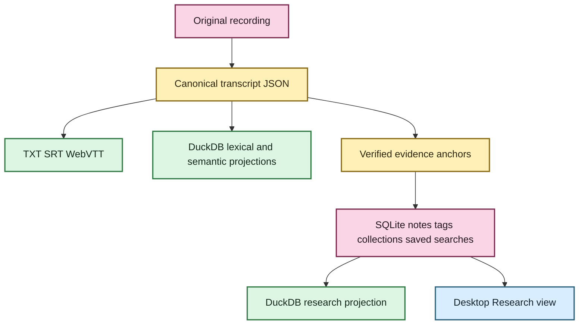

# Getting started with EchoFlow 💃

This is the **use-the-thing** guide.

You do not need to understand the architecture to follow it. EchoFlow makes technical
decisions about resources, private working state, model custody, recovery, transcript
storage, and search so you can concentrate on the recording and the evidence.

If you want the tour first, visit **[Welcome to EchoFlow](README.md)**.

## Before we begin

EchoFlow is still pre-production. There is no polished signed desktop installer yet, so
the supported path is still a source/developer checkout.

The repository now has two useful presentation paths over the same application services:

- the Python CLI; and
- the first Tauri + React desktop shell for import, Library discovery, verified evidence
  reading, and browse-first Research navigation.

```mermaid
flowchart LR
    A[Your recording] --> B[Inspect source and computer]
    B --> C[Choose safe local plan]
    C --> D[Transcribe]
    D --> E[Canonical transcript]
    E --> F[Derived exports]
    E --> G[Private local search]
    G --> H[Verified evidence navigation]
    H --> I[Durable notes tags collections]
    I --> G
    G --> J[Desktop Library]
    H --> J
    I --> K[Desktop Research]

    classDef source fill:#F9D5E5,stroke:#7B2E52,stroke-width:2px,color:#22151B
    classDef process fill:#E8D9FF,stroke:#68469B,stroke-width:2px,color:#1F1630
    classDef evidence fill:#FFF0B8,stroke:#8A6B18,stroke-width:2px,color:#2C260F
    classDef view fill:#DDF5E3,stroke:#347A46,stroke-width:2px,color:#142719
    classDef inspect fill:#D8EEFF,stroke:#2E617B,stroke-width:2px,color:#12222A

    class A source
    class B,C,D process
    class E,H,I evidence
    class F,G view
    class J,K inspect
```



Text fallback: source media is inspected and transcribed locally into canonical evidence;
rebuildable search and verified navigation make that evidence useful; durable research
state stays separate; the desktop Library and Research views reuse those same backend
contracts.

The original recording is treated as read-only input. EchoFlow writes working files,
checkpoints, transcripts, exports, durable user state, and rebuildable search state
separately.

## 1. Install the source build

```bash
git clone https://github.com/SSD1805/EchoFlow.git
cd EchoFlow
uv sync --locked --extra transcription
uv run echoflow init
```

Then inspect the machine:

```bash
uv run echoflow doctor
uv run echoflow runner
```

`doctor` checks important local dependencies and configuration. `runner` shows the compute
and memory EchoFlow can actually use.

## 2. Install a transcription model

```bash
uv run echoflow models recommend
uv run echoflow models install small
```

Model acquisition is explicitly network-bearing. Once a verified managed model is local,
transcription uses that immutable revision instead of silently reaching out to the
network.

## 3. Inspect a recording before doing the work

```bash
uv run echoflow transcribe interview.m4a --dry-run
```

For machine-readable output:

```bash
uv run echoflow transcribe interview.m4a --dry-run --json
```

## 4. Transcribe locally

```bash
uv run echoflow transcribe interview.m4a
```

EchoFlow may normalize the selected audio stream into deterministic working audio. That
working audio is private derived state. Your original recording is not overwritten.

The faster-whisper path requests native word timing. Word intervals are validated and
rebased onto one source-relative timeline so internal work chunks do not reset the
published clock.

The durable transcript is canonical JSON. If you also want ordinary publication formats:

```bash
uv run echoflow transcribe interview.m4a --export txt --export srt --export vtt
```

TXT, SRT, and WebVTT are rebuildable views over canonical transcript evidence.

## 5. Resume an interrupted job

```bash
uv run echoflow transcribe interview.m4a --resume JOB_ID
```

Resume rechecks source identity and current resources and restores the original execution
contract rather than silently changing models, streams, preprocessing, or alignment.

## 6. Optional: clean up a noisy recording

```bash
uv run echoflow transcribe noisy-interview.wav --enhance
```

Enhancement remains private working material and does not replace source evidence.
EchoFlow verifies that preprocessing did not shift the transcript timeline.

## 7. Optional: anonymous speakers

```bash
uv run echoflow transcribe focus-group.wav --diarize
```

Diarization uses anonymous recording-scoped refs such as `speaker-01` and `speaker-02`.
EchoFlow does not treat them as biometric identities or link them across recordings.

The integrated pyannote path remains held behind a dependency security gate while its
locked Lightning version is affected by the compensated advisory described in
**[SECURITY.md](../SECURITY.md)**.

When speaker evidence exists, give a ref a durable human-facing display name:

```bash
uv run echoflow library speakers list JOB_ID
uv run echoflow library speakers name JOB_ID speaker-02 "Dr. Chen"
uv run echoflow library speakers transcript JOB_ID
```

`Dr. Chen` is display state. `speaker-02` remains evidence.

## 8. Refresh and search the local transcript library 🔎

A full rebuild remains available as a repair/recovery lever:

```bash
uv run echoflow library rebuild
```

Normal corpus growth can use incremental refresh instead:

```bash
uv run echoflow library refresh
uv run echoflow library refresh --verify
```

`--verify` deliberately reopens and rehashes tracked canonicals. Ordinary refresh uses
metadata as a cheap detector but keeps canonical SHA-256 as the generation authority.

Search exact wording:

```bash
uv run echoflow library search "housing insecurity"
```

Ask for neighboring canonical context without changing ranking:

```bash
uv run echoflow library search "housing insecurity" --context-segments 1
```

Lexical results with aligned word evidence can highlight exact canonical words and expose
a source seek coordinate. Semantic-only results remain passage-level instead of inventing
an exact word.

## 9. Discover transcripts and research through one doorway

```bash
uv run echoflow library find "housing affordability"
```

Unified discovery returns grouped transcript evidence, notes, tags, and collections. It
does not invent one score that makes unlike objects compete with each other.

Saved searches persist typed query intent:

```bash
uv run echoflow library saved save "Housing chapter" "rent burden" \
  --tag housing --mode hybrid
uv run echoflow library saved
uv run echoflow library saved run "Housing chapter"
```

## 10. Keep durable notes beside the evidence 📝

EchoFlow has a local research notebook backed by authoritative SQLite state. Notes, tags,
collections, saved searches, and their evidence anchors survive search-index rebuilds.

List notes:

```bash
uv run echoflow library notes
```

Add a note to a canonical segment:

```bash
uv run echoflow library notes add JOB_ID segment-000042 \
  --body "Compare this with the 2024 survey." \
  --tag methodology \
  --collection "Chapter 3"
```

EchoFlow verifies the exact canonical transcript generation and segment order before
accepting the anchor. If the transcript later changes, the old note survives but does not
silently attach itself to a new generation.

Edit research state explicitly:

```bash
uv run echoflow library notes edit NOTE_ID --body "Revised note text"
uv run echoflow library notes set-tags NOTE_ID --tag housing --tag methodology
uv run echoflow library notes set-collections NOTE_ID --collection "Chapter 3"
uv run echoflow library notes delete NOTE_ID
```

Read **[Your notes should survive the machinery](research-notes.md)** for the full custody
model.

## 11. Use research state to constrain transcript search

Research metadata can define eligible evidence **before** lexical or semantic ranking:

```bash
uv run echoflow library search \
  "housing affordability" \
  --tag methodology \
  --with-notes
```

Or require note text and a collection:

```bash
uv run echoflow library search \
  "housing affordability" \
  --note-text "2024 survey" \
  --collection "Chapter 3"
```

The user does not choose which database to query. `ResearchWorkspaceService` coordinates
verified evidence, authoritative SQLite user state, the deterministic projector, and
rebuildable DuckDB query state.

## 12. Remember library and recording folders when you want to

Remembered locations are explicit durable preferences, not automatic media custody.

A remembered transcript-library root can participate in later refresh. A remembered
recording-source root can be scanned cheaply for recording candidates. Missing external
roots are reported unavailable rather than silently forgotten.

Recording discovery does **not** itself open, hash, FFprobe, copy, or transcribe the file.
Manual processing remains the default.

See **[Durable library locations](architecture/library-locations.md)** for the exact
contract.

## 13. Use the current desktop shell

The graphical foundation lives under `frontend/` and `src-tauri/`.

For development, install the locked frontend dependencies and start the Vite UI:

```bash
cd frontend
npm ci
npm run dev
```

The browser-only development mock (`?e2e=1`) is for frontend tests and visual development.
It is not the real local application authority.

The native shell is invoked through the Tauri script:

```bash
npm run tauri dev
```

The current desktop journey includes:

- native file/folder selection for import;
- one-time versus remembered location choices;
- recording candidate discovery;
- grouped Library search across evidence and research state;
- verified canonical context and word highlighting;
- a clickable source-relative evidence cursor; and
- browse-first Research navigation over notes, tags, collections, and saved searches.

The desktop webview does not receive arbitrary SQL, shell, or raw canonical/source path
authority.

## 14. Optional semantic and hybrid search ✨

Lexical search is the dependency-light default. Semantic search helps when you remember
the idea but not the wording; hybrid retrieval combines lexical and semantic ranks using
reciprocal rank fusion.

The semantic foundation remains advanced setup because the locked project dependency
graph does not yet include Sentence Transformers as a normal packaged semantic extra.

Read **[Semantic search, without the mystery box](semantic-search.md)** for the full
plain-language explanation.

## What EchoFlow stores 🦝



Text fallback: original media and canonical JSON are evidence; notes/tags/collections and
saved searches are durable human knowledge; publication/search/research projections are
rebuildable; the desktop reads those authorities through typed application services.

The useful distinction is not “database versus file.” It is **can this be reconstructed
without losing something the user authored or relied on as evidence?**

## What comes next?

The first desktop import, Library search, verified evidence reader/cursor, and browse-first
Research screen are now foundation. The next product work is:

1. **Research interaction UI** for note creation/editing, tags/collections, and saved-search
   management through the existing backend authority.
2. **Tauri-owned local media playback** driven by verified source-relative coordinates.
3. **Desktop packaging and first run** for Windows, signed/notarized macOS, and deliberate
   Linux delivery.
4. **Backup, restore, and evidence-bearing research export**.
5. **Semantic dependency/model qualification and representative-device release testing**.

For the detailed sequence, see **[ROADMAP.md](../ROADMAP.md)**.
