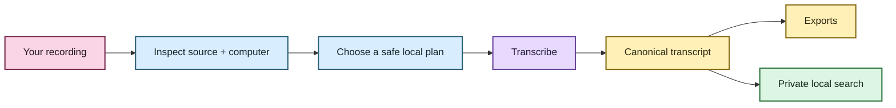
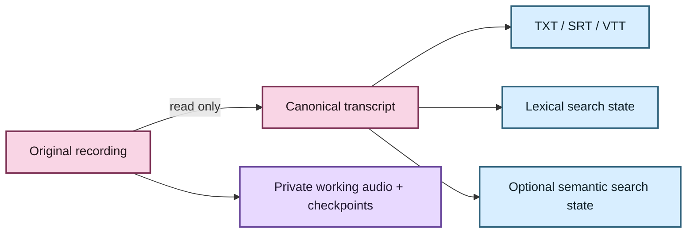

# Getting started with EchoFlow 💃

This is the **use-the-thing** guide.

You do not need to understand the architecture to follow it. EchoFlow will make several
technical decisions for you, including what resources are safely available, which local
transcription strategy fits, where private working state belongs, and how completed work
can be resumed or searched later.

If you want the tour first, visit **[Welcome to EchoFlow](README.md)**.

## Before we begin

EchoFlow is still pre-production. There is no polished desktop installer yet, so the
current path uses Python 3.12, `uv`, and the command line.

The workflow itself is local-first:



The original recording is treated as read-only input. EchoFlow writes working files,
checkpoints, transcripts, exports, and search state separately.

## 1. Install the source build

```bash
git clone https://github.com/SSD1805/EchoFlow.git
cd EchoFlow
uv sync --locked --extra transcription
```

Initialize EchoFlow's private application directories:

```bash
uv run echoflow init
```

Then ask EchoFlow to inspect the machine:

```bash
uv run echoflow doctor
uv run echoflow runner
```

`doctor` checks important local dependencies and configuration. `runner` shows the
compute and memory EchoFlow can actually use.

You do **not** need to manually translate that into “therefore I should use four threads,
CUDA device zero, and model X.” That is application work.

## 2. Install a transcription model

Ask EchoFlow which managed model currently fits the machine and processing policy:

```bash
uv run echoflow models recommend
```

Then install the model you intend to use. For example:

```bash
uv run echoflow models install small
```

### Why is installation a separate step?

Because downloading model weights is a network-bearing action.

EchoFlow makes that boundary explicit instead of quietly reaching out to the internet
when you start transcription. Once a verified managed model is present locally,
transcription uses that local immutable revision.

🦝 **Raccoon translation:** downloading the toolbox and using the toolbox are different
things. EchoFlow does not pretend otherwise.

## 3. Inspect a recording before doing the work

A dry run tells EchoFlow to inspect the media and machine and build a plan without
starting recognition:

```bash
uv run echoflow transcribe interview.m4a --dry-run
```

This is useful when you want to see which strategy, model, stream, storage estimate, and
resource budget would be used before committing to a long run.

For machine-readable output:

```bash
uv run echoflow transcribe interview.m4a --dry-run --json
```

## 4. Transcribe locally

```bash
uv run echoflow transcribe interview.m4a
```

EchoFlow may need to decode or normalize the selected audio stream into a deterministic
working format. That working audio is private derived state. Your original recording is
not overwritten.

The durable transcript is canonical JSON. If you also want ordinary reading/subtitle
formats:

```bash
uv run echoflow transcribe interview.m4a --export txt --export srt --export vtt
```

TXT, SRT, and WebVTT are publication views. They can be regenerated from canonical JSON
without running speech recognition again.

## 5. If something interrupts the job

Long recordings and laptops occasionally have opinions.

When a job has durable checkpoints, resume it with the original input and the job ID:

```bash
uv run echoflow transcribe interview.m4a --resume JOB_ID
```

Resume is deliberately conservative. EchoFlow rechecks source identity and current
resources and restores the original execution contract rather than silently switching
models, streams, or preprocessing halfway through the evidence trail.

## 6. Optional: clean up a noisy recording

You can explicitly ask EchoFlow to apply its current deterministic local FFmpeg noise
suppression before ASR:

```bash
uv run echoflow transcribe noisy-interview.wav --enhance
```

Enhancement is off by default. The processed audio remains private working material and
does not replace the source recording.

EchoFlow also verifies that preprocessing did not alter the frame count/sample rate or
otherwise shift the timeline it uses for transcript timestamps.

For the engineering contract, see
**[Local speech enhancement](architecture/speech-enhancement.md)**.

## 7. Optional: anonymous speakers

The intended CLI surface is:

```bash
uv run echoflow transcribe focus-group.wav --diarize
```

Diarization uses anonymous recording-scoped labels such as `speaker-01` and
`speaker-02`. EchoFlow does not treat them as biometric identities or link them across
recordings.

**Current limitation:** the integrated pyannote path is held behind a dependency security
gate while the locked Lightning version is affected by a compensated advisory. While
that gate is active, EchoFlow refuses diarization before model execution/acquisition.

See **[Anonymous speaker diarization](architecture/diarization.md)** and
**[SECURITY.md](../SECURITY.md)** for the exact boundary.

## 8. Build your local transcript library 🔎

Once you have completed canonical transcripts, build the private lexical library:

```bash
uv run echoflow library rebuild
```

Search it:

```bash
uv run echoflow library search "housing insecurity"
```

Filter by evidence when you know more about what you want:

```bash
uv run echoflow library search \
  "rent increase" \
  --speaker speaker-02 \
  --language en
```

Inspect one transcript's evidence receipt:

```bash
uv run echoflow library show JOB_ID
```

The search database is a rebuildable projection. The canonical transcript remains the
authoritative artifact.

## 9. Optional: search by meaning, not only matching words ✨

Lexical search is excellent when the transcript contains the words you remember.
Semantic search helps when you remember the idea but not the wording.

A query like:

```text
people struggling to afford housing
```

may help surface:

```text
I was spending almost seventy percent of my pay on the apartment.
```

Those sentences share little vocabulary, but they express a related idea.

EchoFlow's current semantic foundation uses a local sentence-embedding model and private
rebuildable vectors. Search results still return original transcript passages with their
evidence coordinates.

### Is this sent to a hosted AI service?

Not during semantic indexing or search in the current implementation.

The embedding provider loads from a local immutable model snapshot. Acquiring model
weights is a separate network-bearing action.

### Is semantic search part of the normal install yet?

Not quite.

The locked project dependency graph does not yet include Sentence Transformers, so the
semantic path currently expects an environment that already supplies a compatible local
runtime and Multilingual E5 Small snapshot. Lexical search works without any of this.

If you want the full explanation without being thrown into vector-storage internals,
read **[Semantic search, without the mystery box](semantic-search.md)**.

## What EchoFlow stores 🦝



The useful distinction is not “database versus file.” It is **can this be reconstructed
without losing something the user authored or relied on as evidence?**

- The original recording is source evidence.
- Canonical transcript JSON is the authoritative transcript artifact.
- Future notes/tags/annotations are user-authored state and must not be treated as cache.
- TXT/SRT/VTT and search indexes are derived and rebuildable.
- Working audio and most execution material are private processing state.

Delete a search index? Rebuild her.

Delete the only canonical transcript or a future annotation? That is data loss.

## Where do I go when I want more detail?

**[docs/README.md](README.md)** is the documentation lobby.

The **[architecture index](architecture/README.md)** is the maintenance hatch for
contributors and technically curious readers. It covers resource admission, media and
timeline semantics, model custody, diarization, enhancement, checkpoints, and search in
exact terms.

The **[security policy](../SECURITY.md)** defines what “local-first” protects and what it
does not claim.

And if the documentation suddenly starts discussing `FLOAT[]`, cgroup ceilings, or RRF
constants, you have probably wandered into the engine room. 🧜‍♀️