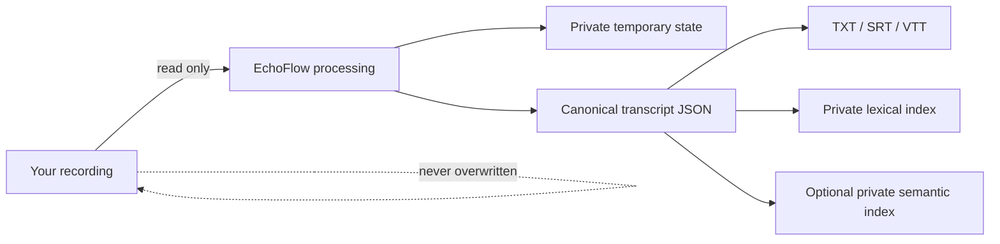
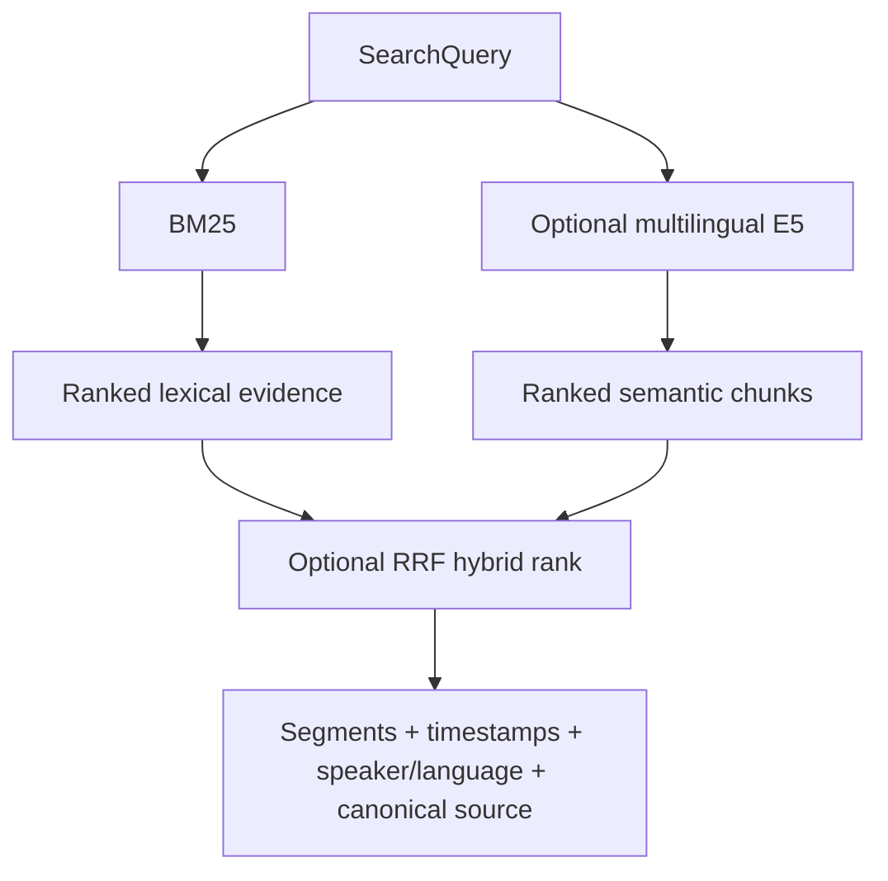

# Getting started with EchoFlow

EchoFlow keeps recording, transcription, and search work on your computer. The original
recording is treated as read-only input. The main transcript is portable canonical JSON;
TXT/SRT/VTT and search databases are derived views that can be regenerated.

## 1. Install the source build

EchoFlow is pre-production and does not publish end-user installers yet.

```bash
git clone https://github.com/SSD1805/EchoFlow.git
cd EchoFlow
uv sync --locked --extra transcription
```

Initialize private application directories and inspect the machine:

```bash
uv run echoflow init
uv run echoflow doctor
uv run echoflow runner
```

## 2. See which transcription model fits

```bash
uv run echoflow models recommend
```

Install the recommended managed model before transcription:

```bash
uv run echoflow models install small
```

Model installation is explicit because it is a network-bearing action. Transcription
itself does not silently download ASR weights.

## 3. Transcribe a recording

Inspect the plan without starting recognition:

```bash
uv run echoflow transcribe interview.m4a --dry-run
```

Then transcribe:

```bash
uv run echoflow transcribe interview.m4a
```

Optional derived exports:

```bash
uv run echoflow transcribe interview.m4a --export txt --export srt
```

## 4. Search completed transcripts

Build the private lexical library:

```bash
uv run echoflow library rebuild
```

Search it:

```bash
uv run echoflow library search "housing insecurity"
```

Filter by available transcript evidence:

```bash
uv run echoflow library search \
  "rent increase" \
  --speaker speaker-02 \
  --language en
```

Inspect where one transcript came from:

```bash
uv run echoflow library show JOB_ID
```

## What EchoFlow stores



The important distinction is ownership:

- **Your recording**: source evidence, never overwritten by EchoFlow.
- **Canonical transcript JSON**: authoritative transcript artifact.
- **TXT/SRT/VTT**: derived publication formats.
- **DuckDB indexes**: private rebuildable search state.

Deleting a search index should not delete transcript evidence.

## Optional semantic and hybrid search

EchoFlow now has deterministic chunking, exact local vector retrieval, multilingual-E5
query/passage semantics, and reciprocal-rank hybrid fusion. The E5 adapter is
strict-local: it accepts an immutable local model snapshot rather than a repository ID.

The locked project dependency graph does not yet include Sentence Transformers. Until a
semantic dependency tranche is resolved and audited, this capability requires an
environment that already supplies a compatible `sentence_transformers` runtime and a
local `intfloat/multilingual-e5-small` snapshot.

Build the private semantic index:

```bash
uv run echoflow library embeddings build \
  /path/to/models--intfloat--multilingual-e5-small/snapshots/<revision> \
  --revision <revision>
```

Inspect what was indexed:

```bash
uv run echoflow library embeddings
```

Semantic retrieval:

```bash
uv run echoflow library search \
  "people struggling to make rent" \
  --mode semantic
```

Hybrid lexical + semantic retrieval:

```bash
uv run echoflow library search \
  "people struggling to make rent" \
  --mode hybrid
```

Lexical search remains the default and has no semantic-model requirement.

## How search results stay tied to evidence



Semantic chunks are retrieval windows, not replacement transcript text. Each window
points to the exact canonical segment IDs and source-relative time range from which it
was built.

For the full architecture, see
[`architecture/corpus-search.md`](architecture/corpus-search.md).
