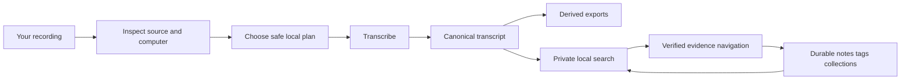
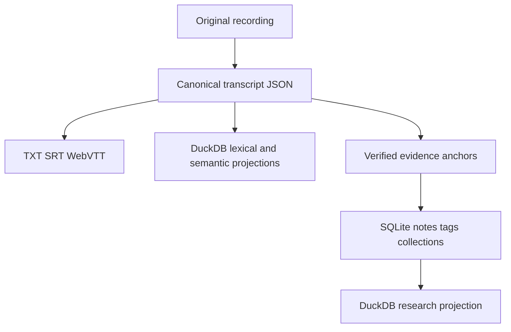

# Getting started with EchoFlow 💃

This is the **use-the-thing** guide.

You do not need to understand the architecture to follow it. EchoFlow makes technical
decisions about resources, private working state, model custody, recovery, transcript
storage, and search so you can concentrate on the recording and the evidence.

If you want the tour first, visit **[Welcome to EchoFlow](README.md)**.

## Before we begin

EchoFlow is still pre-production. There is no polished desktop installer yet, so the
current path uses Python 3.12, `uv`, and the command line.



The original recording is treated as read-only input. EchoFlow writes working files,
checkpoints, transcripts, exports, durable user state, and rebuildable search state
separately.

## 1. Install the source build

```bash
git clone https://github.com/SSD1805/EchoFlow.git
cd EchoFlow
uv sync --locked --extra transcription
uv run echoflow init
```

Then inspect the machine:

```bash
uv run echoflow doctor
uv run echoflow runner
```

`doctor` checks important local dependencies and configuration. `runner` shows the compute
and memory EchoFlow can actually use.

## 2. Install a transcription model

```bash
uv run echoflow models recommend
uv run echoflow models install small
```

Model acquisition is explicitly network-bearing. Once a verified managed model is local,
transcription uses that immutable revision instead of silently reaching out to the
network.

## 3. Inspect a recording before doing the work

```bash
uv run echoflow transcribe interview.m4a --dry-run
```

For machine-readable output:

```bash
uv run echoflow transcribe interview.m4a --dry-run --json
```

## 4. Transcribe locally

```bash
uv run echoflow transcribe interview.m4a
```

EchoFlow may normalize the selected audio stream into deterministic working audio. That
working audio is private derived state. Your original recording is not overwritten.

The faster-whisper path requests native word timing. Word intervals are validated and
rebased onto one source-relative timeline so internal work chunks do not reset the
published clock.

The durable transcript is canonical JSON. If you also want ordinary publication formats:

```bash
uv run echoflow transcribe interview.m4a --export txt --export srt --export vtt
```

TXT, SRT, and WebVTT are rebuildable views over canonical transcript evidence.

## 5. Resume an interrupted job

```bash
uv run echoflow transcribe interview.m4a --resume JOB_ID
```

Resume rechecks source identity and current resources and restores the original execution
contract rather than silently changing models, streams, preprocessing, or alignment.

## 6. Optional: clean up a noisy recording

```bash
uv run echoflow transcribe noisy-interview.wav --enhance
```

Enhancement remains private working material and does not replace source evidence.
EchoFlow verifies that preprocessing did not shift the transcript timeline.

## 7. Optional: anonymous speakers

```bash
uv run echoflow transcribe focus-group.wav --diarize
```

Diarization uses anonymous recording-scoped refs such as `speaker-01` and `speaker-02`.
EchoFlow does not treat them as biometric identities or link them across recordings.

The integrated pyannote path remains held behind a dependency security gate while its
locked Lightning version is affected by the compensated advisory described in
**[SECURITY.md](../SECURITY.md)**.

When speaker evidence exists, give a ref a durable human-facing display name:

```bash
uv run echoflow library speakers list JOB_ID
uv run echoflow library speakers name JOB_ID speaker-02 "Dr. Chen"
uv run echoflow library speakers transcript JOB_ID
```

`Dr. Chen` is display state. `speaker-02` remains evidence.

## 8. Build and search the local transcript library 🔎

```bash
uv run echoflow library rebuild
uv run echoflow library search "housing insecurity"
```

Ask for neighboring canonical context without changing ranking:

```bash
uv run echoflow library search "housing insecurity" --context-segments 1
```

Filter by anonymous evidence refs or language when useful:

```bash
uv run echoflow library search \
  "rent increase" \
  --speaker speaker-02 \
  --language en
```

Lexical results with aligned word evidence can highlight exact canonical words and expose
a source seek coordinate. Semantic-only results remain passage-level instead of inventing
an exact word.

Inspect one transcript's evidence receipt:

```bash
uv run echoflow library show JOB_ID
```

## 9. Keep durable notes beside the evidence 📝

EchoFlow now has a local research notebook backed by authoritative SQLite state. Notes,
tags, collections, and their evidence anchors survive search-index rebuilds.

List notes:

```bash
uv run echoflow library notes
```

Add a note to a canonical segment:

```bash
uv run echoflow library notes add JOB_ID segment-000042 \
  --body "Compare this with the 2024 survey." \
  --tag methodology \
  --collection "Chapter 3"
```

A note may span contiguous canonical segments:

```bash
uv run echoflow library notes add JOB_ID \
  segment-000042 segment-000043 segment-000044 \
  --body "This exchange belongs in the methods section."
```

EchoFlow verifies the exact canonical transcript generation and segment order before
accepting the anchor. If the transcript later changes, the old note survives but does not
silently attach itself to a new generation.

Edit research state explicitly:

```bash
uv run echoflow library notes edit NOTE_ID --body "Revised note text"
uv run echoflow library notes set-tags NOTE_ID --tag housing --tag methodology
uv run echoflow library notes set-collections NOTE_ID --collection "Chapter 3"
uv run echoflow library notes delete NOTE_ID
```

Read **[Your notes should survive the machinery](research-notes.md)** for the full custody
model.

## 10. Use research state to constrain transcript search

Search can resolve human tag/collection names into durable IDs and apply the resulting
evidence scope **before** lexical ranking or semantic vector scoring.

```bash
uv run echoflow library search \
  "housing affordability" \
  --tag methodology \
  --with-notes
```

Or require note text and a collection:

```bash
uv run echoflow library search \
  "housing affordability" \
  --note-text "2024 survey" \
  --collection "Chapter 3"
```

The user does not choose which database to query. `ResearchWorkspaceService` coordinates
verified evidence, authoritative SQLite user state, the deterministic projector, and
rebuildable DuckDB query state.

Projection diagnostics are available when needed:

```bash
uv run echoflow library research
uv run echoflow library research sync
uv run echoflow library research rebuild
```

Normal users should not need to operate either database directly.

## 11. Optional semantic and hybrid search ✨

Lexical search is the dependency-light default. Semantic search helps when you remember
the idea but not the wording; hybrid retrieval combines lexical and semantic ranks using
reciprocal rank fusion.

The semantic foundation remains advanced setup because the locked project dependency
graph does not yet include Sentence Transformers as a normal semantic extra.

Read **[Semantic search, without the mystery box](semantic-search.md)** for the full
plain-language explanation.

## What EchoFlow stores 🦝



The useful distinction is not “database versus file.” It is **can this be reconstructed
without losing something the user authored or relied on as evidence?**

- Original recording: source evidence.
- Canonical transcript JSON: authoritative transcript evidence.
- Speaker display labels, notes, tags, collections: durable user-authored state.
- TXT/SRT/VTT, search indexes, research projection, navigation views: derived/rebuildable.
- Working audio and most execution material: private processing state.

Delete a search index? Rebuild it.

Delete the only canonical transcript or somebody's note? That is data loss.

## What comes next?

The backend research workspace exists. The next product work is increasingly about making
it pleasant for a normal person:

1. one unified library-discovery surface across transcripts, notes, tags, and collections;
2. saved searches plus useful derived frequent/recent navigation;
3. a thin graphical shell that turns transcript selection into verified note anchors and
   local seek actions;
4. portable research export and incremental library refresh; and
5. consumer-hardware/semantic-install/installer qualification.

For the detailed sequence, see **[ROADMAP.md](../ROADMAP.md)**.
