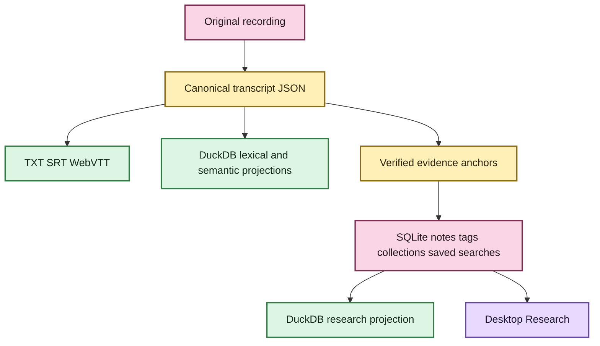

# Getting started with EchoFlow 💃

This is the **use-the-thing** guide.

EchoFlow is a private, local-first workspace for recorded evidence. You do not need to
understand the architecture to use it: EchoFlow owns resource planning, model custody,
recovery, transcript storage, search projections, and evidence verification so you can
concentrate on the recording and the research.

If you want the tour first, visit **[Welcome to EchoFlow](README.md)**.

## Before we begin

EchoFlow is still pre-production. There is no polished signed desktop installer yet, so
the supported path is a source/developer checkout.

The repository currently has two presentation paths over the same application services:

- the Python CLI; and
- a Tauri + React desktop shell for native import, Library discovery, verified evidence,
  and durable Research workflows.

```mermaid
flowchart LR
    A[Your recording] --> B[Inspect source and computer]
    B --> C[Choose safe local plan]
    C --> D[Transcribe]
    D --> E[Canonical transcript]
    E --> F[Derived exports]
    E --> G[Private local search]
    G --> H[Verified evidence navigation]
    H --> I[Durable notes tags collections]
    I --> G
    G --> J[Desktop Library]
    H --> J
    I --> K[Desktop Research]

    classDef source fill:#F9D5E5,stroke:#7B2E52,stroke-width:2px,color:#22151B
    classDef process fill:#E8D9FF,stroke:#68469B,stroke-width:2px,color:#1F1630
    classDef evidence fill:#FFF0B8,stroke:#8A6B18,stroke-width:2px,color:#2C260F
    classDef view fill:#DDF5E3,stroke:#347A46,stroke-width:2px,color:#142719
    classDef inspect fill:#D8EEFF,stroke:#2E617B,stroke-width:2px,color:#12222A

    class A source
    class B,C,D,K process
    class E,H,I evidence
    class F,G view
    class J inspect
```



Text fallback: source media is inspected and transcribed locally into canonical evidence;
rebuildable search and verified navigation make that evidence useful; durable research
state stays separate; the desktop exposes import, Library, evidence, and Research workflows.

## 1. Install the source build

```bash
git clone https://github.com/SSD1805/EchoFlow.git
cd EchoFlow
uv sync --locked --extra transcription
uv run echoflow init
uv run echoflow doctor
uv run echoflow runner
```

## 2. Install a transcription model

```bash
uv run echoflow models recommend
uv run echoflow models install small
```

Model acquisition is explicitly network-bearing. Once a verified managed model is local,
transcription uses that immutable revision instead of silently reaching out to the network.

## 3. Inspect and transcribe a recording

```bash
uv run echoflow transcribe interview.m4a --dry-run
uv run echoflow transcribe interview.m4a
```

The durable transcript is canonical JSON. Add publication views when useful:

```bash
uv run echoflow transcribe interview.m4a --export txt --export srt --export vtt
```

EchoFlow may canonicalize the selected audio stream into private working audio. The
original recording is not overwritten.

## 4. Resume an interrupted job

```bash
uv run echoflow transcribe interview.m4a --resume JOB_ID
```

Resume rechecks source identity and current resources and restores the original execution
contract rather than silently changing models, streams, preprocessing, or alignment.

## 5. Optional: enhancement and anonymous speakers

```bash
uv run echoflow transcribe noisy-interview.wav --enhance
uv run echoflow transcribe focus-group.wav --diarize
```

Enhancement remains private working material and may not shift the canonical timeline.
Diarization uses anonymous recording-scoped refs rather than biometric identity.

When speaker evidence exists, give a ref a durable human-facing display name:

```bash
uv run echoflow library speakers list JOB_ID
uv run echoflow library speakers name JOB_ID speaker-02 "Dr. Chen"
```

`Dr. Chen` is display state. `speaker-02` remains evidence.

## 6. Refresh and search the local transcript library 🔎

```bash
uv run echoflow library rebuild
uv run echoflow library refresh
uv run echoflow library refresh --verify
uv run echoflow library search "housing insecurity"
uv run echoflow library find "housing affordability"
```

Unified discovery returns grouped transcript evidence, notes, tags, and collections. It
does not invent one score that makes unlike objects compete with each other.

## 7. Keep durable research beside the evidence 📝

Notes, tags, collections, and saved searches are authoritative local user state.

```bash
uv run echoflow library notes add JOB_ID segment-000042 \
  --body "Compare this with the 2024 survey." \
  --tag methodology \
  --collection "Chapter 3"
```

Saved searches persist typed query intent rather than today's result snapshot:

```bash
uv run echoflow library saved save "Housing chapter" "rent burden" \
  --tag housing --mode hybrid
uv run echoflow library saved run "Housing chapter"
```

Research metadata can constrain transcript search before ranking:

```bash
uv run echoflow library search \
  "housing affordability" \
  --tag methodology \
  --with-notes
```

See **[Your notes should survive the machinery](research-notes.md)** for the custody model.

## 8. Remember library and recording folders when you want to

Remembered locations are explicit durable preferences, not automatic media custody.
A transcript-library root can participate in later refresh; a recording-source root can be
scanned cheaply for candidates. Discovery does **not** itself open, hash, FFprobe, copy, or
transcribe the file. Manual processing remains the default.

See **[Durable library locations](architecture/library-locations.md)**.

## 9. Use the current desktop shell

The graphical foundation lives under `frontend/` and `frontend/src-tauri/`.

Native desktop development needs Node/npm, a stable Rust toolchain with Cargo, and Tauri's
OS-native webview/build libraries. See **[Desktop development prerequisites](development/desktop-development.md)** before the first native build.

```bash
cd frontend
npm ci
npm run tauri dev
```

`npm ci` installs the locked JavaScript dependency graph into `frontend/node_modules/`; it
does not install those packages globally. The browser-only development mock (`?e2e=1`) is
for frontend tests and visual development. It is not the real local application authority.

The current desktop journey includes:

- native file/folder selection for import;
- one-time versus remembered location choices;
- recording candidate discovery;
- grouped Library search across evidence and research state;
- verified canonical context and word highlighting;
- exact-generation Research note reopening;
- note create/edit/delete plus saved-search lifecycle; and
- first-class tag/collection filtering with inspectable active filters.

The desktop webview does not receive arbitrary SQL, shell, or raw canonical/source path
authority.

## 10. Optional semantic and hybrid search ✨

Lexical search is the dependency-light default. Semantic search helps when you remember
the idea but not the wording; hybrid retrieval combines lexical and semantic ranks using
reciprocal rank fusion.

The semantic foundation remains advanced setup because the locked project dependency
graph does not yet include Sentence Transformers as a normal packaged semantic extra.

Read **[Semantic search, without the mystery box](semantic-search.md)**.

## What EchoFlow stores 🦝



Text fallback: original media and canonical JSON are evidence; notes/tags/collections and
saved searches are durable human knowledge; publication/search/research projections are
rebuildable; the desktop Research surface consumes the same application authority.

## What comes next?

The desktop import, Library search, verified evidence reader, durable Research workspace,
and first-class tag/collection navigation are foundation. Next:

1. **Finish Research** with explicit stale/unavailable-anchor review and advanced typed search controls.
2. **Build the desktop Processing center** over existing machine/model/job/transcription authority, including adaptive zero-knob execution.
3. **Add speaker/processing controls and Tauri-owned local media playback**.
4. **Productize lifecycle, packaging, first run, backup/restore, and portability**.
5. **Qualify semantic dependencies and representative hardware**.

The deliberately separate **[post-MVP research roadmap](post-mvp-roadmap.md)** covers
research snapshots/diffs, REFI-QDA interoperability, evidence packets, comparison,
evidence-linked writing/script boards, portable research bundles, and live provisional
capture after the first desktop product is coherent.

For the detailed first-release sequence, see **[ROADMAP.md](../ROADMAP.md)**.
