# Getting started with EchoFlow 💃

This is the **use-the-thing** guide.

EchoFlow is a private, local-first workspace for recorded evidence. You do not need to
understand the architecture to use it: EchoFlow owns resource planning, model custody,
recovery, transcript storage, search projections, and evidence verification so you can
concentrate on the recording and the research.

If you want the tour first, visit **[Welcome to EchoFlow](README.md)**.

## Before we begin

EchoFlow is still pre-production. There is no polished signed desktop installer yet, so the
current path is a source/developer checkout. That does **not** mean every source-build task
requires the entire stack.

Choose the smallest path that matches what you want to do:

| Goal | First command after cloning | You do not need yet |
|---|---|---|
| inspect/click the frontend with fake data | `cd frontend && npm ci && npm run dev:mock` | Python, uv, Rust, Cargo, FFmpeg, model |
| run the real native desktop window | follow the desktop prerequisites, then `npm run tauri dev` | transcription model until you process media |
| use the Python CLI / process real recordings | `uv sync --locked --extra transcription` | frontend tooling unless you also want the GUI |

If a desktop source build behaves strangely, use **[Desktop source-build troubleshooting](development/troubleshooting.md)**. It starts from the error message and explains both the cause and the remedy.

The repository currently has two presentation paths over the same application services:

- the Python CLI; and
- a Tauri + React desktop for import, Processing, Library search, verified evidence, and
  durable Research workflows.

```mermaid
flowchart LR
    A[Your recording] --> B[Inspect source and computer]
    B --> C[Choose safe local plan]
    C --> D[Desktop Processing]
    D --> E[Transcribe]
    E --> F[Canonical transcript]
    F --> G[Derived exports]
    F --> H[Private local search]
    H --> I[Verified evidence navigation]
    I --> J[Durable notes tags collections]
    J --> H
    H --> K[Desktop Library]
    I --> K
    J --> L[Desktop Research]

    classDef source fill:#F9D5E5,stroke:#7B2E52,stroke-width:2px,color:#22151B
    classDef process fill:#E8D9FF,stroke:#68469B,stroke-width:2px,color:#1F1630
    classDef evidence fill:#FFF0B8,stroke:#8A6B18,stroke-width:2px,color:#2C260F
    classDef view fill:#DDF5E3,stroke:#347A46,stroke-width:2px,color:#142719
    classDef inspect fill:#D8EEFF,stroke:#2E617B,stroke-width:2px,color:#12222A

    class A source
    class B,C,D,E,L process
    class F,I,J evidence
    class G,H view
    class K inspect
```



Text fallback: source media is inspected and processed locally into canonical evidence;
rebuildable search and verified navigation make that evidence useful; durable research
state stays separate; the desktop exposes import, Processing, Library, evidence, and
Research workflows.

## Fast path: inspect the frontend only

You need a supported Node/npm installation, then:

```bash
git clone https://github.com/SSD1805/EchoFlow.git
cd EchoFlow/frontend
npm ci
npm run doctor:desktop -- --mode=mock
npm run dev:mock
```

`npm ci` installs into `frontend/node_modules/`; it is not a global install. `dev:mock`
intentionally uses fake local data so the browser never pretends it has Tauri filesystem or
Python authority.

If you run plain `npm run dev` in a browser, EchoFlow shows a development-mode explanation
rather than silently falling back to mock data. Plain `dev` is also the Vite server used by
the real Tauri host.

## Native desktop path

Read **[Desktop development prerequisites](development/desktop-development.md)** before the
first native build. On a prepared machine:

```bash
cd EchoFlow
uv sync --locked --extra transcription
cd frontend
npm ci
npm run doctor:desktop
npm run tauri dev
```

The debug Tauri host automatically prefers EchoFlow's repository `.venv` for backend calls.
A transcription model is optional until you actually process a recording.

### Use the desktop Processing Center

Choose **Processing** in the desktop navigation. The first-release workflow now provides:

- machine and model readiness;
- outcome-oriented processing profiles;
- a preflight summary before execution;
- explicit transcription start;
- durable job status/progress;
- native cancel;
- resume for a compatible interrupted job versus fresh retry when you want a new plan;
- explicit diarization/enhancement/publication intent; and
- private execution-state discard that does not delete recordings, canonical transcripts,
  or research.

Long-running transcription is not an hour-long browser request. Python owns planning,
resource admission, model/checkpoint rules, and transcript correctness; Tauri supervises
allowlisted child processes; React presents the workflow.

See **[Processing Center](architecture/processing-center.md)** for the exact contract.

## 1. Install the Python source build for CLI/processing work

From the repository root:

```bash
uv sync --locked --extra transcription
uv run echoflow init
uv run echoflow doctor
uv run echoflow runner
```

## 2. Install a transcription model when you want to transcribe

```bash
uv run echoflow models recommend
uv run echoflow models install small
```

Model acquisition is explicitly network-bearing. Once a verified managed model is local,
transcription uses that immutable revision instead of silently reaching out to the network.

You can skip this step when you are only inspecting the UI or browsing existing evidence.

## 3. Inspect and transcribe a recording from the CLI

```bash
uv run echoflow transcribe interview.m4a --dry-run
uv run echoflow transcribe interview.m4a
```

The durable transcript is canonical JSON. Add publication views when useful:

```bash
uv run echoflow transcribe interview.m4a --export txt --export srt --export vtt
```

EchoFlow may canonicalize the selected audio stream into private working audio. The
original recording is not overwritten.

## 4. Resume an interrupted job

```bash
uv run echoflow transcribe interview.m4a --resume JOB_ID
```

Resume rechecks source identity and current resources and restores the original execution
contract rather than silently changing models, streams, preprocessing, or alignment.

## 5. Optional: enhancement and anonymous speakers

```bash
uv run echoflow transcribe noisy-interview.wav --enhance
uv run echoflow transcribe focus-group.wav --diarize
```

Enhancement remains private working material and may not shift the canonical timeline.
Diarization uses anonymous recording-scoped refs rather than biometric identity.

When speaker evidence exists, give a ref a durable human-facing display name from the CLI:

```bash
uv run echoflow library speakers list JOB_ID
uv run echoflow library speakers name JOB_ID speaker-02 "Dr. Chen"
```

`Dr. Chen` is display state. `speaker-02` remains evidence. Desktop speaker-name management
is still on the next transcript/speaker-tools tranche.

## 6. Refresh and search the local transcript library 🔎

```bash
uv run echoflow library rebuild
uv run echoflow library refresh
uv run echoflow library refresh --verify
uv run echoflow library search "housing insecurity"
uv run echoflow library find "housing affordability"
```

Unified discovery returns grouped transcript evidence, notes, tags, and collections. It
does not invent one score that makes unlike objects compete with each other.

In the desktop Library, the default language is deliberately ordinary: search transcripts,
notes, tags, and collections, then open a transcript result to see the exact passage.

## 7. Keep durable research beside the evidence 📝

Notes, tags, collections, and saved searches are authoritative local user state.

```bash
uv run echoflow library notes add JOB_ID segment-000042 \
  --body "Compare this with the 2024 survey." \
  --tag methodology \
  --collection "Chapter 3"
```

Saved searches persist typed query intent rather than today's result snapshot:

```bash
uv run echoflow library saved save "Housing chapter" "rent burden" \
  --tag housing --mode hybrid
uv run echoflow library saved run "Housing chapter"
```

Research metadata can constrain transcript search before ranking:

```bash
uv run echoflow library search \
  "housing affordability" \
  --tag methodology \
  --with-notes
```

The desktop Research search uses one **Match** choice: Any of these words, All of these
words, or Exact phrase. Retrieval, ordering, transcript/speaker/language constraints,
research filters, result count, and context are under **Search options**. Those choices are
still compiled to the same typed Python contract; the GUI has not become the search engine.

See **[Research search](research-search.md)** and
**[Your notes should survive the machinery](research-notes.md)**.

## 8. Remember library and recording folders when you want to

Remembered locations are explicit durable preferences, not automatic media custody.
A transcript-library root can participate in later refresh; a recording-source root can be
scanned cheaply for candidates. Discovery does **not** itself open, hash, FFprobe, copy, or
transcribe the file. Manual processing remains the default.

See **[Durable library locations](architecture/library-locations.md)**.

## 9. Change the desktop theme

The header has one **Theme** dropdown with Archive, Midnight, Paper, Moss, Plum, and Ember.
The choice is saved locally as presentation preference only.

All six skins use the same semantic tokens for text, surfaces, controls, focus, errors,
selection, and accent foregrounds. They also declare explicit browser light/dark schemes
and run through the same contrast/axe qualification matrix. See
**[Desktop themes and accessibility](development/desktop-accessibility.md)**.

## 10. Know what the desktop currently does

The current desktop journey includes:

- native file/folder selection and remembered-location choices;
- recording candidate discovery;
- Processing readiness, model state, preflight, launch, cancel, resume/retry, and job-state discard;
- grouped Library search across evidence and research state;
- verified canonical context and word highlighting;
- Research note create/edit/delete, saved-search lifecycle, and tag/collection filtering;
- full Research search options and inspectable technical retrieval details;
- exact-generation Research note reopening plus explicit anchor review/re-anchor; and
- six persisted accessible themes.

The desktop webview does not receive arbitrary SQL, shell, or raw canonical/source path
authority.

## 11. Optional semantic and hybrid search ✨

Lexical search is the dependency-light default. Semantic search helps when you remember
the idea but not the wording; hybrid retrieval combines lexical and semantic ranks using
reciprocal rank fusion.

The semantic foundation remains advanced setup because the locked project dependency
graph does not yet include Sentence Transformers as a normal packaged semantic extra.

Read **[Semantic search, without the mystery box](semantic-search.md)**.

## What EchoFlow stores 🦝

Original media and canonical JSON are evidence; notes/tags/collections and saved searches
are durable human knowledge; publication/search/research projections are rebuildable;
remembered locations and theme selection are machine-local preferences with different
custody semantics from evidence.

## What comes next?

Research/search, Processing Center, and the desktop comprehension/theme tranche are
foundation. Next:

1. transcript and speaker tools plus provenance/details polish;
2. Tauri-owned local media playback;
3. lifecycle and retention UI;
4. architecture/redundancy audit before packaging;
5. packaging/first run/update/uninstall;
6. backup/restore and research portability;
7. packaged semantic custody; and
8. representative-device qualification.

The deliberately separate **[post-MVP research roadmap](post-mvp-roadmap.md)** covers later
research snapshots/diffs, interoperability, evidence packets, comparison, writing/script
boards, portable research bundles, and live provisional capture.

For the detailed first-release sequence, see **[ROADMAP.md](../ROADMAP.md)**.
