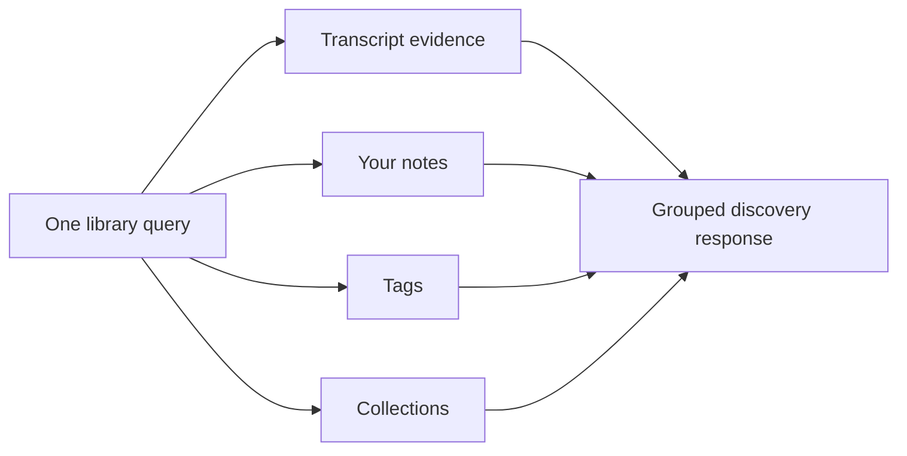

# Find things across the whole local library 🔎

A research library stops feeling like a pile of subsystems when one question can look in
all the places a person actually remembers.

EchoFlow's unified discovery surface does that without pretending every kind of result is
the same thing.

```bash
uv run echoflow library find "housing affordability"
```

One query can return four separate groups:

- **Transcript evidence** ranked through the existing lexical, semantic, or hybrid
  retrieval path and resolved back to verified canonical evidence.
- **Your notes** found through the rebuildable research projection, then hydrated from
  authoritative SQLite state.
- **Tags** whose names match the query.
- **Collections** whose names match the query.

A note does not receive a fake BM25 score so it can compete with a transcript passage. A
tag does not become "82% relevant" because a different subsystem happened to emit a
number. EchoFlow keeps the result types separate and useful.

## The simple mental model



Text fallback: one human query fans out through existing typed capabilities and returns
separate transcript, note, tag, and collection groups. The discovery layer composes those
capabilities; it is not another database.

## Why grouped results?

Different objects answer different questions.

A transcript passage answers:

> Where did somebody actually say this?

A note answers:

> What did I write about this evidence?

A tag answers:

> What label have I already been using for this idea?

A collection answers:

> Which research grouping might I want to open?

Those are related, but they are not interchangeable. Keeping them grouped makes the UI
more honest and gives a future graphical shell a clean set of sections or tabs.

## Human output

The default terminal view renders separate sections for transcript evidence, notes, tags,
and collections.

Transcript results retain source-relative seek coordinates, speaker presentation, and
research-state decoration. Notes retain their current/stale canonical-generation state.
That means an old note does not disappear merely because a transcript was regenerated.
It remains visible as an older-generation note until a person explicitly decides what to
do with it.

## Machine-readable output

```bash
uv run echoflow library find "housing" --json
```

The JSON response keeps the same grouping:

```text
query
total_count
groups
  transcripts
    retrieval_mode
    count
    results
  notes
    count
    results
  tags
    count
    results
  collections
    count
    results
```

Transcript results keep evidence identity, seek coordinates, speaker refs/display labels,
ranks, and associated research state. Notes retain authoritative note content plus durable
evidence anchors.

## Semantic and hybrid discovery

By default, the transcript group uses lexical retrieval:

```bash
uv run echoflow library find "housing" --mode lexical
```

If local semantic state has been qualified and built, the transcript group can use:

```bash
uv run echoflow library find "people struggling to make rent" --mode semantic
uv run echoflow library find "people struggling to make rent" --mode hybrid
```

`--mode` affects **transcript evidence only**. Notes, tag names, and collection names stay
on deterministic local text lookup. EchoFlow does not embed a tag just because the
transcript side happens to use embeddings.

## Limits and context

`--limit` is a **per-group** limit:

```bash
uv run echoflow library find "housing" --limit 10
```

That can return up to ten transcript results, ten notes, ten tags, and ten collections.
The current maximum is 100 per group.

Transcript evidence can also include bounded canonical context:

```bash
uv run echoflow library find "housing" --context-segments 1
```

Context expansion remains post-ranking, exactly as it does for ordinary transcript
search.

## How label matching works

Tags and collections use deterministic group-local matching. Exact names come first,
followed by prefix/substring matches and then token overlap. This ordering is only for
names inside those groups.

It is **not** a universal relevance score and is not persisted as authoritative state.
Future frequent/recent tag navigation will likewise be derived from durable relationships
rather than maintained as fragile counters.

## What this reuses

Unified discovery deliberately builds on existing application contracts:

```text
ResearchWorkspaceService
  transcript search + verified navigation
  authoritative note hydration
  tag / collection state
        |
        v
WorkspaceDiscoveryResponse
        |
        +--> CLI today
        +--> thin GUI later
```

SQLite remains authoritative for unique human research. DuckDB remains rebuildable query
acceleration. Canonical transcript JSON remains transcript evidence. `find` changes none
of those custody rules.

## What comes next

The next useful research-navigation tranche is **saved searches plus derived navigation**:

- durable saved typed query intent;
- most-used and recently used tags/collections as derived views;
- useful facets/counts where they reduce hunting;
- selected/citable result sets; and
- stale-anchor review affordances.

After that, the first thin GUI can make the same discovery response visual rather than
inventing another search architecture.

🦝 One doorway. Same floorboards.
