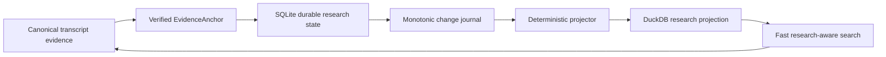

# Your notes should survive the machinery 📝🦝

EchoFlow can keep **your research notes, tags, and collections** beside recorded evidence
without pretending they are part of the transcript itself.

That distinction matters.

The recording and canonical transcript describe evidence. A note such as “compare this
with the 2024 survey” is something **you know, suspect, or want to remember**. EchoFlow
keeps those kinds of truth separate while still letting them meet through exact evidence
coordinates.

## The short version

When you attach a note to transcript evidence, EchoFlow stores the note durably and keeps
its exact evidence address:

- document/transcript identity;
- original source SHA-256;
- canonical transcript SHA-256;
- canonical segment IDs; and
- source-relative start/end seconds.

The note survives search-index and research-projection rebuilds.



You do not need to operate either database. `ResearchWorkspaceService` presents one
research workspace over the two storage roles.

## Add a note

The current CLI anchors to real canonical segment IDs rather than a disposable search row
or formatted timestamp:

```bash
echoflow library notes add TRANSCRIPT_ID segment-000042 \
  --body "Check this against the 2024 survey." \
  --tag methodology \
  --tag housing \
  --collection "Chapter 3"
```

A note may span several **contiguous canonical segments**:

```bash
echoflow library notes add TRANSCRIPT_ID \
  segment-000042 segment-000043 segment-000044 \
  --body "This whole exchange belongs in the methods section."
```

EchoFlow verifies the current canonical transcript bytes before accepting the anchor. It
refuses missing, reordered, or non-contiguous segment selections rather than guessing.

Optional `--start-seconds` and `--end-seconds` may narrow an anchor inside the selected
canonical span. They cannot escape that evidence.

The first GUI can turn transcript selection into the same `EvidenceAnchor`, which means
we do not need a second annotation system for graphical use.

## Read and query your notebook

List recent notes:

```bash
echoflow library notes
```

Filter the notebook:

```bash
echoflow library notes \
  --text "survey methodology" \
  --tag housing \
  --collection "Chapter 3"
```

Limit notes to one transcript:

```bash
echoflow library notes --transcript TRANSCRIPT_ID
```

Machine-readable output keeps durable evidence identity explicit:

```bash
echoflow library notes --json
```

Note-text matching currently uses deterministic lexical terms. It does not pretend a
local embedding model inferred a meaning the note never contained.

## Use research state to search the transcript corpus

Research metadata can constrain transcript retrieval before scoring:

```bash
echoflow library search "housing affordability" \
  --tag methodology \
  --with-notes
```

Or require terms in attached notes while searching transcript evidence:

```bash
echoflow library search "housing affordability" \
  --note-text "2024 survey" \
  --collection "Chapter 3"
```

EchoFlow resolves tag/collection names to durable IDs, obtains a canonical evidence scope
from the research projection, and ranks lexical/semantic candidates **inside that
scope**. It does not retrieve the whole corpus and filter it afterward in Python.

Search results may show associated note count, tags, and collections alongside original
speaker/timeline/ranking evidence.

## Edit research state

Replace note text:

```bash
echoflow library notes edit NOTE_ID --body "Revised note text"
```

Replace its tag set:

```bash
echoflow library notes set-tags NOTE_ID \
  --tag housing \
  --tag methodology
```

Replace collection membership:

```bash
echoflow library notes set-collections NOTE_ID \
  --collection "Chapter 3"
```

Delete a note explicitly:

```bash
echoflow library notes delete NOTE_ID
```

Those commands mutate authoritative SQLite user state. The DuckDB query projection
catches up from a monotonic change journal.

## What if the transcript changes?

A note belongs to the **exact canonical transcript generation** it was written against.

Suppose an older transcript contains:

```text
job-abc / canonical aaaa... / segment-000042
```

and a regenerated transcript later also contains `segment-000042` but canonical hash
`bbbb...`.

EchoFlow does **not** silently move the old note onto the new evidence.

The old note remains durable and can be shown as belonging to an older transcript
generation. The projected evidence key includes the canonical SHA-256, so an old note
cannot accidentally match a new segment merely because the friendly segment ID was
reused.

## Why two databases?

Because they have different jobs and different deletion semantics.

| Store | Job | Rebuildable? |
|---|---|---|
| SQLite research state | authoritative notes/tags/collections and evidence anchors | **No** |
| DuckDB research projection | fast derived relationships and lexical note terms | Yes |
| DuckDB transcript index | transcript terms/segments for lexical ranking | Yes |
| DuckDB semantic index | chunks/vectors for semantic retrieval | Yes |

SQLite is a better fit for frequently mutated transactional application state. DuckDB is
a better fit for local analytical/query workloads. EchoFlow deliberately does **not** make
both authoritative.

The write path is one-way:

```text
SQLite authority
      |
      | monotonic transactional journal
      v
Deterministic projector
      |
      v
DuckDB projection
```

If the stores disagree, SQLite wins. If DuckDB disappears, rebuild it.

## Projection diagnostics

Inspect current sequences:

```bash
echoflow library research
```

Catch up incrementally:

```bash
echoflow library research sync
```

Rebuild the disposable projection from authoritative SQLite state:

```bash
echoflow library research rebuild
```

The DuckDB watermark advances in the same transaction as projected rows, so it cannot
claim a sequence was applied if those rows did not commit.

If the projection is too far behind for retained journal history to bridge the gap,
EchoFlow rebuilds from a consistent SQLite snapshot. If DuckDB claims to be ahead of
SQLite authority, EchoFlow fails closed.

## What comes next for the notebook?

The storage and evidence-address contracts are built. The next improvements are mostly
human ergonomics:

- unified library discovery across transcript evidence, notes, tags, and collections;
- durable saved searches;
- derived frequent/recent tag and collection suggestions;
- selected/citable result sets;
- portable research export;
- stale-anchor review/re-anchor UX with explicit user confirmation; and
- a thin graphical click/select-to-annotate surface.

Frequent/recent tag rankings should be **derived views**, not stored counters. The tag is
durable user state; “used 147 times” is disposable navigation metadata.

The current tranche deliberately does not yet provide rich-text/WYSIWYG editing, semantic
embeddings over note prose, automatic cross-generation re-anchoring, collaborative sync,
or a GUI.

> **Your research state is durable. Its fast query representation is disposable. The two
> can always meet again through exact evidence identities.**
