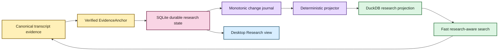

# Your notes should survive the machinery 📝🦝

EchoFlow can keep **your research notes, tags, and collections** beside recorded evidence
without pretending they are part of the transcript itself.

That distinction matters.

The recording and canonical transcript describe evidence. A note such as “compare this
with the 2024 survey” is something **you know, suspect, or want to remember**. EchoFlow
keeps those kinds of truth separate while still letting them meet through exact evidence
coordinates.

## The short version

When you attach a note to transcript evidence, EchoFlow stores the note durably and keeps
its exact evidence address:

- document/transcript identity;
- original source SHA-256;
- canonical transcript SHA-256;
- canonical segment IDs; and
- source-relative start/end seconds.

The note survives search-index and research-projection rebuilds.



Text fallback: verified canonical evidence anchors durable SQLite research state; a
transactional journal projects that authority into rebuildable DuckDB query state, while
the desktop Research view reads the same human-authored authority through a typed bridge.

You do not need to operate either database. `ResearchWorkspaceService` presents one
research workspace over the two storage roles.

## Add a note

The current CLI anchors to real canonical segment IDs rather than a disposable search row
or formatted timestamp:

```bash
echoflow library notes add TRANSCRIPT_ID segment-000042 \
  --body "Check this against the 2024 survey." \
  --tag methodology \
  --tag housing \
  --collection "Chapter 3"
```

A note may span several **contiguous canonical segments**:

```bash
echoflow library notes add TRANSCRIPT_ID \
  segment-000042 segment-000043 segment-000044 \
  --body "This whole exchange belongs in the methods section."
```

EchoFlow verifies the current canonical transcript bytes before accepting the anchor. It
refuses missing, reordered, or non-contiguous segment selections rather than guessing.

Optional `--start-seconds` and `--end-seconds` may narrow an anchor inside the selected
canonical span. They cannot escape that evidence.

The desktop Evidence reader already works with the same verified segment/word coordinate
system. The next Research UI mutation slice will turn a verified selection into this same
`EvidenceAnchor` instead of creating a second annotation model for graphical use.

## Read and query your notebook

List recent notes:

```bash
echoflow library notes
```

Filter the notebook:

```bash
echoflow library notes \
  --text "survey methodology" \
  --tag housing \
  --collection "Chapter 3"
```

Limit notes to one transcript:

```bash
echoflow library notes --transcript TRANSCRIPT_ID
```

Machine-readable output keeps durable evidence identity explicit:

```bash
echoflow library notes --json
```

The desktop **Research** workspace now provides a browse-first view over authoritative
notes, tags, collections, and saved searches. It also labels notes as current evidence or
an older canonical generation. React receives document/generation/segment/time identity,
not raw canonical/source filesystem paths.

Note-text matching currently uses deterministic lexical terms. It does not pretend a
local embedding model inferred a meaning the note never contained.

## Use research state to search the transcript corpus

Research metadata can constrain transcript retrieval before scoring:

```bash
echoflow library search "housing affordability" \
  --tag methodology \
  --with-notes
```

Or require terms in attached notes while searching transcript evidence:

```bash
echoflow library search "housing affordability" \
  --note-text "2024 survey" \
  --collection "Chapter 3"
```

EchoFlow resolves tag/collection names to durable IDs, obtains a canonical evidence scope
from the research projection, and ranks lexical/semantic candidates **inside that
scope**. It does not retrieve the whole corpus and filter it afterward in Python.

Unified workspace discovery is implemented and powers the desktop Library search. Search
results can show associated note count, tags, and collections alongside original
speaker/timeline/ranking evidence without inventing one cross-type relevance score.

## Edit research state

Replace note text:

```bash
echoflow library notes edit NOTE_ID --body "Revised note text"
```

Replace its tag set:

```bash
echoflow library notes set-tags NOTE_ID \
  --tag housing \
  --tag methodology
```

Replace collection membership:

```bash
echoflow library notes set-collections NOTE_ID \
  --collection "Chapter 3"
```

Delete a note explicitly:

```bash
echoflow library notes delete NOTE_ID
```

Those commands mutate authoritative SQLite user state. The DuckDB query projection
catches up from a monotonic change journal.

Desktop research **editing** is not implemented yet. The current Research surface is
browse-first by design. Its next slice will expose these same mutations through narrow
versioned bridge methods rather than direct SQLite access from React.

## What if the transcript changes?

A note belongs to the **exact canonical transcript generation** it was written against.

Suppose an older transcript contains:

```text
job-abc / canonical aaaa... / segment-000042
```

and a regenerated transcript later also contains `segment-000042` but canonical hash
`bbbb...`.

EchoFlow does **not** silently move the old note onto the new evidence.

The old note remains durable and is shown as belonging to an older transcript generation.
The projected evidence key includes the canonical SHA-256, so an old note cannot
accidentally match a new segment merely because the friendly segment ID was reused.

## Why two databases?

Because they have different jobs and different deletion semantics.

| Store | Job | Rebuildable? |
|---|---|---|
| SQLite research state | authoritative notes/tags/collections and evidence anchors | **No** |
| DuckDB research projection | fast derived relationships and lexical note terms | Yes |
| DuckDB transcript index | transcript terms/segments for lexical ranking | Yes |
| DuckDB semantic index | chunks/vectors for semantic retrieval | Yes |

SQLite is a better fit for frequently mutated transactional application state. DuckDB is
a better fit for local analytical/query workloads. EchoFlow deliberately does **not** make
both authoritative.

The write path is one-way:

```text
SQLite authority
      |
      | monotonic transactional journal
      v
Deterministic projector
      |
      v
DuckDB projection
```

If the stores disagree, SQLite wins. If DuckDB disappears, rebuild it.

## Projection diagnostics

Inspect current sequences:

```bash
echoflow library research
```

Catch up incrementally:

```bash
echoflow library research sync
```

Rebuild the disposable projection from authoritative SQLite state:

```bash
echoflow library research rebuild
```

The DuckDB watermark advances in the same transaction as projected rows, so it cannot
claim a sequence was applied if those rows did not commit.

If the projection is too far behind for retained journal history to bridge the gap,
EchoFlow rebuilds from a consistent SQLite snapshot. If DuckDB claims to be ahead of
SQLite authority, EchoFlow fails closed.

## Saved searches and research navigation are foundation now

Saved searches persist typed query intent and re-resolve current evidence rather than
freezing result snapshots. Frequent/recent tag and collection navigation is derived from
current relationships instead of persisted popularity counters.

The tag is durable user state. “Used 147 times” is disposable navigation metadata.

## What comes next for the notebook?

The storage, evidence-address, unified discovery, saved-search, derived-navigation, and
browse-first desktop contracts are built. The next improvements are human ergonomics:

- create a note directly from a verified desktop evidence window;
- edit/delete notes and assign/remove tags/collections in the Research screen;
- create, run, rename, and delete saved searches from Library/Research;
- stale-anchor review/re-anchor UX with explicit user confirmation;
- selected/citable result sets; and
- portable evidence-bearing research export.

The current tranche deliberately does not provide rich-text/WYSIWYG editing, semantic
embeddings over note prose, automatic cross-generation re-anchoring, or collaborative
sync.

> **Your research state is durable. Its fast query representation is disposable. The two
> can always meet again through exact evidence identities.**
