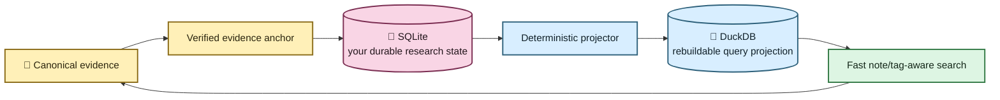

# Your notes should survive the machinery 📝🦝

EchoFlow can now keep **your research notes, tags, and collections** beside recorded
evidence without pretending they are part of the transcript itself.

That distinction matters.

The recording and canonical transcript describe the evidence. A note such as
“compare this with the 2024 survey” is something **you know, suspect, or want to remember**.
EchoFlow keeps those two kinds of truth separate while still letting you move between
them quickly.

## The short version

When you attach a note to transcript evidence, EchoFlow stores the note durably and keeps
its exact evidence address:

- transcript/document identity;
- original source SHA-256;
- canonical transcript SHA-256;
- canonical segment IDs; and
- source-relative start/end seconds.

The note survives search-index rebuilds. The fast query machinery can be deleted and
reconstructed without deleting your work.



You do not need to operate either database. EchoFlow presents one research workspace.

## Add a note

A command-line note anchors to real canonical segment IDs rather than a disposable search
row or a pretty timestamp.

```bash
echoflow library notes add TRANSCRIPT_ID segment-000042 \
  --body "Check this against the 2024 survey." \
  --tag methodology \
  --tag housing \
  --collection "Chapter 3"
```

A note may span several **contiguous canonical segments**:

```bash
echoflow library notes add TRANSCRIPT_ID \
  segment-000042 segment-000043 segment-000044 \
  --body "This whole exchange belongs in the methods section."
```

EchoFlow verifies the current canonical transcript bytes before accepting the anchor. It
refuses missing, reordered, or non-contiguous segment selections rather than guessing.

Optional `--start-seconds` and `--end-seconds` may narrow an anchor inside the selected
canonical segment span. They cannot escape that evidence.

A future graphical interface can turn text selection into the same `EvidenceAnchor`.
The GUI does not need a second anchoring system.

## Read and query your notebook

List recent notes:

```bash
echoflow library notes
```

Filter the notebook itself:

```bash
echoflow library notes \
  --text "survey methodology" \
  --tag housing \
  --collection "Chapter 3"
```

Limit notes to one transcript:

```bash
echoflow library notes --transcript TRANSCRIPT_ID
```

Machine-readable output keeps the durable evidence identity explicit:

```bash
echoflow library notes --json
```

Note-text matching currently uses deterministic lexical terms. It does not pretend that
a local embedding model inferred a meaning the note never contained.

## Use your research state to search the transcript corpus

The same research metadata can constrain transcript retrieval:

```bash
echoflow library search "housing affordability" \
  --tag methodology \
  --with-notes
```

Or require terms in your attached notes while searching transcript evidence:

```bash
echoflow library search "housing affordability" \
  --note-text "2024 survey" \
  --collection "Chapter 3"
```

Research constraints are resolved **before** BM25 ranking or semantic vector scoring.
EchoFlow does not retrieve an enormous corpus and then filter it in Python.

Search results can show associated note count, tags, and collections alongside the
original speaker/timeline/ranking evidence.

## Edit your research state

Replace note text:

```bash
echoflow library notes edit NOTE_ID --body "Revised note text"
```

Replace its tag set:

```bash
echoflow library notes set-tags NOTE_ID \
  --tag housing \
  --tag methodology
```

Replace its collection membership:

```bash
echoflow library notes set-collections NOTE_ID \
  --collection "Chapter 3"
```

Delete a note explicitly:

```bash
echoflow library notes delete NOTE_ID
```

Those commands mutate the durable user-state store. The query projection catches up from
a monotonic change journal.

## What if the transcript changes?

A note belongs to the **exact canonical transcript generation** it was written against.

Suppose an older transcript contains:

```text
job-abc / canonical aaaa... / segment-000042
```

and a regenerated transcript later also contains `segment-000042` but has canonical hash
`bbbb...`.

EchoFlow does **not** silently move the old note onto the new evidence.

The old note remains durable and can be shown as belonging to an older transcript
generation. The fast projection key includes the canonical SHA-256, so it cannot
accidentally match the new segment merely because the friendly segment ID was reused.

That is why the SHA-256 is part of the address rather than decorative provenance.

## Why are there two databases?

Because they have different jobs.

| Store | Job | Can EchoFlow rebuild it? |
|---|---|---|
| SQLite research state | your notes/tags/collections and their evidence anchors | **No** |
| DuckDB research projection | fast derived relationships/lexical note terms for filtering | Yes |
| DuckDB transcript index | transcript terms/segments for lexical ranking | Yes |
| DuckDB semantic index | chunks/vectors for semantic retrieval | Yes |

SQLite and DuckDB do not attach to one another or share a cross-database transaction.
EchoFlow coordinates them through stable evidence identities.

The durable write happens first. Query projection is derived afterward.

## What if the fast projection disappears?

Nothing unique is lost.

EchoFlow can rebuild the research projection from a consistent SQLite snapshot:

```bash
echoflow library research rebuild
```

Normal incremental synchronization is also explicit:

```bash
echoflow library research sync
```

And you can inspect the two sequence numbers:

```bash
echoflow library research
```

Conceptually:

```text
Research projection current: SQLite 18442, DuckDB 18442
```

If DuckDB is behind, EchoFlow replays bounded changes. If retained change history no
longer reaches far enough back, EchoFlow rebuilds from SQLite. If a projection somehow
claims to be *ahead* of authoritative SQLite state, EchoFlow fails closed instead of
inventing a recovery story.

## What this does not do

This first durable research-state tranche does not yet provide:

- rich-text/WYSIWYG note editing;
- semantic embeddings over note prose;
- fuzzy note search;
- saved-search objects;
- exportable/citable selected result sets;
- a graphical click-to-annotate interface; or
- automatic re-anchoring across changed canonical transcript generations.

Those can build on the same storage and evidence-address contracts rather than creating
parallel state.

The important promise is already narrower and stronger:

> **Your research state is durable. Its fast query representation is disposable. The two
> can always meet again through exact evidence identities.**
