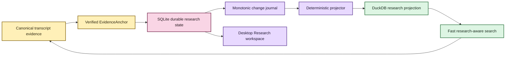

# Your notes should survive the machinery 📝🦝

EchoFlow keeps **your research notes, tags, collections, and saved searches** beside
recorded evidence without pretending they are part of the transcript itself.

The recording and canonical transcript describe evidence. A note such as “compare this
with the 2024 survey” is something **you know, suspect, or want to remember**. EchoFlow
keeps those kinds of truth separate while still letting them meet through exact evidence
coordinates.

## The short version

When you attach a note to transcript evidence, EchoFlow stores the note durably and keeps
its exact evidence address:

- document/transcript identity;
- original source SHA-256;
- canonical transcript SHA-256;
- canonical segment IDs; and
- source-relative start/end seconds.

The note survives search-index and research-projection rebuilds.



Text fallback: verified canonical evidence anchors durable SQLite research state; a
transactional journal projects that authority into rebuildable DuckDB query state; the
desktop Research workspace consumes the same authority rather than inventing a
browser-owned notebook.

You do not need to operate either database. `ResearchWorkspaceService` presents one
research workspace over the two storage roles.

## Add, edit, organize, and delete notes

The CLI anchors to real canonical segment IDs rather than a disposable search row or
formatted timestamp:

```bash
echoflow library notes add TRANSCRIPT_ID segment-000042 \
  --body "Check this against the 2024 survey." \
  --tag methodology \
  --tag housing \
  --collection "Chapter 3"
```

A note may span several **contiguous canonical segments**. EchoFlow verifies the current
canonical transcript bytes and refuses missing, reordered, or non-contiguous selections.
Optional `--start-seconds` and `--end-seconds` may narrow an anchor inside that verified
span.

The desktop now uses that same rule when a note is created from the verified Evidence
reader. It sends document/generation identity and canonical coordinates through one narrow
bridge method. If the library moved to a newer canonical generation before Save, the write
is refused instead of silently attaching the note to different evidence.

Existing notes can be edited in the Research workspace. A desktop edit replaces note body,
tag assignments, and collection assignments **atomically in authoritative SQLite** and
emits one projection-journal event. The note’s evidence anchor is not rewritten.

Desktop edit/delete also carries the note’s authoritative `updated_at` version. If a CLI or
another local surface changed that note after it was displayed, EchoFlow refuses the stale
write and asks the user to refresh. Local-first does not mean lost-update-safe by accident.

Deletion is explicit and deliberately narrow: deleting a note deletes that human-authored
note. It does not delete the canonical transcript or original recording.

The equivalent CLI operations remain available:

```bash
echoflow library notes edit NOTE_ID --body "Revised note text"
echoflow library notes set-tags NOTE_ID --tag housing --tag methodology
echoflow library notes set-collections NOTE_ID --collection "Chapter 3"
echoflow library notes delete NOTE_ID
```

## Use research state to search the transcript corpus

Research metadata can constrain transcript retrieval before scoring:

```bash
echoflow library search "housing affordability" \
  --tag methodology \
  --with-notes
```

Or require terms in attached notes while searching transcript evidence:

```bash
echoflow library search "housing affordability" \
  --note-text "2024 survey" \
  --collection "Chapter 3"
```

EchoFlow resolves human names to durable IDs, obtains a canonical evidence scope from the
research projection, and ranks lexical/semantic candidates **inside that scope**. It does
not retrieve the whole corpus and throw away results afterward.

Unified workspace discovery powers the desktop Library search. Search results can show
associated note count, tags, and collections alongside original evidence/ranking data
without inventing one cross-type relevance score.

## What if the transcript changes?

A note belongs to the **exact canonical transcript generation** it was written against.
If a regenerated transcript reuses the same friendly `segment-000042` under a different
canonical SHA-256, EchoFlow does **not** silently move the old note.

The old note remains durable historical user state. The projected evidence key includes
canonical generation identity so stale annotations cannot accidentally attach to new
evidence. Editing the prose or labels on that old note still leaves its original anchor
unchanged.

A later re-anchor workflow must be an explicit user decision that shows both generations;
it must never be an incidental side effect of editing a note.

## Why two databases?

| Store | Job | Rebuildable? |
|---|---|---|
| SQLite research state | authoritative notes/tags/collections/saved searches and evidence anchors | **No** |
| DuckDB research projection | fast derived relationships and lexical note terms | Yes |
| DuckDB transcript index | transcript terms/segments for lexical ranking | Yes |
| DuckDB semantic index | chunks/vectors for semantic retrieval | Yes |

SQLite fits frequently mutated transactional user state. DuckDB fits local analytical
query workloads. EchoFlow deliberately does **not** make both authoritative.

```text
SQLite authority
      |
      | monotonic transactional journal
      v
Deterministic projector
      |
      v
DuckDB projection
```

If the stores disagree, SQLite wins. If DuckDB disappears, rebuild it.

## Saved searches and navigation are foundation

Saved searches persist typed query intent and re-resolve current evidence rather than
freezing result snapshots. Frequent/recent tag and collection navigation is derived from
current relationships instead of persisted popularity counters.

The tag is durable user state. “Used 147 times” is disposable navigation metadata.

The desktop currently presents saved-search intent but does not yet create/run/rename/delete
saved searches. That is the next Research interaction slice, together with returning a
research object to verified evidence.

## What comes next for the notebook?

The storage, evidence-address, unified-discovery, saved-search backend, Research overview,
verified note creation, and note edit/delete/label mutation contracts are built.

The remaining Research tranche is:

- create, run, rename, and delete saved searches in the desktop;
- navigate notes/tags/collections/saved searches back to current verified evidence when
  possible;
- expose advanced typed search/research filters without hidden interpretation;
- stale-anchor review/re-anchor UX with explicit user confirmation; and
- later, selected/citable result sets and portable evidence-bearing research export.

The product does not currently provide rich-text/WYSIWYG editing, semantic embeddings over
note prose, automatic cross-generation re-anchoring, or collaborative sync.

> **Your research state is durable. Its fast query representation is disposable. The two
> can always meet again through exact evidence identities.**
